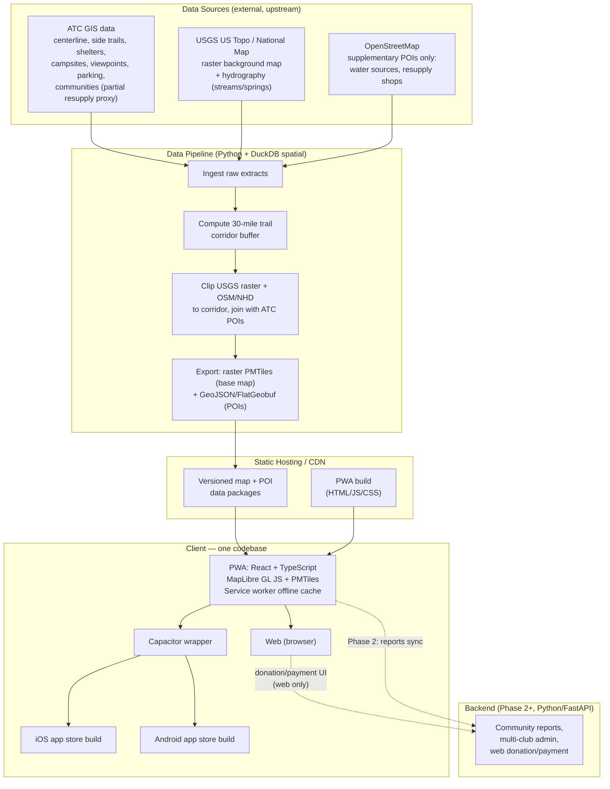

# OurHike — Technical Architecture (Draft v1)

Companion to [OurHikeValues.md](OurHikeValues.md) and [FEATURES.md](FEATURES.md). This describes *how* v1 gets built. Decided 2026-07-24; the DuckDB spatial pipeline is the first piece to validate before building further on top of it (see "First thing to prove out," below).

---

## Guiding constraints

- **One client codebase** for phone (iOS + Android) and web.
- **No in-app purchases** — any payment/donation flow lives on the web only (avoids app store fees).
- **Offline-first** — hikers download data before losing signal; nothing safety-relevant requires a live connection.
- **Boring, low-maintenance, inheritable** (values #7, #8) — favor tools a volunteer-run nonprofit can keep running for a decade, over cutting-edge complexity.
- **Open by default** (value #3) — open formats and open-source tooling throughout; avoid vendor lock-in.
- **Fetched/generated data never gets committed to the git repo.** `pipeline/data/` (raw pulls, processed intermediates, quad downloads, etc.) is gitignored — only source code and the `sources.json` registry are tracked. Data is either re-derived on demand by rerunning the pipeline scripts, or lives in versioned object storage (Cloudflare R2) once actually published — never in repo history. This keeps clone size sane and avoids committing anything with unresolved licensing (see the ATC/opentrail.org license-status notes below) before it's actually cleared for shipping.

---

## High-level architecture

---

## Data pipeline (Python + DuckDB)

**Sources:**

| Source | Provides | License status |
|---|---|---|
| ATC GIS (ArcGIS, public map) | Trail centerline, side trails, shelters, campsites, viewpoints, parking, trail club sections, communities. **Confirmed gap: no dedicated water-source or general resupply layer.** | Public map confirmed accessible ([discover_sources.py](pipeline/discover_sources.py) walks it programmatically); redistribution terms still pending direct confirmation with ATC |
| USGS US Topo / National Map | **Background reference map** — pre-rendered, public-domain topographic raster tiles, clipped to the corridor. Also National Hydrography Dataset (streams/springs) as an approximate, unverified water-source proxy. | Public domain |
| OpenStreetMap | **Supplementary POIs only** — water sources (`amenity=drinking_water`, `natural=spring`) and resupply-relevant points (shops, post offices, hostels) that fill the ATC gap above. Deliberately *not* used for roads/land-cover/background — see rationale below. | Open (ODbL) |

**Background map = raster, not vector (decided 2026-07-24, supersedes earlier vector-tile plan):** the original plan had MapLibre rendering vector tiles built from OSM roads/land-cover data — but that means designing and maintaining our own cartography/styling pipeline just to draw context (terrain, roads) nobody needs to search or filter. USGS US Topo maps are already public-domain, pre-rendered, and the reference format hikers already trust (value #4). Clipping and re-tiling an existing raster product is far less to build and maintain than rendering our own vector style (value #8). Only the AT-specific POI layers that hikers actually search/filter (centerline, shelters, campsites, water, crossings, resupply) need to stay as small vector GeoJSON — those are unaffected by this decision. **Trade-off:** a raster background can't be semantically restyled later (e.g. a dedicated dark/sunlight-glare mode per the Phase 2 "outdoor usability pass" isn't a simple style swap); canvas-level filters (invert/contrast) are the fallback if that becomes necessary.

**Corridor definition:** a ~30-mile buffer around the trail centerline and its named waypoints, computed once with DuckDB's spatial extension (`ST_Buffer` + `ST_Union` over the centerline geometry). All USGS raster/OSM/NHD data is clipped to this corridor before packaging — this is what keeps offline downloads small and hosting cheap (value #8), while still covering the towns and services within a realistic support range of the trail.

**Pipeline steps:**
1. **Ingest** — pull raw extracts from ATC, USGS, OSM into a working format DuckDB can read directly (GeoJSON, Shapefile, GeoPackage, FlatGeobuf). *(ATC side done — see `pipeline/discover_sources.py` + `pipeline/fetch_all.py`.)*
2. **Corridor** — build the 30-mile buffer geometry once from the trail centerline + waypoints. *(Done — see `pipeline/spike_corridor.py`; validated on the real 3,025-segment centerline, ~81,138 sq mi corridor.)*
3. **Clip & join** — clip the USGS raster background to the corridor; intersect OSM/NHD POI data against it; join everything into a unified POI schema. *(POI clipping validated in the spike using ATC campsites/shelters; raster clipping not yet built.)*
4. **Export** — write the background as **raster PMTiles** (single static archive, no tile server required) and POI layers as **GeoJSON/FlatGeobuf**.
5. **Publish** — versioned output pushed to static hosting/CDN.

This is a script, not a service — it's rerun periodically (e.g. monthly, or on demand when ATC data updates), not something running continuously. No database server to operate. *(Where/how it actually runs — a maintainer's manual trigger vs. a scheduled job — is an open item, see ROADMAP.md Phase 1.)*

**Proven out (2026-07-24):** DuckDB's spatial extension handles the core operation cleanly — buffering the real ~2,200-mile centerline by 30 miles, unioning it into one valid polygon, and clipping real POI data against it all worked as expected. One gotcha worth flagging for anyone touching this again: `ST_Transform` needs `always_xy := true`, or it silently swaps lat/lon axes and produces garbage geometry that only surfaces downstream (e.g. as `nan` areas) — documented in `pipeline/README.md`.

---

## Client (PWA — one codebase)

- **Stack:** React + TypeScript, **MapLibre GL JS** (open-source map renderer, no vendor lock-in) reading **PMTiles** directly in-browser. Two kinds of local data, per the pipeline decision above: a **raster** background (clipped USGS US Topo tiles, packaged as PMTiles) for terrain/context, and small **vector GeoJSON** layers (ATC + OSM + NHD) for the AT-specific POIs users actually search/filter — loaded directly as MapLibre GeoJSON sources, no vector-tiling step needed at this data volume.
- **Offline:** service worker precaches the app shell; map/POI data for a chosen trail section is downloaded on demand and stored via the Cache API / IndexedDB — mirrors the "download this region" pattern hikers already know from Avenza/FarOut.
- **GPS:** browser Geolocation API for "you are here," foreground use — sufficient for MVP (see trade-off below).
- **Packaging:** the same web build is wrapped with **Capacitor** to produce installable iOS and Android app-store builds. The web version and the app-store versions are the same codebase, not parallel implementations.
- **No purchases in the wrapped app** — any payment/donation UI is only rendered in the unwrapped web context.

**Known trade-off:** continuous background GPS track-recording (while the phone is locked/backgrounded) is weaker here than in a fully native app. Fine for MVP's foreground "check the map, see nearby water/shelters" use case. If always-on background tracking becomes a priority later, Capacitor supports native GPS plugins to close most of that gap without a rewrite.

---

## Backend (Phase 2+)

Not needed for MVP — the MVP client only reads static files from hosting. When community reporting, multi-club admin, or web donations arrive (see [FEATURES.md](FEATURES.md) Post-MVP section):

- **Stack:** Python (FastAPI) — keeps the pipeline and backend in the same language.
- **Database:** Postgres (with PostGIS if live spatial queries are ever needed) — added only once there's actual dynamic data to store.
- **Scope:** community condition reports, moderation, multi-club/org admin, and the web-only donation/payment flow.

---

## Hosting & cost shape

- **Cloudflare Pages** for the PWA build, **Cloudflare R2** for the PMTiles/GeoJSON data packages — R2 has no egress fees, which matters since map downloads are the bulk of the bandwidth. Both have free/low-cost tiers sufficient for MVP scale. No servers to run, which fits value #8 directly.
- A small backend is added later, only when dynamic features actually require one.

---

## Stack summary

| Layer | Choice |
|---|---|
| Client (phone + web) | React + TypeScript, MapLibre GL JS, PMTiles, Capacitor |
| Data pipeline | Python, DuckDB (spatial extension) |
| Backend (Phase 2+) | Python (FastAPI), Postgres/PostGIS if/when needed |
| Hosting | Static hosting/CDN (MVP) → + small managed backend later |

---

## Risks & open questions

- **ATC data licensing/access** — the public map is confirmed accessible and its 9 layers cataloged, but redistribution terms are still not confirmed directly with ATC; may shape what can actually be shipped and how.
- **Water-source and resupply data completeness** — ATC's own data has no dedicated layer for either. NHD streams and OSM `drinking_water`/`spring` tags are the current stopgap, and both are approximate/unverified, not confirmed potable/current data — worth being explicit about that distinction in the UI (value #4), and revisiting once community condition-reporting (Phase 2) exists as the real long-term fix.
- **Raster background loses easy restyling** — a real trade-off from choosing pre-rendered USGS raster tiles over a self-built vector style: no simple semantic dark-mode/high-contrast swap for the Phase 2 "outdoor usability pass." Canvas-level filters are the fallback if that gap matters in practice.
- **Background GPS** — acceptable gap for MVP, revisit if always-on tracking becomes a feature priority.
- **DuckDB-WASM** (querying the offline dataset client-side, in-browser) — promising future option, not committed for MVP.
- **Multi-club data model** — deferred to Phase 2 per FEATURES.md, but pipeline schema should avoid AT/NYNJTC-only assumptions where it's cheap to do so now, per value #7.
- **Pipeline execution environment** — manual trigger vs. a scheduled job; deliberately deferred, see ROADMAP.md Phase 1.
