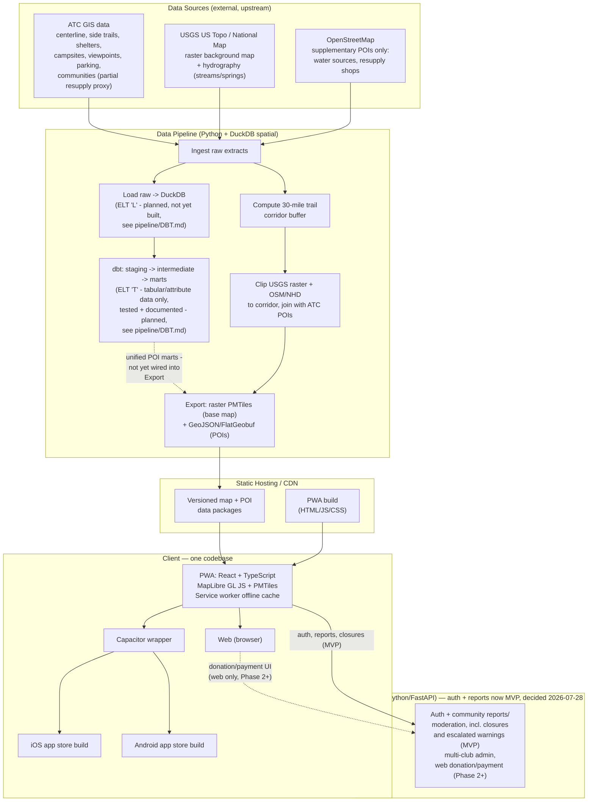

# OurHike — Technical Architecture (Draft v1)

Companion to [OurHikeValues.md](OurHikeValues.md) and [FEATURES.md](FEATURES.md). This describes *how* v1 gets built. Decided 2026-07-24; the DuckDB spatial pipeline is the first piece to validate before building further on top of it (see "First thing to prove out," below).

---

## Guiding constraints

- **One client codebase** for phone (iOS + Android) and web.
- **No in-app purchases** — any payment/donation flow lives on the web only (avoids app store fees).
- **Offline-first** — hikers download data before losing signal; nothing safety-relevant requires a live connection. **Nuance added 2026-07-28:** this still holds for *viewing* previously-synced data (a downloaded closure/warning snapshot works fully offline), but *submitting* a report, marking a closure, or seeing something newer than the last sync needs connectivity - the same honest "last synced" framing already used for offline map staleness elsewhere in this project.
- **Boring, low-maintenance, inheritable** (values #7, #8) — favor tools a volunteer-run nonprofit can keep running for a decade, over cutting-edge complexity.
- **Open by default** (value #3) — open formats and open-source tooling throughout; avoid vendor lock-in.
- **Fetched/generated data never gets committed to the git repo.** `pipeline/data/` (raw pulls, processed intermediates, quad downloads, etc.) is gitignored — only source code and the `sources.json` registry are tracked. Data is either re-derived on demand by rerunning the pipeline scripts, or lives in versioned object storage (Cloudflare R2) once actually published — never in repo history. This keeps clone size sane and avoids committing anything with unresolved licensing (see the ATC/opentrail.org license-status notes below) before it's actually cleared for shipping.

---

## High-level architecture

---

## Data pipeline (Python + DuckDB)

**Sources:**

| Source | Provides | License status |
|---|---|---|
| ATC GIS (ArcGIS, public map) | Trail centerline, side trails, shelters, campsites, viewpoints, parking, trail club sections, communities. **Confirmed gap: no dedicated water-source or general resupply layer.** | Public map confirmed accessible ([discover_sources.py](pipeline/discover_sources.py) walks it programmatically); redistribution terms still pending direct confirmation with ATC |
| USGS US Topo / National Map | **Background reference map** — pre-rendered, public-domain topographic raster tiles, clipped to the corridor. Also National Hydrography Dataset (streams/springs) as an approximate, unverified water-source proxy. | Public domain |
| OpenStreetMap | **Supplementary POIs**, and — via Protomaps, see below — **the extended-context basemap outside the corridor**. Water sources (`amenity=drinking_water`, `natural=spring`) and resupply-relevant points (shops, post offices, hostels) fill the ATC gap above. Deliberately *not* used to render the corridor background itself, which stays USGS raster — see rationale below. | Open (ODbL) |

**Background map = raster, not vector (decided 2026-07-24, supersedes earlier vector-tile plan):** the original plan had MapLibre rendering vector tiles built from OSM roads/land-cover data — but that means designing and maintaining our own cartography/styling pipeline just to draw context (terrain, roads) nobody needs to search or filter. USGS US Topo maps are already public-domain, pre-rendered, and the reference format hikers already trust (value #4). Clipping and re-tiling an existing raster product is far less to build and maintain than rendering our own vector style (value #8). Only the AT-specific POI layers that hikers actually search/filter (centerline, shelters, campsites, water, crossings, resupply) need to stay as small vector GeoJSON — those are unaffected by this decision. **Trade-off:** a raster background can't be semantically restyled later (e.g. a dedicated dark/sunlight-glare mode per the Phase 2 "outdoor usability pass" isn't a simple style swap); canvas-level filters (invert/contrast) are the fallback if that becomes necessary.

**Extended-context background beyond the corridor (validated 2026-07-27, shipped):** the corridor raster stops hard at 30 miles, which leaves a hiker panning out — or bailing to a town — looking at nothing. Rather than widening our own USGS raster pipeline, [Protomaps' basemap](https://docs.protomaps.com/basemaps/downloads) (OpenStreetMap-derived vector tiles, the same PMTiles format already in use) is extracted for a wide box around the whole corridor and layered *beneath* the corridor raster. Measured: **57 MB at max zoom 9**, 1.6 MB at z6, 293 MB at z11 — a small fraction of the corridor's own 1.18 GB raster archive, self-hostable on the same R2 bucket with no API key and no metered billing. Confirmed a genuine full basemap (9 vector layers: roads, water, places, POIs, buildings, boundaries, landcover, landuse, earth) rather than a stripped-down stub. **Its ODbL licence requires visible "© OpenStreetMap" attribution**, rendered by `MapScreen` via `client/src/map/style.ts`'s `ATTRIBUTION` — do not remove it.

**Corridor definition:** a ~30-mile buffer around the trail centerline and its named waypoints, computed once with DuckDB's spatial extension (`ST_Buffer` + `ST_Union` over the centerline geometry). All USGS raster/OSM/NHD data is clipped to this corridor before packaging — this is what keeps offline downloads small and hosting cheap (value #8), while still covering the towns and services within a realistic support range of the trail.

**Pipeline steps:**
1. **Ingest** — pull raw extracts from ATC, USGS, OSM into a working format DuckDB can read directly (GeoJSON, Shapefile, GeoPackage, FlatGeobuf). *(ATC side done — see `pipeline/discover_sources.py` + `pipeline/fetch_all.py`. As of 2026-07-25, ingest is change-aware, not just repeatable: each fetch script checks a cheap upstream signal first and skips the real (slower/larger) pull entirely if nothing changed — `fetch_all.py` checks each ATC layer's `editingInfo.dataLastEditDate`, `fetch_opentrail.py` uses real HTTP conditional requests (`ETag`/`If-None-Match`), `fetch_topo_quads.py` already compared S3 `Last-Modified` per quad. This matters because most sources here (especially USGS) update on the order of years, not days — most scheduled runs should do a handful of cheap metadata checks and transfer nothing.)*
2. **Load** — load already-fetched raw data into DuckDB tables *before* any transformation, the "L" in an extract-**load**-transform (ELT) pipeline. *(Design decided 2026-07-29, not yet built — see `pipeline/DBT.md`. Deliberately excludes raster pixel data; only lightweight raster metadata loads, keeping the warehouse itself small per value #8.)*
3. **Transform (dbt)** — turn loaded raw tables into clean, tested, documented staging/intermediate/marts models — SQL by default, Python only for a documented, measured exception. *(Design decided 2026-07-29, not yet built — see `pipeline/DBT.md`, including the first planned vertical slice: ATC shelters/campsites + opentrail waypoints unified into one `dim_pois` mart, directly targeting the "Unified POI schema" item below for a subset of sources.)*
4. **Corridor** — build the 30-mile buffer geometry once from the trail centerline + waypoints. *(Done — see `pipeline/spike_corridor.py`; validated on the real 3,025-segment centerline, ~81,138 sq mi corridor.)*
5. **Clip & join** — clip the USGS raster background to the corridor; intersect OSM/NHD POI data against it; join everything into a unified POI schema. *(POI clipping validated in the spike using ATC campsites/shelters. Raster clipping now validated at real scale too — see `pipeline/spike_raster_mosaic.py`, mosaicking the real 1,654 downloaded US Topo quads (14GB) per corridor-intersecting grid cell, reprojecting each quad from its native UTM zone via a lazy `WarpedVRT` before merging, since quads across the trail span multiple UTM zones and can't be merged directly. Hit and now handles a real corruption in one of USGS's own hosted source files (confirmed via a byte-exact-matching re-download that still failed to decode) — bad quads are validated and skipped rather than crashing the run. The POI-side unified schema is now planned via dbt, see step 3 above — not yet wired into this clip/export flow.)*
6. **Export** — write the background as **raster PMTiles** (single static archive, no tile server required) and POI layers as **GeoJSON/FlatGeobuf**. Each output artifact (the background, and each POI layer separately — not one bundle) gets its own content hash (SHA256), computed after export.
7. **Publish, change-aware end to end (planned 2026-07-25):** the same "skip if unchanged" principle from Ingest, carried all the way to what actually ships to hikers, since the goal isn't just less work for us — it's less data hikers need to pull over trail-side signal.
   - A small version manifest (`latest.json`) in R2 lists a version id + content hash per artifact/chunk.
   - Publish compares freshly computed hashes against that manifest; unchanged artifacts are never re-uploaded, and if *nothing* changed, no new version is published at all — not even a no-op version bump.
   - The client mirrors this: it stores the hash of each chunk it already downloaded, and before flagging "update available" it fetches the tiny manifest and diffs hashes against its local cache — only flagging chunks that actually changed. A hiker who's downloaded GA→VA shouldn't be prompted to re-pull those because a shelter in Maine moved.
   - **Superseded 2026-07-31 by [pipeline/DATA_RELEASES.md](pipeline/DATA_RELEASES.md).** What is described here shipped as `publish.py`, and running it revealed the gap this bullet does not cover: overwriting a live key in place can corrupt a download already in flight, and gives a hiker no way to pin or to be told about a change. The successor design keeps every rule below and adds immutable dated release folders, a daily upstream check that only flags, a weekly incremental build, a verification battery run against the published bytes, and release only via a merged code change.
   - **Open dependency (resolved — whole corridor, one package):** this only works if hiker downloads are chunked (per-state? per section?) rather than one corridor-wide package — hashing granularity has to match download granularity, or "one thing changed anywhere" still means "everyone re-downloads everything." That chunking scheme isn't decided yet; it's the same open question as the "Offline download flow" client feature (Phase 2), and should be decided once, not twice.

This is a script, not a service — it's rerun periodically (e.g. weekly, per the ingest change-detection above) or on demand, not something running continuously. No database server to operate. *(Where/how it actually runs — a maintainer's manual trigger vs. a scheduled job — is still open: nothing calls these scripts on a schedule yet. See [#96](https://github.com/jaimito-asuntos-gringuenos/OurHike/issues/96).)*

**Proven out (2026-07-24):** DuckDB's spatial extension handles the core operation cleanly — buffering the real ~2,200-mile centerline by 30 miles, unioning it into one valid polygon, and clipping real POI data against it all worked as expected. One gotcha worth flagging for anyone touching this again: `ST_Transform` needs `always_xy := true`, or it silently swaps lat/lon axes and produces garbage geometry that only surfaces downstream (e.g. as `nan` areas) — documented in `pipeline/README.md`.

---

## Client (PWA — one codebase)

- **Stack:** React + TypeScript, **MapLibre GL JS** (open-source map renderer, no vendor lock-in) reading **PMTiles** directly in-browser. Two kinds of local data, per the pipeline decision above: a **raster** background (clipped USGS US Topo tiles, packaged as PMTiles) for terrain/context, and small **vector GeoJSON** layers (ATC + OSM + NHD) for the AT-specific POIs users actually search/filter — loaded directly as MapLibre GeoJSON sources, no vector-tiling step needed at this data volume.
- **Offline:** service worker precaches the app shell; map/POI data for a chosen trail section is downloaded on demand and stored via the Cache API / IndexedDB — mirrors the "download this region" pattern hikers already know from Avenza/FarOut.
- **GPS:** browser Geolocation API for "you are here," foreground use — sufficient for MVP (see trade-off below). **Still true even with the wrong-way alert now in MVP (2026-07-28):** its own design already recommends a conservative v1 - an in-app visual/audible cue while the app is open, not continuous background monitoring - so it fits this same foreground-GPS constraint rather than requiring the native background-location work to ship on day one.
- **Packaging:** the same web build is wrapped with **Capacitor** to produce installable iOS and Android app-store builds. The web version and the app-store versions are the same codebase, not parallel implementations.
- **No purchases in the wrapped app** — any payment/donation UI is only rendered in the unwrapped web context.

**Known trade-off:** continuous background GPS track-recording (while the phone is locked/backgrounded) is weaker here than in a fully native app. Fine for MVP's foreground "check the map, see nearby water/shelters" use case. If always-on background tracking becomes a priority later, Capacitor supports native GPS plugins to close most of that gap without a rewrite.

### What happens when a screen throws (decided 2026-08-03)

React's default is to unmount the **entire root** when an error escapes a render, an effect, or an effect's cleanup — not the component that threw. Once, that produced a white page with no tab bar on it, from a three-line defect in `mapChrome.ts`, reported as "the download tab shows nothing". The gap between those two descriptions is why this is an architecture note rather than a bug fix.

Offline is what makes a blank screen worse here than on an ordinary web app. A reload happens with no signal, against a service worker, on the battery that gets someone home — so the usual escape hatch is the one thing least likely to help. [HIKER_SAFETY.md](features/HIKER_SAFETY.md) is about not misleading a hiker; a screen showing nothing at all is a different failure with the same consequence.

**Two error boundaries** (`client/src/chrome/ErrorBoundary.tsx`):

- One in `main.tsx`, around everything — the shell's own render, onboarding, the reporting flow.
- One around `MapScreen`. The map is both the likeliest thing here to throw (WebGL, a GPS watcher, byte-range reads against an archive up to 1.18 GB, MapLibre attach/detach lifecycle) and the worst to lose, since it is what someone is looking at when they do not recognise where they are. Its own boundary means a map failure does not cost Downloads and More as well.

**Three decisions inside that, each chosen rather than defaulted:**

| | |
|---|---|
| **The tab bar stays** under the map fallback. | A fallback you cannot navigate out of is a white screen with words on it. |
| **No reload button.** | See the offline note above. Switching tabs remounts the screen for free, and the boundary resets on the active tab so that is a real retry rather than the fallback again. |
| **Nothing is recorded.** | There is no telemetry in this client, and adding some carries its own privacy weight — [IDENTITY_AND_PRIVACY.md](features/IDENTITY_AND_PRIVACY.md). Errors reach `console.error` and stop there. A deliberate no, revisitable if a real need appears. |

The fallback copy names which screen went and says the rest still works, because both are true and "something went wrong" understates what is available. It also says the downloaded map and the outbox are untouched — the two things worth fearing for when a screen goes blank.

---

## Backend — split by what actually needs it (revised 2026-07-28)

**No longer "not needed for MVP."** Promoting Map Options' trail closures and Hiker Safety's serious warning pins/wrong-way alert into v1 MVP means someone has to be able to mark a closure and a moderator has to be able to escalate a warning - both reuse [REPORT_A_PROBLEM.md](features/REPORT_A_PROBLEM.md)'s exact moderation-queue mechanism, not a narrower one built just for these two. Building that mechanism narrowly would cost nearly the same as building the real thing, so **Authentication and the full Report a Problem feature (all six report types) ship as MVP too**, rather than the plumbing getting built twice. See [features/AUTHENTICATION.md](features/AUTHENTICATION.md) and [features/REPORT_A_PROBLEM.md](features/REPORT_A_PROBLEM.md) for the full designs, both now MVP-scoped.

**What stays genuinely Phase 2+:** multi-club/org admin and the web-only donation/payment flow. Nothing about promoting the safety features requires either of those to move.

- **Stack:** Python (FastAPI) — keeps the pipeline and backend in the same language.
- **Database:** Postgres (with PostGIS if live spatial queries are ever needed).
- **MVP scope:** Authentication (accounts, at least enough to identify a reporter and a moderator), community condition reports + moderation queue (Report a Problem), closures, and warning escalation.
- **Phase 2+ scope:** multi-club/org admin, the web-only donation/payment flow.

---

## Hosting & cost shape

- **Cloudflare Pages** for the PWA build, **Cloudflare R2** for the PMTiles/GeoJSON data packages — R2 has no egress fees, which matters since map downloads are the bulk of the bandwidth. Both have free/low-cost tiers sufficient for MVP scale.
- **A small backend (FastAPI + Postgres) is now part of MVP, not added later** - revised 2026-07-28 alongside promoting closures/warnings/wrong-way to v1 (see Backend section above). This is a real, deliberate cost/complexity increase over the original "no servers to run" MVP framing, not a detail - worth having front of mind in Phase 4 launch-readiness planning (hosting costs, moderation staffing) even though the data pipeline itself stays server-free.

---

## Stack summary

| Layer | Choice |
|---|---|
| Client (phone + web) | React + TypeScript, MapLibre GL JS, PMTiles, Capacitor |
| Data pipeline | Python, DuckDB (spatial extension) |
| Data transform (design decided 2026-07-29, not yet built) | dbt-core + dbt-duckdb (SQL, staging/intermediate/marts inside the same DuckDB file) - see [pipeline/DBT.md](pipeline/DBT.md) |
| Backend (MVP: auth, reports/moderation, closures; Phase 2+: multi-club admin, donations) | Python (FastAPI), Postgres/PostGIS if/when needed |
| Hosting | Static hosting/CDN (map/POI data) + a small managed backend, both MVP as of 2026-07-28 |

---

## Risks & open questions

- **ATC data licensing/access** — the public map is confirmed accessible and its 9 layers cataloged, but redistribution terms are still not confirmed directly with ATC; may shape what can actually be shipped and how.
- **Water-source and resupply data completeness** — ATC's own data has no dedicated layer for either. NHD streams and OSM `drinking_water`/`spring` tags are the current stopgap, and both are approximate/unverified, not confirmed potable/current data — worth being explicit about that distinction in the UI (value #4), and revisiting once community condition-reporting (now MVP, not Phase 2 - see Backend section above) exists as the real long-term fix.
- **MVP scope grew materially on 2026-07-28** - Authentication, a live backend, the full Report a Problem feature, Map Options' closures, and Hiker Safety's serious warnings/wrong-way alert all moved from Post-MVP into v1, specifically so closures/warnings could be verified/moderated by someone rather than shipping a fake pipeline-fed stopgap. Worth tracking as a real, deliberate increase in v1 build cost and timeline, not something to lose track of amid the individual feature docs it touches.
- **Raster background loses easy restyling** — a real trade-off from choosing pre-rendered USGS raster tiles over a self-built vector style: no simple semantic dark-mode/high-contrast swap for the Phase 2 "outdoor usability pass." Canvas-level filters are the fallback if that gap matters in practice.
- **Background GPS** — acceptable gap for MVP, revisit if always-on tracking becomes a feature priority.
- **DuckDB-WASM** (querying the offline dataset client-side, in-browser) — promising future option, not committed for MVP.
- **Multi-club data model** — deferred to Phase 2 per FEATURES.md, but pipeline schema should avoid AT/NYNJTC-only assumptions where it's cheap to do so now, per value #7.
- **Pipeline execution environment** — manual trigger vs. a scheduled job; deliberately deferred, see [#96](https://github.com/jaimito-asuntos-gringuenos/OurHike/issues/96).
