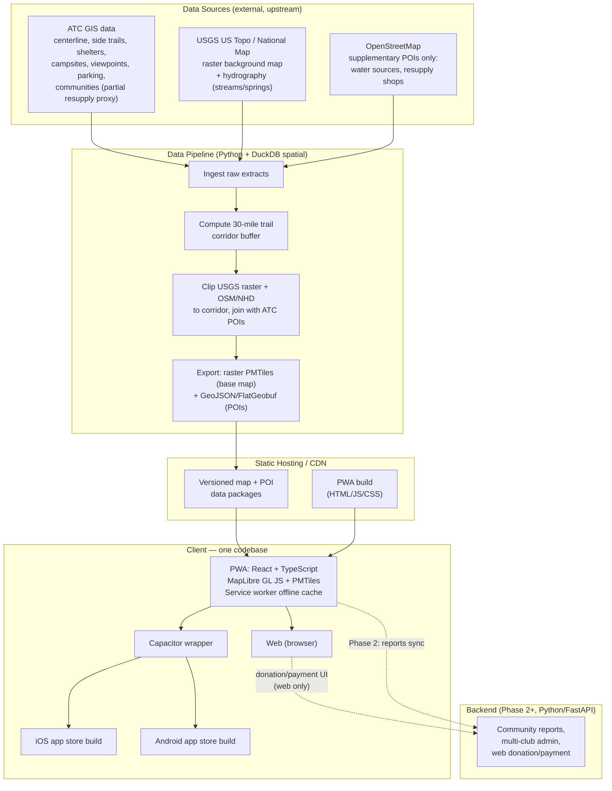

# OurHike — Technical Architecture (Draft v1)

Companion to [OurHikeValues.md](OurHikeValues.md) and [FEATURES.md](FEATURES.md). This describes *how* v1 gets built. Decided 2026-07-24; the DuckDB spatial pipeline is the first piece to validate before building further on top of it (see "First thing to prove out," below).

---

## Guiding constraints

- **One client codebase** for phone (iOS + Android) and web.
- **No in-app purchases** — any payment/donation flow lives on the web only (avoids app store fees).
- **Offline-first** — hikers download data before losing signal; nothing safety-relevant requires a live connection.
- **Boring, low-maintenance, inheritable** (values #7, #8) — favor tools a volunteer-run nonprofit can keep running for a decade, over cutting-edge complexity.
- **Open by default** (value #3) — open formats and open-source tooling throughout; avoid vendor lock-in.

---

## High-level architecture

---

## Data pipeline (Python + DuckDB)

**Sources:**

| Source | Provides | License status |
|---|---|---|
| ATC GIS (ArcGIS) | Trail centerline, shelters, campsites, water sources, road crossings, resupply points | Pending confirmation with ATC |
| USGS National Map | Elevation/topo data for base map | Public/open |
| OpenStreetMap | Roads, land cover, supplementary POIs | Open (ODbL) |

**Corridor definition:** a ~30-mile buffer around the trail centerline and its named waypoints, computed once with DuckDB's spatial extension (`ST_Buffer` + `ST_Union` over the centerline geometry). All USGS/OSM data is clipped to this corridor before packaging — this is what keeps offline downloads small and hosting cheap (value #8), while still covering the towns and services within a realistic support range of the trail.

**Pipeline steps:**
1. **Ingest** — pull raw extracts from ATC, USGS, OSM into a working format DuckDB can read directly (GeoJSON, Shapefile, GeoPackage, FlatGeobuf).
2. **Corridor** — build the 30-mile buffer geometry once from the trail centerline + waypoints.
3. **Clip & join** — intersect USGS/OSM data against the corridor; join ATC POI layers (shelters, water, campsites, crossings, resupply) into a unified schema.
4. **Export** — write base map tiles as **PMTiles** (single static archive, no tile server required) and POI layers as **GeoJSON/FlatGeobuf**.
5. **Publish** — versioned output pushed to static hosting/CDN.

This is a script, not a service — it's rerun periodically (e.g. monthly, or on demand when ATC data updates), not something running continuously. No database server to operate.

**First thing to prove out:** before building the rest of the pipeline, validate that DuckDB's spatial extension actually handles this cleanly — buffering a ~2,200-mile trail line by 30 miles, clipping a real OSM/USGS extract against it, and exporting the result. This is a quick, cheap spike to run before committing further design around it.

---

## Client (PWA — one codebase)

- **Stack:** React + TypeScript, **MapLibre GL JS** (open-source map renderer, no vendor lock-in) reading **PMTiles** directly in-browser.
- **Offline:** service worker precaches the app shell; map/POI data for a chosen trail section is downloaded on demand and stored via the Cache API / IndexedDB — mirrors the "download this region" pattern hikers already know from Avenza/FarOut.
- **GPS:** browser Geolocation API for "you are here," foreground use — sufficient for MVP (see trade-off below).
- **Packaging:** the same web build is wrapped with **Capacitor** to produce installable iOS and Android app-store builds. The web version and the app-store versions are the same codebase, not parallel implementations.
- **No purchases in the wrapped app** — any payment/donation UI is only rendered in the unwrapped web context.

**Known trade-off:** continuous background GPS track-recording (while the phone is locked/backgrounded) is weaker here than in a fully native app. Fine for MVP's foreground "check the map, see nearby water/shelters" use case. If always-on background tracking becomes a priority later, Capacitor supports native GPS plugins to close most of that gap without a rewrite.

---

## Backend (Phase 2+)

Not needed for MVP — the MVP client only reads static files from hosting. When community reporting, multi-club admin, or web donations arrive (see [FEATURES.md](FEATURES.md) Post-MVP section):

- **Stack:** Python (FastAPI) — keeps the pipeline and backend in the same language.
- **Database:** Postgres (with PostGIS if live spatial queries are ever needed) — added only once there's actual dynamic data to store.
- **Scope:** community condition reports, moderation, multi-club/org admin, and the web-only donation/payment flow.

---

## Hosting & cost shape

- **Cloudflare Pages** for the PWA build, **Cloudflare R2** for the PMTiles/GeoJSON data packages — R2 has no egress fees, which matters since map downloads are the bulk of the bandwidth. Both have free/low-cost tiers sufficient for MVP scale. No servers to run, which fits value #8 directly.
- A small backend is added later, only when dynamic features actually require one.

---

## Stack summary

| Layer | Choice |
|---|---|
| Client (phone + web) | React + TypeScript, MapLibre GL JS, PMTiles, Capacitor |
| Data pipeline | Python, DuckDB (spatial extension) |
| Backend (Phase 2+) | Python (FastAPI), Postgres/PostGIS if/when needed |
| Hosting | Static hosting/CDN (MVP) → + small managed backend later |

---

## Risks & open questions

- **ATC data licensing/access** — terms not yet confirmed; may shape what can be redistributed and how.
- **DuckDB spatial performance** — assumed workable, not yet proven on real data; see "First thing to prove out" above.
- **Background GPS** — acceptable gap for MVP, revisit if always-on tracking becomes a feature priority.
- **DuckDB-WASM** (querying the offline dataset client-side, in-browser) — promising future option, not committed for MVP.
- **Multi-club data model** — deferred to Phase 2 per FEATURES.md, but pipeline schema should avoid AT/NYNJTC-only assumptions where it's cheap to do so now, per value #7.
