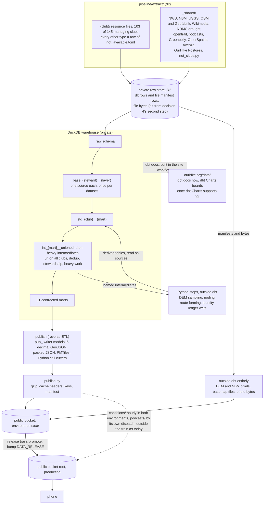

# The dlt → dbt data platform — design and migration plan

This is the design for **#1793 — Rebuild the data platform as dlt → dbt: seven contracted marts, a monthly refresh, published docs, and lighter phone downloads**: every source extracted and loaded by dlt into a private raw store, transformed by one dbt 2.0.6 project into eleven contracted marts, and published to phones as files.

## Contents

- [Overview](#overview): what was asked, every decision, what this reverses, the shape, the three clocks
- [Extract and load (dlt)](#extract-and-load-dlt): the folder contract, one extraction per dataset, who may publish and what may be fetched, no rasters, status layers, dlt's requirements, change checks
- [The data checks](#the-data-checks): the layout test, the run check after every load, note ageing
- [The dbt project](#the-dbt-project): v2, extensions, layers, one key per table, the eleven marts, status and water rules, contracts, Python steps, publish (reverse ETL), the evaluator, SQLFluff, state, docs
- [Keeping every rule we already built](#keeping-every-rule-we-already-built): parity, SQL first, the 179-row ledger, the human gates, state
- [Club by club](#club-by-club): the folder roster, the five tiers, deduplication after the load
- [Making the download smaller](#making-the-download-smaller): today's download, the three tiers, the four kinds of phone file, simplification
- [Background map: the plan, not the change](#background-map-the-plan-not-the-change): the basemap plan, on hold
- [Where data lives between runs](#where-data-lives-between-runs): storage tiers, DuckLake, a full reload that cannot empty a safety table, skip checks, stable keys, how dbt builds (open), geometry rules
- [Running it](#running-it): workflows, the hourly lanes, cadence, CI, secrets, docs, skills
- [Every club's closures and alerts (decision 53)](#every-clubs-closures-and-alerts-decision-53): where it stands, the rules it keeps, phases A to G
- [Row dates (decision 52)](#row-dates-decision-52): first seen and last changed on every mart row, from one dbt snapshot per mart (decision 57)
- [What the clubs publish that is not loaded yet](#what-the-clubs-publish-that-is-not-loaded-yet): the tally, what makes the gaps, and loading all of it (decision 54)
- [Phases](#phases): the build stages of one pull request, the work in flight, and the go/no-go gate
- [Risks and what nobody has checked](#risks-and-what-nobody-has-checked): the register, and every `@unvalidated` claim
- [Open questions for the maintainer](#open-questions-for-the-maintainer)

## Overview

**Status: planned 2026-10-01 under #1793 — Rebuild the data platform as dlt → dbt: seven contracted marts, a monthly refresh, published docs, and lighter phone downloads (branch `claude/intelligent-feynman-sw3ewm`); built in stages on that branch since, and at the go/no-go gate on 2026-10-05 (head `567890e6`).** Stage 1's dbt tooling went green first, on a GitHub runner on 2026-10-01: dbt 2.0.6, the YAML moved to v2's shape, the evaluator enforced, and SQLFluff and `dbt lint` in CI and `scripts/test.sh` ([Phases](#phases)). Where each stage and workstream stands now is [Work in flight](#work-in-flight-updated-as-it-moves); a section's "as built" paragraphs say what of its design is on the branch, and the rest is the intended state. The implementation lands as one pull request on that branch, built in stages and merged by the maintainer as a single go/no-go change (decisions 29–31, [Phases](#phases)).

**What "report N", "the decisions log" and "a probe" mean here.** The planning session kept its working files in a private scratch directory, and none of them is committed. They are six research reports, cited by number: 1, dlt for extraction; 2, the geometry marts (trail lines, POIs, elevation); 3, closures, warnings and podcasts; 4, CI and publishing; 5, what a phone downloads, and geometry; 6, dbt tooling. Then three later studies: storage formats and DuckLake, incremental loading per source and per mechanism, and each node's cadence. Then the decisions log, which records the maintainer's answers and which [Decisions](#decisions) restates. A probe is a throwaway project built to measure one behaviour. A reader cannot open any of these, so this document restates what it takes from them, with the date and what each figure was measured against.

### What was asked

A number in brackets is a row of [Decisions](#decisions).

| Ask (maintainer's words, shortened) | Answer | Section |
|---|---|---|
| "All pipelines a dlt implementation… once per month… a true elt approach" | dlt in `pipeline/extract/`; monthly reference lane, hourly lanes kept (1) | [Extract and load (dlt)](#extract-and-load-dlt), [Three clocks](#three-clocks) |
| "dbt project evaluator. Enforce all standards" | severity `error`; exceptions only through a commented seed | [The dbt project](#the-dbt-project) |
| "Implement sql fluff" | jinja templater, in CI and `scripts/test.sh` (19); `dbt lint` as a fast first pass, not the gate (33) | [The dbt project](#the-dbt-project) |
| "7 marts… a data contract"; "do not keep the dim_ and fct_ prefixes" | 11 contracted marts, named exactly as given (5) | [The dbt project](#the-dbt-project) |
| "A staging for each org… Union… in the intermediate… heavy transformation… on that unified model" | `base_` → `stg_<club>__<mart>` → `int_<mart>__unioned` → heavy intermediates → mart | [The dbt project](#the-dbt-project), [Club by club](#club-by-club) |
| "dbt state to only run models that have changed" | what state buys on a PR, and on a monthly reload | [The dbt project](#the-dbt-project) |
| "Hold off on… the background map… create the plan" | plan only | [Background map: the plan, not the change](#background-map-the-plan-not-the-change) |
| "dbt docs… publish the docs on OurHike" | `https://ourhike.org/data/`, now (10, 19) | [The dbt project](#the-dbt-project), [Running it](#running-it) |
| "dbt Charts for any outputs" | YAML boards now, rendered when dbt Charts supports v2 (19) | [The dbt project](#the-dbt-project) |
| "Not… download the entire duckdb… blazing fast" | no phone downloads a DuckDB file; the whole data set shrinks (9) | [Making the download smaller](#making-the-download-smaller) |
| "Simplify any geometries… a few feet off" | navigation line stays 1 m; bytes from encoding and per-zoom tiles (8) | [Making the download smaller](#making-the-download-smaller) |
| "Don't lose any transformation work… org by org plan" | every rule with its file, line, target model and tests | [Keeping every rule we already built](#keeping-every-rule-we-already-built), [Club by club](#club-by-club) |
| "Ask me questions… all the tables you need… a dbt skillset"; "check if dlt also has a skillset" | 40 numbered decisions, most by poll; four marts added, and what still reaches a phone from no mart; dbt and dlt repo skills (5, 11, 16) | [Decisions](#decisions), [The eleven marts](#the-eleven-marts), [Skills](#skills) |
| "1 folder per org… the same # of files"; "data checks… each of the different file types" | 11-file club folders, since decision 88 a club's resource files plus its rows of one `extract/not_available.toml`; dated `NOT_AVAILABLE` notes; three checks (12–14) | [Extract and load (dlt)](#extract-and-load-dlt) |
| "Recheck that each org has all the potential data loaded" | `pipeline/ORG_COVERAGE_SURVEY.md` (15) | [Club by club](#club-by-club) |
| "Load ALL the clubs… deduplication after the extract-load" | every managing club extracted, and each candidate steward once it has a reviewed catalogue row; dedup in intermediates | [Load everything, gate publication downstream](#load-everything-gate-publication-downstream), [The folder roster](#the-folder-roster), [Deduplication after the load, mart by mart](#deduplication-after-the-load-mart-by-mart) |
| "The most recent version of dbt… v2"; "Keep the dbt versions aligned"; "see if we can use just plain dbt?" | `dbt` 2.0.6, one version everywhere (17, 19, 32) | [Version: dbt 2.0.6, one version everywhere](#version-dbt-206-one-version-everywhere) |
| "DEC is allowed if it is part of their GIS clearinghouse"; "the same goes for OPRHP"; "The GIS info almost always is reusable" | one publication rule per layer, with a presumption for public GIS (20–22); no GIS-shaped type noted as unavailable until a fixed checklist is worked (21b); the licence batch answered (36–38) and the fetch terms (39) | [Who may publish](#who-may-publish), [The folder contract](#the-folder-contract), [Club by club](#club-by-club) |
| "Attempt to load a duckdb extension and use sql before going the route of a python model" | core SQL, then `spatial`, then a community extension, then Python (23) | [Keeping every rule we already built](#keeping-every-rule-we-already-built) |
| "Think of that final step as reverse etl"; "dbt can output to specific external files" | every phone file is a dbt exposure, written by a `phone_file` model; `publish.py`, not dbt, writes R2, because a DuckDB write to the bucket loses gzip and cache headers (24) | [Publish (reverse ETL)](#publish-reverse-etl), [Four kinds of phone file](#four-kinds-of-phone-file) |
| "Should all of these files… load data to parquet? Should ducklake be used"; "the dlt job should run incrementally" | Parquet raw, DuckLake at two named phases, full reload behind a skip check; how dbt builds is left open (25–27) | [Where data lives between runs](#where-data-lives-between-runs) |
| "Apply a meta tag that classifies each as hourly/daily/weekly/monthly" | `meta.cadence` on every source, exposure and resource (28) | [Every node carries its cadence](#every-node-carries-its-cadence) |
| "We are going to implement this in 1 big pr… a go / no go change" | one pull request, parity plus a UA soak, new data published in it (29–31) | [Phases](#phases), [The go/no-go gate](#the-gono-go-gate) |
| "Are we landing the same data, multiple times? We shouldn't"; "Are we landing many rasters?" | each upstream dataset extracted once, a republished copy a `SAME_AS` note, a club's portion an assignment (34); no raster lands as data (35) | [One extraction per upstream dataset](#one-extraction-per-upstream-dataset), [No raster lands as data](#no-raster-lands-as-data) |

### Decisions

Settled by the maintainer on 2026-10-01, most by poll; 4 and 11 went without a picture, and 12, 14 and 15 began as the maintainer's own unprompted asks, as did 20–25, 28–29, 32, 34–35 and 40. Nothing below re-argues them. Under "Offered and not taken", "—" means nothing offered was left: the maintainer gave the direction in their own words, or (5) took every option offered. "Not recorded" means a poll whose other options the decisions log did not keep.

| # | Question | Chosen | Offered and not taken |
|---|---|---|---|
| 1 | Refresh cadence | **Monthly base, fast lane kept**: trails, POIs, elevation, podcasts, challenges monthly; closures, warnings, weather, water conditions keep their current hourly/daily clocks; all through dlt | Monthly for everything; monthly plus an on-change trigger |
| 2 | `warnings` holds | NWS weather alerts; org notices that do not close the trail; hazard POIs | Water / drought conditions |
| 3 | `challenges` holds | What **#1780 — Let a club publish a challenge — places on its own trails that hikers opt into and tag at camp — starting with the ATC's A.T. Summer Bucket List** builds. It closed 2026-10-01 through **PR #1798 — Challenges: a club's list of places on its own trails, joined and tagged at camp, starting with the ATC's Summer Bucket List**, merged at 5b65fca, so the mart ports `export_challenges.py` from `main`; not redesigned here | Peak lists; org-run programmes; trail completion; empty stub |
| 4 | dlt for file-shaped sources (no visual) | **Manifest row first, then bytes as well**: first, one dlt row per file (url, size, sha256, last-modified) with the bytes in the private raw store; then dlt moves the bytes too (filesystem destination). The poll called these phase 1 and phase 2; they are decision 4's own two steps, not build stages. Pixels never enter DuckDB | Row data only; bytes from day one |
| 5 | Extra marts | `trail_network`, `places`, `suggested_hikes`, `sources` | — |
| 6 | OurHike's Postgres closures and reports | **Yes, hourly**: dlt `sql_database` reads moderator-verified rows only; one `closures` mart for every org plus OurHike. *(Implementation note, stage 2b: built through psycopg rather than `sql_database`, on a measurement of its column hints; the rows and predicates are as decided. See "Decision 6 no longer adds SQLAlchemy".)* | Keep them separate |
| 7 | Closures vs warnings | **Split on `obstructs_trail`; unknown = warning.** Unclassified rows (every NYNJTC alert today) go to `warnings` as "not reviewed", never to `closures`, never dropped | Unknown = closure; an org-category seed |
| 8 | Simplification | Navigation line stays 1 m; bytes from 6 decimals and packed columns (−48% first run, Reasoned: summed per-file measurements, nothing rebuilt end to end); per-zoom simplification inside tiles (z14 ≈ 0.44 m grid, Reasoned); miles and climb on full resolution | +2 m or +5 m, junctions pinned |
| 9 | "The entire duckdb" | **The whole data set** (7,101,793 bytes on the wire, measured 2026-10-01 from release `2026-09-24-2`'s manifest): safety core (water, closures, trail lines) whole but packed; the rest to tiles and cells read by range | DuckDB-WASM on the phone; the offline basemap + DEM |
| 10 | Who sees docs and charts | **Public, counts only**, at `ourhike.org/data/`; no maps, so no coordinates in the page | Public with maps; maintainers-only CI artifact |
| 11 | dbt skill (no visual) | `.claude/skills/dbt/SKILL.md` plus dbt Labs' `dbt-labs/dbt-agent-skills` plugin | Repo skill only; none |
| 12 | dlt folders | The maintainer: *"1 folder per org… the same # of files"*, then *"the data extraction should be specific to the managing club"*. Poll: **clubs plus one shared folder**: `pipeline/extract/<club>/` strict, `pipeline/extract/_shared/` free-form. Not `pipeline/dlt/`, which shadows `import dlt` from `pipeline/` | not recorded |
| 13 | Club file set | **Exactly 11**: `org.py`, `trail_lines.py`, `points_of_interest.py`, `elevation.py`, `closures.py`, `warnings.py`, `places.py`, `suggested_hikes.py`, `podcasts.py`, `challenges.py`, `photos.py`; each a dlt resource or a dated `NOT_AVAILABLE` note. *Amended by 88: the notes, `SHARES` pointers and `org.py` files moved into one `pipeline/extract/not_available.toml`, so a folder holds only its resource files.* `trail_network` and `sources` have no file (derived); weather and basemap live in `_shared/` | not recorded |
| 14 | Data checks (maintainer, unprompted) | Layout test per PR; run check after each dlt run; note ageing monthly (180 days, `@unvalidated` until one recheck cycle shows how often a note turns out wrong) | — |
| 15 | Coverage audit (maintainer, unprompted) | **Now, in this plan**: `pipeline/ORG_COVERAGE_SURVEY.md`, which seeds the first notes | not recorded |
| 16 | dlt agent skills | **Repo dlt skill only** (dltHub's AI Harness licence permits use "solely in connection with dltHub Services") | the Harness; `dlt-mcp` 0.3.0 |
| 17 | dbt version | **dbt-oss 2.0.5** (Apache-2.0, 2026-09-18). **Supersedes the session's call to stay on 1.12.x** (T1). The YAML moves to v2's shape (the 64 parse errors measured on today's project). v2 bundles DuckDB 1.5.4 against the pipeline's 1.5.5 pin: whether v2 reads a 1.5.5-written warehouse and loads spatial in CI is `@unvalidated`, settled by one CI run (that run happened on 2026-10-01: [Version](#version-dbt-206-one-version-everywhere)). Its side-environment half is superseded by 19, and **its distribution by 32** (`dbt` 2.0.6) | `dbt` 2.0.6 (no licence on PyPI); 1.12.x |
| 18 | Which orgs get folders | **Managing orgs only**: 145 of `trail_orgs.json`'s 173 rows by `type` (173 − 12 `national_umbrella` − 13 `route_only` − 3 `aggregator`, counted 2026-10-01). Umbrellas and route-only: a dated line each in `_shared/not_clubs.py`; aggregators (osm, outerspatial, avenza) in `_shared/` | All 173 (1,903 files) |
| 19 | One dbt version | *"Keep the dbt versions aligned."* **dbt-oss 2.0.5 everywhere, no side environment** (supersedes that half of 17; 32 later changed the distribution to `dbt` 2.0.6, and one version everywhere still holds); SQLFluff jinja templater (measured 3.0 s serial, 0 violations on the 32 current files); docs now; Charts boards as YAML in `pipeline/dbt/charts/`, rendered once dbt Charts supports v2 (`dbt-charts` 0.8.0 and its `main` pin `dbt-core<2`, read 2026-10-01): a named external blocker | dbt-core 1.12.5 until Charts supports v2; v2 plus Evidence.dev |
| 20 | DEC's GIS data | The maintainer: *"DEC is allowed if it is part of their GIS clearinghouse."* **A DEC dataset listed in the NYS GIS Clearinghouse may be published**, as a maintainer decision and not a grant from DEC; the item's own restrictive text stays quoted beside it. Person fields never ship. `nysdec`'s `public_domain` becomes `maintainer_clearinghouse` | — |
| 21 | Don't give up on an org | *"The GIS info almost always is reusable."* **(a)** A GIS layer an org publishes anonymously on a public endpoint is presumed reusable (`public_gis`); explicit restrictive text goes to the maintainer as one batched question (answered the same day by 36–38); the presumption does not reach photos, audio or prose. **(b)** No GIS-shaped row is accepted as unavailable until a fixed discovery checklist is worked and written down | — |
| 22 | OPRHP's GIS data | *"ANd the same goes for OPRHP. We can use that."* The same footing as DEC; all four `oprhp_*` layers publish, credited "NY State Parks"; `nysparks` becomes `maintainer_clearinghouse` | — |
| 23 | SQL first | *"Attempt to load a duckdb extension and use sql before going the route of a python model."* **Core SQL, then `spatial`, then a community extension, then Python**, each step down on a written reason | — |
| 24 | The last step | *"Think of that final step as 'reverse etl'."* **Publish (reverse ETL)**: every phone output is a dbt exposure; four kinds of file; the follow-up asked for dbt to write the files | — |
| 25, 25a | Incremental | *"dlt should just reload the entire table. but can you leave dbt as a question?"* **dlt does a full reload per source behind the skip-unchanged check** (25a supersedes 25's extract half); a failed reload must never empty a safety table; how dbt builds is an open question | — |
| 26 | Where data lives | **"Tiers as drawn"**: Parquet raw with zstd; DuckLake for the monthly raw lane at phase 3 and the warehouse at phase 4; GeoParquet step cache; phone files written by a dbt materialisation and uploaded by `publish.py`; an empty table counts only with the upstream's own count | Plain files only; DuckLake now for raw and the warehouse |
| 27 | How dbt builds | **"Leave open in the plan"**: options A, B and C, decided at the phase that ports the POI marts; closures and warnings stay `table` in every option. **Answered by decision 41: C** | C now; A; B |
| 28, 28a | Cadence | *"Apply a meta tag that classifies each as hourly/daily/weekly/monthly."* **`meta.cadence` on every source, exposure and dlt resource**; each node built only by the lane equal to its fastest upstream; `warnings` owned by the conditions job | — |
| 29 | One pull request | *"This should be a go / no go change."* **One pull request**, closing the issue this plan belongs to, built in stages on one branch; supersedes the issue's "phases become their own issues" | — |
| 30 | What decides go | **"Parity + UA soak"**: frozen inputs through both pipelines; every R2 key byte-equal or listed with a reason; all suites and checks green; one monthly run plus 7 days of hourly runs on UA (**3 days since decision 46**) | Suites + UA soak with no byte diff; parity only |
| 31 | New club data | **"Publish new data in this PR"**, with a new-data review report; the batched licence question and the open terms questions block go. The same day, 36–38 answered the licence batch and 39 the fetch terms; what still blocks go is in [The go/no-go gate](#the-gono-go-gate) | Extract all, publish after go |
| 32 | dbt distribution | The maintainer: *"maybe we should be using dbt, not dbt-oss … see if we can use just plain dbt? We get expanded features that way I believe"*, after reading dbt Labs' `docs.getdbt.com/blog/comparing-dbt-and-dbt-oss`. **`dbt` 2.0.6, one distribution everywhere**: CI, `scripts/test.sh`, the skills and the docs. **Supersedes the distribution part of 17 and 19** (dbt-oss 2.0.5 → `dbt` 2.0.6); one version everywhere still holds. It is under the dbt Product Licensing Agreement, and only its documented opt-outs are used. dbt-oss 2.0.5 stays the documented fallback, because the same project files ran green on it ([Version](#version-dbt-206-one-version-everywhere)) | Keep dbt-oss 2.0.5 |
| 33 | Linting under the full distribution | **"SQLFluff enforced + dbt lint"**: SQLFluff with the jinja templater stays the enforced check (the original ask), and `dbt lint` runs as a fast, dbt-aware first pass, never the only gate ([SQLFluff](#sqlfluff)) | `dbt lint` only; SQLFluff only |
| 34 | Landing data once | *"Are we landing the same data, multiple times? We shouldn't. Like for USFS, that should get landed as a 'base' layer (subset of staging) Then each club can take that data and assign their portion."* **Each upstream dataset is extracted once, in its steward's folder.** A republished copy is a `SAME_AS` note and is never extracted. A club's portion is an assignment in `int_<mart>__stewardship`, so each feature reaches its mart once, with its stewards attached ([One extraction per upstream dataset](#one-extraction-per-upstream-dataset)) | — |
| 35 | Rasters | *"Are we landing many rasters?"* **No raster lands in the raw store or the warehouse as data.** The DEM is read in place and only its samples are cached; NBM grids leave only their derived squares; the topo and hiking-sheet rasters belong to the background map ([No raster lands as data](#no-raster-lands-as-data)) | — |
| 36 | Layers that bar profit, sale or commercial use (about 10) | **"Non-commercial: publish"**, with each publisher's attribution: OurHike is non-commercial in these terms' sense. California State Parks' "may not be … altered" is read as not covering reprojection, tiling or simplification for display, and its interagency-only admin-code fields are dropped ([Who may publish](#who-may-publish), rule 5) | Treat as commercial and hold; ask each publisher |
| 37 | Layers that say "internal use", "not for distribution" or "all rights reserved" (about 16) | **"Publish under GIS presumption"**: 21(a) extends to them when they are served anonymously on a public GIS endpoint. This is the maintainer's decision against the items' own words, which stay quoted in `sources.json`. Still excluded: person fields, the four `refuse` orgs until permission is recorded, and anything that is not an anonymous public endpoint ([Who may publish](#who-may-publish), rule 3) | Hold and ask each publisher; drop them |
| 38 | Layers that carry conditions rather than refusals (about 9) | **"Publish, honouring each"**: each condition travels with its layer in the `sources` mart and is enforced downstream. A condition that cannot be met holds its layer ([Who may publish](#who-may-publish), rule 5) | Hold all |
| 39 | Fetch terms: browser-only hosts, no-automation terms, waiver gates | **"Allow ArcGIS copies, else ask"**: a club's own public ArcGIS layer counts as published whatever its website's waiver says, so ONDA's `ODT Tracks` is extracted. **The pipeline never imitates a browser**: it always sends its own honest user agent, and a host that refuses it holds until the org answers. Other no-automation terms and waivers mean ask. ATC's trail-updates scrape stays as today, on **#458 — Confirm with the ATC what may be republished from their Trail Updates** ([What may be fetched](#what-may-be-fetched)) | Never imitate, and ask, with ONDA's ArcGIS copy held too; allow a browser UA where served |
| 40 | A key for every table | **"every table needs a unique id. Use the dbt_utils package in dbt, and call the generate_surrogate_key() macro to create the key based on current values"**, with the columns found by researching each table, and **"staging tables should only do 2 main things. data type conversion / field renaming & dedupe source tables"**. The key's inputs are the registry key, then the upstream's own primary key where one is unique, else the smallest set of current values measured unique; never a server row id alone ([One key per table](#one-key-per-table)) | — |
| 41 | Decision 27 answered: how dbt builds | **C**, by poll on 2026-10-01, from a diagram of the three shapes: **snapshots for points of interest only**, for automated POI-ledger proposals; closures second, once the hourly lane can store and restore a warehouse; table models everywhere else. Closures and warnings stay `table` models, as every option kept them | A, tables throughout; B, a snapshot of every source with incremental models downstream |
| 42 | Where raw lands | **Superseded by decision 43.** **"Can't you just use our current bucket? … If we made that decision, we can undo that decision. It's fine, don't make unnecessary work"** (poll, 2026-10-01). This reverses the 2026-09-08 decision `R2_LAYOUT.md` records, a private raw bucket and a private step cache: both live in the current bucket, under their own prefixes, and the eight secrets reduce to the ones that bucket already has. **One rule survives, because the bucket is world-readable** (`R2_LAYOUT.md`: "an object put here is published, not stored"): a raw table whose rows this project has decided never to publish stays off R2. That covers ATC's user-created campsites, USFS's dispersed camping areas, DEC's non-public rows, opentrail until **#98 — Confirm opentrail.org data-reuse terms with the maintainer** is answered, and any layer whose terms refuse redistribution. Such a table is filtered in its request where the steward's own field allows it, or kept in the job's local store. The list is worked at stage 4, when the workflows first write to R2 | two private buckets, as designed; one private bucket for raw and steps; holding R2 until the gate |
| 43 | Where raw lands, again | **"Noooooo don't partition the sources. If you absolutely need to we can make a private bucket. I just don't think it's necessary"**, then, on a poll, **"Same bucket, one key"** (2026-10-01). Decision 42's hold-out rule split the sources by whether a table could sit in the world-readable bucket, and the maintainer refused the split. Without it, every raw table would land in `your-hike`, which publishes it: USFS's dispersed camping locations, DEC's non-public rows, and every layer whose terms refuse redistribution. So all raw lands in one private bucket, **`our-hike-raw`**, created 2026-10-02 (location ENAM, no public access, no custom domain), with nothing held back by source. It is named for the project, not the old `your-hike`, at the maintainer's word, and the public bucket moves the same way: **`our-hike`** replaces `your-hike` for phones. That move was made on 2026-10-02 without copying anything: *"No need to copy that data over. Lets just … delete it in 3 days"* (the maintainer; OurHike has no users yet). So `our-hike` is filled by fresh publishes, `data.ourhike.org` moves to it, and `your-hike` is deleted on 2026-10-05. The step cache sits in the same bucket under `steps/`, beside raw under `raw/`. **One read-and-write key** covers both, so three secrets: `R2_RAW_BUCKET`, `R2_RAW_ACCESS_KEY_ID` and `R2_RAW_SECRET_ACCESS_KEY`, with `R2_ENDPOINT_URL` reused (same account). The cost, accepted on the poll: R2 keys cover a whole bucket, so a build job that needs only to read raw could overwrite it, where `INCREMENTAL.md` designed a separate write key for the extract jobs alone. Supersedes decision 42 | a second bucket for the step cache and three keys (eight secrets, `INCREMENTAL.md`'s design); one bucket with a read-only key besides |
| 44 | How a phone file is versioned | **"A +B in this PR. But it also needs to consider how to flag the app that fresher data is available"** (poll, 2026-10-02, from a page drawing today's date pin beside the two options). A release id like `2026-09-24-2` marked two things at once, a file's shape and the build a phone reads, and they are split. **The shape is a dbt model version.** Every contracted mart that feeds a phone file declares `versions:`, v1 being today's shape exactly (the shape parity checks), and its writer names the version in the R2 key. An added column is not a new version. A removed, renamed or retyped one is, and v1 keeps being written beside v2 until its `deprecation_date`. Phones ignore fields they do not know, and an absent field means unknown. **The build is a pointer.** A committed `channels.json` names, for each environment and each schema version, the build a phone reads, and replaces the client's `DATA_RELEASE` constant. Promotion and rollback are a reviewed one-line commit to it, uploaded by the release train's dispatch and never by a push. So the 2026-09-09 reason for a committed pin still holds: the dataset changes only with a commit, a review and history. What changes is that the commit no longer needs an app release, so the monthly refresh reaches installed phones. **The flag is #919's.** `lib/dataRefresh.ts` reads the pointed-to build's manifest rather than the pinned one, so `TrailDataUpdate.tsx` asks the hiker whenever a newer build lands, under the 2026-08-21 decision that nothing is replaced without asking. **The flag needs nothing new, by poll on 2026-10-02 from a page drawing the row and two options for an app left behind:** *"Today's row is enough"*, and for an app whose schema version is past its `deprecation_date`, *"2A: say nothing"*. That app keeps its last good download and shows no row, because `useAppUpdate.ts` installs the newer app the next time it opens online, and then the row offers the newer data. Offered and not taken: a dot on the More tab beside the row, applying sub-1 MB corrections silently (which would revisit the 2026-08-21 decision), and a buttonless line saying newer data needs the newer app. Designed and built at stage 4, with `pipeline/DATA_RELEASES.md` and `RELEASING.md`. **Measured 2026-10-02 on dbt 2.0.6**, in a throwaway project (`fruit_v1`, `fruit_v2`, `latest_version: 2`): `versions:`, `deprecation_date` and `ref('fruit', v=1)` build, each version's contract is enforced at build (a key retyped in the SQL alone failed "enforced contract that failed"), and a reference to a version near its `deprecation_date` warns (`dbt1073`). **But dbt 2.0.6 does not refuse a breaking change between states**, which dbt Core does with `ContractBreakingChangeError`: under `-s state:modified --state`, dropping a column from a contracted v1 view and retyping a contracted v2 table's key in both its SQL and its YAML each built green. So the refusal is this project's own check: a pull request's contracted versions are compared with `main`'s manifest, and a removed column, a changed type or a dropped version fails unless the change is a new version | A only: schema versions with the date pin kept; A in this PR and B as its own issue |
| 45 | Which other clubs' POIs move to 1° cells (stage 6) | **Deferred out of this pull request** (2026-10-02, after the poll below): *"I think we are going to have to let the user decide what to download. but let's not cram that into this pr."* The cell split waits for a follow-up in which the hiker chooses what to download (**#1811 — Fast follows after PR #1805's dlt → dbt re-platform: the hiker's own download choice, the cutover, and what the port found in today's code**, section 1); this pull request ships stage 6's lossless v2 files only, with every POI whole. The poll's answer stands as the starting point for that follow-up: **A, "exits whole"** (poll, 2026-10-02, from `poi-cells-mock.html`, a drawing of a hiker offline outside the square they downloaded, under each option). The maintainer first: *"Yes all POIs should be made available the most efficient way possible. That's into the cell right? If not then dont."* **Whole on every phone:** water and shelters from every organization, the A.T.'s own POI files, and other organizations' **trailheads and parking**, the exits, which serve the fourth harm (getting off the trail quickly). **To 1° cells:** other organizations' campsites, privies, viewpoints and crossings (6,189 points). First run about 3,092,705 B (−56% from 7,101,793; Reasoned, the sum in "Before and after, first run") | B: trailheads and parking in cells too, 2,698,203 B (−62%), with no other club's exit on a phone outside its downloaded squares |
| 46 | How long the UA soak runs (amends decision 30) | **"Lets do 3 days using a routine"** (2026-10-02). Decision 30's "7 days of hourly runs on UA" becomes **3 days**: an hourly dispatch of the conditions lane on UA, from this branch, by a scheduled routine, once the lane is on the branch and one dispatch has passed. The monthly run and every other item of decision 30 stand | 7 days, as decision 30 wrote it |
| 47 | Whether the ATC's challenge list may publish | **"For the ATC challenges list. I have their permission as a volunteer."** (2026-10-02). `reference/challenges/atc` publishes on the maintainer's authorisation, which rests on the maintainer's statement as an ATC volunteer. The folder has no `sources.json` row to carry a `licence_basis`, so it publishes through a row of the `unregistered_publishing_sources` seed whose `decided_by` cites this decision (`int_sources__publication` reports it as `publishing_before_registration`). When the folder gets a registry row, that row's basis is `maintainer_authorisation`, never `stated_by_org`. **No written grant from the ATC is in this repository**, and nothing here may render it as one. **PR #1798 — Challenges: a club's list of places on its own trails, joined and tagged at camp, starting with the ATC's Summer Bucket List** asked for the ATC's written permission before the list reached a phone; this is the maintainer's answer to that ask | hold the list back under rule 6 of "Who may publish" until a written grant is recorded |
| 48 | What the trail-data row says when the pointer moves a phone to an older release | **A, "Changed trail data", as built** (poll, 2026-10-03, from a mock of the row in three forms: today's "Newer trail data", A, and B "Earlier trail data"). `chrome/TrailDataUpdate.tsx` names a rollback the pointer made (`lib/dataRefresh.ts`'s `older`) "Changed" and every other offer "Newer"; the rest of the row is unchanged |
| 49 | What the monthly lane does when one source still fails after its retries | **Keep last month's copy** (poll, 2026-10-03, after DEC's GIS server stalled two monthly runs, refresh-reference.yml 37097625268 and 37099504783). That source is left on its last committed table, the rest publish, and the run is marked partial and red, as the conditions legs already do; a source with no earlier copy publishes nothing new. **Built 2026-10-04 (091a5ff6), before the gate run**, after monthly runs 10, 11, 12, 14 and 15 each stopped on one layer: the monthly lane is in `extract/_run.py`'s `ISOLATING_LANES`, a layer whose read still fails after `extract/_kinds.py`'s `MONTHLY_READ_BACKOFF_SECONDS` is logged `refused` and keeps its last committed table, the run exits `PARTIAL_EXIT` (3), and refresh-reference.yml's `refused` job goes red. Monthly runs 16 and 17 ran that way, and `left_out_on_its_own()` (47c81df3) lets such a run be pinned |
| 50 | What a deploy does when the dbt docs cannot build | **Fail loudly, as built** (poll, 2026-10-03). `.github/actions/dbt-docs-site` needs PyPI, dbt's CDN and the dbt package hub, so an outage of any of them blocks previews and tag deploys. The alternative was deploying without `/data/`, which would serve the app shell at that path |
| 51 | Whether each club's notices keep a phone file of their own | **One generic file, as a follow-up after this pull request** (poll, 2026-10-03). Today `conditions/atc_updates.json` (ATC's own shape, with A.T. mile markers) and `conditions/nynjtc_alerts.json` (`OrgNotice`, `features/ORG_NOTICES.md`) are one file per club, though the `closures` and `warnings` marts already hold every club by `source_key`. The follow-up writes one `conditions/notices.json` in the `OrgNotice` shape as a v2 file beside the two (decision 44), with ATC's mile markers as an optional placement, and holds back a failing club by keeping that club's last good rows with their own date rather than by withholding the file. This pull request keeps both files as today's exporters write them, because parity against today's files is the gate. Tracked in **#1811 — Fast follows after PR #1805's dlt → dbt re-platform: the hiker's own download choice, the cutover, and what the port found in today's code** |
| 52 | Whether every warehouse row carries when it was first seen and last changed (amends decision 41) | **Yes, every row of every intermediate and mart model, in this pull request** (poll, 2026-10-03), detected by **a dbt snapshot per source** (check strategy on each row's key and content hash), with `_first_seen_at` and `_changed_at` carried downstream and enforced by a test. Snapshots persist between runs outside the warehouse, which is rebuilt each run. Notices also carry OurHike's `checked_at` (decision 53). dlt's SCD2 was weighed and is not available here: dlt 1.30.0's filesystem destination, the raw store's, offers merge only as `upsert` or `insert-only` and only on Delta or Iceberg tables, and no SCD2 (read in its `filesystem/factory.py`, 2026-10-03). Revisit at phase 3, when the monthly lane moves to DuckLake, whose own snapshots could replace the export and restore |
| 53 | Which clubs' closures and alerts are brought in | **All of them, in this pull request** (2026-10-03): *"Add all to this PR. Publish all 121 closures … Bring in all closure and alerts notices."* Published as facts and a link (`features/ORG_NOTICES.md` §7). Access is checked per host (robots.txt for our agent, the site's terms), never assumed: *"Don't just assume it blocks automated access … we'll be careful about not burdening their servers."* A real refusal stays a quoted note until the club permits. Decision 51's single notices file moves into this pull request. The plan is "Every club's closures and alerts (decision 53)" |
| 54 | Whether every dataset the clubs publish is loaded, not only notices | **Yes, all of them** (2026-10-03): *"OK, so we want to load all those clubs!!! Make the registry row if that is needed. Make a plan to do that correctly. That's a lot of data to load."* The 842 published-but-unregistered type × club cells get a `sources.json` row each where the dataset is real and reachable, then a resource, then dbt. Read here as this pull request, like decision 53, because the maintainer added it to the same list; the maintainer may move any wave out. The plan is "Loading everything the clubs publish (decision 54)" |
| 55 | Whether a club's notices publish when its terms restrict copying but not reading | **Facts and a link for all of them** (poll, 2026-10-03), from the 20 or so clubs phase A found with such terms: among them the Arizona Trail Association ("Information taken from this website and published online … requires written permission"), WTA ("used solely for internal informational purposes"), Buckeye, Ozark Trail, TPWD, NYS DEC, Duluth, mass.gov and the Bay Area Ridge Trail. Each is extracted, its terms quoted verbatim on its `sources.json` row, and its rows carry `licence_basis: maintainer_authorisation` naming this decision. A notice publishes as facts in OurHike's own words and a link (`features/ORG_NOTICES.md` §7); no reader carries a page's or item's wording into a published column. Terms that forbid automated access, and robots.txt rules, are refusals and stay quoted notes (ADK, Trail Finder, nycgovparks.org, CalTopo). avalanche.org's "contact … for permission" stays unfetched until it is asked |
| 56 | When the editor-tracking person fields already loaded are purged | **After the fix re-reads** (poll, 2026-10-03). A worker found 15 loaded layers carrying staff names in `Creator`, `Editor`, `created_user` and `last_edited_user` (10 of ATC's 12 ArcGIS Online layers, `oprhp_park_polygons`, `nj_statewide_trails`, `utah_sgid_trails`, `ncta_trail`, `duluth_superior_hiking_trail`), and Alaska Trails' `DataOwner`, which holds a person's e-mail address on 31 rows, measured on the layers' live metadata 2026-10-03 (first counted as 17, recounted). `massgis_long_distance_trails` could not be checked: its host's robots.txt answered 502, which RFC 9309 reads as disallow. They reached the private raw store and its pinned copies only: no mart or `pub_` model carries them (contracts, and a search of `models/marts` and `models/publish`, 2026-10-03). The fix drops `PERSON_FIELDS`, each layer's own `editFieldsInfo` creator and editor fields, a row's `person_fields`, and any name matching a person-shaped pattern unless the row lists it in `not_person_fields`. The next monthly run re-reads every changed layer without them; then the dlt skill's purge ("A field that should never have loaded") deletes every older as-sent snapshot, pinned `raw_run`, stored warehouse and `browse/ourhike.duckdb` that holds them, so the next promotion needs a fresh UA build |
| 57 | Where the row-history snapshots sit (amends decision 52) | **One snapshot per mart, built in the intermediate layer** (poll, 2026-10-03): *"I think it should snapshot the mart, but make that snapshot in the intermediate layer. We might choose how to merge features that have been removed at a later date."* Decision 52 had put a snapshot on every source, hashing every column, so a change to a field nothing uses (an editor's name, an edit time) moved a row's `_changed_at`; the maintainer: *"why track changes we don't care about?"* Now each mart's rows are snapshotted in the intermediate schema with every contracted column, so the snapshot holds a removed feature's last content and a later decision can merge removed features back; the mart reads its current rows and their two dates from it. Only the marts' rows carry `_first_seen_at` and `_changed_at`; other intermediates do not. Source history is not lost by this: the raw store keeps every pull's as-sent copy, write-once |
| 58 | What the hourly closures and warnings publish does when the row history cannot be restored | **Publish, dates blank** (poll, 2026-10-03). The closures and warnings marts build from their final intermediate with `_first_seen_at` and `_changed_at` null, which means unknown and never "new"; the run goes red so the store gets fixed; nothing is saved to the history that run, so a bad restore cannot overwrite it. A hiker still gets the closure. The monthly lane, which is not a safety clock, still stops loudly on a lost store. Each snapshot version also records the build that wrote it, so a change to OurHike's own rules can be told apart from an upstream edit |
| 59 | Whether a free-text column that carries personal data is kept for its useful notes | **Left out whole** (2026-10-03): *"Yeah, leave them out if there is PII."* NCTA's `descriptionText` and FLTC's `Description` carry water notes ("Seasonal potable water", "No privy, no water available") beside private hosts' names, e-mail addresses and phone numbers; IATA's `Parking_Notes` says whom to tell before leaving a car overnight beside four named state employees' addresses. Each such column is a row's `person_fields` and never loads, because rule 8 excludes in dlt and never redacts rows in dbt. A water fact lost this way is a gap in the notes, never a guess |
| 60 | Whether go waits for all of decisions 53 and 54, or ships the re-platform first | **Everything here** (poll, 2026-10-03, 21:50 UTC, from a status check giving the gate items about 2026-10-05 to 10-06 and decisions 53 and 54 several days beyond it, a guess and not a measurement). Go waits for every phase of decision 53 (A to G) and all six waves of decision 54, each wave's tables through dbt staging, in this pull request. The alternatives were keeping decision 53 and moving decision 54's waves 2 to 6 to follow-ups, and going on the re-platform alone |
| 61 | How often the conditions lane runs, and for how long | **Split** (poll, 2026-10-04): the maintainer, *"we can move the conditions to run every 4 hours and to take up to an hour. if this is going to be too hard to keep fast, let's expand now and not waste time on it"*, then chose by poll to keep what a storm or a moderator's closure turns on hourly. **Every club's and agency's notices (decision 53) move to a new job every 4 hours with up to an hour to read; NWS weather alerts, OurHike's own moderated closures and reports, and ATC's and NYNJTC's notices stay in the short hourly job.** The alternative, everything every 4 hours, would let a warning shorter than about 4 hours (most severe thunderstorm warnings) expire unseen, and take a verified closure up to about 5 hours to reach a phone. The phone already says "Conditions as of Nh ago" at any age (`lib/conditionState.ts`) |
| 62 | What the 3-day soak's clock does when decision 61's jobs land | **Restarts on the new schedule** (poll, 2026-10-04), so the soak tests the lanes that will ship. Runs 477 to 508 stay in the record as the hourly lane's history (25 green, run 506 red and fixed) |
| 63 | When a new layer's `reaches_hikers` turns true | **As soon as that layer's rules are in dbt and tested, layer by layer, not after every wave** (the maintainer, 2026-10-04: *"why are you making the reaches hikers false? the whole point is to get all of this on the map"*). `false` is a hold until the rules ELT.md lists from the live reads keep a wrong thing off the map (firefighting water read as drinking water, planned trailheads, historic ruts routed as trail, staff residences, terms no decision covers), never a decision to leave a layer off |
| 64 | How the clubs' own trail lines (about 180 places and trail-line layers, wave 1) reach a hiker | **Draw now, route later** (poll, 2026-10-04, from `decisions-64-67-mock.html` section 1). A club line draws on the map as a club line as soon as its rules are in dbt and tested, and joins routing, route distances and the trail graph only after a dedupe step has checked it against the lines already there. Historic alignments never draw as trail and never route, whatever this decision says. The alternatives were drawing and routing at once, and drawing a club line only where no other source's line lies within a set distance |
| 65 | What a hiker sees of a plumbed tap or spigot whose layer gives no shutoff season (about 600: BLM, NPS, CPW, NJDEP, IATA, NCTA, FLTC, Tennessee) | **An unconfirmed pin with a season caution** (poll, 2026-10-04, section 2): a hollow, low-confidence water pin whose card says it is plumbed water, that the agency does not say when it is shut off, that taps like it are often off out of season, and to carry enough to reach the next source. It replaces the hold `oprhp_water_holdback` set for these layers. The lead reads it as covering NY Parks' taps too, because the poll named that rule as the alternative (Reasoned; the maintainer may say otherwise). A layer with a season field, such as CPW's `d_WINTER_S`, reads it instead. The alternatives were keeping them off the map, and showing them only between fixed dates |
| 66 | Which of 129 clubs' notices a hiker's notices panel shows (decision 53, phase E) | The maintainer's own answer (poll, 2026-10-04, section 3): *"Every notice that touches a planned hike in the next 7 days. for a long hike get everything along the planned hike in the next 7"*. A notice shows when it touches a hike the hiker has planned to start within the next 7 days; for a long hike, every notice along the stretch the hiker plans to walk in the next 7 days. The offered options were the hiker's downloaded maps, whatever is near the map view, and every club with a filter |
| 67 | How hunting areas (NY Parks, IATA, USACE), BLM's recreational shooting points and USFS's burned areas (BAER) reach a hiker | **A warning where a trail crosses one** (poll, 2026-10-04, section 4): the area is drawn, with an advisory on the stretch of a downloaded trail inside it, and the trail stays open. A burned area shows only while USFS's layer still lists it. The alternatives were the notices list alone with nothing drawn, and leaving them off |
| 68 | Whether the planned-hike panel (decision 66) shows a notice an agency posts without placing it | **Clubs only** (poll, 2026-10-04, from the panel's preview shot, which the maintainer passed as *"Matches, keep it"*): an unplaced notice shows when a club that maintains a trail the route walks posted it; an agency's notice shows only where it is placed on or near the route. Built in `7db72ed3`: `seeds/notice_readers.csv`'s `steward_kind`, from `reference/trail_orgs.json`'s `type` (`generate_notice_models.py`'s `CLUB_TYPES`), on every `conditions/notices.json` row. Decision 76 places a state-wide agency notice by its state (built at `567890e6`, its row) |
| 69 | Whether points a club prints on its own web page or PDF publish as `public_gis` (decision 21a), for decision 54's waves 4 and 5 | **Yes, extend 21a to them** (poll, 2026-10-04, `maintainer_questions.html` card Q1): facts only (name, kind, the fix as the page states it, mile), credited and linked, none of the page's prose. 9 tables of about 440 points at `47c81df3`. MTSG's WordPress map route (`mtsg_map_locations`, 185 items) is a club's own map and takes the same answer (card 8a). The alternatives were publishing only the four pages with no copyright line, and holding all nine for letters. **Built** in section L, merged at `dc296b46`: `int_sources__publication` admits `page_points`, `pdf_points` and `json_features` under `public_gis` (`8f82f454`; [Who may publish](#who-may-publish), rule 3), and 10 rows read `reaches_hikers: true` (`2ed75ed9`): the 9 page and PDF point tables and MTSG's map locations. `ata_water_cache_boxes` stays false: no POI type maps a cache, and the ATA's terms are `unresolved`. "About 440 points" is the card's count, not measured against the reach gate; on the fixtures 8 of PATC's points and 1 of MTSG's drop at it |
| 70 | Whether a club's suggested-hike list publishes | **Facts and a link, as decision 55 does for notices** (poll, 2026-10-04, card Q2): name, distance and climb, each beside the text it was read from, and the link; never the club's description. 21 of the 40 `unresolved` rows at `47c81df3`. CDTC stays `unresolved` until its terms can be read. **Built** in section K, merged at `43989398` (`f1b7804e`): 24 of section K's 25 hike lists and 8 of section C's 9 read `maintainer_authorisation`, each licence saying it is not a grant from the club. `cdtc_hike_suggestions` stays `unresolved`, as decided, and so does `tko_spring_fundraiser_hike_posts`, because decision 73 is TKO's and was not stretched. `reaches_hikers` stays false on all 32 under decision 63: no mart reads `int_suggested_hikes__club_unioned`, so no tested rule yet keeps a published row to the name, distance and climb beside their text, and the link |
| 71 | Whether a hold-harmless or indemnity clause limits use | **A liability line, not a limit on use** (poll, 2026-10-04, card Q7): `utah_trailheads` (568 trailheads) publishes under CC BY 4.0 with UGRC's credit, and `ugrc_cities_towns` keeps shipping. It answers the "save harmless" half of Explore PA's words, not their "purposes only" half. The alternatives were holding every row with such a clause, and asking UGRC. **Built** in section L, merged at `dc296b46`: rule 5's liability row also reads "save … harmless" and "indemnification" (`8f82f454`), and `utah_trailheads` reads `reaches_hikers: true`, one pin kept where two rows share a name and a fix (`750f78e5`, `2ed75ed9`). `utah_highest_peaks` stays false (no POI type maps it), and the CPW rows stay held on "a product and property of Colorado Parks and Wildlife", which no decision their licence names answers |
| 72 | FMST's 264-row trailheads sheet, held on "at your own risk" and "updated only when" | **Accuracy and liability lines: publish at low confidence** (poll, 2026-10-04, card 8b), credited to FMST with the sheet's "Current as of" date. The sheet's notes (no trail parking, Table Rock's road closed after Helene) reach no card yet; that gap stands either way. **Built** in section L, merged at `dc296b46`: rule 5 reads "updated only when", "may be out of date" and "at your own risk" as no restriction (`8f82f454`); `fmst_primary_trailheads` reads `reaches_hikers: true` at low confidence (`2ed75ed9`), and the sheet's "Current as of:" cell lands as `source_as_of`, which the card's sentence prints as the sheet's own claim (`6dd573b0`; '8/12/2026' on all 264 rows of the saved live export, measured 2026-10-04) |
| 73 | Trailkeepers of Oregon's Oregon Hikers Field Guide (1,736 hike pages, 1,738 trailhead pages, a 4,069-point layer; no registry row) | **Leave it a dated note, and send no letter** (poll, 2026-10-04, card Q3). The alternatives were a tier-5 letter, and registering the featured-hikes layer under 21a now. **Holds** at `567890e6`: the Field Guide and the featured-hikes layer stay the dated notes in `extract/tko/suggested_hikes.py` and `points_of_interest.py`, with no registry row, and section C's `tko_spring_fundraiser_hike_posts` stays `unresolved` rather than take decision 70 (`f1b7804e`) |
| 74 | API credentials for the photo and podcast readers | **A non-commercial Flickr key; no Spotify credential** (poll, 2026-10-04, card Q4). The maintainer applies for the key and stores it as a repository secret; the extract reads each photo's own licence and lands only what `license_allows_reuse` passes. Spotify's Developer Terms say *"Do not store Spotify Content indefinitely"*, which the write-once raw store would do, so its two shows stay notes. **Waits on the maintainer** adding the repository secret `FLICKR_API_KEY`: at `567890e6` no workflow passes it, and the Flickr photo cells are dated notes saying so (`extract/fmst/photos.py` and `extract/nysparks/photos.py` among them) |
| 75 | GATC's water-sources PDF (65 sources, no coordinates), its two alert feeds, and IN.gov's terms | **GATC: publish the water list now, at low confidence, placed from GATC's own mile points, and its alerts as facts and a link** (poll, 2026-10-04, card Q5: the option that was not recommended, because the placement step was neither built nor checked). **IN.gov: its clause on "bots" is not a refusal** (card Q6): it sits in a list of malicious activity, and one named request an hour is neither, so IN DNR's Knobstone notices publish as facts and a link under decision 55. Building GATC's placement carries its own measurement against ATC's own water points before any of the 65 reaches a hiker (decision 63). **Built in two halves.** IN.gov's in section L, merged at `dc296b46`: rule 5's `conduct` class (`8f82f454`) and `in_dnr_knobstone_conditions` reaching hikers (`2ed75ed9`). GATC's in section G (GATC's water), merged at `6b5f0963`: `int_points_of_interest__gatc_water` places the 61 A.T. rows on ATC's mile axis ([Who may publish](#who-may-publish), its GATC paragraph). ATC has no water layer, so the check is against ATC's same-named shelters, campsites and road gaps (18 of the 61), not water points. 59 of the 65 ship at low confidence, each card saying it is placed from GATC's mile and not surveyed, with the PDF's own title and date ("GATC Water Update July 2020", `f62fd196`, read again once by `952b0389`); 6 are held: the 4 approach-trail rows, Stover Creek Shelter ("Typically very low or dry") and Hawk Mountain's tent sites, past the 0.37 mi bound. The 59 and 6 are Reasoned from the rules over the live rows, not a live build. `gatc_alerts` publishes; `gatc_news_feed` stays held for decision 7's classifier |
| 76 | Whether a state-wide agency notice (BLM's 12 state fire-restriction pages among the 22 decision 68 hides) counts as placed | **By its state, on that agency's land** (poll, 2026-10-04, `statewide_notice_mock.html` frame A): it shows to a hike planned in that state that walks that agency's trails, and a Utah notice never shows for a Colorado hike. The alternatives were keeping decision 68 as built, and showing every agency's state-wide notice to any hike in the state. **Built** in section B, merged at `567890e6`: the Census Bureau's TIGER/Line 2025 states (`census_tiger_states`, `_shared/census/states.py`, monthly, `stated_by_org` on 17 U.S.C. 105), the `notice_states` seed naming 13 of the 22 notices by quoted evidence (BLM's 12 state fire-restriction pages and CT DEEP's parks emergency message), `int_closures__notice_state_shapes`, `conditions/notice_states.json`, and `noticeTouches()`'s state rule under "For the whole state" ([Phase E](#phase-e-the-phone) has the measurement and what it still misses) |
| 77 | How large `conditions/notices.json` may be, and when a phone fetches it | **Grow and simplify areas at 100 m, and fetch the file only once a hike is planned** (poll, 2026-10-05, card N1 of `gatc_tiger_questions.html`). Soak run 536's file was 24,966,662 bytes, 6,203,870 gzipped, fetched by every phone on each conditions refresh (`lib/useConditions.ts`), and 20.6 MB of it was the area outlines at 10 m. Each polygon is grown outward by 100 m and then simplified at 100 m in EPSG:5070, so a route that touched the original area still touches it (Reasoned) and a route up to 100 m outside also matches: a notice shown rather than missed. Re-simplifying run 536's own outlines that way, with coordinates at 5 decimal places, gave 9,706,068 bytes and 1,692,475 gzipped (Measured 2026-10-05). Lines and points are not grown. A phone with no planned hike downloads nothing. **As built** (`macros/notice_phone_geometry.sql`, merged in 0f5b36ba), in three places different from the poll's card, each for a reason the card did not have: (1) an area is grown and simplified in an affine lon/lat frame about its own centre, not EPSG:5070, because the phone draws an edge as a straight line in lon/lat and the live file's longest area edge (630 km) sits 6.7 km off its EPSG:5070 line (Measured); (2) GEOS's simplifier cut back past its tolerance and left 275 source vertices in 117 areas up to 60 m outside the result, so wherever the simplified shape holds the source less than 1 m inside its edge it is joined to the source grown 1 m, and a test (`assert_a_notice_area_covers_every_vertex_of_its_source`) holds every source vertex inside; the 100 m band is therefore met mostly, not always; (3) lines stay at 10 m, as the card said, so the 9.7 MB figure (which simplified lines at 100 m too) was not reachable: on UA's live file the built shaping writes 10,832,088 bytes, 2,008,557 gzipped, every one of 765,166 area vertices covered (Measured 2026-10-05 on Python's DuckDB 1.5.5). "A hike is planned" is any planned day hike or any long hike not recorded as walked (`lib/dayHikes.ts` `anyHikePlanned`). **One consequence the card did not show:** hunting, shooting and burned areas (decision 67) are drawn from this file, so a phone with nothing planned no longer draws them. That is back with the maintainer as Q5 of `review_questions.html` | 250 m (1,063,960 gzipped); 100 m with no change to the fetch; leave it |
| 78 | What a planned-hike notice row says the notice is | **The source's own status as the category, and every row shows its category** (poll, 2026-10-05, card N2). `chrome/PlannedNoticeList.tsx` led each row with Closure, Advisory or Notice and the title, and showed no `category`, so `usfs_rec_opportunities_status`' 3,123 closed or temporarily closed sites read as bare campground names. That layer's `openstatus` becomes its category, a field value and never wording, and a row shows a category under its title. The layer has no date field, so a closed row's age stays unknown, as its registry row says | hold the recreation-site layer off the panel |
| 79 | GATC's water list as section G built it (decision 75) | **Keep it as built** (poll, 2026-10-05, cards G1 to G3): each pin named with GATC's whole entry, directions included; Stover Creek Shelter and Hawk Mountain's tent sites held; each mile read straight off ATC's axis | split the names by a reviewed seed; ship Hawk Mountain's tent sites; correct the miles by a drift fitted through the 18 namesakes |
| 80 | Whether TIGER/Line's "statistical data collection and tabulation purposes only … not legal land descriptions" restricts decision 76's use | **Not a restriction** (poll, 2026-10-05, card B1): the Census Bureau is credited as its metadata asks, and the state shapes only place notices, never drawn as boundaries. As built in `567890e6` | hold `conditions/notice_states.json` until the Census Bureau is asked |
| 81 | What happens to the other hourly files when one notice source's rows fail a safety test (review finding ARCH-1 / DBT-1) | **Hold that source and publish the rest** (poll, 2026-10-05, Q1 of `review_questions.html`). Five of the soak's first ten runs (525, 526, 527, 530, 531) published nothing because one source's rows failed the wording-leak test, a region box, or (run 531) one Idaho polygon in the notices writer, while six other writers had built. The failing source is held in `int_closures__gate` with its reason and carries its last good rows; every other file publishes; the run then turns red. A writer that fails outright keeps its last copy while the others publish. **As built** in `dd563700`, `649f1315` and `32714e2b`, merged at `a18ea444`: `build_marts.py` exits `PARTIAL_EXIT` (5) once everything else has run, so the workflow publishes what was written and then turns the run red, in three cases: a test whose `meta` sets `holds_a_source` warns (a club's wording in a published column, or a row outside its region box, for which `int_closures__gate` holds the source); one generated club notice source's own model fails in stage A (its raw tables are dropped and stage A runs once more); or every failure in a dbt run is a `pub_` writer's own (each failed writer's file is removed, and its key keeps the bucket's last copy). **A withdrawn notes or disputes table is a fourth case** (`826e05f7`): when the extract withdraws OurHike's `raw_ourhike__notes` or `raw_ourhike__disputes` (its newest `_extract_runs` row says `unavailable`, as it does when the reader cannot see `public.field_notes`), every dbt build of that run carries `--exclude source:ourhike.<table>+`, the build prints an `::error` naming the table and exits 5, and the rest publishes. No mart reads either table: `dbt ls` over the hourly selection at `bcc70dd0` lost exactly 14 nodes to the two excludes, the two sources, their base models and 10 tests (measured 2026-10-06). Before it, stage A failed on the missing table and no conditions file was written, which is **#922 — The whole conditions bake has been failing hourly since field notes landed, so the closures baseline is ageing** back on the dbt path | stop the whole hourly build, as before the review |
| 82 | What date the planned-hike notices panel prints (review finding ARCH-2 / WF1) | **Keep the hourly build's date** (poll, 2026-10-05, Q3): "Gathered by OurHike on <date>". The pipeline half already merged stays: an hourly run whose newest notices copy began over 8 h before turns red after publishing (`SERVED_STALE_HOURS`, `@unvalidated`). Measured on run 538: 4,142 of 7,392 notices had been read 4 to 24 h before the printed date | print when OurHike read the notices, with a warning past 8 h; print each row's checked time |
| 83 | How a seasonal plumbed tap appears in the day-hike card's "Water on route", the follow card and Today (review finding CLI-5, severity 1) | **Leave the rows as they are** (poll, 2026-10-05, Q4): the tap is drawn as other water there, and decision 65's caution and hollow pin stay on the waypoint card only. About 600 taps; `PoiRow` defaults to high confidence. Recorded here because the review graded it as a hazard (out of water) and the maintainer chose the current rows knowingly | hollow pin and "tap, may be off out of season"; hollow pin only |
| 84 | Whether a phone with no planned hike still draws hunting, shooting and burned areas, now that decision 77 fetches `notices.json` only on a plan | **Their own small file, read at launch** (poll, 2026-10-05, Q5): `conditions/hazard_areas.json`, a new permanent key, carrying only the hazard notices (decision 67) with decision 77's shaping, read as `notices.json` was before decision 77. On run 536 those were 338 notices, 7.4 MB of 25.0 MB (2.1 MB gzipped) at 10 m. Put through the writer's own compiled shaping (decision 77's macro, DuckDB 1.5.5), the same 338 rows came to 925,901 bytes, 232,903 gzipped (Measured 2026-10-05; a live build's full-detail source outlines may differ a little). As built in `79379144`: `pub_conditions_hazard_areas` keeps `pub_conditions_notices`' own rows that carry a `hazard`, so the shaping, the date rules, the gate and the history-off withholding stay in one place; the phone reads it on `notices.json`'s old schedule and takes hazard rows from whichever of the two files is newer | always download `notices.json`; keep them on the plan-only file |
| 85 | Whether `api.weather.gov`'s robots.txt (`User-agent: *` / `Disallow: /`, read 2026-10-05) stops the alerts read (review finding ARCH-4) | **The documented API wins** (poll, 2026-10-05, Q2): NWS documents the API for application clients and asks each to send a User-Agent naming the app and a contact (weather.gov/documentation/services-web-api, cited at `export_weather_alerts.py:71`); the host-wide robots rule is read as aimed at crawlers of the host. The precedent it departs from, for a documented API only, is #1804 — fetch_drought.py fetches droughtmonitor.unl.edu/data/, a path the Drought Monitor's robots.txt disallows for every user agent. Whether that path has documentation of its own was not checked here. The read stays as it is | hold NWS alerts as a refusal; move to `alerts.weather.gov`'s CAP/ATOM feeds after reading their robots |
| 86 | The opening sketch's simplification (review finding ARCH-8) | **Simplify each part of a network line on its own** (poll, 2026-10-05, Q6): one ring too small to simplify no longer keeps its whole line at 1 m. `network_overview.geojson` on UA's records goes from 4,851,338 bytes (repeats dropped, already merged) to 2,597,165 (664,180 gzipped), and Panther Snowmobile Trails (50.1 → 49.1 mi) and Rock Run ATV Trails (54.0 → 41.2 mi) fall under the through-route length and lose their name and casing at z0–z5 (Measured 2026-10-05). As built in `4724d46f` (cherry-picked from the review worker's `3bc8c1bd`) | keep the 4.85 MB file with both systems named |
| 87 | Which notices light the "new notices" banner (review finding CLI-4) | **A notice with no date of its own counts as new only if OurHike first saw it after its source's earliest row, worded "seen" rather than "issued"; row edits never count** (poll, 2026-10-05). 84% of run 536's closures carry no `updated_at`, so none could ever light the banner; counting every first-seen date would have lit it for all 5,597, because the row history began within the same day. **As built** in `fee25c18`, merged at `17fc0508`: `lib/noticeSelection.ts`'s `firstSeenRule()` counts a notice from its `first_seen_at` only when that falls more than `SAME_BUILD_MS` after its source's earliest `first_seen_at` in the file, and the banner then says "seen", never "issued" (`lib/notices.ts`). `SAME_BUILD_MS` is 10 minutes, publish-conditions.yml's job cap rather than a measured spread, and is `@unvalidated`: a notice first seen within ten minutes of its source's first build is not counted, which errs toward a missed banner rather than a false one. The spread of `first_seen_at` within each build's rows over a few weeks of hourly files would settle it | leave the banner to rows with an `updated_at` |
| 88 | Where a club's "not available" notes, `SHARES` pointers and catalogue rows live (round-2 review, 2026-10-06; the maintainer: *"I'm concerned about introducing 3k new files, that's a lot of code. less code would be easier to maintain"*) | **One file for the whole repository** (poll, 2026-10-06): `pipeline/extract/not_available.toml`, one row per club × type, replaces the 1,095 `NOT_AVAILABLE` note files, which held 30,670 lines; the same notes written as one TOML file came to 7,704 lines without their docstrings (measured 2026-10-06 at `fd38fe24`). The same poll also folded in three more changes. The 44 `SHARES` files become rows. The 145 `org.py` files, each `RESOURCES = [catalogue_row()]`, give way to a catalogue row made for every managing club. `reference/org_coverage.json` is retired, as its own comment planned ("Once those files exist this file is retired, so that the notes are the one home"); 560 of the 1,095 notes had moved past it. A club folder now holds only its resource files, and a club with none has no folder. Amends decision 13. The layout test keeps decision 13's guarantee that every managing club answers every type, now as a resource file or a row. Up to 1,283 fewer files. **As built**, merged at `2c2cb4f1`: `not_available.toml` holds 1,139 rows, 1,095 notes and 44 shares (read with Python's `tomllib` at `780e74c0`), and 103 of the 145 managing clubs keep a folder. Files under `pipeline/extract` went from 1,654 to 371, and the pull request's diff against `main` from 4,144 files to 2,860 (`git ls-tree` and `git diff --name-only origin/main...` at the merge's first parent and at the merge, counted 2026-10-06). A dump of every resource, note, share and catalogue row the extract discovers, made with the network refused, was byte-identical at `bcc70dd0` and after the fold (sha256 `22441fbd…`). The 380 resources whose column hints need the live upstream, and 4 that need the conditions database, are compared there by their repr | one notes file per club (−950 files); keep 11 files per club |

Settled outside the numbered rows:

| Directive | Settles |
|---|---|
| *"Trust me, it will make things easier"* (on dlt, after being shown the evaluation that declined it) | dlt adopted ([below](#what-this-reverses-on-purpose)) |
| *"Do not keep the dim_ and fct_ prefixes"* | `trail_lines`, `points_of_interest`, `elevation`, `closures`, `warnings`, `podcasts`, `challenges`, `trail_network`, `places`, `suggested_hikes`, `sources` |
| *"Load ALL the clubs… deduplication after the extract-load"* | `load` stops gating extraction, keeps gating publication |
| Poll, unnumbered: the four `refuse` rows, **note now, load on permission** | dated notes quoting the terms until permission; a permission request drafted to each (not taken: load privately, never publish). The poll said each gets a club folder; decision 18 came later, and by `type` only onda and buckeye (`regional_nonprofit`) are clubs, so rtc (`national_umbrella`) and avenza (`aggregator`) carry their notes in `_shared/`. Reasoned from the order; not put to the maintainer |

Session calls, not polled, stated so a reviewer can disagree: **T1** stay on dbt-core 1.12.x — **superseded** by 17, then 19. **T2** the evaluator var `marts_prefixes` lists each mart name's first word plus `_` (the seven-prefix list measured passing on 1.12.2, where it fails `dim_pois` as wanted; measured again 2026-10-01 on dbt 2.0.6 and on dbt-oss 2.0.5, with one scratch model for each of the eleven names under `models/marts/<name>/`: no naming or directory finding for any of them). **T3** `base_` → `stg_` → `int_<mart>__unioned`, with one exceptions row for `fct_too_many_joins` on `int_%__unioned` ("union branches, not joins"). **T4** docs at `https://ourhike.org/data/`, never under `/app/`. T2–T4 stand; [The dbt project](#the-dbt-project) and [Running it](#running-it) carry them.

### What this reverses, on purpose

| Written decision | Where | Now |
|---|---|---|
| dlt declined | **#1294 — Evaluated and declined: dlt for the fetch layer, and a weekly cadence for non-alert data** (open; a 2026-10-01 comment records the reversal) and its spike, pull request **#1363 — Port the ArcGIS fetch to dlt and count it, instead of estimating what it replaces**, closed unmerged on the maintainer's decision 2026-09-09; its verdict was "dlt is still the wrong tool for this layer". Code on `claude/dlt-data-pipelines-ttlhje` @ `41c85849` | dlt does every extract and load |
| "**Extract** — unchanged: `fetch_all.py`, `fetch_opentrail.py`, `fetch_topo_quads.py` keep pulling…"; "Extract stays where it is" | `pipeline/DBT.md:27`; `pipeline/load_raw.py:7-9` | extraction moves to `pipeline/extract/`; `load_raw.py` is replaced and its 13 tests become requirements on the dlt load |
| the dlt verdict is "the evaluation this design rests on" | `pipeline/INCREMENTAL.md:36-38` | its tiers and clocks stand, with dlt as the mechanism |
| `atc_trail_updates`, `nynjtc_trail_alerts` not staged ("no per-feature GeoJSON"; "would freeze a schema nobody has decided on") | `pipeline/DBT.md:173-174` | both staged into `closures`/`warnings`; decision 7 is the missing schema decision; each review gate becomes an intermediate filter (decision 40 keeps filters out of staging) |
| `usdm_drought` not staged ("the WEEK… lives in the filename") | `pipeline/DBT.md:177` | **partly stands**: extracted by dlt (the manifest row keeps the week), in no mart (decision 2), clipped by `export_drought.py` as today |
| `load` verdict decides whether a club gets a `sources.json` row (`ship` "Becomes a sources.json row"; `via` "No entry of its own") | `pipeline/reference/trail_orgs.json`, `_load_values` | every managing club extracted; `licence_basis` and `attribution` travel into `sources`, and every mart filters on a derived `may_publish` |
| "**A row in `dim_pois` is not a publishable POI**"; a SQL `public_use` filter "beside the tested Python one" would be a second pipeline | `pipeline/DBT.md:166`, `:193` | `points_of_interest` becomes **the one home** of the filter; `export_nearby_poi.py`'s copy is deleted at cutover, so the one-home argument holds and the home moves |
| "Not attempted: cross-source POI deduplication"; "Not staged: geometry" | `pipeline/DBT.md:194-195` | dedup in intermediates; geometry staged as real `GEOMETRY` |
| Stay on dbt 1.12.x | this session (T1) | `dbt` 2.0.6, after dbt-oss 2.0.5 (17, 19, 32) |
| "the implementation phases become their own issues once the plan is agreed" | **#1793 — Rebuild the data platform as dlt → dbt: seven contracted marts, a monthly refresh, published docs, and lighter phone downloads** | one pull request, built in stages (29) |
| `licence_basis: public_domain` on `nysdec` and `nysparks` | `pipeline/reference/trail_orgs.json` | `maintainer_clearinghouse` (20, 22), a correction in the first build stage ([Who may publish](#who-may-publish)) |
| NWS alerts are the alerts half of `publish-weather.yml` | `publish-weather.yml`'s header | the conditions job (`publish-conditions.yml`) owns `warnings`, so NWS moves to its `:40` run (28a) |

**The four measured dlt hazards, and two reasons the evaluation gave that still bind, carry forward as requirements.** Each hazard is a way dlt reports success while a hiker gets worse data. [dlt configuration requirements](#dlt-configuration-requirements) is their one home, with the evidence for each:

- **Geometry lands as rows of numbers**: on dlt's defaults the 3,025-feature A.T. centerline became 2,072,165 rows in 4 tables and reported `LOADED` (measured 2026-09-09). Every geometry carries a `json` hint.
- **An empty `replace` truncates, and so can a failed one** (measured 2026-10-01). An unchanged upstream is left out of the run, never run empty, and a safety table is never emptied by a failed load ([A full reload that cannot empty a safety table](#a-full-reload-that-cannot-empty-a-safety-table)).
- **Telemetry is on by default**, from jobs that would hold R2 write keys. It is switched off and held off by a test.
- **A cursor is two-valued and never sees a delete.** Change checks stay ours and three-valued, and every source is reloaded whole.
- **Retries are per caller on purpose**, and **a new dependency sits beside R2 keys**: one retrying session per source, and dlt pinned like every pipeline dependency.

### The shape



Release-scoped data reaches a hiker only through the release train (`.claude/skills/release-train/SKILL.md`): the committed `DATA_RELEASE` (`client/src/lib/dataRelease.ts:103`) selects the dataset, so a monthly run changes no phone until a promotion. Decision 44 moves that selection from the app bundle into a committed `channels.json` at stage 4, so a promotion no longer waits for an app release; it is still a reviewed commit. Four prefixes are read outside the pinned release (`ROOT_SCOPED_PREFIXES`, `client/src/lib/dataRelease.ts:144`), and the plan keeps all four as they are:

| Prefix | Why it bypasses the train |
|---|---|
| `conditions/` | the hourly bake, one leg per environment (`.github/workflows/publish-conditions.yml:244-245`) |
| `podcasts/` | live by the maintainer's decision of 2026-09-26 on **#1683 — Offer podcast episodes picked for the hike, with a one-tap Spotify save and an in-app player** (`pipeline/export_podcasts.py:12-20`): a monthly podcast run reaches phones without a promotion |
| `photos/` | keys are content digests, "the key IS the hash" (`pipeline/publish.py:925-926`), so a new photo is reached only through a release-scoped POI that names it (Reasoned) |
| `archive/` | one-time artifacts, outside every lane |

### Three clocks

An hourly cron here fires about every four hours: **#1346 — Every cron in this repository fires about five times a day, whatever it declares — including the conditions bake**.

| Lane | Carries | Today | What a month would cost |
|---|---|---|---|
| **Monthly reference** | `trail_lines`, `points_of_interest`, `elevation`, `trail_network`, `places`, `suggested_hikes`, `podcasts`, `challenges`, `sources`; photos; the basemap's Geofabrik extract | `publish-vector-data.yml`, `publish-podcasts.yml`, `build-basemap.yml`: **dispatch-only** (no `schedule:`) | nothing: monthly is *more* often. How late a monthly cron fires is `@unvalidated` (none exists here), settled by the first three firings' start times. The nearest measurement: weekly `smoke-published.yml` fired in each of the 8 weeks 2026-08-10 to 09-28, 0.6–8.1 h after its declared 09:40Z, the last five 5.6–8.1 h (run list read 2026-10-01) |
| **Hourly conditions** | `closures` (ATC rows that block the trail, OPRHP, OurHike's verified closures, every club's closure layers); `warnings` (ATC notices that do not block, every NYNJTC alert until classified, OurHike's serious reports, NWS alerts, by decision 7's split); work projects; drought, which stays in this bake and in no mart | `publish-conditions.yml`, `40 * * * *`: median gap 4.0 h, max 6.3 h over 40 runs to 2026-09-25 (`features/CONDITIONS_DELIVERY.md:106-107`). OPRHP's temporary closures still ride the dispatched vector publish and join this lane (**#1152 — Move OPRHP's temporary closures onto the conditions clock, where a safety layer belongs**) | the client re-reads hourly (`CONDITIONS_REFRESH_MS`, `client/src/lib/useConditions.ts:58`); `pipeline/check_deployment.py:127` alarms past 3 h (its comment reasons from an hourly firing; the measured median gap is 4.0 h); work-project rows give way to an out-of-date notice after 48 h (`client/src/lib/workProjects.ts:60`, `@unvalidated` in its own comment); the maintainer's tolerance is "a closure can be latent by a day" (`features/CONDITIONS_DELIVERY.md:111`). A month puts a hiker in front of a closed trail |
| **Hourly weather** | the NBM forecast, outside dbt. NWS alerts move to the conditions lane, which owns `warnings` (decision 28a) | `publish-weather.yml`, `55 * * * *`, UA only (`OURHIKE_DATA_ENV: ua` at `:104`, `:184`) | storm warnings are scheduled for a median 43 min (15,238 severe thunderstorm warnings) and 31 min (1,311 tornado warnings), 2026-06-01 to 09-01 (`pipeline/export_weather_alerts.py:30-32`). The alerts file is the offline fallback for a phone that cannot ask NWS itself (`:33-37`); a month-old one holds none that are live (Reasoned) |

Every source, exposure and dlt resource carries one of four cadences, and each node is built only by the lane equal to its fastest upstream ([Every node carries its cadence](#every-node-carries-its-cadence)). NYNJTC's alert taxonomy terms are the one daily resource, and nothing is weekly. Each fast lane runs dlt and then dbt on its own marts only. Hazard POIs reach `warnings` from the latest monthly POI build, read hourly through `--defer` and not refetched (measured on dbt-oss 2.0.5 in a probe project, before decision 32).

### What stays outside dbt, and why

| Stays outside | Today | Why not SQL in dbt |
|---|---|---|
| DEM pixels | `export_elevation.ElevationSampler`, range reads of 3DEP COGs | Measured 2026-09-24 (`pipeline/DBT.md:33-48`): no raster type in DuckDB spatial; the `raster` extension ~50× slower (1,000,000 points 200 s vs 4.1 s); `raquet` wrong (736 of 2,000 points differ, max 3.0 m, the size of `lib/elevation_gain.py`'s 3.0 m dead band). The tile index enters as manifest rows |
| NBM forecast | `fetch_weather.py`, `export_weather.py` | same missing raster type (Reasoned; not measured for NBM); no mart owns a forecast |
| Basemap tiles | Planetiler, `export_basemap.py` | a file, not a table; and on hold ([Background map](#background-map-the-plan-not-the-change)) |
| Photo bytes | `fetch_atc_photos.py`, `fetch_poi_images.py` → `photos/<digest>.jpg` | binary; manifest rows load through dlt |
| Per-cell files | `cut_trail_graph.py`, `cut_cells.py` | one file per 1° cell, and dbt has no per-cell model fan-out. The cell *assignment* can be SQL; the cutting stays Python ([Four kinds of phone file](#four-kinds-of-phone-file)) |
| The upload | `publish.py` | gzip, cache headers, key validation, the release folder and the manifest. A DuckDB `COPY` to S3 stored every object with no `Content-Encoding` and no `Cache-Control` (measured 2026-10-01 against a local S3 stand-in), so dbt never writes the public bucket ([Publish (reverse ETL)](#publish-reverse-etl)) |
| Python-only steps | DEM sampling (`export_elevation.ElevationSampler`), noding (`build_trail_graph.py`), route forming (`lib/hike_route_builder.py`), the identity ledger's write (`reconcile_poi_identity.py`); HTML scrapes (`lib/atc_scrape.py`) as extraction | dbt 2.0.6 refuses Python models on DuckDB, as dbt-oss 2.0.5 did (both measured 2026-10-01), and decision 23 sends everything else to SQL first. Each of the four steps has its measured reason in [SQL first, then an extension, then Python](#sql-first-then-an-extension-then-python); where each runs relative to dbt is [Python steps, outside dbt](#python-steps-outside-dbt) |

**What moved into dbt.** The file writers are `pub_` models with a `phone_file` materialisation (decision 26), measured byte-identical to the Python writers apart from a trailing newline; PMTiles build inside dbt through GDAL. Mile calibration and the gain scan are SQL attempts with their Python kept as the fallback. The false claim that DuckDB's `COPY` cannot set GDAL's coordinate precision is corrected, with its measurement, in [Making the download smaller](#making-the-download-smaller).

Also outside: `route_disputes.py` and `propose_atc_updates.py` (they send work to people, not data to phones), and the Podcast desk, a private claude.ai artifact whose database CI cannot reach (`features/PODCAST_PLACES.md:292`); dlt ingests `pipeline/reference/podcast_episodes.json` instead.

### How this relates to the other pipeline docs

| Document | After this plan |
|---|---|
| `pipeline/DBT.md` | the history of Phases A–D, built 2026-08-18 to 08-27 under **#100 — Build the dbt ELT transform layer before NYNJTC's own trail network arrives** (Phase B under **#99 — Expand the unified POI schema beyond its first slice**); lines `:27`, `:166`, `:173-174`, `:177`, `:193-195` superseded as above. A status note at its top points here |
| `pipeline/INCREMENTAL.md`, home of **#1312 — Run each source on its own clock, keep raw bytes in a private store, and rebuild only the unit that moved — the ELT and delta design, written down** | **adopted, dlt as the mechanism**. One change: its unbuilt **daily** `extract-sources.yml` (`:356`) becomes the monthly reference lane (decision 1). The tension with tier 1's "upstream bytes exactly as sent" (`:248`) is resolved in [Extract and load (dlt)](#extract-and-load-dlt) |
| `pipeline/DATA_RELEASES.md`, `RELEASING.md` | UA first, production only through the release train (RELEASING.md §12, who may cut a release). What the train moves changes at stage 4 under decision 44: the `channels.json` pointer for each schema version, in place of the client's `DATA_RELEASE` |
| `pipeline/R2_LAYOUT.md`, `pipeline/lib/r2_keys.py` | a key "cannot be renamed, only joined by a sibling" (`R2_LAYOUT.md:22-23`), so new formats are sibling keys; `ALLOWED_EXTENSIONS` (`r2_keys.py:46`) admits no `.html`, `.parquet` or `.duckdb`, so docs live on the site |
| `features/ORG_BULK_LOAD.md`, `pipeline/reference/trail_orgs.json` | still the club catalogue; also names the folders and feeds `may_publish` |
| `pipeline/ORG_COVERAGE_SURVEY.md`, `bcc70dd0:pipeline/reference/org_coverage.json` (retired by decision 88) | the dated per-club snapshot the first `NOT_AVAILABLE` notes start from, and its 2,670 rows; [Club by club](#club-by-club) uses it and does not restate it |
| `.claude/skills/dbt/SKILL.md`, `.claude/skills/dlt/SKILL.md` | how to work on the two layers this document designs ([Skills](#skills)) |

## Extract and load (dlt)

A dlt resource fetches every upstream and lands its rows in the private raw store, normalized by dlt (names, types, flattened properties) beside an as-sent copy. **Every source is reloaded whole, with `replace`, behind a skip-unchanged check** (decision 25a): an unchanged upstream is left out of the run, and a changed one is read in full, so a lifted closure leaves by its absence. Cursors, change capture and tombstones are not used; what the sources would allow later is in [The skip-unchanged check, by platform](#the-skip-unchanged-check-by-platform).

Nothing is joined or deduplicated before dbt. The only filters before dbt are the ones a request already carries today, each a registry, status or privacy rule rather than a transform:

- Socrata `where` clauses (part of the change marker, `fetch_external_layers.py:130-143`);
- the conditions database's moderation predicates (`export_conditions.py:158-313`);
- ATC's Campsite Sustainability Index, read for official sites only (`build_water_distance.py`'s docstring: user-created campsites "never reach this machine");
- an agency's own status field on a closure or status layer ([Status layers are often stale](#status-layers-are-often-stale));
- the person fields every resource leaves out ([Who may publish](#who-may-publish), rule 8).

Adopting dlt reverses four written decisions, which [What this reverses, on purpose](#what-this-reverses-on-purpose) lists; the maintainer reversed them on 2026-10-01 (*"Trust me, it will make things easier"*). The hazards the declined evaluation found come back below as requirements. Most of them were measured by **the 2026-09-09 spike**, which was **PR #1363 — Port the ArcGIS fetch to dlt and count it, instead of estimating what it replaces**. Its results are in the evaluation's comments.

Two terms are used throughout:

- **The raw store** is INCREMENTAL.md's tier 1, the private R2 bucket `R2_RAW_BUCKET`. No phone reads it ([Storage tiers](#storage-tiers)).
- **A lane** is the scheduled job that reads a resource. Each resource carries `meta.cadence`, one of `hourly`, `daily`, `weekly` or `monthly` (decision 28), and the lane is the job that runs that cadence. Closures, warnings, NWS alerts, the NBM forecast manifest, the drought feed and OurHike's own Postgres rows are hourly; NYNJTC's alert taxonomy terms are daily; nothing is weekly; the rest is monthly. The assignment and its evidence are in [Every node carries its cadence](#every-node-carries-its-cadence).

### The folder contract

```
pipeline/
  .dlt/config.toml   # committed: telemetry off, naming, file format. Never credentials
  extract/
    _contract.py     # TYPES, FILE_TYPES, NotAvailable, discover(), the cadence home, the claim map
    _kinds.py        # one builder per source kind
    _run.py          # change checks -> extract -> normalize -> run check -> load
    _warehouse.py    # raw store -> warehouse.duckdb `raw` (load_raw.py's successor)
    _shared/         # free-form: national services, aggregators, OurHike's own data, not_clubs.py
    not_available.toml  # every club's notes and shares, one row per club x type (decision 88)
    atc/  nysdec/  … # 103 of the 145 clubs: resource files only, one per type published; no __init__.py
```

**Not `pipeline/dlt/`:** scripts run from `pipeline/`, which sits first on `sys.path`, so that folder would shadow `import dlt` (decision 12).

**The 145 is measured** from `reference/trail_orgs.json` at 23fca25: 173 rows, minus 12 `national_umbrella`, 13 `route_only` and 3 `aggregator` (decision 18). It grows as candidate stewards get reviewed rows, to the 215 or 221 folders [The folder roster](#the-folder-roster) counts. The 25 umbrellas and route-only trails get one dated line each in `_shared/not_clubs.py`. `osm`, `outerspatial` and `avenza` get `_shared/` folders.

One of the 145 collides with decision 12: `usgs-tnm` is typed `federal`, so it is a managing row, while decision 12 put USGS in `_shared/usgs/`. Its answers therefore name `_shared/usgs/` as where USGS data is extracted: rows of `not_available.toml`, beside the two resource files in `usgs_tnm/` (podcasts and warnings). That keeps the layout test exact without moving USGS. `nps` and `nps-poi` are two rows, so they get two folders.

| file | loads | feeds · lane |
|---|---|---|
| `org` (no file: `discover()` makes it, decision 88) | the club's `trail_orgs.json` row + licence fields of each key it claims | `sources` · monthly |
| `trail_lines.py` | line layers; any mile axis the club publishes (ATC's half-mile markers) | `trail_lines`, `trail_network`, `elevation` calibration · monthly |
| `points_of_interest.py` | point layers + reviewed files about them | `points_of_interest` · monthly |
| `elevation.py` | the club's own elevation product, or a note where it publishes none (3DEP is `_shared/usgs/`; how many clubs publish one is `ORG_COVERAGE_SURVEY.md`'s to count) | `elevation` · monthly |
| `closures.py` / `warnings.py` | notices and layers that do / do not close trail | `closures` / `warnings` · **hourly** |
| `places.py` | park polygons, communities | `places` · monthly |
| `suggested_hikes.py` | published hike lists (NYNJTC Hike Finder) | `suggested_hikes` · monthly |
| `podcasts.py` / `challenges.py` | the club's own show / challenges | `podcasts` / `challenges` · monthly |
| `photos.py` | photo manifest rows, never pixels | `points_of_interest` · monthly |

Challenges came with **#1780 — Let a club publish a challenge — places on its own trails that hikers opt into and tag at camp — starting with the ATC's A.T. Summer Bucket List**, closed 2026-10-01 by **PR #1798 — Challenges: a club's list of places on its own trails, joined and tagged at camp, starting with the ATC's Summer Bucket List** (merged at 5b65fca). Its reviewed files under `pipeline/reference/challenges/` are on `main`, and they are what `atc/challenges.py` loads; they are not redesigned here. That pull request's body asked not to merge until the ATC's written permission was recorded in `sources.json`, and none is recorded yet, so rule 6 of [Who may publish](#who-may-publish) (page prose keeps its own licence row) decides what reaches a phone.

The lane belongs to the type. That puts `oprhp_trail_closures` in `nysparks/closures.py` and therefore on the hourly lane, which satisfies **#1152 — Move OPRHP's temporary closures onto the conditions clock, where a safety layer belongs** by construction (Reasoned). Today that layer arrives only on a dispatched publish.

**One upstream is one resource and one raw table, even when it feeds two types.** Decision 7 splits closures from warnings on `obstructs_trail` in dbt, with unclassified rows going to warnings as "not reviewed", so extract never splits anything.

- `atc/closures.py` defines ATC's Trail Updates resource and claims `atc_trail_updates`. `not_available.toml`'s `[atc.warnings]` holds `shares = "closures"` and claims nothing, so the claim test still sees the key once.
- NYNJTC's alerts all read `category: null` (`lib/nynjtc_alerts.py:278`) and land in warnings, and `nynjtc/closures.py` defines the resource while `not_available.toml`'s `[nynjtc.warnings]` holds `shares = "closures"` (the code had it this way round before decision 88; this line said the reverse).

#### One extraction per upstream dataset

**Each upstream dataset is extracted exactly once, in its steward's folder** (decision 34; the maintainer: *"Are we landing the same data, multiple times? We shouldn't."*). USFS's national trail layer is extracted by `usfs/trail_lines.py` and nowhere else. A club whose portion lives in that layer extracts nothing for it: its `trail_lines` answer is a dated note, a row of `not_available.toml`, naming the resource it draws from, which is the `via` rule of [Load everything, gate publication downstream](#load-everything-gate-publication-downstream). `trail_orgs.json` has 79 `via` rows (counted 2026-10-01): 30 point at `atc`, 21 at `nps`, 11 at `usfs`, 3 at `pasda`, and 14 at twelve other folders.

**A republished copy is not a second dataset.** When an org republishes a dataset that another resource already extracts, the copy is a `SAME_AS` note naming the original resource, and the copy is never extracted. The coverage audit's examples, each measured 2026-10-01 (a bracketed name such as (b3) is the audit batch it comes from, as in [Club by club](#club-by-club)):

- **DEC's ArcGIS Online twins of its on-prem layers.** `DEC_Trails/1` holds the same 5,292 segments as `dil_trails/2`, and `NYS_State_Land_Assets` layers 27, 28, 31, 35, 37 and 38 hold the same counts as the six point services loaded today (b3). The on-prem layers stay the extraction.
- **DEC's 2025 `DEC_pointsinterest/FeatureServer/0`**: 4,317 points, last edited 2025-10-14, an older copy of the same assets (b3).
- **CDTC's NPS POI views**: `Camping_view` (420), `NPS_Points_of_Interest_view` (742) and `2026_NPS_Campsites_view` (59) republish NPS data, which `nps` extracts (b7).
- **CPW's three COTREX copies**: `CPWAdminData/FeatureServer/15` (83,008 lines, edited 2026-08-27), `COTREX_Spring26/0` (83,008, 2026-05-13) and `COTREX_Trails_Populated_2026/FeatureServer/54` (82,300, 2026-08-12). The newest is extracted, in place of the 2024 Boulder County snapshot `cotrex_trails` loads today (`ORG_COVERAGE_SURVEY.md` §3d), and the other two are notes (b7).

A `SAME_AS` note is the whole resource file when a copy is all the org publishes for that type, and sits beside `CLAIMS` when the org also publishes data of its own, as CDTC does with its water caches. **It ages out and is rechecked like a `NOT_AVAILABLE` note** ([3. Note ageing](#3-note-ageing-on-the-monthly-run)), because a copy can stop being one: once its publisher edits it apart from the original, it is an independent dataset and gets a resource of its own. **The layout test fails if two resources point at the same upstream URL or item id** ([1. Layout](#1-layout-every-pull-request-pipelineteststest_extract_layoutpy)).

**A club's portion is an assignment, not a copy.** dbt stages the steward's layer once, as `base_<steward>__<layer>` under `staging/<steward>/base/`: `base_usfs__trails` in `staging/usfs/base/`, never one per club. Which features are which club's is `int_<mart>__stewardship`, one row per (feature, club, basis, evidence), where the basis is one of three:

- the ATC club-section polygons (`raw_atc__trail_club_sections`), for the A.T. maintaining clubs;
- the club's trail list in `trail_orgs.json` (its `trails` field);
- a name or ID match against the steward's own attributes.

So each feature lands in its mart once, with its stewards attached, and no feature is duplicated per club or counted twice ([Layers and naming](#layers-and-naming)). **Post-load dedupe is only for independent datasets of the same ground**, such as a club's own GPS line against USFS's line ([Deduplication after the load, mart by mart](#deduplication-after-the-load-mart-by-mart)).

#### Folder name = `trail_orgs.json` slug, with `-` written `_`

The folder name is `trail_orgs.json`'s reviewed `slug` with `-` written `_`, because Python cannot import a hyphen. 41 of the 173 slugs have one, and none has an underscore, so the mapping reverses exactly (measured 2026-10-01).

Raw tables are `raw_<folder>__<key>`. That is `load_raw.py:215`'s shape with the folder in place of `_provider_slug()`. dlt keeps a resource's `table_name="raw_nysdec__dec_lean_tos"` as written under both `snake_case` and `sql_ci_v1` (measured 2026-10-01, dlt 1.30.0, a real run into DuckDB). Only the run keeps it: dlt's `normalize_table_identifier()` called alone collapses the `__` to `raw_nysdec_dec_lean_tos`, so no code here may build a table name by calling it.

**`PROVIDER_SLUGS` (`load_raw.py:122-147`) retires, and its lesson stays.** Never derive a table name from a display string: the first-word rule named two New York State agencies `nys`. Nine of the 30 sources.json providers change name:

| provider | today → folder |
|---|---|
| NYS DEC · NYS OPRHP | `dec` → `nysdec` · `oprhp` → `nysparks` (11 staging models move) |
| NYC Parks · NYC DOT | `nyc_parks` → `nycparks` · `nyc_dot` → `nycdot` |
| Colorado P&W · Utah UGRC · NC State Parks · TRTA | `cpw` → `cotrex` · `utah_ugrc` → `utah_sgid` · `nc_parks` → `nc_mst` · `trta` → `tahoe_rim` |
| NJDEP | `njdep` → `njgin`, **needs a human**: `njgin`'s `why` calls it "a different NJGIN layer" |

The renames ride on the base/stg restructure the dbt section makes anyway. A `TABLE_SLUG` field per club would avoid them, at the cost of two names for one org: the ambiguity `PROVIDER_SLUGS` existed to remove.

#### The contract, and one file of each kind

```python
# pipeline/extract/_contract.py  (shape)
from lib.freshness_state import Freshness  # FRESH / STALE / UNKNOWN, one home

TYPES = (
    "org",
    "trail_lines",
    "points_of_interest",
    "elevation",
    "closures",
    "warnings",
    "places",
    "suggested_hikes",
    "podcasts",
    "challenges",
    "photos",
)
CADENCE_BY_TYPE = {"closures": "hourly", "warnings": "hourly"}  # every other type: "monthly" (decision 28a)
MAY_BE_EMPTY = frozenset({"closures", "warnings"})  # empty also allowed by sources.json `may_be_empty`
RECHECK_AFTER_DAYS = 180  # @unvalidated: settled by how often a re-survey overturns a note that old


@dataclass(frozen=True)
class NotAvailable:
    """Nothing this pipeline may load from this org for this type, as of `confirmed`:
    not published, published but refused (`terms` set), or not yet landed."""

    confirmed: date  # the day a person looked; never in the future
    checked: tuple[str, ...]  # what was looked at, repeatable
    where: tuple[str, ...]  # URLs
    recheck_after_days: int = RECHECK_AFTER_DAYS
    terms: str | None = None  # verbatim, when the data exists and its terms refuse it


class Resource(Protocol):
    """What `_run.py` asks of every entry in a file's RESOURCES."""

    table: str  # raw_<folder>__<key>, written as table_name, never normalized
    cadence: str  # hourly | daily | weekly | monthly: the type's default, or an override
    cadence_reason: str | None  # required when cadence differs from CADENCE_BY_TYPE

    def change_check(self, recorded: dict | None) -> tuple[Freshness, dict | None]:
        """Our code, before dlt: the verdict and the upstream marker it compared."""

    def resource(self) -> DltResource:
        """The dlt resource. Called only when the verdict is not FRESH."""


@dataclass(frozen=True)
class SameAs:
    """A republished copy of a dataset that another resource extracts (decision 34). Never
    extracted, and aged and rechecked like a NotAvailable, because a copy can stop being one."""

    original: str  # the sources.json key whose resource extracts the dataset
    copy: tuple[str, ...]  # the copy's URLs or ArcGIS item ids, which the layout test compares
    confirmed: date  # the day a person compared them; never in the future
    checked: tuple[str, ...]  # what shows it is the same data: row counts, edit dates, the item's text
    recheck_after_days: int = RECHECK_AFTER_DAYS


# A club answers each of the ten FILE_TYPES exactly once (decision 88), with one of:
#   <folder>/<type>.py       CLAIMS + RESOURCES, the keys it owns and a Resource for each; it may also
#                            carry SAME_AS, or be SAME_AS alone, when a copy is all the org publishes
#   [<folder>.<type>]        a row of extract/not_available.toml: a NotAvailable note, or a share,
#                            shares = "<type>", a sibling type whose resource file also feeds this one
# and discover() makes every managing club's `org` catalogue row from trail_orgs.json.
```

```python
# pipeline/extract/nysdec/points_of_interest.py
"""DEC's six per-type point services plus the back-country asset inventory (21,468 rows, of
which only privies ship, through a value allowlist), loaded whole: PUBLICUSE 'N' rows included,
because public use is a publication rule and belongs to dbt. Change check: the on-prem
statistics fingerprint, count + max(OBJECTID) + max(UPDATED) in one query, because
max(UPDATED) alone cannot see a deleted lean-to (see "The skip-unchanged check, by platform")."""

from extract._kinds import arcgis_layer

CLAIMS = (
    "dec_lean_tos",
    "dec_primitive_campsites",
    "dec_scenic_vistas",
    "dec_firetowers",
    "dec_viewing_areas",
    "dec_parking_areas",
    "dec_backcountry_features",
)
RESOURCES = [arcgis_layer(key) for key in CLAIMS]  # URL, hints, marker kind: all from sources.json
```

A builder takes a **key, never a URL**. A club file therefore cannot fetch an upstream that sources.json does not register, and the build enforces CONTRIBUTING.md's "A note on data and licences": "establish its licence first and record it".

```toml
# pipeline/extract/not_available.toml (shape)
[nynjtc.elevation]
confirmed = 2026-10-01
summary = "NYNJTC publishes no elevation product: its trails' profiles are 3DEP (_shared/usgs/) along the lines nynjtc/trail_lines.py loads."
checked = [
    "the 27 FeatureServers on NYNJTC's ArcGIS root: hasZ false on Long_Path_2023/0, NYNJTC_HighlandsTrail2021sections/0 and Long_Path_Shawangunk_Ridge_Trail/0; Z only on Points (0 rows), roundrock (a KMZ import) and 26 trailhead points",
    "ArcGIS Online, orgid:G1WTEJ6UVRUTvh9C: 76 public items, none an Image Service, elevation or DEM item",
    "nynjtc.org's WordPress search for 'elevation profile' and 'elevation gain': book sales and prose only",
]
where = [
    "https://services7.arcgis.com/G1WTEJ6UVRUTvh9C/arcgis/rest/services",
    "https://www.arcgis.com/sharing/rest/search?q=orgid:G1WTEJ6UVRUTvh9C",
    "https://www.nynjtc.org/wp-json/wp/v2/search",
]
```

That note restates the coverage audit's NYNJTC × elevation row (batch b2, upheld by its skeptic pass, measured 2026-10-01). It claims only what was checked. The audit's ATC row is the counter-example: ATC's `ATX_Ratings/FeatureServer/9` centerline carries Z values, so ATC's elevation is a resource file, `atc/elevation.py`, once that layer has a `sources.json` row, not a note (its value is a cross-check against 3DEP, per the survey).

**A GIS-shaped type is not given up early** (decision 21b; the maintainer: *"Make sure for all of these orgs that you dont give up to easily. The GIS info almost always is reusable."*). A note on `trail_lines`, `points_of_interest`, `places`, `closures`, `warnings` or `elevation` lists in `checked` what was tried from one fixed checklist:

1. every ArcGIS REST root on the org's hosts, not only `/arcgis` (WDNR's DEM sat under `/arcgis_image`);
2. ArcGIS Online search by name, owner and orgid, and Hub sites;
3. the state GIS clearinghouse;
4. the parent or partner agency's GIS: USFS, NPS, state parks, county, MPO;
5. data.gov, CKAN and Socrata;
6. GPX, KML, KMZ, Google My Maps exports and GeoPDF maps on the org's own site;
7. for closures and warnings, conditions pages, RSS, WordPress categories and status APIs.

`pipeline/ORG_COVERAGE_SURVEY.md` §2 has the checklist as the audit worked it, with a "Tried:" list on every row it reopened. The NYNJTC note above records items 1, 2 and 6 only, so it is committed after items 3 to 5 are worked and written in. The persistence pass did not work the checklist for 182 elevation rows of non-agency orgs (`ORG_COVERAGE_SURVEY.md` §2, "What it did not check"), so their notes wait on it the same way. The layout test checks a note's shape, never whether the searches it lists were done, so that stays a reviewer's check (Reasoned: a test cannot tell a search that happened from one that was written down).

```python
# pipeline/extract/_contract.py's discover() (shape): one catalogue row for every managing club, no file
ClubFile(club=folder, type="org", path=TRAIL_ORGS_PATH, resources=(replace(catalogue_row(), club=folder, type="org"),))
```

`catalogue_row()` yields the club's `trail_orgs.json` row: `org`, `website`, `type`, `licence`, `licence_basis`, `attribution`, `load`, `via`. It adds each claimed key's sources.json `licence`, `licence_basis`, `attribution` and `reaches_hikers`. All clubs write into one table, `raw_extract__orgs`, the sources mart's input. Org resources are local reads, so all of them run every run, which is what makes a shared `replace` table safe.

### One home: sources.json, trail_orgs.json, the club's answers

| fact | one home | other readers |
|---|---|---|
| per layer: `url`, `kind`, licence, `steward`, `reaches_hikers`, field names, `freshness` marker, `may_be_empty` | `pipeline/sources.json` | 15 non-test modules import `lib/source_registry.py` (counted at 23fca25), `check_freshness.py` among them; `discover_sources.py` rewrites the file; `export_sources.py` publishes `stewards.json`/`registry.json` from it |
| per org: slug, name, website, type, licence verdict, `load`, `via` | `reference/trail_orgs.json` (**#1543 — 165 trail organizations exist and the registry knows 14, with no way to load the rest that does not cost one pull request each**) | `build_org_nominations.py`, each club's catalogue row (`extract/_kinds.py`'s `CatalogueRow`) |
| how to extract a layer | the club's resource file, `extract/<folder>/<type>.py` |
| the dated availability note, or a share | the club and type's row of `extract/not_available.toml` (decision 88) | `_run.py`, the layout test (check 1 under "The data checks") |

sources.json stays the registry because other tools read it, so a new upstream is a sources.json row first and a club resource second.

**The claim test** checks both directions:

- Every sources.json key appears in exactly one extract file's `CLAIMS`.
- Every `CLAIMS` entry is a sources.json key or an existing `pipeline/reference/` path.

### Load everything, gate publication downstream

The maintainer, round 5: *"We should just load ALL the clubs now and handle any deduplication after the extract-load."* The `load` column stops gating extraction and keeps gating publication. Licence fields reach the sources mart through each club's catalogue row, and every mart filters on the `may_publish` derived there. Counts are over the 145 managing rows (measured from `trail_orgs.json` at 23fca25):

| `load` | rows | extracted | published |
|---|---|---|---|
| `ship` | 24 | everything it publishes | a registered layer: its own sources.json `reaches_hikers` and `licence_basis` |
| `via` | 79 | its own notices, POIs, hikes, challenges, podcasts. Its own geometry too if it publishes an independent line (deduplicated in `int_trail_lines__deduplicated`), and a `SAME_AS` note for a copy. Otherwise `trail_lines.py` is a note naming the resource its `via` column points to, and its portion is assigned in `int_trail_lines__stewardship` ([One extraction per upstream dataset](#one-extraction-per-upstream-dataset)) | as `ship` |
| `hold` | 38 | every endpoint that exists; "no endpoint" is a note | a registered layer as `ship`; anything without a sources.json row, no, until a person lifts the hold |
| `none` · `retired` | 1 · 1 | `cdt-society`: notes. `nh-granit`: notes quoting its retirement reason (below) | no |
| `refuse` | 2 | notes quoting the terms, until permission | no |

**`may_publish` is decided per layer, never from `load` alone.** `trail_orgs.json` says of itself "THIS FILE DECIDES NOTHING ON ITS OWN - it is the reviewed input a sources.json entry is written from" (`_comment`). Its `load` column also disagrees with sources.json on a shipping safety layer. `nysparks` reads `hold`, while all four OPRHP layers, `oprhp_trail_closures` among them, are `reaches_hikers: true` and ship today (both files read 2026-10-01 at 23fca25). A `may_publish` taken from `load` would take OPRHP's temporary closures off every phone. So each club's catalogue row carries both the club's row and each claimed key's licence fields, and the rules below decide.

### Who may publish

This is the one statement of the publication rule. [The dbt project](#the-dbt-project) implements it once, in `int_sources__publication`, rule by rule. Decisions 20, 21, 22 and 36–39 are the maintainer's, 2026-10-01; they are not grants from the agencies.

1. **A layer registered in `sources.json` publishes on its own row**: its `reaches_hikers` must be true, and its `licence_basis` must be one the `publishable_licence_bases` seed lists.
2. **`trail_orgs.json`'s `load` decides only for a layer with no `sources.json` row.** That is most of what round 5 newly extracts, and it is where "keeps gating publication" does its work: `ship` and `via` may publish with a publishable basis; `hold`, `none` and `retired` may not until a person registers the layer.
3. **A GIS layer an org publishes itself, anonymously, on a public endpoint is presumed reusable** for rendering into OurHike's maps with attribution (decision 21a). Public endpoints are an ArcGIS REST feature or map service, WFS, a shapefile, GeoJSON or KML download, and an open-data portal listing. The row records `licence_basis: public_gis` (maintainer, 2026-10-01). So an unstated licence on a public GIS layer no longer blocks it, and a null or `unstated` basis on anything else still does.
   - **Decision 37 extends the presumption to layers whose own words refuse reuse**: "internal use", "not for distribution" or "all rights reserved". Served anonymously on a public GIS endpoint, they publish with attribution. That is the maintainer's decision against the items' own words, which stay quoted beside it in `sources.json`, as DEC's do under rule 4, so a reader sees both. Among them: Wisconsin DNR's park closures view, the Florida Park Service POIs, Florida Forest Service burns, Colorado Springs' and El Paso County's layers, SANDAG's SDRP trail layer, Des Moines' trails, Lancaster County's Conestoga Trail, SHTA's layers, Oregon Metro's access points, avalanche.org's map layer, the Great Plains Trail working-group layer and CPW's staff boundaries.
   - **Decision 69 extends it to the points a club prints on its own public web page or PDF** (the maintainer's poll, 2026-10-04), and to the route its own website's map reads them from (MTSG's WordPress route): facts only, meaning name, kind, the fix as the page states it and mile, credited and linked, none of the page's prose. A copyright footer on such a page is answered by decision 69 itself, which the maintainer chose over holding the five pages with one. `int_sources__publication` admits `page_points`, `pdf_points` and `json_features` under `public_gis`, and `tests/test_organizations.py` holds each such row to a club's own folder and to no field that would carry the page's text onto a card.
   - **Still excluded**: person fields (rule 8), the four `refuse` orgs until their permission is recorded (rule 7), and anything that is not an anonymous public endpoint at all, such as login-gated apps, the PA DCNR emergency dashboard and IN DNR's restricted natural areas, because the presumption needs a public endpoint.
4. **A DEC or OPRHP dataset listed in the NYS GIS Clearinghouse (`data.gis.ny.gov`) publishes under `licence_basis: maintainer_clearinghouse`** (decisions 20 and 22). The item's own text stays quoted beside the decision in `sources.json`, so a reader sees both: DEC's `licenseInfo` "Secondary Distribution of the data is not allowed" or "not for distribution to third parties", and OPRHP's Property item "Credit source of NY State Parks. Do not redistribute." (both re-read 2026-10-01).
   - **Measured 2026-10-01:** 21 queries against the clearinghouse's search API found 75 DEC items and 7 OPRHP items (owner `NYS.Parks.Admin`), among them DEC Trails, NYS State Land Assets, Campgrounds, Campsite Amenities (campground water spigots), NY State Parks Trails and NY State Parks Property (the `NYS_Park_Polygons` loaded today).
   - **Reasoned:** the on-prem `gisservices.dec.ny.gov` layers loaded today (`dil_trails`, `dil_land_assets_*`) are the same datasets served from a second host, so the decision covers them by dataset, not by URL.
   - **Not found in the clearinghouse** by those queries: `Current_HAB_Reports_DIL`, `Pheasant_Release`, `big_game_CopyFeatures`, `mz_deer`, `Small_Game_Seasons`, the on-prem-only `dec_backcountry_features`, and the kiosk survey. They stay under the maintainer's 2026-08-25 authorisation that `sources.json`'s `dec_licence` records (its scope followed **#1019 — A survey's proposed ring decides which of NYS Parks' and NYNJTC's trails ship, and DEC's ship not at all**), and are listed for the maintainer.
   - OPRHP's two loaded layers that are not in the clearinghouse publish under rule 3: `NY_State_Parks_Temporary_Trail_Closure` has an empty `licenseInfo`, and `NY_State_Park_Facilities` carries an accuracy disclaimer only. So all four `oprhp_*` layers publish, credited "NY State Parks".
5. **Other restrictive text on a GIS layer is decided by the maintainer's answers to the licence batch** (decisions 36 and 38, 2026-10-01). Each layer's own words stay quoted beside the decision in `sources.json`. (A ruling recorded earlier, such as a `sources.json` licence block the maintainer signed off, stands.)
   - **Profit, sale or commercial use barred (decision 36): publish**, with each publisher's attribution, because OurHike is non-commercial in these terms' sense. The layers: TPWD, Virginia DCR, Idaho Parks, California State Parks, Minnesota DNR, Maricopa County, King County, Cumberland/TDEC and FWS's SHARP. California State Parks' "may not be sold or altered" is read as not covering reprojection, tiling or simplification for display (a maintainer decision), and its admin-code fields, which CSP limits to interagency use, are dropped.
   - **Conditions rather than refusals (decision 38): publish, honouring each.** The condition travels with its layer in the `sources` mart and is enforced downstream: RIDEM's disclaimer is shown wherever its data is drawn; NHT alignments are held to zooms at or coarser than 1:100,000; Vermont ANR's CC BY-SA keeps a share-alike notice on derived files; Albuquerque's "Closed" open-space parcels are never drawn; SanGIS is not credited below 1:24,000; NJDEP's Data Distribution Agreement is read in full under **#1293 — Register New Jersey's two trail layers — NJDEP's State Park Service Trails and the Geospatial Forum's Statewide Trails — after reading the NJDEP Data Distribution Agreement in full**. **A condition that cannot be met holds its layer**: the Pacific Northwest Trail line's "not intended for trip planning" cannot be met on a line hikers plan with, so it does not publish.
   - **Restrictive text that no decision names** is still extracted and staged, quoted verbatim on its row, with `may_publish` false, and goes to the maintainer (Reasoned: decisions 20, 22 and 36–38 answered the layers the audit found, not every wording a later layer may carry). Of the audited layers due to load, PA DCNR's Explore PA Trails ("intended for demonstration, education, planning, and monitoring purposes only … save the Commonwealth harmless") is the one none of them names; decision 71 has since answered its "save harmless" half, and its "purposes only" half is still unnamed. Under decision 31 such a question blocks go.
   - **Liability, accuracy and conduct lines (decisions 71, 72 and 75, the maintainer's polls of 2026-10-04).** A hold-harmless, save-harmless or indemnity clause says who answers for a misuse, not what use is allowed (decision 71: UGRC's "hold the State of Utah harmless"), and a sheet's "use the spreadsheet at your own risk", "may be out of date" and "will be updated only when" are a liability line and accuracy lines (decision 72, FMST's trailheads); `licence_restriction_phrases` cuts each out before anything else is read. A site's bar on disruptive or malicious use (IN.gov's "disruptive activities online, including excessive use of scripts … or use viruses, bots, worms, or trojan horses") is its own class, `conduct`, which decision 75 answers where a row's licence names it: one request an hour under a named agent is neither. A bar on automated access in other words is not that phrase, and stays a refusal.
6. **Photos, audio and page prose keep their own licence rows.** The GIS presumption does not reach them (decision 21a, "Reasoned, not decided" in the maintainer's own table). Decision 69's points are facts read off a club's page, never its prose, which is why they publish and the page's text does not. Nor do decisions 20 and 22 reach DEC's web pages (the weekly closures page, day hikes, the Fire Tower Challenge, stated climbs), which DEC's Website Content Usage policy still governs, or parks.ny.gov's pages and OPRHP's Flickr (all rights reserved).
7. **The four `refuse` orgs (`rtc`, `onda`, `avenza`, `buckeye`) never publish until their permission is recorded** (the poll: "note now, load on permission").
8. **Person fields never load, whatever the licence.** They are excluded inside the dlt resource, never filtered in dbt, so no copy of them exists to leak. Examples: Forest Ranger Contact's `RANGER`, `PHONE_CELL`, `PHONE_ALT`, `EMAIL`, `SUPERVISOR` and `SUPERVIS_1` (field list read 2026-10-01; the territory polygon and `REGION` are kept, and the statewide line 833-NYS-RANGERS goes in nysdec's `trail_orgs.json` row, not added yet; the note is beside `PERSON_FIELDS` in `extract/_kinds.py`); OPRHP's survey views with patron contact fields, the Palisades Bear Program results among them; and the Central Iowa Trail Association status API's `updateByDisplay` and `trail.stewards`. A pytest refuses any resource whose hints or requested field list name a field on the person-field denylist, and the purge for a slip is in [Purging a field that should never have loaded](#purging-a-field-that-should-never-have-loaded).

**A correction the implementation pull request makes in its first stage.** `trail_orgs.json`'s `nysdec` and `nysparks` rows read `licence_basis: public_domain`. No state work is public domain by default, so both become `maintainer_clearinghouse`, dated 2026-10-01 (decisions 20 and 22). In the same stage, the `sources.json` rows for DEC and OPRHP datasets that the clearinghouse lists record `maintainer_clearinghouse` beside the item text they quote. Under decision 29 there is one implementation pull request, and these corrections are part of it.

**The same reading sits on 69 more rows**, counted 2026-10-01 by `type`: 21 `nht_org`, 18 `regional_nonprofit`, 11 `state_clearinghouse`, 7 `federal`, 6 `state_agency` and 6 `nst_org`. Only a federal work is public domain by statute (17 U.S.C. 105, the reading `sources.json`'s `usfs_licence` records). So `int_sources__publication` accepts `public_domain` on a `federal` row only, and the other 62 rows' bases are `@unvalidated` until each is re-read. Many of their GIS layers may qualify under rule 3 instead (Reasoned: rule 3 needs only a public, anonymous endpoint), which the first stage records row by row. The guard takes nothing off a phone today: every layer that ships is registered, rule 1 reads its own `sources.json` basis, and no `sources.json` row reads `public_domain` (counted 2026-10-01: 32 `maintainer_authorisation`, 30 `stated_by_org`, 1 `unresolved`).

**`nh-granit` is not reloaded by this plan.** **#1711 — Ship only hiking trails: remove NH GRANIT, and drop USFS motorized trails nationwide** removed its sources.json row on the maintainer's judgement about the data, not its terms. A builder takes a registered key, so loading it again would mean restoring that row. Whether "load ALL the clubs" reaches a source the maintainer removed is the maintainer's call. Until then `not_available.toml`'s `[nh_granit.trail_lines]` is a note quoting the row's `why`.

**Decision 18 overrides round 5 for two refusals.** Round 5 gave each refusal a club folder, but decision 18 took umbrellas and aggregators out of club folders:

- `rtc`'s terms ("custom, by agreement") are quoted on its `not_clubs.py` line.
- `avenza`'s ("commercial, per publisher") are quoted in `_shared/avenza/`.
- `onda` and `buckeye` keep club folders.
- `not_available.toml`'s `[buckeye.trail_lines]` lists the Ohio DNR copy through OuterSpatial among what it checked.

**GATC's PDF is placed from its own miles (decision 75).** `gatc/points_of_interest.py` loads `lib/club_pdfs.py`'s fused-string rows, each carrying the document's manifest (URL, ETag, `Last-Modified`, sha256, bytes, and the PDF's own title and creation date) as `_document` rather than as a separate manifest row, so one table holds both (built, stage 2b). `int_points_of_interest__gatc_water` places each A.T. source on ATC's mile axis at GATC's mile and checks it against ATC's same-named point; its header holds the 2026-10-04 measurement (GATC's miles count from Springer on ATC's marker scale; 18 of 61 matched, along the trail median 0.121 mi and worst 0.407 mi; a 0.37 mi hold bound, Tukey's fence of the 18). The text extraction needs pypdf, which `requirements-extract.in` pins and `requirements.in` still does not.

#### What may be fetched

Decision 39, **"Allow ArcGIS copies, else ask"**, settles the fetch terms the audit found (browser-only hosts, no-automation terms, waiver gates):

- **A club's own public ArcGIS layer counts as published, whatever its website's waiver says.** So ONDA's public `ODT Tracks` layer (28 sections, no licence stated; audit p06) is extracted, while the GPX, CalTopo maps and Databook behind ONDA's waiver are not fetched. Extracting it does not by itself publish it: `onda` is one of the four `refuse` rows, and rule 7 and decision 37 keep those off phones until permission is recorded. Until the maintainer says whether decision 39 also lifts that for `ODT Tracks`, its `may_publish` stays false, the cautious reading ([Open questions](#open-questions-for-the-maintainer)).
- **The pipeline never imitates a browser.** Every request sends `lib/user_agent.py`'s own named agent (`CONTACTABLE_USER_AGENT` for Wikimedia). A host that refuses it, such as `tnstateparks.com` or LSHT's ClubExpress files, holds until the org answers.
- **Other no-automation terms and waivers mean ask.** The plan drafts each request, and the maintainer sends it ([Club by club](#club-by-club), tier 5).
- **ATC's trail-updates scrape stays as today**, on the open thread **#458 — Confirm with the ATC what may be republished from their Trail Updates**.

### `_shared/`

| folder | holds | lane |
|---|---|---|
| `nws/` | `api.weather.gov/alerts/active` (`lib/nws_alerts.py`'s `ALERTS_URL`; built, stage 2b, as `raw_nws__alerts`), as its own `nws` dlt pipeline inside the conditions job, which owns `warnings` ([Every node carries its cadence](#every-node-carries-its-cadence)) | hourly |
| `noaa_nbm/` | NBM forecast-cycle manifest. **Waits for stage 4**: it is the weather job's (`publish-weather.yml`, `:55`), and the lane map that keeps it out of the conditions job's hourly run is stage 4's wiring. `fetch_weather.py`'s `find_cycle()` imports only `requests` and `lib/`, so the extract can call it for the newest complete cycle's files when that lands | hourly |
| `usgs/` | 3DEP tile manifest (476 HEADs), EPQS point elevations, NHD GeoPackage manifest, the `usgs_3dhp` watch. **Built** (stage 2b): the watch, and both manifests through `bucket_listing(key)`, one ListObjectsV2 walk of the prefix each fetcher downloads from: `raw_usgs__tnm_3dep_13_current` (5,967 objects, 1,449 of them tiles, 6 pages; keyed `tnm_` because dlt escapes a name segment that starts with a digit, which refused the monthly lane's first run, 37058045092) and `raw_usgs__nhd_hu4_gpkg` (735 objects, 245 zips, 1 page), measured 2026-10-01. **EPQS waits for stage 3**: it is asked per point, and the points are water sites that `points_of_interest` produces, so its lookups can run only after a dbt build | monthly |
| `osm/` | **Built** as `geofabrik.py`: the fourteen Geofabrik extracts, kept as bytes under the monthly lane's `current/osm/` with `current/index.json`, and one manifest row each (`raw_osm__osm_water`), at a 30-day maximum age counted from each copy's Last-Modified (**#1652 — Download OSM's Geofabrik extracts at most once a month, into a private raw bucket that outlives the 7-day Actions cache**). The water is not extracted: the build job scans the copies (PO03, PO17). The 30 days is @unvalidated (`INCREMENTAL.md:366`, the maintainer's round number); the monthly scans' counts between consecutive copies would settle it | monthly |
| `wikimedia/` | Commons photo manifest. **Waits for stage 3**, as EPQS does: `fetch_poi_images.py` geosearches around each unified POI, so its input is `points_of_interest`, a dbt output | monthly |
| `ndmc/` | weekly drought polygons, with the filename's week as a column. The meaning "lives in the filename rather than in the rows" (`DBT.md:177`). Hourly though the publisher is weekly, because it feeds a safety output and an unchanged read costs one 304. Whether to keep reading it at all is the maintainer's: **#1804 — fetch_drought.py fetches droughtmonitor.unl.edu/data/, a path the Drought Monitor's robots.txt disallows for every user agent** | hourly |
| `opentrail/` | `raw_opentrail__at`, name unchanged | monthly |
| `greenbelly/` | the shelter-capacity scrape and `reference/shelter_capacity.json` | monthly |
| `podcasts/` | `reference/podcast_episodes.json`; the Podcast desk, a private claude.ai artifact where places are tagged, is out of CI's reach (`features/PODCAST_PLACES.md:292`) | monthly |
| `ourhike/` | Postgres closures, reports, notes and disputes, through each one's own `PUBLIC_*_SQL` predicate (decision 6); `reference/work_projects.json`. **Built** (stage 2b): `raw_ourhike__closures`, `__reports`, `__notes` and `__disputes`, from the `CONDITIONS_DATABASE_URL` each conditions leg sets | hourly |
| `ourhike/` (editorial) | other OurHike editorial files, such as `reference/highlights.json` | monthly |
| `outerspatial/` · `avenza/` · `not_clubs.py` | notes · notes · 25 lines of `{slug: (type, confirmed, why no folder)}` | — |

**Where a reviewed OurHike file loads.** In the folder of whoever published the rows a person reviewed:

- `reference/atc_updates.json` was reviewed from ATC's Trail Updates page, so `atc/closures.py`, which `not_available.toml`'s `[atc.warnings]` shares.
- `reference/water_distance.json` is generated by `build_water_distance.py` from ATC's Campsite Sustainability Index layer and reviewed as a diff (its `_README`), so `atc/points_of_interest.py`. That layer is fetched inside `build_water_distance.py` today and gains a sources.json row, official sites only.
- OurHike's own editorial files go to `_shared/ourhike/`.

The files stay in `pipeline/reference/`, with its row-by-row review and its line ceiling. Only the loader moves.

### Source kinds and the dlt mechanism

| kind | today | dlt |
|---|---|---|
| ArcGIS Feature/MapServer (48) | `lib/arcgis.py` | **built** (stage 2a): a custom `@dlt.resource` over `lib/arcgis.py`'s own loop, now the generator `iter_layer_pages()`, which advances by rows returned, stops on an empty page, halves a refused page (#1790) and refuses a server that answers an offset with the page before it. `rest_api` was the first draft here and is not used: its `OffsetPaginator` would be a second pager beside the one #1295 consolidated, and the halving would have to be written twice |
| Socrata (7) · WordPress REST · NWS | `lib/socrata.py` · `fetch_nynjtc_alerts.py` · `lib/nws_alerts.py` | **Socrata built** (stage 2b): `socrata_dataset(key)`, over `lib/socrata.py`'s own `:id`-ordered loop with the extract's named session, held to `count(*)` under the entry's `where` afterwards. Not `rest_api`, for the ArcGIS row's reason. **WordPress built** (stage 2b), for the same reason: `wordpress_posts(key)` finds the category by the slug in the registry row's `url`, holds the posts to `X-WP-Total`, and drops `author` and Yoast's SEO blocks, which spell the author's name out; `wordpress_terms(key, taxonomies)` is the daily terms table. **NWS built** (stage 2b): `nws_alerts()` reads `/alerts/active` whole every run, with no change check, and lands every alert, `Test` messages and cancellations included, for staging's WN01 to filter. Its endpoint and `check_response()` moved from `export_weather_alerts.py` to `lib/nws_alerts.py`, because the exporter imports shapely and the extract job does not install it (`tests/test_extract_layout.py` now holds every module the extract imports to `requirements-extract.txt`). The check now also refuses a page with a next page. Each one's skip check is in [The skip-unchanged check, by platform](#the-skip-unchanged-check-by-platform). Socrata's marker keeps **the entry's `where` text**, because tightening a filter changes the rows while every dataset-wide date stays put (`fetch_external_layers.py:130-143`, the safety filter on `nyc_dot_greenways`). NYNJTC's taxonomy terms land as their own table and are resolved in dbt (today `lib/nynjtc_alerts.py:139-158` resolves them at fetch). A failed NWS request is refused, never an empty table |
| opentrail JSON | `fetch_opentrail.py` | custom `@dlt.resource`; one `If-None-Match` request is check and fetch |
| HTML: ATC Trail Updates, Long Path guide, Hike Finder, Greenbelly | `lib/atc_scrape.py`, `fetch_nynjtc_long_path_guide.py`, `fetch_hikefinder.py`, `build_shelter_capacity.py` | custom `@dlt.resource` around the existing parser; the cached pages go into the as-sent copy. **Built for the Long Path guide and the Hike Finder** (stage 2b): `guide_pages(key)`, one row per section, and `published_hikes(key)`, one row per hike with its GPX as served; the as-sent copy is not built yet. ATC's paginated listing and its 24 h `CACHE_TTL` re-reads (`lib/atc_scrape.py:58`) give way to the trail-updates sitemap, with an update page fetched only when its `lastmod` moves ([The skip-unchanged check, by platform](#the-skip-unchanged-check-by-platform)) |
| reviewed reference JSON | read by exporters | a JSON-file resource, **not dbt seeds**: the rows nest (`states` lists, mile arrays) and seeds are CSV |
| OurHike Postgres | `export_conditions.py` | **Built** (stage 2b), as `conditions_query(key)`: one resource per artifact, running that artifact's `PUBLIC_*_SQL` text whole through psycopg, the bake's own driver. Planned as one `sql_table` per artifact, and measured out of it (below) |
| PBF, GeoPackage, KML and KMZ, PDF, GPX, photos | per fetcher | decision 4: a manifest row (url, size, sha256, last_modified) with the bytes in the raw store; the filesystem destination later. Pixels never enter DuckDB, and no raster lands at all ([No raster lands as data](#no-raster-lands-as-data)) |

**Decision 6 no longer adds SQLAlchemy.** The plan was `sql_database`, which raises `MissingDependencyException` without it (measured 2026-10-01, dlt 1.30.0). It was dropped for what its hints do with a text query: `sql_table` reflects the base table, not the query (measured 2026-10-01, Postgres 16). For closures, the reflected hints name `reported_by` and `verified_by`, the two columns the query withholds. For disputes, they name `field_notes`' columns and miss the computed `accounts`, `latest_at` and `maintainer_said`. `conditions_query` describes the query itself instead, with a `LIMIT 0` read, so a zero-row first load still creates the right columns. `requirements-extract.in` and `requirements-dev.in` drop the `sql_database` extra, and the recompile removes one pin from each, `sqlalchemy`. `requirements.in`'s "Raw psycopg rather than SQLAlchemy on purpose" holds for the extract jobs too.

- **The predicate is not one predicate.** Only closures filter on `moderation_status = 'verified'`. Reports use `status IN ('verified', 'resolved') AND visibility = 'public'`. Notes use `hidden_at IS NULL` inside a 90-day, five-per-place window. Disputes are an aggregate over `reporter_id` with a two-account rule (`export_conditions.py:158-313`). A column list plus one filter cannot express the last two, so each resource runs its query text unchanged. dlt 1.30.0 accepts a `TextClause` from `query_adapter_callback` (`dlt/sources/sql_database/helpers.py:70-71`, read 2026-10-01).
- **Privacy survives because the query text does not change.** `verified_by` and `reporter_id` never leave the database, the same split `backend/tests/test_conditions_publisher_contract.py` already holds.
- A person column the query starts selecting fails the read: `WITHHELD_COLUMNS` in `_kinds.py` is a second line behind the query text.
- `reader_problem()` runs first, in the change check and again inside the read's own transaction. A problem on `closures` or `reports` stops the lane, as it stops the bake, because "empty is indistinguishable from a quiet trail" (`export_conditions.py:470`). On `field_notes`, which `PENDING_READER_SETUP` names, notes and disputes are `Unavailable`: left out of the run, logged `unavailable`, and withdrawn from the warehouse even when an earlier load holds rows, while closures and reports carry on. That is the bake's "omitted rather than published empty". The proof is the query's own `count(*)`, under REPEATABLE READ with the rows.

#### No raster lands as data

The maintainer asked *"Are we landing many rasters?"* (decision 35). None lands, in the raw store or in the warehouse:

- **The DEM** is read in place from USGS 3DEP's Cloud-Optimized GeoTIFFs by HTTP range read (`fetch_elevation.py`'s docstring: "Nothing is downloaded"). Only the sampled values are cached, as `derived.dem_samples` in the step cache ([Python steps, outside dbt](#python-steps-outside-dbt)), and `_shared/usgs/` holds the tile manifest, not tiles. The state DEMs the audit found (WDNR's, NC OneMap's, Colorado's) are recorded in notes, not loaded, because 3DEP covers the same ground.
- **NBM forecast grids** are read in Python on the hourly weather lane, and only the derived squares are kept. `_shared/noaa_nbm/` holds the cycle manifest.
- **The topo quads and the hiking-sheet rasters** (`fetch_topo_quads.py`, `fetch_and_mosaic_cell.py`, `assemble_raster.py`, `render_cell_tiles.py`; "~14GB across ~1,654 files" of quads, `DBT.md:31`) belong to the background map, which is out of scope ([Background map: the plan, not the change](#background-map-the-plan-not-the-change)), and that raster build is withdrawn under **#855 — Withdraw the USGS raster sheet from the app and stop building it, until it earns the compute back**.
- **Photos** are file bytes with a manifest row (decision 4), not raster data.
- **DuckDB's GDAL integration is vector-only**: neither DuckDB build lists a raster driver such as `GTiff` or `COG` (below).

#### Reading a file-shaped source

**Measured 2026-10-01**: Python's DuckDB 1.5.5 and dbt's bundled DuckDB 1.5.4 list the same 54 GDAL drivers through `ST_Drivers()`, all of them vector. GPKG, ESRIJSON, GeoJSON, KML, GPX, FlatGeobuf, PMTiles, MVT, OpenFileGDB, ESRI Shapefile, OSM, WFS, OAPIF and XLSX are among them. What that means for each file kind:

- **KML** reads directly with `ST_Read`. **KMZ** does not ("Could not open GDAL dataset"), because there is no LIBKML driver; it reads through `/vsizip/<file>.kmz/doc.kml`.
- **GPX** reads one layer at a time: `layer='waypoints'` for points, `layer='tracks'` for lines.
- **An OSM PBF** reads natively with `ST_ReadOSM`.
- **Fetching stays in dlt**, even though GDAL's network drivers (WFS, OAPIF) are present. A GDAL read inside DuckDB would bypass the change check, the retrying session, the project's own user agent and the run check (Reasoned, from [dlt configuration requirements](#dlt-configuration-requirements)), so DuckDB reads only bytes dlt has already landed.

### Status layers are often stale

**Agency "status" layers are often out of date, or contradict themselves.** The persistence pass over the coverage audit (decision 21b) found six, each measured 2026-10-01. **Batch** is the `batch` field on that org's rows in `bcc70dd0:pipeline/reference/org_coverage.json` (retired by decision 88), written short (p06 for `p06_persist`), as [Club by club](#club-by-club) writes it.

| Layer | What it says | Batch |
|---|---|---|
| BLM Oregon's recreation-site status, `OregonRecreationStatusWebmap20210428/FeatureServer/0` | last edited 2024-09-23. It marks Jackman Park and Fish Lake campgrounds Closed while their own notes read "Open mid-June through October" | p06 |
| CDPR's `CSPParkUnit_Status_DOC` | Mount Diablo State Park `OPEN`, with 200 of 200 trail miles, 15 of 15 restrooms and 6 of 6 parking areas closed; its data last edited 2024-07-10 | p06 |
| WA DNR's Gorge trailheads | all 13 read `SITE_STATUS = 'O'`, and all share one `LAST_EDITED_DATE`, 2025-02-07: a bulk edit, not 13 reports | p03 |
| Colorado DHSEM's county fire restrictions, `Join_Features_to_Counties_Fire_Ban/0` | last edited 2023-09-08 | p03 |
| NM Forestry's `NMDF_Restrictions` | 11 of 31 county rows read `Stage = 'Stage 2'` while `Notes` reads "No Restrictions"; no row has an `End_Date` | p04 |
| USFS Region 6's emergency fire closures, polygon layer | 15 Active, 5 Draft, 1 Signed and 518 Expired records, plus 8 with no status, in a view titled "ACTIVE emergency closures only" | p06 |

The signals also disagree in the other direction: an R06 order still reads `ClosureStatus = 'Active'` on Tanner Butte and Ruckel Creek with a `ClosureEndDate` of 2026-07-07 (p04). So neither the status field nor the dates can be trusted alone. **Two rules hold at extraction**, and [Status, water and expiry rules](#status-water-and-expiry-rules) holds the other two in dbt:

1. **Every closure, warning and status row carries its layer's own edit date**: the per-row edit field where the agency maintains one (for example `edw_last_modify` on USFS recreation sites), and the layer's `editingInfo.lastEditDate` otherwise. It is a column on the row, never the time we fetched it.
2. **Extraction filters on the agency's own status field** (for example `ClosureStatus = 'Active'` on R06's layer), never on dates or names. A date filter would decide for the agency that a closure has ended; a name filter guesses. Rows the status field keeps but the dates or notes contradict are kept too, so the dbt tests can see the contradiction.

### dlt configuration requirements

| requirement | hazard | evidence |
|---|---|---|
| `RUNTIME__DLTHUB_TELEMETRY=false` in every job; `dlthub_telemetry = false` in `.dlt/config.toml` | on by default, to `telemetry.scalevector.ai`, from jobs holding R2 write keys | spike, reported in the 2026-09-09 comment on **#1294 — Evaluated and declined: dlt for the fetch layer, and a weekly cadence for non-alert data**: default on. What it sends is @unvalidated, settled by one default-on run behind a logging proxy; off makes it moot |
| `columns={"geometry": {"data_type": "json"}}`; base models apply `ST_GeomFromGeoJSON` | on defaults the A.T. centerline became 2,072,165 rows in 4 tables and reported `LOADED` | spike: 3,025 rows with the hint, round-tripped through `ST_GeomFromGeoJSON`. Measured 2026-10-01: the column lands `JSON` in DuckDB and `VARCHAR` in the filesystem destination's Parquet, so base models cast before converting |
| `naming = "sql_ci_v1"` + a map step flattening `properties` | `snake_case` turns `GlobalID` into `global_id`; unflattened, `sql_ci_v1` gives `properties__globalid`; 16 staging models read `globalid` | measured 2026-10-01 (names); staging count by grep at 23fca25 |
| column hints from each ArcGIS layer's `fields`; `esriFieldTypeDate` → `bigint`, converted in base | a column null in every row is never created | measured 2026-10-01: unhinted all-null `CAPACITY` absent, hinted lands `BIGINT`. Also gives `oprhp_park_polygons` the field list `DBT.md:172` lacks. Date encoding @unvalidated, settled by one read of a live layer's date field; a wrong hint fails at normalize, not silently |
| contract `{"columns": "evolve", "data_type": "freeze"}` on ArcGIS | a mistyped value splits into a variant column (`code__v_text`) staging never reads | spike: `freeze` raises at normalize. How often it fires is @unvalidated, settled by counting refusals in `_extract_runs` |
| `replace` for every table except `_extract_runs`, and **an unchanged upstream is left out of the run, never run empty**. A failed load must not empty a table either: the monthly raw lake sets `replace_strategy = "insert-from-staging"` and builds read its last good snapshot, and the hourly lanes read only committed loads ([A full reload that cannot empty a safety table](#a-full-reload-that-cannot-empty-a-safety-table)) | an empty yield truncates; under dlt's default `truncate-and-insert`, a load that fails empties a table or cuts it short | measured 2026-10-01: empty yield took `closures` 1 → 0 rows; a resource left out via `with_resources()` kept its rows and `_dlt_load_id`. The failed-load results are in the linked section |
| the pager advances by rows returned, as `lib/arcgis.py`'s loop does with `offset += len(batch)`, and the run check compares the rows with `returnCountOnly` (check 2, "Not short"). **Built** by reading through that loop rather than through `rest_api` (the source-kinds table above) | `OffsetPaginator` steps by `limit`, so a server whose `maxRecordCount` is below `limit` skips rows silently. That is the bug `lib/arcgis.py:29-35` has regression tests for. **#1363 — Port the ArcGIS fetch to dlt and count it, instead of estimating what it replaces** reported the default as matching that property; it matches the stop condition only, not the step | **measured 2026-10-01**, requests_mock server capping pages at 4: `limit=10` loaded **4 of 10** rows in 2 requests; the subclass loaded 10 of 10 in 4 requests |
| a server that repeats page one is refused | a `supportsPagination: false` server repeats page one, and a loop that stops only on an empty page never stops | **Built** as a check in `iter_layer_pages()`: two consecutive pages identical feature for feature raise, because one layer read in order cannot produce them (tested in `tests/test_lib_arcgis.py`). Against a live non-paginating server it stays @unvalidated, settled by one probe of such a layer |
| change checks stay ours, before dlt, one per platform ([The skip-unchanged check, by platform](#the-skip-unchanged-check-by-platform)), and none on a safety path may be able to answer FRESH while the data moved | a cursor never sees a deleted row, and neither does an on-prem service ETag or a `max(edit date)` alone, so a lifted closure would persist | spike: pre-check 0.7 s vs a 7.5–11.2 s fetch. Measured 2026-10-01: on-prem ArcGIS ETags hash the response body (in the linked section) |
| a 304 never reaches dlt | a 304 raises `PipelineStepFailed` | spike. The conditional request is ours; 304 means FRESH |
| one retry layer per caller, the caller's. **Built** for ArcGIS without `RESTClient`: `extract/_kinds.py` passes a `requests.Session` naming the project (`lib/user_agent.py`) to `lib/http_retry.py`'s `request_with_retry`, so the posture is `lib/http_retry.py`'s. A `rest_api` resource, if a later kind needs one, takes `RESTClient(session=RetryingSession(posture))`, where `RetryingSession` is new: a `requests.Session` whose `send` applies `lib/http_retry.py`'s mechanism with the caller's `retryable_statuses` and `backoff`. No global `RUNTIME__REQUEST_*` | `lib/http_retry.py:24-35` keeps postures different on purpose (**#536 — One transient 504 from USGS throws away an entire publish**) | Read from dlt 1.30.0's source, 2026-10-01: a passed session replaces dlt's retrying `Client` (`dlt/sources/helpers/rest_client/client.py:89-99`), and `RESTClient` calls only `session.send` (`:155`), so the retry has to sit on `send`. That leaves one retry layer, the caller's |
| dbt runs as its own CLI step, not `dlt.dbt` | dlt's default is `dbt ">=1.7,<2"` (`dlt/helpers/dbt/__init__.py:14`); decision 32 is `dbt` 2.0.6 | read 2026-10-01 |
| `dlt[filesystem,parquet]==1.30.0` in **`requirements-extract.in`** (built, stage 2a, with `sql_database` until stage 2b dropped it; the split this row offered the reviewer), never `requirements.in`. `requirements-dev.in` pins the same dlt without `filesystem`, for the tests: that extra's aiobotocore pins botocore 1.43.106 exactly against `requirements.txt`'s 1.43.89, and uv finds no resolution with both (measured 2026-10-01). dlt also brings `simplejson`, which rebases `requests`' `JSONDecodeError` off `json.JSONDecodeError` in the test environment only | pins install "in a job holding R2 write credentials" (CONTRIBUTING.md, "Changing a Python dependency") | **measured 2026-10-01** (`uv pip compile --universal --python-version 3.11`, the command `requirements.txt`'s header records): a fresh compile of today's `requirements.in` gives 33 pin lines (30 packages; the committed `requirements.txt` holds 27), and adding the dlt line gives 74 (71 packages), so dlt brings 41, SQLAlchemy, pyarrow, fsspec and s3fs among them. A separate `requirements-extract.in` (`requirements-dbt.in`'s precedent) would keep those 41 out of the jobs that hold the public bucket's write keys. That is the reviewer's call |

### Change checks, verdicts and `_loaded_at`

```python
# pipeline/extract/_run.py  (shape)
def run_pipeline(name: str) -> RunReport:  # monthly | conditions_production | conditions_ua | nws | weather
    plan = [r for r in discover() if r.pipeline == name and due(r)]  # a daily resource rides an hourly pipeline when due
    pipeline = dlt.pipeline(f"ourhike_{name}", destination="filesystem", dataset_name="raw")  # monthly from phase 3: the raw lake
    pipeline.sync_destination()  # markers return from the raw store
    verdicts = {r.table: r.change_check(recorded_marker(pipeline, r)) for r in plan}  # (verdict, marker)
    to_run = [r for r in plan if verdicts[r.table][0] is not Freshness.FRESH]  # STALE and UNKNOWN fetch
    pipeline.extract(source_of(to_run, loaded_at=utc_now_naive()))  # map step: _loaded_at, _source_path
    pipeline.normalize()
    rows = pipeline.last_trace.last_normalize_info.row_counts
    if problems := run_check(plan, verdicts, rows, previous=last_counts(pipeline)):
        pipeline.abort_packages()  # nothing lands, no marker advances
        load_run_log(plan, verdicts, rows, outcome="refused")
        fail_if_incomplete(problems, label="Extract run check")  # lib/completeness.py
    load_id = pipeline.load().loads_ids[0]
    if problems := committed(pipeline, load_id, rows, proofs=count_proofs(to_run)):  # the after-run check
        load_run_log(plan, verdicts, rows, outcome="unverified")
        fail_if_incomplete(problems, label="Extract after-run check")
    load_run_log(plan, verdicts, rows, outcome="loaded", load_id=load_id)
```

`committed()`, and why a load can fail after the run check has passed, are in [A full reload that cannot empty a safety table](#a-full-reload-that-cannot-empty-a-safety-table).

**The verdict is three-valued, as `lib/freshness_state.py:25-29` has it:** "THE FAILURE THAT MATTERS is a false 'fresh'". Only FRESH skips. UNKNOWN fetches, and so does STALE.

Markers live in dlt resource state, which the filesystem destination keeps in the raw store, so a fresh runner has them. A marker advances only when a load commits. Measured 2026-10-01 on the DuckDB destination: a marker written during extract was back to its previous value after `drop_pending_packages()`, as `fetch_opentrail.py:34-37` requires, since a degraded response must not get "its ETag persisted". Measured again 2026-10-01 on a local `file://` filesystem destination: after `drop_pending_packages()` the local state held the old marker, and a fresh pipeline directory restored the old marker with `sync_destination()`. R2 behind that destination is @unvalidated, settled by the same probe in the first extract run. Both measurements called `drop_pending_packages()`, which dlt 1.30.0 deprecates as an alias that calls `abort_packages()`; `extract/_run.py` calls `abort_packages()`.

**`_loaded_at` moves only when a resource runs.** It is naive UTC (`load_raw.py:201-206`), and a FRESH table keeps its old stamp. So dbt gets two different signals, and [What dbt state buys, honestly](#what-dbt-state-buys-honestly) owns how each is used:

- `_loaded_at` says when the upstream last changed. `source_status:fresher+` reads it. Today `load_raw.py` restamps every table, so that selector would pick everything.
- `_extract_runs.checked_at` says when a lane last asked. Source freshness reads it through `loaded_at_query` (decision 28a), so a quiet upstream is fresh for as long as its lane keeps checking it.

**`raw._extract_runs`** holds one row per resource per run, skipped resources included: `run_id`, `pipeline`, `cadence`, `club`, `type`, `table_name`, `verdict`, both markers, `rows`, `load_id` (and, from phase 3, the raw lake's `snapshot_id`), `count_proof`, `outcome` (`loaded`, `skipped`, `refused` or `unverified`), `checked_at`, `sha256`, `size_bytes`. It also carries `change` (`lib/data_change.classify()`), which is absent rather than zeroed when nothing was diffed. **It is INCREMENTAL.md's `log.json` (`:425`) as one append-only dlt table.** Every `log.json` field survives (`fetched_at` as `checked_at`, `key` as `table_name`), and the run columns are added. This **reverses INCREMENTAL.md's layout** of one `snapshots/<source_key>/log.json` per source (`:389`).

### Where data lands

| step | credential | writes |
|---|---|---|
| extract job | `R2_RAW_*`, the one key to `our-hike-raw` (decision 43), plus only the upstream credentials its resources need: `HIKEFINDER_PASSWORD` on the monthly lane, the read-only conditions database URLs on the hourly lane (`publish-vector-data.yml` and `publish-conditions.yml` hold them today). No public-bucket key | normalized Parquet with zstd, one prefix per dlt pipeline (from phase 3 the monthly lane writes the raw lake instead), dlt state, `_extract_runs`, as-sent copies (`current/`, `snapshots/`). Keys and formats: [Storage tiers](#storage-tiers) |
| each build | `R2_RAW_*`, the same key, which can write as well as read (decision 43); a build writes only under `steps/` | `warehouse.duckdb` `raw`: each table from the explicit list of files of the load `_extract_runs` recorded as committed for it, never a glob. From phase 3 the monthly tables are attached from the raw lake at the last good snapshot instead ([A full reload that cannot empty a safety table](#a-full-reload-that-cannot-empty-a-safety-table)) |

Measured 2026-10-01 on a local `file://` destination: two `replace` runs left one Parquet file, with `_dlt_loads`, `_dlt_pipeline_state` and `_dlt_version` beside it. R2 itself is @unvalidated, settled by the first run.

**The `INCREMENTAL.md:248` tension.** Tier 1 holds "upstream bytes exactly as sent", and dlt renames, retypes and flattens. Tier 1 never held wire bytes, though: `current/` "mirrors `data/raw/` exactly" (`:405`), which means the fetchers' assembled files. **The resolution keeps both copies:**

- Each resource writes its assembled response to `current/<FETCH_OUTPUTS path>` before yielding, and `_source_path` names that key.
- dlt's normalized copy sits beside it.
- The as-sent copy is what `classify()` diffs, and what unported exporters keep reading at today's `data/raw/` paths until the last one moves to a mart.
- Storing vector layers twice has a cost, @unvalidated, settled by the raw store's size after the first monthly run. PBFs stay bytes only.

**Fixture mode** replaces `make_dbt_fixtures.py` → `load_raw.py` (`pipeline-tests.yml:225-229`):

- **Built** (stage 3) as `python -m extract._fixtures --raw-dir <fixtures> --warehouse <warehouse.duckdb>`, a module of its own rather than a flag on `_run.py`. `make_dbt_fixtures.py` still writes one GeoJSON file per layer, and `FixtureAdapter`, a `requests` transport mounted on `_kinds.session()`, answers each file as its server would: ArcGIS metadata, counts and pages, Socrata's `count(*)` and pages, and opentrail's feed. No `requests_mock`, so the dbt job adds no test dependency. A layer's `fields` are the file's property names, typed by the fixture's own values, because no file records the live types. Socrata answers are keyed on the dataset and the entry's `where`, because NYC's paths and park drives are two slices of one dataset.
- It runs every resource that has a fixture file, 56 of them, on both lanes, and `_warehouse.py` loads them: 6.8 s here. **CI's dbt job reads it** since stage 3, from a venv of `requirements-extract.txt` (its `click` 8.5.0 cannot share one with `requirements-dbt.txt`'s 8.4.2), and every staging model casts `st_geomfromgeojson(cast(geometry as varchar)) as geom` in its source CTE. Built both ways on the same fixtures, `load_raw.py` at `70669d65` and fixture mode after, **all 29 models and the `poi_type` seed came out identical row for row**, `loaded_at` aside, with the same 260 of 261 green and the one expected `equal_rowcount` warning (measured 2026-10-01, dbt 2.0.6). Against `load_raw.py` on the same files, every table has the same row count and the same columns, except GDAL's `ogc_fid`, which no upstream sends, and two names GDAL rewrote, Mohonk's `use_` and OPRHP's `public_`, which dlt keeps as `use` and `public` (measured 2026-10-01).
- CI therefore exercises the real paginator, hints, flatten step and naming, where the 2,072,165-row default would have gone red.
- `make_dbt_fixtures.py:12-22`'s "Nothing here is invented" extends to the `fields` lists.

**`load_raw.py` is deleted once `_warehouse.py` loads the same tables.** Since stage 3 CI's dbt job no longer runs it: fixture mode loads the same 56 tables, with the same rows (above). **It stays until stage 4 wires the extract lanes**, because until then it is the one way to build a warehouse from a laptop's already-fetched `data/raw/`, and the old fetchers still write there for the old exporters. Of its 13 tests (`tests/test_load_raw.py`), every survivor below now exists, the injected load failure included (`test_a_load_that_dies_before_it_commits_is_never_read_as_the_current_closures`), except `_source_path`, which waits on the as-sent copy:

| test | survives as |
|---|---|
| `test_the_registry_decides_what_loads_not_a_glob`, `test_the_other_organizations_layers_load_too`, `test_every_registered_provider_has_a_slug` | the claim test, now over every kind |
| `test_an_external_layer_reads_from_fetch_external_layers_own_directory` | retires; as-sent paths stay `test_fetch_cache_paths.py`'s |
| `test_loads_into_provider_prefixed_raw_tables_with_bookkeeping`, `test_an_external_layer_lands_in_a_provider_named_table` | folder-named table with `_loaded_at`, `_source_path` |
| `test_a_registered_but_unfetched_layer_is_skipped_and_reported` | **inverted**: a missing table fails the run check unless it is a FRESH skip, over what the run was asked for (`fetch_external_layers.py:301-302`). This reverses `load_raw.py:51-56`, "everything fetched is loaded, not everything registered is fetched" |
| `test_a_rerun_replaces_rather_than_appends` | `replace`, plus a skip-not-empty test, and an injected load failure that must leave the previous rows (raw lake) or make the build refuse (plain Parquet) |
| `test_geometry_survives_as_real_geometry` | dbt: each base model's `geom` is `GEOMETRY` and round-trips |
| `test_a_one_word_provider_is_its_own_slug`, `test_a_multi_word_provider_comes_from_the_table_not_from_its_first_word` | folder ↔ slug bijection |
| `test_an_unmapped_multi_word_provider_raises_rather_than_guessing` | an unclaimed key fails the layout test |
| `test_main_returns_the_report_it_printed` | `run_pipeline()` returns what it printed |

### Order, and what each step leaves true

These are the extract half of build stages 2 and 4 in [Phases](#phases), in order:

1. **The contract and sources.json's 30 providers.** The warehouse holds today's tables, renamed per the provider table under "Folder name", loaded by dlt. The layout test asserts that every folder present is complete.
2. **Every other managing org**, from `ORG_COVERAGE_SURVEY.md` (decision 15), in the tier order of [Club by club](#club-by-club). The layout test asserts equality with `trail_orgs.json`.
3. **The hourly lane** moves into dlt, on its current clock.
4. **Bytes through the filesystem destination**, the second of decision 4's two steps, not a build stage.

## The data checks

The maintainer: *"we should probably add data checks to make sure each of the different file types have been created."* There are three, on three clocks.

### 1. Layout, every pull request: `pipeline/tests/test_extract_layout.py`

- Club folders equal the managing slugs in `trail_orgs.json` (a subset until step 2). Every umbrella and route-only slug has one `not_clubs.py` line.
- Every managing club answers each of the ten `FILE_TYPES` exactly once, by a resource file in its folder or a row of `not_available.toml`, never both; a folder holds resource files only, and every managing club has one catalogue row (decision 88).
- Each answer is `CLAIMS` with a non-empty `RESOURCES`, a share naming a sibling type whose resource file has them, a `NotAvailable`, or `SAME_AS` notes alone; a `CLAIMS` file may carry `SAME_AS` notes too. A note of either kind needs `confirmed` not in the future, non-empty `checked`, and `recheck_after_days > 0`; a `NotAvailable` needs a non-empty `where`, and a `SameAs` a non-empty `copy` and an `original` that some file claims. A catalogue row is never a note.
- **No upstream is extracted twice** (decision 34): no two claimed keys share a `sources.json` `url` or ArcGIS item id, and no `SameAs` copy is a claimed key's `url` or item id. Whether two spellings of one layer (a trailing `/query`, `http` against `https`) slip past this comparison is `@unvalidated` until the full catalogue first runs through it.
- A `stg_<club>__<type>` exists for exactly the available types. Photos are included; `org` is not, because it feeds `sources` through one shared model.
- Every sources.json key is claimed once, and every claim resolves.
- No table sits on two pipelines, and every resource carries exactly one `meta.cadence`, with a reason wherever it overrides its type's default (decision 28a's check 1, resource side).

It checks a note's shape, **never its age**, so the calendar cannot turn an unrelated pull request red.

### 2. The run check, after every dlt run

It has two halves. **Between normalize and load**, a failure refuses the package, so nothing loads. **After the load**, the after-run check confirms the load committed, that the rows on disk equal the rows normalized, and that every count proof holds; a failure there records `unverified` and the build refuses ([A full reload that cannot empty a safety table](#a-full-reload-that-cannot-empty-a-safety-table)). For each available club × type resource in the lane:

- **Present:** it loaded this run or recorded FRESH. UNKNOWN never counts as a skip.
- **Non-empty:** `rows > 0`, unless the type is in `MAY_BE_EMPTY` or the layer has `may_be_empty: true`. **An allowed zero counts only with the upstream's own count, read in the same run** (the count per platform is in [A full reload that cannot empty a safety table](#a-full-reload-that-cannot-empty-a-safety-table)). Without it the zero is UNKNOWN and fails.
- **Not short:** where the upstream gives a count, fewer rows than it fails, and more passes. That is the one-direction rule `main`'s `lib/arcgis.py` adopted for ArcGIS layers in **PR #1799 — Fail a layer fetch shorter than the server's own count** (for **#1730 — lib/arcgis.py cannot tell "no more pages" from an ArcGIS error in a 200, so a layer can be truncated mid-pagination and then skipped as unchanged on every later run**), because a layer edited between the count and the pages can move either way. A count that cannot be read is recorded and skipped, never a pass, as that check does.
- **No collapse:** rows ≥ floor × the last loaded count. The precedent is `fetch_opentrail.py:124`, which refuses a count below `prior × (1 − MAX_FEATURE_DROP_RATIO)` with the ratio at 0.5 (`:44`), so a floor of 0.5. Every type starts at 0.5 except closures and warnings, which have no floor: a closures layer emptying is exactly what every closure being lifted looks like (Reasoned). **The per-type floors are @unvalidated**; six monthly runs of `_extract_runs` give the smallest legitimate ratio per type.
- Each club's catalogue row produces exactly one row.

**Exposed to dbt as source tests**, so a build cannot quietly consume a raw store whose latest run was refused. Freshness runs on `_extract_runs.checked_at`, with per-cadence thresholds that are all `@unvalidated` ([Every node carries its cadence](#every-node-carries-its-cadence)). The test below runs as two copies, because one test has one severity: one with `and r.type in ('closures', 'warnings')` at `error`, one with `not in` at `warn`.

```sql
-- pipeline/dbt/tests/assert_every_available_extract_landed_or_skipped_fresh.sql
with latest as (select pipeline, max(run_id) as run_id from {{ source('extract', 'extract_runs') }} group by pipeline)
select r.club, r.type, r.table_name, r.verdict, r.outcome
from {{ source('extract', 'extract_runs') }} r join latest using (pipeline, run_id)
where not (r.outcome = 'loaded' or (r.outcome = 'skipped' and r.verdict = 'fresh'))
```

### 3. Note ageing, on the monthly run

A `NotAvailable` or `SameAs` past `confirmed + recheck_after_days` fails a separate monthly job that is **not upstream of publish**. A `SameAs` ages because a copy can stop being one: once its publisher edits it apart from the original, it is an independent dataset with a resource of its own (decision 34). A stale podcast note is news, not a reason to hold back this month's water data, which is DATA_RELEASES.md §1's argument for treating staleness as news. **The 180-day default is @unvalidated.** It is settled by how often the next re-survey after `ORG_COVERAGE_SURVEY.md` overturns a note of a given age.

### What each check catches that the others cannot

| failure | layout | run | ageing |
|---|---|---|---|
| a missing folder, a twelfth file, a file that is neither resource nor note | ✓ | — | — |
| a registered layer nobody extracts, or one claimed twice | ✓ | — | — |
| one upstream dataset extracted twice, under two keys or in two folders | ✓ | — | — |
| a staging model for a type that is only a note, or an available type with no staging model | ✓ | — | — |
| a resource that never ran this lane, or a zero nobody can prove | — | ✓ | — |
| an upstream that 403s, empties, halves, or cannot be asked | — | ✓ | — |
| a load that fails part-way: an emptied, cut-short or uncommitted table | — | ✓ (after the load) | — |
| an org that started publishing after somebody looked | — | — | ✓ |
| a `SAME_AS` copy that has drifted from its original | — | — | ✓ |

### Tests under the socket guard

Every extract test runs under `pipeline/tests/conftest.py:115-143`'s `no_outside_network` guard, with `requests_mock` answering. **#1363 — Port the ArcGIS fetch to dlt and count it, instead of estimating what it replaces** measured dlt clean under a verbatim copy of that guard, with zero non-loopback connection attempts, because `rest_api` is built on `requests` and `requests_mock` intercepts at the adapter layer. Test destinations are `tmp_path` filesystem or DuckDB. The 2026-10-01 probes quoted above used dlt 1.30.0 and duckdb 1.5.5 against `requests_mock` or local files only, and none reached the network; they were not run inside the guard itself.

## The dbt project

Unless a line says otherwise, every measured figure here comes from the planning research of 2026-10-01: a scratch copy of `pipeline/`, the fixtures `make_dbt_fixtures.py` writes, and the evaluator cloned at `v1.4.0`. **Most ran on dbt-core 1.12.2 with the Python adapter dbt-duckdb 1.11.0, before decision 17 moved the project to v2**, and each one says so where it matters. A figure marked 2.0.5 ran on dbt-oss 2.0.5, before decision 32 moved the project to `dbt` 2.0.6. Where the same probe has been re-run on 2.0.6, the line says so; where it has not, the figure is the fallback distribution's, and that it carries over is Reasoned from stage 1's CI job passing unchanged on both.

### Version: dbt 2.0.6, one version everywhere

| Item | Evidence | Consequence |
|---|---|---|
| Version | `dbt` 2.0.6, the full distribution (decision 32, which superseded decision 17's `dbt-oss` 2.0.5) | `requirements-dbt.in` pins `dbt==2.0.6`, and `requirements-dbt.txt` is its pip-compile on Python 3.12. `dbt-duckdb` and `sqlfluff-templater-dbt` left with dbt-core |
| Licence | the dbt Product Licensing Agreement, not an open-source licence. 2.0.6's PyPI metadata carries no licence field at all (read 2026-10-01) | only documented opt-outs are used (below) |
| One version | Decision 19: *"Keep the dbt versions aligned"* | No dbt-core 1.12 anywhere, and no second v2 distribution beside the first: not for SQLFluff, not for charts, not for docs. **Supersedes decision 17's side environment and the session's call T1.** Decision 32 changed which distribution, not how many |
| Fallback | `dbt-oss` 2.0.5 (Apache-2.0, released 2026-09-18) ran the same project files green through every step of the CI job (measured 2026-10-01) | swapping back is one line in `requirements-dbt.in`, a recompile, and `scripts/test.sh`'s version check, which reads that file |
| On a runner | **Measured 2026-10-01, run 36876123026 at e8dc1692**: the `dbt` job passed every step in 46 s on GitHub's `ubuntu-latest`, on 2.0.6: SQLFluff, deps, parse, `dbt lint` (32 files in 0.04 s), seed, build 153 of 153, source freshness, docs (315 assets and 38 Parquet files), and the evaluator 77 of 77 | stage 1's job is the gate every later stage passes. Its runtime cache missed on that run, so the runner downloaded dbt's driver and spatial itself |
| YAML | Measured: 2.0.5 refused the v1-shaped project with **64 parse errors**. 56 were `loaded_at_field`/`freshness`, which must move under `config:`. 8 were generic-test arguments, which must move under `arguments:` (1.12 already warns `MissingArgumentsPropertyInGenericTestDeprecation` for those) | All 64 were in YAML, and stage 1 moved them. 2.0.6 parses the moved YAML clean (measured 2026-10-01) |
| Speed | Measured on the fixtures: **2.0.5 built 146 nodes (29 models, 116 tests, 1 seed) in 4.1 s, against 7.1 s for the full build on 1.12.2**, which counted 141 nodes. On the runner run above, 2.0.6 built stage 1's 153 nodes in 1.5 s | A real-data build is untimed (`@unvalidated`; the first monthly run's log settles it) |
| Packages | `dbt_utils` 1.4.1, `codegen` 0.14.1 and evaluator 1.4.0 accept dbt `<3.0.0`; the evaluator's `require-dbt-version` reads `[">=1.10.6", "<3.0.0"]` | The evaluator moved 1.3.2 → 1.4.0. All three parse and run on 2.0.6 and on 2.0.5 (measured 2026-10-01); `package-lock.yml` is the file dbt-oss wrote, read unchanged by 2.0.6 |
| DuckDB | Both distributions bundle **1.5.4**. The pipeline pins **1.5.5**, where `duckdb-extension-spatial` stops. v2 installs its own spatial extension under `~/.duckdb/extensions/v1.5.4`, which `seed_spatial_extension.py` does not seed | **Measured on the runner run above**: dbt 2.0.6 read the warehouse Python's 1.5.5 wrote and built 153 nodes green, after fetching its own 1.5.4 spatial on the cache miss. In the sandbox, a plain `.duckdb` file round-tripped 1.5.5 → 1.5.4 → 1.5.5, both versions shared a DuckLake catalog ([DuckLake at phases 3 and 4](#ducklake-at-phases-3-and-4)), and with the driver and spatial cached, 2.0.6 parsed and built with every outbound connection refused. `@unvalidated`: that a cache-hit run on a runner never reaches extensions.duckdb.org; the job's next run on the same requirements hash settles it. Fallback: pin Python's `duckdb` to the 1.5.4 that dbt bundles, so the whole pipeline runs one DuckDB version as it runs one dbt version (Reasoned). `duckdb-extension-spatial` 1.5.4 is on PyPI (checked 2026-10-01); whether the rest of the pipeline accepts the step down from 1.5.5 is `@unvalidated`, settled by the pytest suite on 1.5.4 |
| dbt Charts | `dbt-charts` 0.8.0 and `main` pin `dbt-core>=1.8,<2` (read 2026-10-01) | A named external blocker ([Docs and charts](#docs-and-charts)) |

**The licence.** `dbt` 2.0.6 is licensed under the dbt Product Licensing Agreement. Its FAQ reads: "You can use the full version of dbt internally, for free and without restriction. This includes using dbt to provide transformed data to other customers." Its limits are a hosted or managed service for third parties, which OurHike does not run, and §4, which applies only if the binary is redistributed (Reasoned: CI installs it from PyPI and dbt's CDN, and nothing OurHike ships carries it). Two clauses decide how it runs here:

- **§2.3** says dbt collects usage information, and documents how to opt out.
- **§3.2** forbids disabling licence validation "or any functionality that causes the Products to interact with the dbt Platform or online services of Provider".

So **only documented opt-outs are used.** Telemetry is off through dbt's "anonymous usage stats" switch, and `DBT_SKIP_REMOTE_LICENSE` and every similar undocumented switch are never set.

**Telemetry is off, by `DBT_ENGINE_SEND_ANONYMOUS_USAGE_STATS=false`**, set as job-level `env:` on the `dbt` job in `pipeline-tests.yml` and on every dbt command `scripts/test.sh` runs. Measured 2026-10-01 through a proxy that logs every connection: without it, each 2.0.6 command tried (parse, show) opened `p.vx.dbt.com`; with it, parse, show and build opened none, and neither did the whole job. `DO_NOT_TRACK=1`, which the same docs page offers, still opened `p.vx.dbt.com`, so it is not used.

**What dbt downloads at run time, and the cache.** Neither v2 distribution ships a database driver. On its first command dbt downloads the ADBC driver for the profile's adapter from `public.cdn.getdbt.com`, and its DuckDB then installs spatial from extensions.duckdb.org. Measured 2026-10-01 from an empty HOME on 2.0.6: `libadbc_driver_duckdb-1.5.4.so`, 70,458,712 bytes, into `~/.cache/com.getdbt/adbc/`, and the 1.5.4 spatial build, 80,848,518 bytes, into `~/.duckdb/extensions/v1.5.4/`. dbt-oss 2.0.5's cold run downloaded the same driver file.

- **The `dbt` job caches both paths**, keyed on `requirements-dbt.txt`'s hash, because with both present 2.0.6 parsed and built 153 of 153 nodes with every outbound connection refused (measured the same day). A warm cache turns an outage of either host into nothing and saves about 151 MB a run.
- **A miss downloads both again**, and the paths are where dbt wrote, not a documented location. If a later dbt moves them, the restore puts back files nothing reads and the run downloads as before: slower, never wrong.
- **2.0.6 still opens `public.cdn.getdbt.com` once per command**, with its driver cached; dbt-oss 2.0.5 did not (measured 2026-10-01). What that call carries is not in the debug log, and nothing here touches it, because §3.2 forbids it.
- **Installing 2.0.6 reaches the same CDN.** PyPI holds a 3,291-byte sdist whose build step downloads the real wheel from `public.cdn.getdbt.com/fs/wheels` and refuses it unless its sha256 matches the sdist's own `assets.json` (read 2026-10-01).

**The gate.** In the `dbt` job, `dbt parse` is the first dbt command after `dbt deps` (parse needs the packages), and `dbt lint` follows it. Both run before the fixtures and the load, so a YAML shape v2 refuses fails in seconds: on the runner run above, parse took 354 ms and lint 387 ms. The job id stays `dbt`: it is a required check (`.github/expected-protections.yml:77`), and renaming a job hangs the merge queue (`.github/workflows/README.md:19-29`).

### Extensions dbt loads

Decision 23 orders every rule: core SQL, then `spatial`, then a community extension, then Python ([SQL first, then an extension, then Python](#sql-first-then-an-extension-then-python) has the rule and the measured function list). Rung 3 needs dbt itself to load the community extensions, so the profile names them:

```yaml
# pipeline/dbt/profiles.yml  (shape; today's file lists `spatial` only)
ourhike:
  target: dev
  outputs:
    dev:
      type: duckdb
      path: "{{ env_var('OURHIKE_WAREHOUSE', '../data/warehouse.duckdb') }}"
      extensions:
        - spatial
        - {name: h3, repo: community}   # PO18 and PO35's pre-bucket
```

Only `h3` is listed, because only `h3` has a ledger row today. `geography`, `a5` and `raster` join the list in the stage whose rule first uses one, so an unused extension never becomes a reason a build fails.

**Two `@unvalidated` checks, one CI run each:**

1. Whether dbt 2.0.6's DuckDB adapter loads a community extension from `profiles.yml` at all (not tried on either v2 distribution). The shape above is dbt-duckdb's; v2 does not load dbt-duckdb, and it was measured installing `spatial` from the profile only.
2. Whether `h3`, `geography` and `a5` have builds for v2's bundled DuckDB 1.5.4. They were measured installing on 1.5.5 only, so the CI run probes all three, not only the one listed.

**The fallback**, if either fails, is a pre-hook on the models that need the extension:

```yaml
# on a model that uses h3 (shape)
config:
  pre_hook: ["INSTALL h3 FROM community", "LOAD h3"]
```

If the pre-hook also fails, the rows that needed the extension go to a Python step, with the failure quoted in their ledger rows. A runner with no access to the community repository needs the extension seeded, as `spatial` is seeded today; that is CI step 3 in [Running it](#running-it).

### Layers and naming

```
pipeline/dbt/
├── seeds/   poi_type_mapping.csv (exists); dbt_project_evaluator_exceptions.csv, publishable_licence_bases.csv (new)
├── models/
│   ├── staging/
│   │   ├── <club>/                        # each managing club with ≥1 available extract file
│   │   │   ├── _<club>__sources.yml       # every raw table dlt writes for the club
│   │   │   ├── _<club>__models.yml
│   │   │   ├── base/  _<club>__base.yml, base_<club>__<layer>.sql    # one source() each, only in the folder that extracts the layer
│   │   │   └── stg_<club>__<mart>.sql     # one per available file: at most nine marts, plus stg_<club>__photos
│   │   ├── registry/                      # sources.json, trail_orgs.json, the clubs' catalogue rows
│   │   ├── nws/ osm/ usgs/ opentrail/ podcasts/ ourhike/   # _shared/ sources
│   │   └── derived/                       # tables the Python steps write
│   ├── intermediate/<mart>/   int_<mart>__unioned.sql, int_<mart>__<verb>.sql, int_<mart>__stewardship.sql
│   ├── intermediate/sources/  int_sources__publication.sql      # the one home of may_publish
│   ├── marts/<mart>/          <mart>.sql, _<mart>__models.yml   # eleven folders
│   ├── reporting/             rpt_counts_by_club_and_mart.sql, rpt_source_freshness.sql
│   ├── publish/               pub_<file>.sql, materialized phone_file: the reverse-ETL writers
│   └── exposures.yml          # one exposure per phone output
├── selectors.yml              # not built: build_marts.py's LANE_EXCLUDES selects each lane (Every node carries its cadence)
├── macros/materializations/   phone_file.sql
├── charts/                    # dbt Charts boards, YAML, unrendered until v2 support
└── tests/singular/<mart>/
```

| Layer | Name | Reads | Does |
|---|---|---|---|
| base | `base_<steward>__<layer>`, in `staging/<steward>/base/`: the folder that extracts the layer, once per dataset (decision 34), so `base_usfs__trails` and never one per club | one `source()` | Renames and casts; `st_setcrs(st_geomfromgeojson(geometry), 'OGC:CRS84')`; aliases every column in lowercase; builds the row's key and dedupes on it ([One key per table](#one-key-per-table), decision 40). No filter, no join. One source per model is what `fct_multiple_sources_joined` requires, and one child per source keeps `fct_source_fanout` at 0 (Reasoned) |
| staging | `stg_<club>__<mart>` | that club's base models | Conforms to the mart's shape: renames to the mart's columns and carries the base model's key. Nothing else, by decision 40, so the club's own review gate (for example ATC's reviewed file) is a filter in its `int_<mart>__` model, not here. One per available type, that is per resource file (decision 88). The catalogue rows land in the shared `stg_registry__orgs`, and `photos.py` in `stg_<club>__photos`, which feeds POIs and no mart |
| union | `int_<mart>__unioned` | every `stg_<club>__<mart>` | `union all by name`, no filter |
| heavy | `int_<mart>__<verb>` | unions, intermediates, `stg_derived__*` | dedup, corridor, water distance, mile axis, graph |
| stewardship | `int_<mart>__stewardship` | the mart's deduplicated intermediate, `stg_registry__orgs`, ATC's club sections | one row per (feature, club, basis, evidence): which clubs steward each feature, by the ATC club-section polygons, the club's trail list in `trail_orgs.json`, or a name or ID match (decision 34). It assigns a portion and never copies a feature |
| mart | one of the eleven names | intermediates | contract, `access: public`, exposures |

The base → staging → union shape was measured on 1.12.2 against the evaluator: `int_pois_unioned`'s direct parents fell from 13 to 3 and no new finding appeared. The evaluator already knows the `base` layer (its 1.4.0 defaults carry `base_prefixes: ['base_']` and `base_folder_name: 'base'`) and treats `rpt_` as `other_prefixes`. **`union all by name` replaces today's positional `select *`** in `int_pois_unioned.sql` (the model's own header calls the column order "a semantic contract"). Under the positional union a swapped `st_x`/`st_y` put every DEC lean-to in Antarctica on a green run, `PASS=145` (`assert_pois_land_in_the_region_this_build_covers.sql`'s header). By-name matching closes that route (Reasoned), and the region test stays because a swap inside one base model still unions cleanly. This replaces `DBT.md:82`'s `int_<entity>_<verb>` and `dim_`/`fct_` names, and its views for intermediates (today's `dbt_project.yml` sets `intermediate: +materialized: view`).

**Materializations** follow dbt best practice layer by layer: `base_` and `stg_` models are views, unions and heavy intermediates are tables, and marts are contracted tables, each with its reason in [How should dbt build: tables, snapshots, or incremental models?](#how-should-dbt-build-tables-snapshots-or-incremental-models). Decision 41 answers decision 27 with (C): a snapshot joins them for points of interest only, closures second once the hourly lane can store and restore a warehouse, and no incremental model; `closures` and `warnings` stay tables.

**One mile axis.** Four exporters each rebuild the same marker-calibrated axis by calling `export_elevation.calibrated_trail_axis` (imported at `export_poi.py:246`, `export_spurs.py:50`, `export_trails.py:51`), then project onto it with their own code: POI `mile` (`export_poi.py`'s `attach_miles`), profile `distance_mi` (`export_elevation.py`), spur `junction_mile` (`export_spurs.py`'s `attach_junction_miles`) and per-vertex trail miles (`export_trails.py:852-975`). Research report 2 recommends one shared intermediate:

```sql
-- int_trail_lines__mile_axis: one row per ordered A.T. centerline piece, full resolution
select piece_id, piece_order,    -- Springer -> Katahdin
       geom_5070,                -- EPSG:5070 metres; never the 1 m navigation line (decision 8)
       start_mile, end_mile,
       anchors                   -- (metres_along, mile) list from int_elevation__mile_calibration (EL03, a SQL attempt)
from ...
```

Consumers call `st_linelocatepoint`, then interpolate between anchors. The held-out accuracy gate (median 0.05 / p95 0.25 / max 1.0 mi, `export_elevation.py:440-463`) becomes an error-severity test on this model. Whether DuckDB's `ST_LineLocatePoint` matches shapely to the three decimals `mile` and `distance_mi` are published at (`export_poi.py:378-382`, `export_elevation.py:1408`) is `@unvalidated`; the parity method in [Keeping every rule we already built](#keeping-every-rule-we-already-built) settles it.

**Dedup lives in intermediates, after every club is loaded.** These are the rules that do it today, and the model each becomes:

| Rule today | Home today | Becomes |
|---|---|---|
| A declared junior within 10 m of its senior for ≥50% of its length is removed; the survivor inherits `name`, `trail_status`, `blaze_color` where it has none, and keeps the junior's id as `duplicate_of` | `lib/duplicates.py:81-91`; **#1459 — Two New York City agencies draw the same tread and the map draws both lines, because nothing dedupes geometry across sources** | `int_trail_lines__deduplicated` |
| Shared ground: two named trails within 10 m for 50 m, both kept and drawn two-tone | `lib/concurrency.py:127-128` ("Both measured", per its docstring) | `int_trail_lines__shared_ground`, which annotates and removes nothing |
| Steward senior to its redistributor | **#1709 — Register the steward and the redistributor both, and declare which one wins where they overlap** | more `duplicate_of` declarations |
| OSM water within 25 m of opentrail is dropped, opentrail kept | `export_poi.py:565-574` (measured 2026-08-13: 41 of 174 opentrail water points have an OSM node within 25 m) | `int_points_of_interest__deduplicated` |
| Who survives, what it inherits, who decides | `features/POI_DEDUPLICATION.md`, "designed 2026-08-13, not yet built" (**#696 — Nothing stops two sources publishing the same place twice, and the one rule that does is a 25 m constant for a single source pair**, closed on 2026-08-13 when the design landed, while the doc still reads "not yet built") | the same model's rule set; each merge is a ledger line |
| POI identity across releases | `reconcile_poi_identity.py:127-218` | Python step → `int_points_of_interest__identified` |

`lib/duplicates.py`'s constants were chosen, not fitted, against one measured pair: **#1453 — Measure whether New York City's two registered layers draw the same tread twice — 2,095 greenway segments sit on NYC Parks ground** found 23.6% of DPR-jurisdiction greenway length within 25 m of an NYC Parks line (2026-09-15). 10 m borrows `lib/concurrency.py`'s measured 8–10 m knee, and at 10 m and 50% 269 of the 1,828 DPR segments count as duplicates; both round toward missing a duplicate (the module's docstring). For any other pair they are `@unvalidated` until that pair's overlap is measured. **Publication filters run before dedup.** If a row that may ship and one that may not are judged duplicates, the unshippable one must not win and then vanish, taking the place with it (the `lost` harm; Reasoned). **Every metre threshold here is measured in EPSG:5070** with `always_xy := true`, never with `ST_Distance_Sphere` or a `_Spheroid` function on (lon, lat) points, which DuckDB reads as (lat, lon): a 30 m east–west pair at 41°N read 39.71 m that way (measured 2026-10-01, [Geometry rules every mart obeys](#geometry-rules-every-mart-obeys)).

### One key per table

**Decision 40, the maintainer's, 2026-10-01:** *"every table needs a unique id. Use the dbt_utils package in dbt, and call the generate_surrogate_key() macro to create the key based on current values. You are going to have to research each table to find the combination of fields that make that unique key. staging tables should only do 2 main things. data type conversion / field renaming & dedupe source tables."*

**How a key is built.** Every staging model's first column is its key, `<what one row is>_key` (`poi_key`, `trail_segment_key`, `closure_key`, `club_section_key`, `mile_marker_key`), built with `dbt_utils.generate_surrogate_key`. Its inputs, in order:

1. the registry key as a literal, such as `'dec_primitive_campsites'`, so a key stays unique once every org is unioned;
2. the upstream's own primary key where one is unique on every row: a GlobalID, `ASSET_UID`, `Point_ID`, a Socrata natural key;
3. otherwise the smallest set of current values measured unique, a geometry included where no attribute tells two rows apart (`geometry_key()`, md5 of the shape's text at full precision).

A server's row id (`OBJECTID`, `FID`) is never an input on its own, because a truncate-and-reload mints it again ([Stable upstream keys](#stable-upstream-keys)). "Based on current values" means a feature whose key columns change gets a new key: a moved DEC campsite is a new row. Intermediate and mart models carry the staging key through. `dim_pois` used to hash `(source, source_id)`, which for DEC's six layers was `OBJECTID`.

**Staging does two jobs**, by decision 40: type conversion with renaming, and the dedupe. The dedupe is the package's own `dbt_utils.deduplicate(relation='renamed', partition_by=<key>, order_by=...)`, with its DuckDB implementation supplied by the project through dbt's dispatch.

- **Why the project supplies one.** dbt_utils has no DuckDB version of `deduplicate`, and its default joins the kept rows back with a natural join, where NULL never equals NULL.
  - Measured 2026-10-01 on DuckDB 1.5.5: deduplicating `(1, 'a', NULL), (2, 'b', 'x'), (3, 'b', 'x')` on the second column kept only `(2, 'b', 'x')`, so the first row was lost for holding a null.
  - Every ATC staging model carries a null `public_use`, so it would have emptied them.
- **How.** `dbt_project.yml`'s `dispatch` block searches `ourhike` before `dbt_utils`, so dbt finds `pipeline/dbt/macros/duckdb__deduplicate.sql`, a `QUALIFY row_number() … = 1`. This is the documented way to give a package an adapter it lacks, and the models call nothing but the package. Measured on dbt 2.0.6: the same three rows came back as `(1, 'a', NULL), (2, 'b', 'x')`.
- **Today's staging models still carry classification literals** (`'shelter' as poi_type`, `'high' as confidence`) and `stg_opentrail__waypoints`' join to the `poi_type_mapping` seed. Decision 40 puts those in the intermediate layer. They move when stage 3 rebuilds staging on the dlt tables, and the models written then follow the rule from the start.

**A dedupe may only remove exact copies, and the build proves it.** The generic test `duplicates_are_exact` (`pipeline/dbt/tests/generic/`) runs on every raw table, at error. It takes the same key expressions the model builds, and fails when two rows share the key and differ in any column other than the server's own row ids (`OBJECTID`, `FID`, GDAL's `OGC_FID`, dlt's `_dlt_id`, and Socrata's `:id`, which the extract lands as `_socrata_id`).

- `_socrata_id` joined that list after the monthly lane's first live build (refresh-reference.yml run 37109384156), which failed three NYC tests on copies that differ only in it. `spike_table_keys.py` had already counted `:id` as a row id when it measured those copies; the test had not.
- Where copies can differ in a row id that is published, the dedupe keeps the lowest: DEC's POI models and `stg_oprhp__facilities` order by `objectid`, the seven NYC Socrata base models by `_socrata_id`. The same upstream rows then always keep the same id, and it is the copy `parity.py`'s `_exact_copy_reasons` expects kept.

- So a key missing a column fails the build. It never drops a real feature quietly.
- Checked both ways on the CI fixtures, 2026-10-01: with `dec_primitive_campsites`' key cut to `ASSET_UID`, that test failed; with the measured key it passes.
- A `dbt_utils.equal_rowcount` test at warn on each staging model says how many rows the dedupe removed.
- `pipeline/tests/test_dbt_keys.py` holds the model's key expressions and its raw table's test arguments equal, since the two are written in two files.

**The keys, measured.** For each registry table: the inputs after the registry key, and the count that shows they are unique. Live reads, 2026-10-01. Thirteen were measured that afternoon by `pipeline/spike_table_keys.py`, a spike that reads every attribute and every vertex at 6 decimal places and can be rerun. The rest are from that morning's incremental research. "Exact copies" are rows equal on every column but the server's row ids, which is what the dedupe removes before the count.

| table | key inputs | measured |
|---|---|---|
| ATC: `trail_club_sections`, `centerline`, `side_trails`, `at_treadway`, `shelters`, `campsites`, `parking`, `viewpoints`, `privies`, `bridges`, `communities` | `GlobalID` | unique on every row of each, 30 to 3,025 rows; the six POI layers' ids also survived 44 days |
| `half_mile_points_from_springer` | `Point_ID` | 4,395 of 4,395; the layer has no GlobalID |
| `dec_hiking_trails` | `GLOBALID` | 5,292 of 5,292 |
| `dec_lean_tos`, `dec_scenic_vistas`, `dec_firetowers`, `dec_viewing_areas` | `ASSET_UID` | 315, 134, 35, 34: unique on every row |
| `dec_primitive_campsites` | `ASSET_UID`, geometry | 2,092 of 2,092 after 1 exact copy. **`ASSET_UID` alone is 2,088 of 2,093**: DEC gave four ids to two different sites at two places, mostly under two names |
| `dec_parking_areas` | `ASSET_UID`, geometry | 1,852 of 1,852; one id is shared by two lots that differ only by place |
| `dec_backcountry_features` | `ASSET_UID`, `NAME`, geometry | 21,472 of 21,472 after 4 exact copies; `ASSET_UID` and geometry leave one pair at one place under two names |
| `oprhp_trails`, `oprhp_facilities`, `oprhp_park_polygons` | `GlobalID` | 16,641, 8,823, 858. The registry's `id_field` still names OBJECTID on facilities |
| `oprhp_trail_closures` | `Name`, geometry | 4 of 4. No id field: `UID` is null on all 4 |
| `nynjtc_long_path` | `LP_Section`, `Mileage` | 43 of 43; `LP_Section` with `Trail_Name` is 40 of 43 |
| `nynjtc_highlands_trail` | `Section_Name` | 12 of 12 |
| `mohonk_trails` | `GlobalID` | 304 of 304 |
| `usfs_trails`, `usfs_rec_sites` | `globalid` | 86,417 and 31,415 |
| `njdep_park_trails`, `nj_statewide_trails` | `GLOBALID` | 3,305 and 13,296 |
| `nps_trails` | `GEOMETRYID` | 31,484 of 31,484; no GlobalID |
| `blm_trails` | geometry, `BLM_MILES`, `ROUTE_PLAN_ID`, `DEF_FET2`, `PLAN_SEASON_RSTRCT_CODE`, `ROUTE_PRMRY_NM` | 19,530 of 19,530 after 2 exact copies. Geometry alone is 19,515: 14 shapes carry two or more route records, and only these five attributes tell them apart. Each of the five is null on between 478 and 15,786 rows. The longest key here, and the one most likely to break; @unvalidated whether BLM means those rows as separate routes, settled by asking BLM's GTLF stewards |
| `cotrex_trails` | `feature_id` | 96,897 of 96,897 |
| `wa_rco_trails`, `ncta_trail`, `azgeo_arizona_trail`, `tahoe_rim_trail`, `duluth_superior_hiking_trail` | `GlobalID` | 22,454, 4,004, 145, 132, 67 |
| `utah_sgid_trails` | `Unique_ID` | 48,132 of 48,132 |
| `alaska_trails` | `TrailName`, `TrailType`, geometry | 1,595 of 1,595 after 7 exact copies; `TrailType` is null on 126. Without it, one line carries two named trails |
| `pasda_dcnr_trails` | `TRAILID` | 684 of 684 |
| `ct_deep_blue_blazed` | `TrailName`, `Par_Name`, geometry | 351 of 351. **`TrailName` with `Par_Name` is 350 of 351**, against 351 that morning |
| `nc_mst_trail` | `TRAILNAME`, geometry | 328 of 328. **`Section` with `TRAILNAME` is 126 of 328**, not the 328 the morning's table recorded |
| `massgis_long_distance_trails` | `GLOBALID` | 32 of 32 |
| `cdtc_centerline` | `STATE` | 8 of 8, one row per state |
| `pcta_centerline`, `wi_ice_age_trail` | the registry key alone | one row each |
| `nyc_drinking_fountains` | `system`, `gispropnum` | 3,195 |
| `nyc_park_polygons` | `gispropnum` | 2,061 of 2,061, non-null on every row (re-measured 2026-10-03). This row used to share the fountains' key, and the layer has no `system` column (Socrata `enfh-gkve` declares 33, none of them `system`), so the monthly lane's first live build failed to bind it (refresh-reference.yml run 37109384156) |
| `nyc_cscl_paths`, `nyc_park_drives` | `globalid` | 6,496 of 6,496; the drives are a filtered subset of the same dataset |
| `nyc_dot_greenways` | `segmentid` | 2,995 of 2,995 **after 44 exact copies**: every repeated `segmentid` was a repeated record. Re-measured 2026-10-03 on the landed table: 3,039 rows, 10 `segmentid`s on 54 of them, each copy differing only in `_socrata_id` |
| `nyc_parks_trails` | geometry, `date_collected` | 7,055 of 7,055 after 4 exact copies; `date_collected` is null on 4. Re-measured 2026-10-03: 7,059 rows, 4 keys on 8, each copy differing only in `_socrata_id` |
| `nyc_public_restrooms` | geometry | 973 of 973 after 2 exact copies. Re-measured 2026-10-03: 975 rows, 2 keys on 4, each copy differing only in `_socrata_id` |
| `atc_trail_updates` (`reference/atc_updates.json`) | `atc_id`, ATC's slug | 35 of 35 |
| `reference/water_distance.json` | `atc_global_id` | 512 of 512 |
| `reference/challenges/<org>/` | the file's `id` | one file per challenge |
| `raw_extract__orgs` (`trail_orgs.json`) | `slug` | 173 of 173 |
| opentrail | `dbid` | 246 of 246 over 44 days; its top-level `id` is the row's position and is never used |
| `podcast_episodes.json`, `shelter_capacity.json`, `highlights.json` | `spotify_id`, `poi_id`, `id` | 71, 280, 10 |
| `green_tunnel_podcast`, The Green Tunnel's RSS feed (`atc/podcasts.py`) | `guid` | 51 of 51, every episode the show has published (Apple counts 51) |
| NWS alerts | `id` | one per message; an update is a new message ([Stable upstream keys](#stable-upstream-keys)) |
| OurHike's Postgres rows | `id` | the UUID primary key |

**Exact copies are real.** Seven of the thirteen layers measured that afternoon hold some: DEC primitive campsites 1, DEC back-country 4, BLM 2, Alaska 7, NYC park trails 4, NYC restrooms 2 and NYC DOT greenways 44. So the dedupe decision 40 asks for has work to do. The maintainer had expected sources should have none, "but I guess they could".

**Not measured yet**, so each key is written when its staging model is: `osm_water`, `usgs_3dhp`, `usdm_drought`, `nynjtc_trail_alerts` (the WordPress post id, Reasoned), `nynjtc_long_path_guide`, `nynjtc_hike_finder`, and every layer the coverage audit found that has no registry row yet. The rule holds for them: no staging model merges without its key, its exactness test and the counts that chose it.

### The eleven marts

Every mart carries `club varchar` (the folder that extracted the row), `source_key varchar` (with a relationships test to `sources`) and `_loaded_at timestamp`. Each feature appears once, with its stewards attached from `int_<mart>__stewardship`, never once per club (decision 34). Every mart except `sources` keeps only rows whose source has `may_publish` (from `int_sources__publication`); `sources` keeps every registered row, because it is where the flag is read. Keys are `varchar` unless the table says otherwise.

| Mart | One row per | Key | Lane | From | Phone files, by today's exporter (each file is an exposure; its writer, key and format are in [Publish (reverse ETL)](#publish-reverse-etl)) |
|---|---|---|---|---|---|
| `trail_lines` | published line: centerline, side trail, spur, network | `trail_line_id` | monthly | `int_trail_lines__simplified`, `__mile_axis` | `export_trails.py` → `trails.geojson`, `trail_miles.json`, `trails_overview.geojson`; `export_nearby_trails.py` → `nearby_trails.geojson`, `nearby_trails.pmtiles`, `network_overview.geojson` (cells cut by `cut_cells.py`); `export_spurs.py` → `spurs.json`; `export_club_sections.py` → `club_sections.json` |
| `points_of_interest` | published POI | `poi_id`, held stable by the ledger | monthly | `int_points_of_interest__identified` | `export_poi.py` → `poi_<type>.geojson` ×8; `export_nearby_poi.py` → `nearby_poi.geojson`; `export_retired_poi.py` → `retired_poi.geojson` |
| `elevation` | 25 m sample on a profiled line | (`line_id`, `seq integer`) | monthly | `int_elevation__profile` | `export_elevation.py` → `elevation_profile.json`; `export_network_elevation.py` → `trail_graph_elevation.json`; `export_network_profile.py` → `trail_graph_profile.json` |
| `trail_network` | graph edge | `edge_id` | monthly | `int_trail_network__edges` | `build_trail_graph.py` → `trail_graph.json`, `trail_graph_geometry.json`; `cut_trail_graph.py` → `trail_graph_cells.json` + per-cell shards |
| `closures` | notice, area or report that blocks the trail | `closure_id` | hourly | `int_closures__unioned`, `__gate` | `export_atc_updates.py` → `conditions/atc_updates.json`; `export_nynjtc_alerts.py` → `conditions/nynjtc_alerts.json`; `export_conditions.py` → `conditions/closures.json` |
| `warnings` | NWS alert, non-blocking or unclassified notice, serious report, hazard POI | `warning_id` | hourly | the same, plus `int_warnings__unioned` | `export_weather_alerts.py` → `conditions/weather_alerts.json`; `export_conditions.py` → `conditions/reports.json` (every public report, whatever its severity; the mart takes the serious ones); the two notice files above |
| `podcasts` | episode | `spotify_id` | monthly | `int_podcasts__checked` (built) | `export_podcasts.py` → `podcasts/episodes.json` |
| `challenges` | chosen at the port | chosen at the port | monthly | `points_of_interest`, `trail_lines` | `export_challenges.py` → `challenges.json` |
| `places` | named park, town, trailhead, parking or trail | `place_id` | monthly | `int_places__resolved` | `export_places.py` → `places.json` |
| `suggested_hikes` | hike | `hike_id` | monthly | `int_suggested_hikes__routed` | `export_suggested_hikes.py` → `suggested_hikes.json` + detail; `export_highlights.py` → `highlights.json` |
| `sources` | registered layer or feed | `source_key` | monthly | `int_sources__registered` and `int_sources__stewards` (built); `int_sources__publication` for `may_publish` (built: rule 1 and the three basis guards; rules 2, 5 and 7 arrive with `trail_orgs.json` and the fields they read) | `export_sources.py` → `stewards.json`, `registry.json` |

**What reaches a phone from no mart.** Decision 5 answered "Question whether or not you have all the tables you need" with four more marts. Four hourly files still come from no mart, each for the reason its ledger row gives: `conditions/drought.json` (drought is in no mart by decision 2, WN12), `conditions/notes.json` and `conditions/disputes.json` (baked as today, WN11), and `conditions/work_projects.json` (no mart owns work projects yet, CL17). Each is still an exposure, on its staging model, so its cadence and its upstream are checked like any other ([Every node carries its cadence](#every-node-carries-its-cadence)); drought's also reads `trail_lines`, deferred, for its clip. Whether notes, disputes or work projects earn a mart of their own is not decided here. The NBM forecast, photo bytes, DEM pixels and the basemap stay outside dbt entirely ([What stays outside dbt, and why](#what-stays-outside-dbt-and-why)).

**Safety fields.** These come from research report 2 §5 and report 3. Each is a constraint or a test.

| Mart | Field | Null meaning, and how it is held |
|---|---|---|
| `trail_lines` | `geom geometry('OGC:CRS84')`, `length_m` | `geom` is the 1 m navigation line (decision 8). `length_m` is measured at full resolution before simplification. That is already true for the A.T. and is made true for graph `length_m`, which today reads the published, 1 m-simplified line (`build_trail_graph.py:548`). Douglas–Peucker can only shorten a line, so that under-reports day-hike miles (Reasoned; by how much on the network is unmeasured) |
| | `vertex_miles double[]`, `monotonic_breaks integer` | Null off the A.T. **Not tested for increasing**: where the calibrated axis's nearest piece changes under a chain, a vertex can land a few thousandths of a mile behind its predecessor, and `export_trails.py:860-875` counts these steps (`_monotonic_breaks`) into the manifest rather than smoothing them, because the client splits a piece at each one (`client/src/lib/trailPosition.ts`). The mart carries the same count, so a test asserting increase would fail on a state the code accepts on purpose |
| | `trail_status`, `closure_kind` | `trail_status` is `in ('open','closed')`. A layer with no status column ships as open (`export_nearby_trails.py:437-444`), which is a default and not a finding. Temporary area closures also publish in `closures` (**#1152 — Move OPRHP's temporary closures onto the conditions clock, where a safety layer belongs**), but the v1 shape keeps them split into the lines too, with `closure_kind: area`, `closure_reason` and `closure_source`: deployed builds read them nowhere else, so dropping the split takes the closure tape off every phone, and #1152 itself says the move is expand-then-contract across two releases. The split leaves only in a later version, once no supported build lacks the conditions reader |
| `points_of_interest` | `mile double`, `not_on_at varchar` | Check `mile is null or (trail_id = 'AT' and not_on_at is null)`, because `attach_miles` "always succeeds - there is no distance at which it declines" (`mark_off_trail_records`' docstring, `export_poi.py:1238-1244`). `trail_id = 'AT'` alone is not enough: every record `export_poi.py` builds carries `TRAIL_ID = "AT"` (`:447`), and an OSM water point on another organization's trail is told apart only by the `_not_on_at` anchor `mark_off_trail_records` sets (`NOT_ON_AT_KEY`, `:460`), which the mart keeps as `not_on_at` |
| | `capacity integer` | Check `capacity is null or capacity >= 1`: absent is unknown, never zero |
| | `water_distance_ft integer`, `water_distance_source varchar` | Check `water_distance_ft > 0`, because 0 and negative CSI values are refused (`build_water_distance.py:421-423`). The source is CSI's `Nearest_Water_Source` verbatim; 42 of the 305 published distances are `OSA_Field_Estimate`, a steward's round number (measured 2026-09-30, `export_poi.py:391-403`), and the phone prints a tilde from this column. Check `(water_distance_ft is null) = (water_distance_source is null)`: measured 2026-10-01 against `reference/water_distance.json`, all 305 distances carry a provenance and the 207 sites without a distance carry none, so a distance with no source would be a display outrunning its source |
| | `confidence`, `poi_type` | `not null`; `confidence in ('high','low')` (`lib/poi_schema.py:96-97`); `poi_type` from `POI_TYPES` via the seed |
| `elevation` | `elevation_ft decimal(6,1)` | Null means no DEM coverage, never 0. The exporter rounds to 0.1 ft today (`export_elevation.py:1420`) |
| | `distance_mi decimal(8,3)`, `part_start boolean` | `distance_mi` strictly increasing within a line; `part_start` true at each seam. The spacing stays 25 m: thinning cut the measured 520,757 ft total by 4.80% at 50 m and 16.59% at 200 m (research report 5) |
| `trail_network` | `climb_gain_ft`, `climb_loss_ft` | Both null means unknown, never `[0,0]`. Check `(gain is null) = (loss is null)`. A test requires that no closed trail is an edge. "Closed" can only mean closures known at the monthly build, so a closure that starts later reaches routing only when the client applies the hourly `closures`. Today's manually dispatched graph has the same gap; it is flagged here, not fixed |
| `closures` | `obstructs_trail` | `not null`, check true (decision 7) |
| | `review_state` | `reviewed`, `moderator_verified` or `org_published` |
| | `mile_start`, `mile_end` | A.T. only, within 0.5–2197.5 (`lib/atc_updates.py:43-44`). A reversed range is refused, not swapped (`:188`). Dates are null when the source gives none |
| `warnings` | `obstructs_trail`, `review_state` | `obstructs_trail` is false, or null when unclassified. On organization notices, `review_state` is `not_reviewed` wherever `obstructs_trail` is null (every NYNJTC alert today) and otherwise the source's own state (`reviewed` for ATC's reviewed file, `moderator_verified` for OurHike's serious reports); it is `auto` for ATC rows the mechanical gate forces false (`auto_row`, `lib/atc_updates.py:438-457`), and `relayed` for NWS, whose text fields are relayed exactly and whose missing fields stay null (`export_weather_alerts.py:83-86`). No drought (decision 2) |
| `podcasts` | `episode_id`, `hike_ids` | `episode_id` must match `^[0-9A-Za-z]{22}$` (`lib/podcasts.py:61`). `hike_ids` gets a relationships test to `suggested_hikes`, which is new |
| `places` | `state` | A postal code only where the source or its organization states one; "Never guessed at" (`export_places.py:22-29`) |
| `suggested_hikes` | climb | Null when unknown. Naismith reads it with no descent credit |
| `sources` | `may_publish boolean not null` | Decided once, in `int_sources__publication`, by the eight rules of [Who may publish](#who-may-publish) (sketch below). Licence alone cannot decide, counted 2026-10-01: the four `refuse` rows (rtc, onda, avenza, buckeye) carry `stated_by_org`, the same value as 29 shipping rows in `sources.json`, and 3 `sources.json` rows with `maintainer_authorisation` or `stated_by_org` have `reaches_hikers` false. Anything the rules do not make true is false, including null and the values that say nobody has settled it: `unstated` (40 rows) and null (23) in `trail_orgs.json`, `unresolved` (1) in `sources.json`. An absent licence is not permission; the GIS presumption is a recorded `public_gis`, never an absence |

**`may_publish` in SQL.** The comments number the rules in [Who may publish](#who-may-publish); rule 8 (person fields) is not here because those fields never load.

```sql
-- intermediate/sources/int_sources__publication.sql  (shape)
select
    layer.source_key,
    layer.club,
    case
        when org.load = 'refuse' and org.permission_recorded_on is null then false        -- rule 7
        when layer.restrictive_text is not null
             and layer.ruled_on is null then false            -- rule 5: restrictive text that no decision names
        when layer.condition_unmet then false                 -- rule 5 (decision 38): a condition that cannot be met holds the layer
        when layer.licence_basis = 'public_gis' and not layer.is_gis then false           -- rule 6: no presumption for photos, audio, prose
        when layer.licence_basis = 'public_domain' and org.type <> 'federal' then false   -- only a federal work is public domain
        when layer.registered then layer.reaches_hikers and basis.licence_basis is not null           -- rule 1
        else org.load in ('ship', 'via') and basis.licence_basis is not null                         -- rule 2
    end as may_publish,
    layer.licence_basis,         -- rules 3 and 4 arrive as public_gis and maintainer_clearinghouse
    layer.restrictive_text,      -- quoted verbatim, and kept beside a ruling so a reader sees both (rule 4)
    layer.ruled_on,              -- the date of the maintainer's ruling: decisions 20, 22 and 36–38, or an earlier licence block
    layer.conditions             -- decision 38's conditions, verbatim, for the writer or filter that enforces each
from {{ ref('stg_registry__layers') }} as layer
inner join {{ ref('stg_registry__orgs') }} as org using (club)
left join {{ ref('publishable_licence_bases') }} as basis using (licence_basis)
```

The `publishable_licence_bases` seed lists `stated_by_org`, `maintainer_authorisation`, `maintainer_clearinghouse`, `public_gis` and `public_domain`, each with the decision that admits it. A test refuses a `public_gis` row whose `kind` is not a GIS endpoint, and a `maintainer_clearinghouse` row whose club is not `nysdec` or `nysparks`.

**A whole-file gate becomes a per-source gate.** Today one bad ATC row publishes no ATC updates (`export_atc_updates.py:211`), and the other artifacts are untouched. A failing test on the shared mart would also hold back OurHike's verified closures. Instead, `int_closures__gate` keeps one row per `source_key` (`rows_invalid`, `passed`). The marts keep only passing sources. The exporter skips the artifact of a failed source and never empties it, so the phone keeps the last good file (Reasoned).

**The closures/warnings split (decision 7)** lives in the two mart models only:

```sql
-- marts/closures/closures.sql
select n.* exclude (notice_id), n.notice_id as closure_id
from {{ ref('int_closures__unioned') }} as n
inner join {{ ref('int_closures__gate') }} as g using (source_key)
where g.passed and n.obstructs_trail                  -- null excluded: only rows classified as blocking

-- marts/warnings/warnings.sql
select n.* exclude (notice_id, review_state, closure_kind),
       n.notice_id as warning_id, 'org_notice' as warning_kind,
       case when n.obstructs_trail is null then 'not_reviewed' else n.review_state end as review_state
from {{ ref('int_closures__unioned') }} as n
inner join {{ ref('int_closures__gate') }} as g using (source_key)
where g.passed and n.obstructs_trail is distinct from true   -- false and null land here, never dropped
union all by name
select * from {{ ref('int_warnings__unioned') }}      -- NWS, serious reports, hazard POIs
```

`assert_every_notice_lands_in_exactly_one_of_closures_or_warnings` holds the partition for every source that passed `int_closures__gate`. A failed source's rows land in neither mart by design (the per-source gate above), so the test reads its rows from the union joined to the passing sources, not from the whole union.

### Status, water and expiry rules

[Status layers are often stale](#status-layers-are-often-stale) has the evidence and the two rules that hold at extraction: every closure, warning and status row carries its layer's own edit date, and extraction filters on the agency's own status field. The other two rules live here, with two more that the same persistence pass forced. All four apply one line of CLAUDE.md: **never let a display outrun its source.**

1. **A contradiction test on every status source whose layer has two fields that can disagree.** One singular test per such source lists the rows where they do. The first ones, from the evidence table: NM Forestry's `Stage = 'Stage 2'` beside `Notes = 'No Restrictions'`; CDPR's `Status = 'OPEN'` with closed trail miles equal to total trail miles; BLM Oregon's `Closed` beside a note that reads "Open …"; R06's `ClosureStatus = 'Active'` with a `ClosureEndDate` in the past. A row the test lists gets `obstructs_trail` null, so by decision 7 it lands in `warnings` as "not reviewed", carrying both values. It never reaches `closures` as a block, and it is never dropped (Reasoned from decision 7: unknown is a warning).
2. **A freshness limit per source.** A closure, warning or status row whose own edit date is older than its source's limit is shown as "last reported <date>", or not at all, and never as current. The limit lives in a seed, `status_freshness_limits.csv` (`source_key`, `max_age_days`, `why`), and **every limit is `@unvalidated`, per source**. What settles each is the publisher's stated update schedule where one exists, otherwise a quarter of that source's recorded edit dates. A row with no edit date at all is never current (absent means unknown).
3. **A water claim never comes from an attribute alone.** `usfs_rec_sites`' `water_availability` reads "Yes, drinking water is available from a hand pump" at Moosalamoo campground (`edw_last_modify` 2026-08-07), while the Green Mountain National Forest's alert of 2025-05-23 says the hand pump "remains non-operational and is expected to remain non-operational for the 2026 summer" (p07). And COTREX's trailhead `water` reads "seasonally" at 10 trailheads (p07), which must never render as yes. So `points_of_interest` joins the land manager's alerts, on their "Rec Sites Affected" list, before any water field becomes a water claim, and carries the source's edit date beside it. A value outside a source's documented yes-set, such as "seasonally" or a code with no legend, is not a yes. Nothing reads `water_availability` today (grep, p07), so this binds the first port rather than fixing a shipped defect.
4. **A closure expires.** Portland Parks & Recreation's page, updated 2026-09-28, still lists Whitaker Ponds as closed "for approximately 3-6 months" from January 6, 2025; COTREX's seasonal closures carry last season's `Start_Date` and `End_Date` beside a recurring `Closure_Period` (p07). Every page-sourced or seasonal closure therefore carries an expiry for its source that is "neither infinite nor last year's date", in this order: a stated end date; else the long end of a stated duration counted from its start; else the source's freshness limit. Past its expiry the row is "last reported <date>", or not shown, as rule 2 says. Missouri's advisory layer shows why the order matters: one row, with `STATUS` null, whose `END_DATE` passed on 2026-08-28 is still served (c14).

| Mart | Field | Null meaning, and how it is held |
|---|---|---|
| `closures`, `warnings` | `source_edited_at timestamp` | the layer's or row's own edit date (extraction rule 1). Null means the source gave none, so the row is never current |
| | `expires_at timestamp`, `is_current boolean not null` | rule 4's expiry and rule 2's limit. `is_current` is false whenever either has passed or `source_edited_at` is null |
| `points_of_interest` | `water_claim_source varchar`, `water_claim_edited_at timestamp` | set only when rule 3's join has run; a water field with no claim source is not a water claim |


**`points_of_interest` replaces `dim_pois`, and becomes the one home of the `public_use` rule.** The mart's own rename is done: the maintainer's review, 2026-10-01, *"No dim_ !"*, so `dim_pois` is `marts/points_of_interest/points_of_interest.sql` already, with `dim_` gone from `marts_prefixes` and the evaluator still at 77 of 77, and its singular test is `assert_points_of_interest_matches_int_pois_unioned`. The renames still to come with stage 3:

- `int_pois_unioned` → `int_points_of_interest__unioned`.
- `assert_points_of_interest_matches_int_pois_unioned` → `assert_points_of_interest_matches_int_points_of_interest__unioned`, once the union is renamed. The same SQL passed on 1.12.2 under today's name (measured), while the two models are 1:1.
- Once the filters land, that test becomes `…_accounts_for_every_unioned_row`: the union's rows equal the mart's rows plus `int_points_of_interest__dropped`'s, each with a reason.
- `assert_int_pois_unioned_matches_staging_sum` → `assert_int_points_of_interest__unioned_matches_staging_sum`. Its branch list stays typed by hand, which its own header names as the duplication that makes it worth having; decision 14's layout pytest fails when that list disagrees with the clubs whose `points_of_interest.py` is available (Reasoned).

**Singular tests carried**, per mart. The three that exist today are marked; the rest are new and named in the tables above.

| Mart | Singular tests |
|---|---|
| `points_of_interest` | the two renames above (exist); `assert_pois_land_in_the_region_this_build_covers` (exists; its boxes are `macros/lands_outside_its_region.sql`'s, see [Contracts](#contracts)) |
| `trail_lines` | the held-out marker gate on `int_trail_lines__mile_axis`; `monotonic_breaks` is reported, as `export_trails.py` reports it today, not asserted |
| `elevation` | `distance_mi` strictly increasing per line |
| `trail_network` | no closed trail is an edge; gain and loss both null or both set |
| `closures`, `warnings` | `assert_every_notice_lands_in_exactly_one_of_closures_or_warnings` |
| `podcasts` | none beyond generic tests; the id pattern and the `hike_ids` relationships test are generic |

**This reverses `DBT.md` Phase D (`:166`, `:193`).** `export_nearby_poi.py`'s `public_verdict()` and `confidence_for()` are deleted at cutover, not kept beside the SQL. Phase D's one-home argument stands; only the home moves. "A row in `dim_pois` is not a publishable POI" moves to `int_points_of_interest__unioned`, where it stays true, and `test_dbt_seed_sync.py` stops calling `public_verdict()`.

```sql
-- intermediate/points_of_interest/int_points_of_interest__publishable.sql (runs before dedup)
with judged as (
    select poi.*, layer.public_field, layer.public_flag_sets_confidence,
           layer.confidence_floor,     -- accepted_values ['low'], severity error = confidence_for's raise
           upper(trim(coalesce(poi.public_use, ''))) = upper(coalesce(layer.public_value, 'Y'))
               as flagged_public
    from {{ ref('int_points_of_interest__corridor') }} as poi
    inner join {{ ref('stg_registry__sources') }} as layer using (source_key)
    inner join {{ ref('int_sources__publication') }} as pub using (source_key)
    where pub.may_publish                              -- an absent licence is not permission
)
select * exclude (confidence, public_field, public_flag_sets_confidence, confidence_floor, flagged_public),
       case when confidence_floor = 'low' then 'low'                              -- floor only lowers
            when public_flag_sets_confidence and not flagged_public then 'low'    -- OPRHP ParksApp
            else confidence end as confidence    -- public_verdict() says 'high' here; the row's own can only be lower
from judged
where public_field is null or public_flag_sets_confidence or flagged_public       -- DEC: 'N' drops
```

**`challenges` ports #1780 — Let a club publish a challenge — places on its own trails that hikers opt into and tag at camp — starting with the ATC's A.T. Summer Bucket List.** That issue was open when this plan started and closed on 2026-10-01 at 07:23 UTC through **PR #1798 — Challenges: a club's list of places on its own trails, joined and tagged at camp, starting with the ATC's Summer Bucket List**, so `pipeline/export_challenges.py` and `pipeline/lib/challenges.py` are on `main` now and the port is no longer blocked. Decision 3 holds: the mart ports `export_challenges.py` and is not redesigned here, and the port chooses its grain. Rules carried from `main`'s `pipeline/lib/challenges.py` (identical to the branch copy, diffed 2026-10-01):

- Places are published POI ids, with mile, coordinate and name copied from `points_of_interest`. That is why this mart reads another mart.
- Every place lies within its tag radius of its publisher's trail, or says `off_trail`. Radii are 10–2000 m (`MIN_RADIUS_M`, `MAX_RADIUS_M`), and the defaults (`DEFAULT_RADIUS_M`, 150 m for a place, 60 m for a POI type) are `@unvalidated` in its own comment, which names what settles them: tag prompts from real tracks, counting hikers at the place who were missed against hikers walking past who were asked.
- An unresolvable item is dropped and reported; when the drops leave the finish line unreachable, the whole challenge is dropped.
- Mystery titles are sealed until `reveal_on`. Today's exporter takes the build date as a `today` argument that defaults to the UTC date (`export_challenges.py:350-354`). In dbt the date comes from a `var`, not `current_date`, so a rebuild reproduces the file (Reasoned).

### Contracts

| Rule | Evidence (1.12.2 + dbt-duckdb unless noted) | Here |
|---|---|---|
| Enforced on every mart | Measured: the build emits `create table (… not null primary key, … check (…), geom geometry)`; a violation fails it, and building into `__dbt_tmp` first keeps the old table | All eleven, as tables. On a fresh runner a failed mart is simply absent, so the exporter exits non-zero and uploads nothing (Reasoned) |
| CRS pinned by type | Measured: `geometry('OGC:CRS84')` passes only when the model emits `st_setcrs(…, 'OGC:CRS84')`. The table still accepts rows with no CRS | Every base model sets CRS84, which is lon/lat order, GeoJSON's (Reasoned). The contract refuses only a different, known CRS, so every geometry mart also carries the bounds test in [Geometry rules every mart obeys](#geometry-rules-every-mart-obeys) |
| Column case | Measured: names are compared case-sensitively; ATC's `Name` failed until aliased | Lowercase aliases in base models. dlt's `sql_ci_v1` already lowercases |
| `_loaded_at` | Measured 2026-10-01 on dlt 1.30.0: `TIMESTAMP WITH TIME ZONE` in every dlt raw table, though `extract/_run.py` stamps naive UTC; `extract/_warehouse.py` creates a proven-empty table the same way, so an empty closures table types like a full one. `TIMESTAMP` was `load_raw.py`'s (1.12.2) | Stamped in dlt's map step when a resource runs, so a FRESH table keeps its old stamp ([Extract and load (dlt)](#extract-and-load-dlt)). Contracts declare `timestamptz` |
| Lon/lat swap | A swap is still a valid geometry, so no contract sees it | Keep `assert_pois_land_in_the_region_this_build_covers.sql`, beside the bounds test ([Geometry rules every mart obeys](#geometry-rules-every-mart-obeys)). Its one box today (lat 30–50, lon −90 to −66) fails the first western club by design, its header says. With every club loaded it becomes per club, from `trail_orgs.json`'s `states`, a single string per row: 21 of 173 rows read `national` and give no box (counted 2026-10-01), so those keep a national bound. Every margin stays `@unvalidated`, as the test's header already says, until a pass over a live fetch reports each layer's real extent |
| Constraints | dbt-duckdb declares all five constraint types enforced; a `check` violation was measured failing the build | No `foreign_key`, because DuckDB refuses to drop a table a foreign key references, and a rebuild drops it (Reasoned). Relationships tests instead |
| Breaking change | Measured: `--warn-error-options '{"error":["UnversionedBreakingChange"]}'` exits 2 | Checked against the merge-base manifest on every PR |
| Access, exposures | Measured: public + contract + described columns passes `fct_public_models_without_contract` and `fct_undocumented_public_models`; an exposure on a public table passes | Marts public, intermediates protected. One exposure per phone output (decision 24), described in [Publish (reverse ETL)](#publish-reverse-etl) |
| Versions | — | None at first: one consumer family per mart (Reasoned) |

**Every "measured" above ran on 1.12.2 through dbt-duckdb, an adapter v2 does not load.** Three of them have since been measured on 2.0.5 against a plain DuckDB file (2026-10-01, [Where data lives between runs](#where-data-lives-between-runs)): a `check` violation failed the build in `__dbt_tmp` and kept the old table, although dbt warned the check "will be ignored"; a known, different CRS (`EPSG:4326` against `OGC:CRS84`) failed the build; and a CRS-less geometry passed. `primary_key` and `check` both fail any build into DuckLake. `UnversionedBreakingChange` and a dropped column are still `@unvalidated` on 2.0.5. What is known: 2.0.5's `dbt build --help` does not list `--warn-error-options`, but `dbt parse` accepts the flag and refuses a malformed value with exit 2, so the flag is parsed. 2.0.6's `dbt build --help` does not list it either (read 2026-10-01), and none of these contract probes has been re-run on 2.0.6. One probe run on 2.0.6 settles the rest: a dropped column must fail.

### Python steps, outside dbt

**dbt refuses Python models on DuckDB, on 2.0.6 as on dbt-oss 2.0.5** ("Python models are not supported for duckdb adapter", both measured 2026-10-01 in [Keeping every rule we already built](#keeping-every-rule-we-already-built)), and decision 19 allows one dbt version. So a rule that must stay Python runs outside dbt, in one of two places:

- **before a dbt invocation**, as a step that reads named intermediates and writes a `derived` table. dbt reads that table as a source, staged as `stg_derived__<thing>`, because an intermediate reading a source trips `fct_marts_or_intermediate_dependent_on_source`. An exposure `step_<name>` on the step's inputs makes the docs show both halves.
- **after the marts**, as a cell cutter (`cut_cells.py`, `cut_trail_graph.py`) that reads the files the `pub_` writers wrote ([Publish (reverse ETL)](#publish-reverse-etl)), or before dbt as a dlt resource.

Decision 23 sends every rule to SQL first, then to an extension, and only then to Python. After that first cut this design kept four steps in Python, each with its measured reason in the ledger. **As built there are nine**, in `build_marts.py`'s `STEPS` order: `step_long_path_guide`, `step_site_water`, `step_osm_water`, `step_osm_water_grade`, `step_poi_photos`, `step_node_lines`, `step_dem_sampling`, `step_weather_squares` (the hourly lane's) and `step_form_route`. `step_poi_identity` is not built:

| Step | Writes | Rule (home today) | Why Python | Tests |
|---|---|---|---|---|
| `step_dem_sampling` (built) | `derived.dem_samples` | COG range reads, nodata → null, pinned cache (`export_elevation.py:599-1329`, `GDAL_READ_OPTIONS` through `ElevationSampler`) | EL06: `raster` measured about 50× slower, `raquet` wrong at 736 of 2,000 points | `test_export_elevation.py` (40); `test_export_network_elevation.py` (22) |
| `step_node_lines` (built) | `derived.graph_pieces` | crossings noded exactly (`build_trail_graph.py:370-398`, `:428-457`), at the cuts `int_trail_network__cuts` names | TN04: pieces must be bit-identical to shapely's `substring` | `test_build_trail_graph.py` (27); `test_dbt_trail_network_parity.py` (4 of its 24) |
| `step_form_route` (built) | `derived.formed_routes` | route formed from the prose and searched over the graph (`lib/hike_route_builder.py:389-1167`) | SH03: no `duckpgq` build for 1.5.5 | `test_lib_hike_route_builder.py` (30), `test_lib_trail_graph_route.py` (31) |
| `step_poi_identity` (not built) | `derived.poi_identity` | the ledger *write*: tiers and state across releases (`reconcile_poi_identity.py:127-218`) | PO22: stateful, never re-mint. Its matching moves to SQL | `test_reconcile_poi_identity.py` (55) |

Counts are `def test_` lines at 23fca25, counted 2026-10-01.

**Mile calibration (EL03) and the gain scan (EL10, EL11) are SQL attempts, not steps.** Each keeps its Python as the fallback until its parity unit tests pass in SQL: `test_export_elevation.py`'s 40 cases for the calibration, `test_lib_elevation_gain.py`'s 41 and `test_export_network_elevation.py`'s 22 for the gain. The gain scan's 3 m dead band is hysteresis, so its SQL is a recursive CTE over ordered samples, and whether that is fast enough on 656,621 edges is `@unvalidated` until the first full build times it.

**Why steps and not a second engine inside dbt.** DEM reads are GDAL `/vsicurl` range reads of a remote bucket (`export_elevation.py:599-623`), and the ledger reads state from outside the warehouse; neither belongs in a `dbt build` that CI runs offline. The tests in the four files above run unchanged. The cost is several `dbt build` invocations: one before the first step, and one after each step whose output a later step or mart reads (Reasoned). `pipeline/build_marts.py` owns the count and the order ([Running it](#running-it)).

**Two models build alone.** `int_places__resolved` and `int_trail_network__cuts` carry `tags=['builds_alone']`, and `build_marts.py` builds each with no other model beside it, between the rest of its stage and what it feeds (`77a5b78b`), so each has DuckDB's whole memory limit. Monthly run 20 (refresh-reference.yml 37296900535) had run out of DuckDB's 12.4 GiB at "what derived.poi_photos unblocks" with the two building side by side. The tag is per model because the maintainer asked for that (`77a5b78b`'s message): `d50d6a6f` first built the whole lane on one thread, and `7ec658c1` dropped that. Run 21 (37323395441) built each alone and each still ran out, so both queries were rewritten (each model's header says how, and what it was measured on). Run 22 ran the cuts model's next form out of memory too and stopped the places model on a GEOS error, both since fixed (`de8fe591`, `9195e1ef`, `1b8cb69d`), and run 23 never reached either. Whether they now fit on the runner is `@unvalidated`; a monthly run that passes that build settles it.

### Publish (reverse ETL)

The maintainer, decision 24: *"maybe we should think of that final step as "reverse etl". we are loading the data to the downstream system, it just happens to be a file type, not a database"*, and then *"also think about the external feature. dbt can output to specific external files"*.

**The stage after the marts is "publish (reverse ETL)".** It loads marts into the downstream system, which here is R2 objects a phone reads.

- **Every phone output is a dbt exposure** (`type: application`). Its `depends_on` lists the marts it reads plus the `pub_` model that writes it, and its `meta` gives the R2 keys, format, coordinate decimals, offline tier, size budget and cadence (decision 28).
- **dbt writes each file** through one small project materialisation, `phone_file`, except the per-cell files, which stay Python.
- **`publish.py` uploads it.**

The four kinds of file, and which phone output is which, are one table in [Four kinds of phone file](#four-kinds-of-phone-file).

**What exposures give, measured on dbt-oss 2.0.5** (re-run on 2.0.6 below):

- An exposure parsed into the manifest with its `depends_on` and `meta` intact.
- `dbt ls --select +exposure:<name>` listed exactly its upstream models, so `dbt build --select +exposure:<name>` builds what one file needs.
- After one model was edited, `state:modified+` selected that model and the exposures downstream of it.
- Docs lineage (`dbt.edges`) carried model → exposure edges.
- The evaluator's `fct_exposure_parents_materializations` passed, because it flags only `view` and `ephemeral` parents.

**On dbt 2.0.6, measured 2026-10-01**, on a scratch copy of stage 1's `pipeline/dbt/` against the fixture warehouse, with one exposure, `poi_files`, on `dim_pois`:

- It parsed into the manifest with its `depends_on` and `meta` intact.
- `dbt ls --select +exposure:poi_files --resource-type model` listed the same 15 models as `+dim_pois`, and `dbt build --select +exposure:poi_files` built them green: 15 models, 82 tests and 1 seed.
- After one staging model was edited, `state:modified+` selected it, its two downstream models and `poi_files`.
- The manifest's `child_map` carries the model → exposure edge. The docs' `dbt.edges` and the evaluator rule above were not re-run on 2.0.6.

**How `state:modified+` decides which writers run.** On a pull request, CI selects `state:modified+` against the merge-base manifest. Every writer is a `pub_` model that its file's exposure depends on, so that selection already holds the writers whose files the change can alter, and no others (Reasoned from the measurement above). CI then reads the selected exposures out of `manifest.json`, since v2 refuses `dbt ls --resource-type exposure` (measured 2026-10-01 on 2.0.5 and on 2.0.6, whose accepted values stop at `model, source, seed, snapshot, test, unit_test, analysis, function, semantic_model, metric, saved_query, check`), and their `meta.r2_keys` are the phone files the pull request stales. The monthly and hourly lanes run every writer their selector reaches. `scripts/pipelines.sh` still answers for the paths dbt does not own, such as the cell cutters and the basemap (Reasoned).

```yaml
# pipeline/dbt/models/exposures.yml (shape: one entry per phone output)
exposures:
  - name: trails_geojson
    label: trails.geojson
    type: application
    owner: {name: OurHike}
    depends_on: [ref('trail_lines'), ref('pub_trails_geojson')]
    meta:
      r2_keys: [trails.geojson]     # the 6-dp shape ships as a sibling key, named under R2_LAYOUT.md "Adding an artifact"
      format: geojson
      coordinate_decimals: 6
      offline_tier: safety_core     # tier (a) in Making the download smaller
      size_budget_bytes: 1619869    # @unvalidated as a budget: one release's measured size, not a ceiling anyone chose
      cadence: monthly              # decision 28: the freshness this file promises
```

`size_budget_bytes` is filled in only where [Before and after, first run](#before-and-after-first-run) has a figure for that file, and is absent elsewhere. Absent means nobody has set a budget, never zero.

**The custom materialisation.** `pipeline/dbt/macros/materializations/phone_file.sql` is about 20 lines, the materialisation probe's `gdal_file.sql` renamed because it writes JSON as well as GDAL formats. Each writer model sits in `models/publish/` as `pub_<file>`, selects from the marts its exposure names, and sets two config keys: `format` (`geojson`, `json` or `pmtiles`) and `location`. v2's config schema accepts those two keys, and refuses arbitrary new ones (`UnusedConfigKey`, dbt1060). The materialisation:

- keeps each `COPY` in one tested macro rather than in scattered post-hooks, and shows in docs as `materialized: phone_file`;
- is the node each exposure depends on;
- avoids `external`'s placeholder NULL row.

Its output was compared with the Python writers on the release's own files (Measured):

| File | Python writer | `phone_file` | Difference |
|---|---|---|---|
| `trails.geojson`, 6 dp (Python: `export_nearby_trails.py`'s `_rounded_geometry` with compact `json.dumps`) | 6,035,842 B; 1,620,803 B at gzip -6 | 6,035,843 B; 1,620,806 B | **byte-identical apart from one trailing newline**, and identical across 2 rebuilds |
| `elevation_profile.json`, packed | 933,910 B | 933,911 B | the trailing newline |
| `trail_miles.json`, packed | 625,481 B | 625,482 B | the trailing newline |

That comparison read the published line, which is already 1 m-simplified, so it covers rounding and serialisation, not simplification. The 1 m Douglas–Peucker pass runs before the writer: in SQL with `ST_Simplify` in EPSG:5070 once `test_simplify_trails.py`'s 19 cases pass against it (decision 23), and until then as a Python step whose output the writer reads ([Making the download smaller](#making-the-download-smaller), where that parity is `@unvalidated`).

Feature order followed `ORDER BY seq`. `id` stayed a property, and no feature-level `id` member was added. The first coordinate read `[-84.193819, 34.626618]`, and DuckDB's `round(x, 6)` agreed with Python's `round` on every vertex. The trailing newline changes a file's sha256. Manifests and `trails_sha256` are computed from the bytes written, so they stay consistent, and a parity test ignores one trailing `\n`.

**Two pitfalls, both measured:**

1. **Round each coordinate; never call `ST_ReducePrecision` on a line.** `ST_ReducePrecision(geom, 0.000001)` removed 3 of the release's 249,046 vertices. That would misalign `trail_miles.json`'s per-vertex mile arrays. The writer rounds `x` and `y` per vertex and rebuilds each part with `st_pointn` and `st_makeline`. The never-degenerate rule is a `CASE WHEN` over `list_distinct` per part: if 6 decimals would collapse a part, the feature keeps full precision. In this release that is one feature, side trail `side_trails:c821e540-…`.
2. **Coalesce `features` to `[]`.** `list()` over zero rows writes `"features":null`, which is invalid GeoJSON, and an empty closures file is a normal state. The writer uses `coalesce(list(… order by seq), [])`.

Two smaller ones:

- `COPY … (FORMAT JSON)` wraps each row as `{"<column>": …}`, so the packed writers select `packed.*`.
- `->>` turns numeric header fields into strings.

GDAL's own GeoJSON writer is not used for the 6-dp files. With `RFC7946=NO` it writes the obsolete `crs` member and comes out 1.5% larger at gzip. With `RFC7946=YES` it re-rounds to 7 dp. With `COORDINATE_PRECISION=6` it turned the degenerate feature into a `GeometryCollection` holding a `Point`.

**Writers run last, after the tests.** `dbt build` tests a model after building it, so a writer model would write its file before its own tests run. A failing test would then still leave a file in `data/processed/`, reaching no phone only because the job fails and uploads nothing (Reasoned).

So the writer models are excluded from the main `dbt build` and run as a final selection (`path:models/publish`) once everything else has passed. They write only under `var('processed_dir')`, which is `pipeline/data/processed/dbt/` while each family's Python writer still runs: `export_sources.py` writes `data/processed/stewards.json` and `registry.json`, the names the writers use, and a dbt file written over one would leave its manifest describing the bytes it replaced. Stage 4 points it at `data/processed/` as each Python writer is deleted. `phone_file` refuses a `location` that is not a bare file name, and `tests/test_dbt_publish_writers.py` refuses a `COPY … TO` anywhere else in the project.

The evaluator needs `pub_` in `other_prefixes` beside `rpt_`: measured 2026-10-01 on dbt 2.0.6, `fct_model_naming_conventions` typed `pub_podcasts_episodes` as `other` and wanted `rpt_` (`dbt_project.yml` sets both). Three more, from the first writer: a materialisation enforces no contract unless it calls `get_assert_columns_equivalent`, which `phone_file` now does (a writer whose contract named a wrong type built and wrote its file until it did); `COPY` creates no directory, so `location` is a bare file name and the phone's key is the exposure's `meta.r2_keys`; and dbt 2.0.6 reports only how many rows a failed test returned, so a gate's own rows are listed with `dbt show` (`int_podcasts__checked`'s test comment has the command).

**PMTiles through GDAL on 1.5.4.** A `COPY … (FORMAT GDAL, DRIVER 'PMTiles', LAYER_NAME 'trails', DATASET_CREATION_OPTIONS ('MINZOOM=5','MAXZOOM=14'))` inside dbt worked on v2's bundled DuckDB 1.5.4. It wrote 3,626,417 B, header z5–z14, 3,758 gzip MVT tiles (Measured). That is `write_tiles`' own statement. Today's tiles are cut from the written GeoJSON "so the tiles and the file cannot disagree about a vertex" (`export_nearby_trails.py:1733-1734`); the PMTiles writer model keeps that by reading the same rounded relation the GeoJSON writer reads (Reasoned).

Two conditions come with it:

- **A second spatial seed.** v2 put its spatial extension under `~/.duckdb/extensions/v1.5.4/`, and `seed_spatial_extension.py` seeds only Python's 1.5.5. A runner without access to extensions.duckdb.org therefore needs a second seed or a cache, which is CI step 3 in [Running it](#running-it). Stage 1's job caches that directory with dbt's driver ([Version](#version-dbt-206-one-version-everywhere)); that a cache hit keeps a runner off extensions.duckdb.org is `@unvalidated`.
- **The header-zoom check moves.** `write_tiles` asserts the header's zooms, against "a creation option GDAL silently ignored". That assertion becomes a check inside the materialisation.

The SQL alternative builds tiles with `ST_TileEnvelope` + `ST_AsMVTGeom` + `ST_AsMVT`. It came out 5.1% smaller (3,496,685 B against 3,685,407 B from today's GDAL call) and took 7.07 s against 3.37 s (Measured). It fits decision 23 and gives per-zoom control. It is adopted only when the tiles change for another reason, after a tile-by-tile parity check against the GDAL archive (`@unvalidated`: visual parity was not compared).

**Why not dbt's `external` materialisation.** It works on dbt-oss 2.0.5, and it does not fit (Measured on 2.0.5, not re-run on 2.0.6):

| What `external` does on 2.0.5 | Consequence |
|---|---|
| refuses its `options` key at parse (`UnusedConfigKey`, dbt1060), although the bundled macro reads it | no COPY options reach it: output is always snappy (10,758,180 B against 10,000,928 B from a zstd `COPY`), with no GDAL settings and no partitioning |
| refuses `format='gdal'`: "Allowed formats are: csv, parquet, json" | GeoJSON and PMTiles cannot come from it. Its `json` is NDJSON, one object per row |
| writes one all-NULL placeholder row for an empty model | with a `not_null` contract the build fails (`NOT NULL constraint failed: c_ext_empty__dbt_tmp.globalid`), and an empty closures mart is a normal state |
| loses the CRS at its `__dbt_tmp` table | GeoParquet then labels the geometry CRS84 whatever it holds ([Geometry rules every mart obeys](#geometry-rules-every-mart-obeys)) |
| needs `register_upstream_external_models()` for `--defer` | a table upstream still failed |

**Why dbt never writes the public bucket.** `publish.py` does six things that a dbt write to the public bucket would lose:

| `publish.py` does | Evidence |
|---|---|
| sets `ContentEncoding: gzip` and `CacheControl` on every artifact (`publish.py:437`, `:458`), and phones rely on both | **Measured 2026-10-01**, DuckDB 1.5.5 httpfs against moto, not R2: `COPY … TO 's3://…'` stored GeoJSON, gzip JSON and Parquet alike as `application/octet-stream` with **no `Content-Encoding` and no `Cache-Control`**. An HTTP secret with `EXTRA_HTTP_HEADERS` plus `SET merge_http_secret_into_s3_request=true` did not change that. So a dbt-written public file would reach phones without gzip decoding or cache rules (R2 itself `@unvalidated`) |
| writes the release folder the client's pin reads | **#1333 — DATA_RELEASES.md Phase 1: pin the client to a release folder, and guard the pin before any deploy** |
| validates every key with `lib/r2_keys.py` and types it with `lib/content_types.py` | — |
| writes the manifest with each sha256, never bumps a version for an unchanged file, and describes each change (`describe_changes()`) | — |
| holds the public bucket's credential, in the `publish` job alone | the build job holds only `R2_RAW_*`, the private bucket's one key (decision 43; [Running it](#running-it)) |
| scopes every key by `OURHIKE_DATA_ENV`, so a UA run cannot reach production's keys, and runs inside `concurrency: publish-data` | `publish-vector-data.yml` |

**dbt may write the private tiers directly**, where none of that applies:

- step-cache GeoParquet, by a post-hook `COPY` (`@unvalidated` on v2: a write to `s3://` was measured only through `external`, against moto);
- the warehouse lake's `DATA_PATH`, from phase 4.

Neither is anything a phone reads.


#### Versions and channels (decision 44), as stage 4 builds them

Decision 44 split a release id's two jobs: which shape a file has, and which build a phone reads. This is how each half is built. It is the design, not yet the code.

- **A version is a dbt model version of a contracted mart**, and its `pub_` writers write that version's phone files. **v1 is today's shape, at today's keys.** A published key is permanent (`pipeline/R2_LAYOUT.md`, point 1), and today's keys are what every installed app reads, so v1 adds no key. A v2 writes beside v1 under its own segment: `releases/<id>/v2/<file>` for a release-scoped file, and `conditions/v2/<file>` or `podcasts/v2/<file>` for a root-scoped one. Today's deepest release-scoped key would be at `MAX_SEGMENTS` 4 with that segment added. A key that does not fit is decided at the first v2, between a flatter name and raising the limit, and neither choice is made here (Reasoned: no v2 exists to measure).
- **What needs a new version.** A column removed, renamed or retyped, or a meaning changed, is a breaking change. An added column is not: a phone ignores fields it does not know, and an absent field means unknown, so an older app reading a newer v1 file loses nothing it had (Reasoned, from the client's readers, which pick fields by name). dbt 2.0.6 enforces each version's contract but does not refuse a breaking change between states (decision 44's measurement). So `pipeline/check_contract_versions.py` will compare the pull request's `manifest.json` with `main`'s. It fails on a removed column, a changed type, or a version dropped before its `deprecation_date`, unless the change arrives as a new version.
- **`channels.json` is the pointer.** It is committed, and uploaded to the bucket root (root-scoped, like `latest.json`) only by a dispatch, never by a push, as every publish is. Its shape: `{"production": {"v1": "<release id>"}, "ua": {"v1": "<release id>"}}`, one entry per environment and live version. A release id is still `lib/releases.next_release_id`'s dated folder name, but it is now internal: no app constant names one, and nobody has to pick the last folder of the day by hand. **Promotion** is the commit that moves an entry plus the dispatch that uploads it; **rollback** is reverting that commit and dispatching again. Both stay the release train's (`.claude/skills/release-train/SKILL.md`).
- **The app.**
  - On launch, when online, it reads `channels.json` and takes its own environment's entry for its compiled schema version, `v1` until a v2 ships. It then reads that release's manifest exactly as it reads `DATA_RELEASE`'s today.
  - Offline, or with `channels.json` unreachable, it uses the release it last read (kept in IndexedDB). On a first run with no record, it uses the compiled fallback: today's `DATA_RELEASE` constant, kept for exactly that.
  - An entry naming a release that does not resolve keeps the last good one, never an empty map.
  - The update row (#919, `chrome/TrailDataUpdate.tsx`) reads the channel's release, unchanged otherwise (decision 44's poll).
- **The deploy guards move with the pin.** `pages.yml` and `ua.yml` assert today that `DATA_RELEASE` resolves in their own environment. They will assert instead that `channels.json`'s entry for this build's schema version resolves there.

### Enforcing dbt_project_evaluator

| Setting | Value and reason |
|---|---|
| Severity | `+severity: "{{ env_var('DBT_PROJECT_EVALUATOR_SEVERITY', 'error') }}"`: error everywhere by default, `warn` for a local survey. Measured on 1.12.2: `error` on the then-current project gives 5 FAIL, exit 1. On 2.0.5 the warn-only run reported the same five (measured). On v2 the `error` run is measured too, 2026-10-01 on 2.0.6 and on 2.0.5: with the exceptions seed emptied and one coverage test removed, `error` failed with 4 errors (exit 1), and `warn` exited 0. Stage 1's CI runs it at `error`: 77 of 77 on the runner run in [Version](#version-dbt-206-one-version-everywhere) |
| No global `--warn-error` | It escalated 8 deprecations (measured, 1.12.2) and would fail every deliberate `warn`, such as freshness. Errors are named in `--warn-error-options` instead |
| `marts_prefixes` | `['trail_','points_','elevation_','closures_','warnings_','podcasts_','challenges_','places_','suggested_','sources_']`, replacing the default `['fct_', 'dim_']`. The evaluator's prefix is `split_part(name,'_',1) \|\| '_'`, so `trail_` covers both `trail_lines` and `trail_network`. Measured on 1.12.2 with the first seven prefixes: passing, and failing `dim_pois` as wanted. Measured again 2026-10-01 on 2.0.6 and on 2.0.5 (session call T2), against a scratch copy with one model for each of the eleven names under `models/marts/<name>/`: no naming or directory finding for any of them (`dbt_project.yml`'s comment). `pub_` models need `other_prefixes` too, which `dbt_project.yml` sets to `['rpt_', 'pub_']` (measured 2026-10-01, [Publish (reverse ETL)](#publish-reverse-etl)). A var rather than an exceptions row, because a `marts` row would switch naming off for every mart |
| Coverage | `test_coverage_target` and `documentation_coverage_target` both stay at their default of 100. They cannot be excepted per model, so every model carries its primary-key test, which the primary-key rule demands anyway, and a description |

**The exceptions seed** is `seeds/dbt_project_evaluator_exceptions.csv` (`fct_name, column_name, id_to_exclude, comment`), with the package's copy disabled and `id_to_exclude` as a SQL `LIKE` pattern. **Every comment carries its reason and an issue number with title**, and a pytest refuses a row without them. **Stage 1's seed held 8 rows**, each with its reason: `fct_too_many_joins` on `int_%unioned` (today's `int_pois_unioned` and its 13 parents), `fct_unused_sources` on `raw_oprhp__oprhp_park_polygons` (loaded, not yet staged), and six `fct_missing_primary_key_tests` rows for the staging models with no recorded id (NYNJTC's two, Mohonk's and OPRHP's three). Each leaves with the stage that fixes it. At `780e74c0` the seed holds 57, counted by `fct_name`: 28 `fct_sources_without_freshness`, 11 `fct_model_fanout`, 5 `fct_too_many_joins`, 5 `fct_missing_primary_key_tests`, 4 `fct_rejoining_of_upstream_concepts`, and 1 each of `fct_exposure_parents_materializations`, `fct_exposures_dependent_on_private_models`, `fct_hard_coded_references` and `fct_root_models`. The intended state has two rows, both citing **#1793 — Rebuild the data platform as dlt → dbt: seven contracted marts, a monthly refresh, published docs, and lighter phone downloads**:

| `fct_name` | `column_name` | `id_to_exclude` | reason |
|---|---|---|---|
| `fct_too_many_joins` | `resource_name` | `int_%__unioned` | "union branches, not joins": one parent per club, against `too_many_joins_threshold` 7 |
| `fct_exposures_dependent_on_private_models` | `exposure_name` | `step_%` | a Python step inside the build, not an outside consumer |

The column names are the ones each rule's SQL selects in evaluator 1.4.0.

| Finding today (measured; the same five rules on 1.3.2 and 1.4.0) | Fix |
|---|---|
| `fct_test_directories` 55 | All 55 come from `models/staging/staging.yml` testing models in `staging/<org>/`. Per-club `_<club>__models.yml` measured 0 |
| `fct_missing_primary_key_tests` 6 | The six models with no `source_id` (`DBT.md:180`: NYNJTC's two, Mohonk's, OPRHP's three) get the key [Stable upstream keys](#stable-upstream-keys) names for each layer: a GlobalID or natural key where one exists, and the declared fallback content key where none does (`oprhp_trail_closures`, `nynjtc_long_path`). A contract `primary_key` does not count: `primary_key_test_macros` defaults to `unique` + `not_null` or `dbt_utils.unique_combination_of_columns` |
| `fct_too_many_joins` 1 | `int_pois_unioned`'s 13 parents; the base → staging shape measured 3, and the exceptions row covers the ~145-club unions |
| `fct_unused_sources` 1 | `raw_oprhp__oprhp_park_polygons` is consumed by `places` |
| `fct_test_coverage` 1 (the failing test is `valid_test_coverage`: 79.31%, 23 of 29 models, `DBT.md:188`) | the 100 target above, met per model |
| 28 of 56 raw tables undeclared | Every raw table is declared with a description and freshness. Decision 14's layout pytest fails an available extract file with no staging, and `fct_unused_sources` fails an unstaged declaration |
| `fct_source_fanout` (not a finding today) | One base model per source keeps it at 0 (Reasoned). A layer that feeds two marts fans out after its base model, never from the source |

**`OGC_FID`, and which id the six layers publish.** `DBT.md:180` refused `OGC_FID` as "GDAL's row number for one fetch rather than the organization's identity". Measured on synthetic GeoJSON (research report 2 §7), `ST_Read` exposes an integer feature `id` as `OGC_FID` and a string `id` as `id`, and falls back to a row number only when no id exists. The hazard in report 2 §7: today's exporters already publish ids for these six layers, through `lib/feature_id.py:15-42`'s chain (GlobalID, then the feature's own `id`, then `generated-<index>`). The marts key on that same chain, so a published id does not change at cutover (Reasoned). The chain's last step, `generated-<index>`, is a position in one fetch, the same kind of number `DBT.md:180` refused, so a layer that reaches it has no stable id either way. With dlt the feature `id` lands as its own column. Which upstream ids have held across time, which layers re-mint them on every reload, and why `lib/feature_id.py` misses DEC's `GLOBALID` spelling are in [Stable upstream keys](#stable-upstream-keys). Whether a given organization's id survives its own republish stays `@unvalidated` per layer until two monthly reloads' key sets are diffed.

### SQLFluff

`pipeline/.sqlfluff` keeps the `duckdb` dialect, ST06 off and RF04 ignoring `name`/`source`, each with its reason in the file's header. **The templater becomes `jinja`, in CI and locally** (decision 19), because `sqlfluff-templater-dbt` needs dbt-core 1.x, which neither v2 distribution is. Measured on today's 32 files (sqlfluff 4.3.0), both find 0 violations: the dbt templater takes 9.7 s serial or 4.7 s with 4 processes, the jinja templater **3.0 s or 2.0 s**. The jinja templater needs no warehouse, so lint moves from after the load (`pipeline-tests.yml`'s `sqlfluff lint` step, after `dbt seed`) to first in the job.

The measured configuration was `templater = jinja`, `apply_dbt_builtins = True`, `load_macros_from_path = dbt/macros` and `library_path = dbt/sqlfluff_libs`. That library first held a hand-written Python stub of `generate_surrogate_key`. **Since the maintainer's review, it renders the real dbt_utils** (*"Get the actual dbt_utils package. Dont reinvent the wheel"*). `dbt/sqlfluff_libs/dbt_utils.py` renders each macro from the package's own files in `dbt_packages/`, and supplies only the four dbt built-ins those macros call (`adapter.dispatch`, `dbt.hash`, `dbt.concat`, `dbt.type_string`). Measured 2026-10-01 on the 27 staging models, its key and dedupe lines equal dbt 2.0.6's compiled output, character for character, and lint finds 0 violations. A project macro a model calls, `geometry_key`, renders through `load_macros_from_path` and is part of that comparison. The cost is order: lint runs after `dbt deps`.

| The jinja templater cannot see | Covered by |
|---|---|
| compiled `ref()`/`source()` relations; `var()` values | `dbt build` on the fixtures, on 2.0.6 |
| package macro expansions (stubbed) and macro bodies (never linted) | the same build, plus the contracts. Optionally, a second pass over the compiled SQL with the `raw` templater and layout rules excluded. How noisy that is is `@unvalidated`; one pass over today's 32 compiled files counts it |

**ST06 returns** once the last union is by name, since the positional union is its only stated reason (Reasoned). Measured 2026-10-01: sqlfluff 4.3.0's `duckdb` dialect parses `union all by name` as a `set_operator`, and a formatted two-branch file lints clean. Lint time at full load was `@unvalidated`: if about 1,500 files arrived (the 215 to 221 club folders [Club by club](#club-by-club) counts, with about 7 base and staging models each, a guess), 2.0 s per 32 files would scale to about 94 s with 4 processes. Measured since, and the guess was wrong: on 1,446 files one process took 19 m 31 s and 25 m 35 s (Pipeline tests 37246416152 and 37248247711), and `--processes 0`, four on a hosted runner, took 815, 438 and 458 s (37370567391, 37400529783 and 37408628160; the Actions API's step times, read 2026-10-06). So CI runs the lint last (`pipeline-tests.yml`'s `sqlfluff lint` step).

**`dbt lint` runs beside SQLFluff as a fast, dbt-aware first pass, never instead of it** (decision 33). It reads `pipeline/.sqlfluff`, and warns that it supports only SQLFluff's `dbt` templater ("Continuing anyway"). Measured 2026-10-01 on 2.0.6: it linted the 32 files in 0.05–0.08 s in the sandbox and 0.04 s on the runner, against SQLFluff's 3.8 s serial. It failed on a planted CP01 (keyword case), and it passed a planted LT01 (a space before a comma) that SQLFluff fails. So **SQLFluff stays the enforced check.** `dbt lint` runs after `dbt deps` and `dbt parse`, because it loads the whole project, and without `dbt_packages/` it installs the packages itself.

**`scripts/test.sh` runs the `dbt` job since stage 1**, SQLFluff and `dbt lint` included ([`scripts/test.sh` runs it](#scriptstestsh-runs-it)).

### What dbt state buys, honestly

| Where | Buys | Evidence |
|---|---|---|
| PR | Breaking-change detection | Measured, exit 2 (above) |
| PR | Which phone files a change stales: `state:modified+` reaches the exposures downstream of an edited model | Measured on 2.0.5 and on 2.0.6 ([Publish (reverse ETL)](#publish-reverse-etl)) |
| PR | Selection, but no time: `state:modified+` picks 12 nodes for a comment-only edit to one base model, and a 13-node deferred build took 6.9 s against 7.1 s for the full 141-node build | Measured on 1.12.2 fixtures; parse and startup dominate. So PR jobs build everything and use state for contracts only |
| PR | Narrowing lint and the evaluator to changed files | Possible, not taken: lint is 2.0 s today, and the evaluator judges the whole graph (Reasoned). Lint narrowing is worth revisiting if full-load lint really takes the minute estimated above |
| PR | The base manifest, from `dbt parse` of the merge-base in a `git worktree` in the same job | Reasoned: no storage, no credentials (PR jobs hold none, research report 4) |
| Hourly, ad hoc | `--defer` to the monthly warehouse | Measured requirements: a separate DuckDB file; the production file attached read-only under its recorded alias (`warehouse`); explicit `database:` on sources, which are not deferred (the first attempt failed with `"ci"."raw"… does not exist`). Adding `database:` marks **127 nodes modified once**, so it lands in the build stage that migrates the YAML to v2 |
| Hourly | `dbt build --selector hourly_conditions --defer --state <the monthly manifest that environment serves>`: the hourly cadence intersected with the parents of the conditions job's own exposures, reading hazard POIs, the mile axis and `trail_lines` from the monthly build ([Every node carries its cadence](#every-node-carries-its-cadence)). *As built there is no selector: `build_marts.py --lane hourly` selects the lane with `LANE_EXCLUDES`, and with no `--state` also builds `LANE_PARENTS`, the parents of the hourly nodes* | Measured on 2.0.5 in a probe project (decision 28a): `warnings` read `points_of_interest` through defer. Whether a runner downloads the warehouse or attaches it read-only over S3 is `@unvalidated`, and no monthly run has stored one yet; one timed run against `publish-conditions.yml`'s 10-minute job limit (`:231`) settles it |
| Monthly | `state:modified` buys nothing: it is a code diff, and all raw is reloaded | Reasoned |
| Monthly | `source_status:fresher+` begins to mean something once `_loaded_at` moves only when dlt actually loads changed content. Then `fresher+ state:modified+` rebuilds only marts whose sources moved | Reasoned. Today `load_raw.py` re-stamps every run (`DBT.md:140`) |

**What `fresher+` needs.** It needs the previous run's dbt freshness artifact (`target/sources.json`, not the registry `pipeline/sources.json`), its manifest, and the previous warehouse, since marts it skips must still exist. All three are stored together, write-once, under one step-cache key per monthly build, never as `browse/ourhike.duckdb`, which no step reads; the key and how a run finds the previous one are in [Storage tiers](#storage-tiers).

**Freshness asks whether the lane checked, not whether the upstream changed.** Each source reads `_extract_runs.checked_at` through `loaded_at_query` (measured working on 2.0.5, decision 28a), so a quiet upstream that its lane keeps checking is fresh, and a lane that stopped running is stale. Thresholds come from the cadence ([Every node carries its cadence](#every-node-carries-its-cadence)) and replace today's `warn_after: {count: 7, period: day}` (in all six `_<org>__sources.yml`, five of which tag it `@unvalidated`); the new ones are `@unvalidated` too. "Did the upstream change" is `_loaded_at`, which `fresher+` reads. Decision 14's after-run check owns "did this run's load commit".

**The large saving is not dbt's.** It is in the Python steps, through step-cache keys: **#1651 — The two graph-elevation steps resample all 656,621 edges every run, and re-read 9.5M DEM points whenever the Actions cache is cold**. What `fresher+` saves is `@unvalidated` until a real build is timed.

**Everything in this table is `@unvalidated` on v2.** 2.0.5's and 2.0.6's `dbt build --help` list `--defer` and `--state` (read 2026-10-01); listing a flag is not behaving the same. One probe run settles it: 12 nodes selected, the breaking change exiting non-zero, a deferred build working, and `fresher+` selecting correctly against two consecutive artifacts.

### Docs and charts

**dbt docs publish now at `https://ourhike.org/data/`**, never under `/app/` (decision 10, T4); [Running it](#running-it) owns the wiring. Under one version, v2's shape is the one published. **This reverses half of the session's docs call:** as first written, T4 built the page with `dbt docs generate --static --empty-catalog`, and neither 2.0.5's nor 2.0.6's `dbt docs generate --help` offers either flag (read 2026-10-01). T4's location stands.

| | v1 `--static` (measured on 1.12.2; not used under decision 19) | v2 (measured on 2.0.5; stage 1's CI on 2.0.6) |
|---|---|---|
| Output | one 3.8 MB file (708 KB gzipped) | `index.html` + 330 assets (13 MB) + Parquet, as a directory written to `--output-dir`. On stage 1's fixtures (2026-10-01), 315 assets and 38 Parquet files: 12,301,390 bytes on 2.0.6 and 12,291,821 on 2.0.5 |
| External requests | none | `duckdb-wasm@1.32.0` from cdn.jsdelivr.net by default; `--duckdb-cdn-base <URL>` points it at a mirror ("the site never bundles it", per `--help`) |
| Without a warehouse | `--empty-catalog` against an empty DuckDB file, 8.5 s, types from YAML | No such flag. The command compiles first unless `--no-compile` exports an index a previous run wrote. Compiling against a DuckDB file with no tables works on 2.0.6 (measured 2026-10-03 in a web sandbox: all 1,845 nodes, 355 files, 13,165,633 bytes, 17.0 s); on a runner it is `@unvalidated` until the first preview build |

Open before the first publish:

- **A third-party request.** By default visitors contact jsDelivr. Serving DuckDB-WASM from ourhike.org through `--duckdb-cdn-base` is `@unvalidated`, settled by one preview build pointing at a copy; the site's CSP covers only `/app/*` today (`HEADERS_PATH`, `client/scripts/csp.mjs:238`).
- **No rows (decision 10).** Measured 2026-10-03, listing every Parquet file of a build against an empty warehouse: `dbt_rt.relations`, `run_results` and `adapter_queries` hold no row, and neither the empty build nor the fixture build has an actual column type to show (1,567 columns, 559 with a declared type, in both). So `.github/actions/dbt-docs-site` builds against an empty warehouse, never the fixtures, whose build adds only 2,012 run results of fixture tests.
- **Coordinates the probe did not have.** This project's unit tests do: their `given` and `expect` rows, which the page publishes in `dbt.unit_tests`, carry hand-written WKT, GeoJSON and lat/lon values in 159 of the 244 tests (8,209 numbers of three or more decimal places), and `--exclude resource_type:unit_test` does not keep them out (measured 2026-10-03). Every one of those numbers is in the YAML file declaring its test, which is public in the repository already, so `pipeline/check_docs_site.py` passes them on that provenance and fails coordinate-shaped text anywhere else. **Whether decision 10 means the public page to carry them is the maintainer's call**; until it is made, the page carries them.

**dbt Charts boards are YAML in `pipeline/dbt/charts/` now, rendered once dbt Charts supports dbt v2** (decision 19). That is the named external blocker: `dbt-charts` 0.8.0 and its `main` pin `dbt-core>=1.8,<2` (read 2026-10-01). Under decision 32 the project runs the full `dbt` 2.0.6, so support for that distribution is what would lift it. Until then no second dbt version is installed to render them.

| Board | Shows | Reads |
|---|---|---|
| `counts_by_club.yml` | published rows per club per mart | `rpt_counts_by_club_and_mart` |
| `freshness_by_source.yml` | `_loaded_at` and the freshness verdict per source | `rpt_source_freshness` for `_loaded_at`. The verdict is not in the warehouse: `dbt source freshness` writes it to `target/sources.json`, so it travels in the counts file below, as the test counts do |
| `test_results.yml` | pass, warn and error counts per monthly build | the counts file below |

**No maps.** Measured: a rendered `point_map` (`dct render --format html`, 7.9 s, 720 KB) embedded every coordinate as SVG `aria-label`s, the fixture's `public_use='N'` row included. Until `dct validate` can run, a pytest checks the boards. It refuses `point_map`, `bubble_map` and `geoshape`, and refuses any board reading a model other than an `rpt_` counts model, which makes decision 10 structural. Counts cover published rows only (Reasoned: rows held under terms that forbid publication are not the public page's to describe).

**Real numbers.** This is a proposal (Reasoned); [Running it](#running-it) owns the wiring.

- The monthly run writes the `rpt_` tables, plus test counts from `run_results.json` and freshness verdicts from `target/sources.json`, to **`releases/<id>/data_counts.json`**. Under `lib/r2_keys.py` that passes as it stands (measured 2026-10-01: `validate_key('releases/2026-10-01/data_counts.json')` returns no problem): `json` is in `ALLOWED_EXTENSIONS`, `releases` in `TOP_LEVEL_PREFIXES`, the release id matches `RELEASE_ID_PATTERN`, and 3 segments is under `MAX_SEGMENTS` 4. It is a new sibling key, not a rename (`pipeline/R2_LAYOUT.md`). `test_published_key_contract.py` checks only keys the app fetches, so the site build's read of this file needs its own test (Reasoned).
- In the release folder, the page built at a tag shows the counts of the release that tag's `DATA_RELEASE` selects.
- The site build loads the file into DuckDB under the `rpt_` names, then runs `dct render` (`@unvalidated` until dct runs on v2).
- A test refuses any geometry, `lat` or `lon` field in the file.

## Keeping every rule we already built

The maintainer: *"Don't lose any transformation work that we already built."* This section is the ledger that promise is checked against. It lists **179 rules**, one row each. Each row says where the rule lives today, where it goes, and which tests go with it.

- **119 rows** come from the research reports: 82 from report 2 (trail lines, POIs, elevation) and 37 from report 3 (closures, warnings, podcasts). Report 2 counted 74 and report 3's §7 tables hold 33. The rows here split compound items, merge one pair that both reports listed (CL13), and add WN09 from report 3's §2 table.
- **60 rows** were found by reading the code the reports did not cover.

Line references and `def test_` counts were checked against 23fca25 (this branch's base) on 2026-10-01. `main` has since moved to 22e8a2b. Of the files cited here, three changed there (git diff, 2026-10-01):

- `lib/arcgis.py` and `tests/test_lib_arcgis.py`: TL02's `lib/arcgis.py:106` reads `:190`, and the test file holds 24 cases, not 15. One of the changes is **PR #1799 — Fail a layer fetch shorter than the server's own count**, which [Extract and load (dlt)](#extract-and-load-dlt) builds on.
- `fetch_trail_water.py` and its tests: lines from `:760` on read 26 higher, and the test file holds 34 cases, not 30.
- The challenge files arrived with **PR #1798 — Challenges: a club's list of places on its own trails, joined and tagged at camp, starting with the ATC's Summer Bucket List**, merged 2026-10-01 at 5b65fca. It closed **#1780 — Let a club publish a challenge — places on its own trails that hikers opt into and tag at camp — starting with the ATC's A.T. Summer Bucket List**. The challenge rows were first read on that pull request's branch at `037b443`, and `lib/challenges.py`, `export_challenges.py` and both challenge test files are unchanged on `main` (diffed 2026-10-01).

### How a rule moves: shadow-run parity

**One artifact family moves at a time.** Both paths run on the same raw snapshot, and the old path is deleted only when the published files agree, or when every difference is listed and approved.

| Step | What happens | What it leaves true |
|---|---|---|
| 1. Freeze | One dlt load is pinned as the parity input: a raw-lake snapshot id from phase 3's first step, and before that the build's `steps/raw_inputs/<raw_run>/` copy ([Storage tiers](#storage-tiers)). The private raw store is designed and not built (report 4, `INCREMENTAL.md:244-250`), so the first parity run waits on its buckets | Both paths read the same upstream bytes |
| 2. Run both | Old: today's exporter. New: dlt → dbt mart → the `pub_` writer model reading the mart ([Publish (reverse ETL)](#publish-reverse-etl)) | Two copies of each file in the family, e.g. all eight `poi_<type>.geojson` |
| 3. Compare | Features are paired by `id`, declared volatile keys are dropped (`generated_at`, `fetched_at`), and each feature's canonical JSON is compared byte for byte | A list of `(id, old, new)` differences, not a pass/fail count. `compare_shards.py` is the precedent: it reports "a distance histogram rather than a pass/fail count" because a count cannot say where differences are |
| 4. Classify | Each difference is **expected by a decision** (cite it), **an improvement** (say what was wrong), or **a defect** (fix the new path and return to step 2) | Nothing unexplained |
| 5. Approve, delete | The family's build stage deletes the old path and moves its tests. The maintainer approves every family's list at once, in the one pull request's go/no-go report (decisions 29 and 30, [The go/no-go gate](#the-gono-go-gate)) | One home per rule. Two live paths would be "the second parallel pipeline" `pipeline/DBT.md:166` was written to prevent |

```python
def parity(old: Path, new: Path, volatile=("generated_at", "fetched_at")) -> list[tuple]:
    def drop(f):
        return {**f, "properties": {k: v for k, v in f["properties"].items() if k not in volatile}}

    def index(p):
        doc = json.loads(p.read_text())
        return {f["properties"]["id"]: json.dumps(drop(f), sort_keys=True) for f in doc["features"]}

    a, b = index(old), index(new)
    return [(i, a.get(i), b.get(i)) for i in sorted(a.keys() | b.keys()) if a.get(i) != b.get(i)]
```

That sketch covers the GeoJSON families. The JSON families (`trail_miles.json`, `elevation_profile.json`, `places.json`, `suggested_hikes.json`, the graph shards) pair records on their own key the same way.

**Safety fields are approved one row at a time, never in bulk.** These are water distance, capacity, `confidence`, `mile`, `trail_status`, the closure fields and elevation. A safety row the new path loses is a defect whatever the explanation (CLAUDE.md's four harms).

Differences already known before any run:

| Family | Difference | Basis | Direction |
|---|---|---|---|
| `trails.geojson` | 15 decimals → 6 | decision 8; report 5 measured 80,865 of the first 88,603 numbers at 15 | ≤ 0.056 m |
| graph `length_m` | measured on full resolution, not on the 1 m line (`build_trail_graph.py:548`) | decision 8 | equal or longer, never shorter, so never more optimistic. Reasoned: Douglas-Peucker keeps a subset of the vertices, and a chord is never longer than the path it replaces |
| challenge radius | distance to the line instead of to the nearest vertex (`lib/challenges.py:636-669` at 5b65fca) | `ST_Distance`, in EPSG:5070 metres ([Geometry rules every mart obeys](#geometry-rules-every-mart-obeys)) | admits places truly inside the radius that a vertex gap refused, and none outside it (the code's own docstring: "the error only runs one way") |
| `nearby_poi.geojson` ids | none allowed | `ST_Read` exposes an integer feature id as `OGC_FID`, so a model reading `id` would miss it and fall back to a generated id (report 2 §7, measured on a synthetic file) | any difference is a defect |
| `podcasts/episodes.json` | none in content; the writer prints compact JSON where `export_podcasts.py` indents | measured 2026-10-01: no differences across 71 episodes, and 33,234 B → 25,457 B | smaller; a phone parses either |

### Tests move with their rule

| Rule ends up as | Its pytest cases |
|---|---|
| a `lib/` function that stays Python | run unchanged |
| a dbt SQL model | one dbt unit test per pytest case, named after it. The family's parity stage lists each case beside its unit test, then deletes the cases it replaced; a file whose other cases test a rule that stays Python keeps those. A SQL attempt that fails one of these cases keeps the Python and quotes the failing case in the ledger row |
| a dbt data test (`unique`, `accepted_values`, contract, relationship, singular) | cases that asserted a property of the output move there |

**dbt unit tests run on v2: on dbt-oss 2.0.5, and on dbt 2.0.6.** Measured 2026-10-01 on a scratch copy of `pipeline/dbt/` with report 6's v2 YAML migration, against the fixture warehouse. A unit test on `stg_opentrail__waypoints` took a `format: sql` input that builds geometry with `st_point`, and passed in 1.3 s. With one expectation changed it failed and printed the row that differed (`high -> low`). Re-run the same day on 2.0.6, against stage 1's project and its fixture warehouse: the same unit test passed (0.21 s for the test, 1.3 s for the command), and with one expectation changed it failed with exit 1, printing `high -> low`. This proves the mechanism works, not that every case ports; each family's parity stage settles each case. A ported case looks like this:

```yaml
unit_tests:
  - name: atc_reversed_mile_range_is_refused_not_swapped  # mirrors test_lib_atc_updates.py::test_a_reversed_range_is_refused_rather_than_swapped
    model: int_closures__atc_row_problems
    given:
      - input: ref('base_atc__reviewed_updates')
        rows: [{atc_id: x, start_mile_marker: 485.8, end_mile_marker: 476.6}]
    expect:
      rows: [{atc_id: x, problem_kind: reversed_range}]
```

**v2 refuses Python models on DuckDB, on dbt 2.0.6 as on dbt-oss 2.0.5.** Measured the same day in the same copy: a three-line `def model(dbt, session)` failed with `Internal Error: Python models are not supported for duckdb adapter`. Re-run on 2.0.6 against stage 1's project, 2026-10-01: `dbt parse` accepted the file, and `dbt build` failed it with the same message, from dbt's DuckDB table materialisation (exit 1). On the one dbt version (decision 19), a rule that must stay Python therefore runs outside dbt, in one of two places:

- a **step**: Python that runs before a dbt invocation and writes a `derived` table that dbt reads as a source ([Python steps](#python-steps-outside-dbt) has the shape);
- the **edge**: a dlt resource or a scrape before dbt, or a cell cutter or reviewed-file builder after the marts.

Contracts do not cover Python models anyway (report 6). Two open checks:

- Whether a later 2.x adds Python models is `@unvalidated`. Re-running the three-line probe at each dbt bump settles it; at the move to 2.0.6 it was still refused.
- Whether a step on DuckDB 1.5.5 and dbt v2's bundled 1.5.4 can share one warehouse file. In the sandbox a plain `.duckdb` file round-tripped 1.5.5 → 1.5.4 → 1.5.5 (Measured, [DuckLake at phases 3 and 4](#ducklake-at-phases-3-and-4)). On a runner, dbt 2.0.6's 1.5.4 read and wrote the file Python's 1.5.5 wrote (stage 1's CI job, 2026-10-01); a 1.5.5 read after it stays `@unvalidated` until a Python step runs after dbt on a runner.

### SQL first, then an extension, then Python

The maintainer, decision 23: *"All the dbt models should be sql-first. We deeply prefer to have sql over python. Yes their might be some exceptions, especially around the geospatial functions. Attempt to load a duckdb extension and use sql before going the route of a python model though."*

**Every rule is tried in this order, and goes down a rung only on a written reason**: a measured failure, a missing function, or a parity unit test that SQL cannot pass. The reason goes in the ledger row's **Extension tried** column and in the model's header comment.

1. **Core DuckDB SQL.**
2. **SQL with the `spatial` extension.**
3. **SQL with a community extension**: `h3`, `geography`, `a5` or `raster`.
4. **Python**, as a step or at the edge (above).

**What each rung has, measured 2026-10-01 on DuckDB 1.5.5 with `spatial` in the planning sandbox:**

| | Functions or extensions |
|---|---|
| `spatial`, present | `ST_LineLocatePoint`, `ST_LineInterpolatePoint` and `ST_LineInterpolatePoints`, `ST_LineSubstring`, `ST_LineMerge`, `ST_Node`, `ST_ReducePrecision`, `ST_Snap`, `ST_DWithin` and `ST_DWithin_Spheroid`, `ST_Distance_Sphere`, `ST_Simplify`, `ST_SimplifyPreserveTopology`, `ST_CoverageSimplify`, `ST_Polygonize`, `ST_Union_Agg`, `ST_Dump`, `ST_Points`, `ST_Hilbert`, `ST_QuadKey`, `ST_TileEnvelope`, `ST_AsMVTGeom`, `ST_AsMVT`; and, from report 2's list rechecked the same day, `ST_Intersection`, `ST_Difference`, `ST_MakeValid` |
| `spatial`, absent | `ST_ClusterDBSCAN`, `ST_ClusterIntersecting`, `ST_ClusterWithin`, `ST_Split`, `ST_Segmentize`, `ST_SnapToGrid` |
| community, install and load | `h3`, `geography`, `raster`, `a5`, `webbed` |
| community, no build | `duckpgq` (graph queries): HTTP 404, no build for v1.5.5 |

**Two `@unvalidated` checks decide whether rung 3 is open inside dbt**: whether dbt 2.0.6's DuckDB adapter loads community extensions from `profiles.yml`, and whether `h3`, `geography` and `a5` have builds for dbt v2's bundled DuckDB 1.5.4. One CI run settles each. The configuration and its fallback are in [Extensions dbt loads](#extensions-dbt-loads).

**Metres are measured in EPSG:5070**, never with `ST_Distance_Sphere` or the `_Spheroid` functions on (lon, lat) points, which DuckDB reads as (lat, lon). Every distance rule below (TL28, PO09, PO18, PO21, PO35, TN05, SH06, CH04) carries that rule; the measurement is in [Geometry rules every mart obeys](#geometry-rules-every-mart-obeys).

**What still keeps a rule in Python**, each with its evidence:

| Reason | Rows | Evidence |
|---|---|---|
| no raster type that is fast and right | EL06 | `raster` about 50× slower (200 s against 4.1 s for 1,000,000 points); `raquet` wrong at 736 of 2,000 points, max 3.0 m (`DBT.md:35-48`, measured 2026-09-24) |
| bit-identity with shapely | TN04 | graph pieces must be "the ones `substring` made, to the bit" (`build_trail_graph.py:285-296`). `ST_Node` exists, so the row moves when a bit-identity test passes |
| no graph extension | SH03 | `duckpgq` has no 1.5.5 build; a recursive-CTE path search is `@unvalidated` for speed |
| state across releases | PO22's ledger write | "never re-mint, never reuse, never delete" (`reconcile_poi_identity.py:11-22`). Its matching moves to SQL |
| extraction | the scrapes and lookups at the edge | dlt is Python, and a scrape is extraction, not a dbt model |
| one file per cell | TL31, TN09, TN10 | dbt has no per-cell model fan-out ([Publish (reverse ETL)](#publish-reverse-etl)). The cell *assignment* can be SQL; the cutting stays Python |
| measured SQL failure | none in this ledger | the precedent is the raster export's corridor/tile intersection, one DuckDB query per tile, "killed … after 2 minutes with zero output" where a shapely loop "finishes in seconds" (`DBT.md:130`). That export is not among the rules ported here |

**The writers are SQL now, and precision was never the reason they were not.** `export_trails.py:702-707` says DuckDB's `COPY` "does not pass" GDAL's precision option, and that is false: `COORDINATE_PRECISION=6` passes through on DuckDB 1.5.5 + spatial (measured 2026-10-01). GDAL's writer is still not used for the 6-dp files, because it has no never-degenerate rule and came out 1.9% larger than report 5's compact writer; the SQL `phone_file` writer keeps that rule and matched the Python writer byte for byte apart from a trailing newline. The measurements are in [Making the download smaller](#making-the-download-smaller), and the materialisation in [Publish (reverse ETL)](#publish-reverse-etl).

**The first cut of decision 23 is Reasoned**, and each row is proven or refuted by its parity unit tests in its build stage. 16 of the 20 rows that were Python steps become SQL attempts, and so do six writer rows at the edge (TL15, TL17, TL20, TL30, TN08, SH11). Four steps stay Python: EL06, TN04, SH03 and PO22's ledger write.

Two precedents point the same way.

- **SQL rescued.** On run #88 of `publish-vector-data.yml` (2026-09-08), the POI unify-and-clip that takes 14.66 s against the A.T.-only corridor took 20:07 once 112,439 network lines were buffered and unioned into the corridor polygon (`lib/corridor.py:5-22`). The fix stayed in SQL: the network became an R-tree-indexed line table and a `near_network_sql` join. The join's own time for that step is not quoted; `export_nearby_poi.py`'s step, which uses the same join, measured 35 s on the same nationwide file in the same run.
- **A reason that expired.** `export_spurs.py:31-34` kept the spur join in Python so the parts most likely to be wrong could be "unit tested directly", on 784 spurs against 2,532 POIs. No SQL attempt was measured, and dbt unit tests now exist on v2 (measured above), so TL27–TL28 go to SQL.

### The ledger

Column key:

- **K**: **S** plain SQL, **G** geometry, **P** needs Python; a compound kind takes the stricter letter.
- **Src**: **2** report 2, **3** report 3, **+** found here.
- **Goes**: **SQL** (a dbt model, seed or test, the `pub_` writer models included); **SQL (attempt; fallback …)**, a rule decision 23 moves into SQL first, with the Python it keeps if its parity tests fail; **step** or **edge** (both defined above).
- **Extension tried**: **—** is core SQL with no extension. Otherwise the rung the row uses or was tried on, and for a row that stays Python, why.
- **Tests**: file under `pipeline/tests/` without `test_` or `.py`, with its `def test_` count at 23fca25, listed once per mart.
- A bare `:line` is in the last file the **Today** column named; **same** repeats the row above.

#### trail_lines

| # | Rule | Today | K | Src | Goes | Extension tried | Target | Tests |
|---|---|---|---|---|---|---|---|---|
| TL01 | Trail-line layers carry blaze keys; A.T. layers to the A.T. export, the rest to the network | `export_trails.py:80-118`, `export_nearby_trails.py:700-720` | S | 2 | SQL | — | the A.T.'s half built: `int_trail_lines__at_sources`, the registry's A.T. line sources in file order; `relationships_where` stops the build on one with no line (`fail_if_incomplete`), and `staged` on one no staging model lands. The network's half built: `int_trail_lines__network_sources`, an external kind (`external_arcgis_layer`, `socrata_geojson_layer`) carrying `blaze_field` or `blaze_default`, unit test `int_trail_lines__network_sources_answers_what_the_registry_checks_answer`; `int_trail_lines__network_unioned` lands the 29 layers as one table | export_trails (30), export_nearby_trails (92) |
| TL02 | Blaze decoded against the ArcGIS coded domain by a live call mid-transform | `export_trails.py:127-149` → `lib/arcgis.py:106`; `export_spurs.py:189-200` | P | 2 | SQL | — | `int_trail_lines__coded_domains` (built), one row per code; the decode is a join (`int_trail_lines__blazes`, and the spurs' `Type`), **against a frozen copy until the extract lands each layer's `fields[].domain.codedValues`**: the var `trail_lines_coded_domains`, read live 2026-10-02, `@unvalidated` as a copy, pinned to the exporters' test domains by `test_dbt_trail_lines_parity` | lib_arcgis (15) |
| TL03 | Reviewed colour mapping, five dispositions; unmapped draws neutral and warns | `lib/blaze.py:10-131`, `export_nearby_trails.py:803-858` | S | 2 | SQL | — | built: `int_trail_lines__blazes`, one row per staged line feature, each source by its own exporter's rule; a mapped colour outside lib/blaze.py's palette fails the build, and `int_trail_lines__blazes_every_blaze_value_is_reviewed` is the `warn`; unit test `int_trail_lines__blazes_answers_what_lib_blaze_answers` | lib_blaze (18), blaze_palette_contract (3) |
| TL04 | Line geometries kept; no geometry skipped with a warning | `export_trails.py:190-240` | S | 2 | SQL | — | `int_trail_lines__at_features` (built): `has_line_geometry`, and a `warn` test names each feature skipped | — |
| TL05 | Id: GlobalID → feature `id` → `generated-<index>` | `lib/feature_id.py:15-42` | S | 2 | SQL | — | the A.T.'s half built in `int_trail_lines__at_features`: GlobalID, then OBJECTID (ArcGIS's feature `id`: equal on 3,025 of 3,025 centerline and 1,197 of 1,197 side-trail features, measured 2026-10-02), then `generated-<source_row>`; both A.T. staging keys fall back to the OBJECTID, so rows without a GlobalID never share one. The network's half built in `int_trail_lines__network_judged`: GlobalID in any case → OBJECTID → Socrata's `_socrata_id` → `generated-<n>`, n the raw table's order where the stg model carries `source_row` (the two NYNJTC layers, which have no id field), else the staging key's. Two cases differ from the Python, held in `tests/test_dbt_trail_lines_network_parity.py`'s DELIBERATE_IDS and explained by `parity.py`'s NETWORK_ID_REASONS: dlt's naming lowercases every column, so the SQL cannot tell `GlobalID` from `GLOBALID`, and matching today's exact-case rule would need the field's original case from the layer's metadata (an improvement by the lead's ruling of 2026-10-02, for the maintainer at decision 30's gate: 16 of the fixtures' 66 ids); and the extract lands no GeoJSON feature `id`, so a layer whose only id is that one is numbered by place (no fixture reaches it; landing the id settles it) | lib_feature_id (5) |
| TL06 | Foot filter, default `{Y}` | `export_nearby_trails.py:433`, `:953-955` | S | 2 | SQL | — | built: `int_trail_lines__network_judged` (`foot_allowed` from `int_trail_lines__network_sources`, default `['Y']`); unit test `int_trail_lines__network_judged_answers_what_keep_reason_answers` | — |
| TL07 | `excluded_when` drops stated motorized or no-hiking rows | `:957-970` | S | 2 | SQL | — | built: same model, the fields in the entry's order, a value matched as text | — |
| TL08 | A declared field no feature carries stops the run (2,375 mi of motorized corridor shipped, measured 2026-09-26) | `:983-1007` | S | + | SQL | — | built: `int_trail_lines__network_sources.missing_declared_fields` and its `error` test. Stricter than the Python on a Socrata layer, where a column null on every row is not landed at all (Reasoned from extract/_kinds.py's column hints) | — |
| TL09 | Name column and name constant both declared: stop | `:1069-1079` | S | + | SQL | — | built: the `error` test on `int_trail_lines__network_sources.declares_name_twice` | — |
| TL10 | `Open`/`Closed` ship, other statuses dropped, no column ships open | `:437-444`, `:972-974` | S | 2 | SQL | — | built: `int_trail_lines__network_judged`, `trail_status` with `trail_status_basis` ('stated' or 'default_without_status_column', so an open line from a layer with no status column is labelled a default); `closure_kind` 'long_term' exactly where closed, an `error` test. A section inside one of NYS Parks' temporary closed areas ships closed too, `trail_status_basis` 'closed_area' and `closure_kind` 'area': nearby_trails.geojson's v1 keeps that split (CL13) until **#1152 — Move OPRHP's temporary closures onto the conditions clock, where a safety layer belongs** has shipped a reader of the conditions file | — |
| TL11 | The route's owner wins; other orgs' copies suppressed | `:747-800` | S | 2 | SQL | — | built: `int_trail_lines__network_judged`, on the source's own name field, stripped, the later registry entry winning a name two claim | — |
| TL12 | Named trail ≥ 50 mi, `@unvalidated`; running it against the live registry settles it (`:446-460`) | `:461` | S | 2 | SQL | — | built: `int_trail_lines__network_overview_routes`, a run of shared tread summed against `trail_lines_network_named_trail_threshold_miles`; unit test `int_trail_lines__network_overview_routes_answers_what_through_routes_answers` | — |
| TL13 | Reviewed park drives kept where ≥ 80% inside their named boundary | `:862-925` | G | 2 | SQL | `spatial` | built: `int_trail_lines__network_judged`, `ST_Intersection` length ratio in degrees as `inside_boundary()` measures it; `load_boundary()`'s two refusals are the `error` test on `boundary_missing` | — |
| TL14 | A.T. export: a line touching the 30-mile corridor is kept whole | `export_trails.py:243-261`, `lib/corridor.py:66` | G | 2 | SQL | `spatial` | `int_trail_lines__corridor` (built, `ST_Buffer` 30 mi in EPSG:5070 and `ST_Union_Agg`) and `int_trail_lines__at_clipped` (built, `ST_Intersects` on the full line) | lib_corridor (14) |
| TL15 | 1 m Douglas-Peucker in EPSG:5070, after the clip; network lines too | `export_trails.py:264-375`, `export_nearby_trails.py:1961` | G | 2 | SQL (measured 2026-10-02: on ATC's 4,221 live lines `ST_Simplify` gave `shapely.simplify`'s vertices, every one to the bit, so the Python fallback is not needed) | `spatial`: `ST_Simplify`. Measured 2026-10-02 on DuckDB 1.5.5 against shapely 2.1.2 (GEOS 3.13.1): the same doubles, vertex for vertex, on all 66 fixture network lines and 400 of `_awkward_lines()`' 404 at 1 m and 100 m; the other 4 are the loops the never-drop fallback exists for | the A.T.'s half built: `int_trail_lines__at_simplified`, `ST_Simplify` 1 m in EPSG:5070, a line the pass leaves undrawable keeping its full geometry (`line_is_drawable`), with `length_m` before the pass and `published_length_m` after. The network's half built: `int_trail_lines__network_navigation`, a line whose pass leaves any part with fewer than two distinct vertices keeps its full resolution whole, as `_drawable_all()` answers; unit test `int_trail_lines__network_navigation_answers_what_simplify_records_answers`, the cases a fixed 1 m can ask; the mart's `length_m` is measured before it (decision 8) | simplify_trails (19) |
| TL16 | Centerline chain merge for the 1,400 m low-zoom drop bar | `export_trails.py:506-587` | G | 2 | SQL | `spatial` | `int_trail_lines__at_chains` (built): `ST_LineMerge`, chains numbered by bounds; the 463 live chains equal `merge_chain_records`', ids, names and vertices (measured 2026-10-02) | — |
| TL17 | Overview sketch: 100 m, 4 decimals | `export_trails.py:712-760` | G | 2 | SQL (measured 2026-10-02: byte-identical to the Python writer apart from one trailing newline, 3,027 lines) | `spatial`: `ST_Simplify` | `int_trail_lines__at_overview` (built), from the 1 m segments, never the chains; `pub_trails_overview` | — |
| TL18 | Declared duplicates: 10 m for ≥ 50% of length; senior inherits name, status, blaze | `lib/duplicates.py:81-193` | G | 2 | SQL | `spatial` | built: `int_trail_lines__network_deduplicated`, every pair at once after the `may_publish` filter ("Publication filters run before dedup"), a source chained into two pairs refused by a test; within one pair the juniors merge in staging-key order, the Python's in file order (Reasoned to matter only where one senior swallows two named juniors); unit test `int_trail_lines__network_deduplicated_answers_what_deduplicate_answers` | lib_duplicates (12) |
| TL19 | Shared ground: 10 m for ≥ 50 m | `lib/concurrency.py:127-141`, `:191` | G | 2 | Python, at the edge | not tried: the pairs ride only in `nearby_trails.pmtiles`, which stays Python (TL30), so `find_shared_ground()` stays beside `write_tiles()`. Not wired yet: today both read the Python's own records, and at cutover (stage 4) they read `pub_nearby_trails`' file instead | `lib/concurrency.py`; `ST_LineSubstring` `@unvalidated` until it is tried with the tiles | lib_concurrency (14) |
| TL20 | Overview seam: half a z5 pixel, 1 px minimum, 3 decimals | `export_nearby_trails.py:334-395` | G | 2 | SQL | `spatial`: `ST_Simplify`; the floor is `sqrt(dx·dx + dy·dy)` where the Python takes `np.hypot`, which can part only on a box within an ulp of one pixel | built: `int_trail_lines__network_overview_seam` (the floor, then 936.9 m) and `int_trail_lines__network_overview_features` (the groups at 3 decimals, by the printf cut TL23 measures), written by `pub_network_overview`; unit tests `int_trail_lines__network_overview_seam_answers_what_the_floor_and_seam_answer` and `int_trail_lines__network_overview_features_answer_what_write_overview_writes`. Parity on the fixtures: no differences, a MultiLineString's parts compared as a set | — |
| TL21 | Through routes chained with reviewed name aliases | `:499-659`, `reference/trail_name_aliases.json` | G | 2 | SQL | core: a recursive CTE floods each run of shared tread from its smallest id, over vertices snapped to a 200 m grid by CPython's own float floor division; no `ST_LineMerge` | built: `int_trail_lines__network_name_aliases` (the reviewed file unnested, a `(source, spelling)` claimed twice stops the build) and `int_trail_lines__network_overview_routes` | trail_name_aliases (13) |
| TL22 | Every vertex's mile on the calibrated axis; `trails_sha256`; HELD BACK without markers | `export_trails.py:800-975`, `:1056` | P | 2 | SQL (measured 2026-10-02: 216,767 of 216,767 live vertex miles equal `trail_miles.json`'s, 112 backward steps each) | `spatial`: `ST_Dump`, `ST_LineLocatePoint` | `int_trail_lines__at_chain_miles` (built) through the `axis_mile` macro, rounded half to even as numpy does; `pub_trail_miles`, whose `trails_sha256` is `sha256()` of the bytes `pub_trails_geojson` wrote (`read_blob`); without markers the build stops at `int_trail_lines__mile_axis_has_a_piece`, where the Python held back this file alone | — |
| TL23 | Network coordinates at 6 decimals | `export_nearby_trails.py:422` | S | + | SQL | core `printf` + `spatial` (`ST_AsGeoJSON`). Not `round()`: measured 2026-10-02 on 266,800 doubles on or an ulp beside a half at 6, 3 and 2 decimals, DuckDB's `round(x, n)` answered differently from Python's on 14,125 and `cast(printf('%.nf', x) as double)` on none, and DuckDB's JSON text of the result equalled `json.dumps` on all | built: `int_trail_lines__network_published.geom_geojson`, every vertex cut by the printf cast, a line whose cut would leave a part with one distinct vertex kept uncut whole; unit test `int_trail_lines__network_published_cuts_what_rounded_geometry_cuts` | — |
| TL24 | Club sections: 100 m milepost snap, 0.75 mi gap ends a stretch, ±0.25 mi | `lib/club_sections.py:55-91`, `:148-189` | G | 2 | SQL (measured 2026-10-02: on ATC's live layers the 30 clubs, their order and stretches, and the 27 unattributed runs, 38.5 mi, equal `club_sections.json`'s) | `spatial` | `int_trail_lines__club_stretches` (built): each marker takes the nearest centerline vertex within 100 m in `lib/spurs.py`'s equirectangular metres (a 0.002-degree grid in place of `PointIndex`, `sqrt` where Python calls `hypot`), runs by a gaps-and-islands window, each owning 0.25 mi either side; `pub_club_sections` | lib_club_sections (21), export_club_sections (9) |
| TL25 | A digit acronym is never a club; unattributed miles published, not dropped | `:115-127`, `:154-158` | S | + | SQL | — | `int_trail_lines__club_stretches` (built): stripped as Python strips, empty or all ASCII digits is no club and its miles publish as unattributed. The digit values are the Acronym field's own coded-domain codes, 33.0 of the 38.5 unattributed live miles (measured 2026-10-02): reported, not decoded, since parity holds the file to the Python | — |
| TL26 | End runs pinned to the termini; polygons only spell names; unknown club keeps its acronym | `:93`, `:191-231` | S | + | SQL | — | `int_trail_lines__club_stretches` pins the termini, a tie to the first span in the Python's dict order; `int_trail_lines__club_names` (built) spells names and regions from polygons that may publish, the lower GlobalID's where two share an acronym and the Python keeps the later (a `warn` test; none live); `int_trail_lines__club_sections` keeps an unknown club's acronym. `pub_club_sections` writes `source_edited` empty until the extract lands each layer's `editingInfo.dataLastEditDate` | — |
| TL27 | Spur = `Type` 3 or a literal alias | `lib/spurs.py:46-63`, `:153-195` | S | 2 | SQL | — | `int_trail_lines__spurs` (built): `decode_type` in its order against `int_trail_lines__coded_domains`; the 784 live spurs equal `export_spurs.py`'s (measured 2026-10-02) | lib_spurs (41), export_spurs (25) |
| TL28 | Spur junction within 100 m, on-trail 25 m, destination within 150 m, five types | `lib/spurs.py:65-87`; `export_spurs.py:92`, `:139` | G | 2 | SQL | `spatial` | `int_trail_lines__spurs` (built): `lib/spurs.py`'s equirectangular metres over every centerline vertex (a 0.002-degree grid in place of `PointIndex`), `sqrt` where Python calls `hypot`; destinations from `int_trail_lines__spur_destinations`, the `points_of_interest` mart's poi_<type>.geojson rows of the five DESTINATION_POI_TYPES (`trail_lines_spur_destination_poi_types`) at the lat and lon GDAL prints, in load_destination_pois()' order, and a warn test should there be none; parity.py's spurs family reads export_poi.py's own run in a folder of its own, and on the fixture both name `atc_shelters:shelter-2` at 43 m | — |
| TL29 | `junction_mile` on the axis; null when the ends cannot be told apart | `export_spurs.py:288-327` | P | 2 | SQL (measured 2026-10-02: the 549 live junction miles equal `spurs.json`'s) | `spatial`: `ST_LineLocatePoint` | `int_trail_lines__spurs` through the `axis_mile` macro, rounded as Python's `round()` does | — |
| TL30 | Network PMTiles z5–14, cut from the written GeoJSON | `export_nearby_trails.py:328-331`, `:1729` | P | 2 | Python, at the edge | not tried: the `phone_file` materialisation writes `format: json` only (`macros/materializations/phone_file.sql`), and the lead kept the tiling in Python (2026-10-02). `write_tiles()` already cuts from a written GeoJSON, so at cutover (stage 4) it is pointed at `pub_nearby_trails`' file and the tiles and the file still cannot disagree; not wired yet | `export_nearby_trails.py`'s `write_tiles()`; exposure `nearby_trails_pmtiles` | — |
| TL31 | Cells with a 3 km seam margin, `@unvalidated`; how far hikers pan past a seam once **#558 — Let a hiker take the stretch they are walking, without picking it off a list** ships settles it (`cut_cells.py:62-65`) | `cut_cells.py:87` | P | 2 | edge | `spatial` for the assignment (`ST_Intersects` on an `ST_Expand`ed box, decision 23); dbt has no per-cell model fan-out, so the cutting stays Python | `cut_cells.py`, over the archive TL30 writes, unchanged; exposure `nearby_trails_cells` | cut_cells (27) |

Report 2's junction-graph and graph-companion items are TN01, TN04–TN06 and TN11. Its "closed areas split" is one rule with report 3's OPRHP area split, so they share one row, CL13.

#### points_of_interest

| # | Rule | Today | K | Src | Goes | Extension tried | Target | Tests |
|---|---|---|---|---|---|---|---|---|
| PO01 | ATC's six layers: five high confidence, Communities low (a town is a proxy for resupply) | `export_poi.py:519-536` | S | 2 | SQL | — | built: `int_points_of_interest__classified`, each layer typed whole by `poi_type_mapping`'s `atc` rows, over `stg_atc__<layer>`, which only renames, casts, keys and dedupes (decision 40); unit test `int_points_of_interest__classified_types_and_refuses_like_the_exporters` | export_poi (73) |
| PO02 | opentrail: `w` → water/high, `s` → water/low, nothing else typed | `:538-543`; `dbt/seeds/poi_type_mapping.csv` | S | 2 | SQL | — | built: `int_points_of_interest__classified`, by `poi_type_mapping`'s `opentrail` rows, the icon read before the geometry as `export_poi.py:1079-1092` reads it, so an icon that publishes nothing is skipped uncounted either way | dbt_seed_sync (8) |
| PO03 | OSM water low confidence | `:550-552` | S | 2 | SQL | — | built: `int_points_of_interest__unioned`'s `osm_water` branch over `stg_derived__osm_water`, typed `water` at `low` by `poi_sources`' `poi_type` and `confidence` columns (`OSM_WATER_FIELD_MAP`), its properties the file's own JSON so an absent tag stays absent; `int_points_of_interest__described` says what `describe_water()` says (unit test `int_points_of_interest__described_says_what_describe_water_says`, 19 cases). The points reach the warehouse through `step_osm_water.py`: `build_marts.py --fixtures` lands `make_dbt_fixtures.py`'s twelve, and the monthly lane (`--landed`) lands refresh-reference.yml's build-job scan of the Geofabrik extracts the raw store keeps (**#1652 — Download OSM's Geofabrik extracts at most once a month, into a private raw bucket that outlives the 7-day Actions cache**): `extract/_shared/osm/geofabrik.py` lands one manifest row per state and keeps the bytes under the lane's `current/osm/`, read again only at 30 days old (`@unvalidated`, the maintainer's round number); the build pulls them (`extract/_geofabrik.py pull`, held to the index's sha256), `fetch_osm_water.py` scans them unchanged, and the scan is pinned as `derived/osm_water.geojson`. A missing or unreadable copy lands the last landed scan, from the newest earlier pin; with none ever landed the build warns, says so in the run summary and publishes no OSM water, as before. Not yet run live: monthly run 13 (refresh-reference.yml 37182708502) landed none, where the identity ledger holds 201 live `osm_water` points (`reference/poi_identity.json`, 2026-10-02), the count the first live build with a scan should come near. Monthly run 17 (37232256991) made the first live scan: 14 of 14 state extracts pulled from the raw store, 7,704 points in `derived/osm_water.geojson`, and `trail_water.json`'s 39 of 512 sites with water (Measured from its log, 2026-10-04 23:14 UTC). Its dbt build stopped at stage A, before `step_osm_water` lands the scan, so what reaches the mart against the ledger's 201 is still unmeasured | step_osm_water (part of 11) |
| PO04 | Id `{source}:{source_feature_id}`, null-safe | `lib/poi_schema.py:127-198` | S | 2 | SQL | — | built: `int_points_of_interest__classified`'s `derived_id`, the id field's value else the feature's own top-level id (`feature_id`); a kept row with neither fails the build at the model's `error` test, as `unify_poi()` raises | poi_schema (7) |
| PO05 | Inside the corridor, or within 500 ft of a network line (an R-tree join) | `lib/corridor.py:66`, `:94`; `export_poi.py:1303` | G | 2 | SQL | `spatial` | built: `int_points_of_interest__in_corridor`, the 30-mile `ST_Buffer` union in EPSG:5070 and the ring as `near_network_sql()` asks it, against `int_trail_lines__network_published`; no ring without a network line; unit test `int_points_of_interest__in_corridor_keeps_what_the_corridor_and_the_ring_keep` and `…_applies_no_ring_without_a_network` | — |
| PO06 | OSM water reach: 100 ft of a line, shelter or campsite; 5 mi ceiling; ≥ 40 kept, ≤ 50% drop | `build_osm_water_reach.py:159-208` | G | 2 | SQL for the distance; the grade is a Python step (PO07's reason: EPQS one point at a time) | `spatial` | built, against fixture rows in CI (live points from the monthly lane since **#1652 — Download OSM's Geofabrik extracts at most once a month, into a private raw bucket that outlives the 7-day Actions cache**: `extract/_shared/osm/geofabrik.py` keeps the fourteen extracts in the raw store, at most once in 30 days, and refresh-reference.yml's build job scans them with `fetch_osm_water.py`, pins the scan and lands it (PO03); not yet run live): `int_points_of_interest__osm_water_reach`, `measure_distances()` in SQL: the nearest of the centerline, side trails, network lines whose organization `reaches_hikers` and the shelters and campsites, within `MEASURE_CEILING_M` (var `poi_osm_water_measure_ceiling_m`), ties broken in the Python's class order, passing within `MATCH_RADIUS_FT` (var `poi_water_match_radius_ft`, fetch_trail_water.py's); unit test `int_points_of_interest__osm_water_reach_measures_like_measure_distances`. `step_osm_water_grade.py` calls `apply_grade_gate()` and `write()` unchanged, so `MIN_REACHABLE` and `MAX_REACHABLE_DROP_RATIO` refuse as they do today on a live run with points, and are skipped under `--fixtures` and when no point landed. With live points the grade asks EPQS for both ends of each walk that passes the distance gate. This row reasoned that at ~13 min of the monthly build, from the 207 points of the 2026-08-18 census (146 reachable, 61 refused on grade) at 2 calls of ~1.9 s each. Measured from the build logs it took 21.3, 41.5 and 54.2 min on monthly runs 20 to 22 (37296900535, 37323395441, and 37370582492's attempt 2), each grading the same 3,118 corridor points, 1,056 or 1,057 of them reachable (`5fd9c3cc`). Run 23 (37408053482) spent 2 h 56 min in the step, from 06:09:32 to 09:05:20 UTC with nothing in the log, until the build job's 240 minutes ran out and it was cancelled; one EPQS answer took 3.7 s from the sandbox that day. Since `780e74c0` the step looks the elevations up 4 at a time (`fetch_trail_water.py`'s `EPQS_AT_ONCE`, `@unvalidated`) and logs its progress every 250 lookups; its time on a runner is not measured yet. Fixtures: 10 corridor points, 6 reachable, one per branch | build_osm_water_reach (39), step_osm_water (part of 11) |
| PO07 | Grade ≤ 15% over ≥ 10 ft, from USGS EPQS; no elevation → unreachable | `fetch_trail_water.py:255-313`, `:717-791` | P | 2 | Python step (`step_site_water`): the grade sits between two reads SQL cannot make in this build, the hydrography's files (decision 4) and EPQS, which answers one point at a time at about 1.9 s a point, so moving the arithmetic would split the step around a dbt invocation for rules `test_fetch_trail_water.py` already holds (Reasoned). A later SQL attempt can take the nearest point, the merge and the gates once the reaches near each site land as a table | none: EPQS lookups are extraction | built: `step_site_water.py` calls `fetch_trail_water.build()` unchanged over `int_points_of_interest__water_sites` into `derived.site_water`, staged as `stg_derived__site_water`, so `MAX_GRADE`, `MIN_GRADE_RUN_FT` and `MATCH_RADIUS_FT` keep their evidence on their constants. By default the step lands the last `trail_water.json`, as a publish does unless `include_trail_water` is ticked (default false, "~5.7 GB of USGS subregions / ~30 min"); `--derive` re-derives. The monthly lane lands `derived/trail_water.json` (`--from-file`), which refresh-reference.yml's build job derives with `fetch_trail_water.py --derive`: ATC's shelters and campsites from the extract's as-landed copy, the fourteen Geofabrik extracts the raw store keeps (**#1652 — Download OSM's Geofabrik extracts at most once a month, into a private raw bucket that outlives the 7-day Actions cache**), never fetched, and NHD and EPQS as always; pinned with the build's raw inputs, or the last landed one when a copy is missing or the derivation refuses. Fixture mode reads `site_water/candidates.json` and `site_water/epqs_elevations.json` (`make_dbt_fixtures.py`) in place of the hydrography and EPQS: 496 fixture sites, 7 with water, and every refusal the gates have (too far, too steep, no elevation, no stream) | fetch_trail_water (30), step_site_water (11) |
| PO08 | No verdict → dropped; no verdict file → export stops | `export_poi.py:1201-1300` | S | 2 | SQL | — | built, against fixture rows in CI (live points from the monthly lane since **#1652 — Download OSM's Geofabrik extracts at most once a month, into a private raw bucket that outlives the 7-day Actions cache**: `extract/_shared/osm/geofabrik.py` keeps the fourteen extracts in the raw store, at most once in 30 days, and refresh-reference.yml's build job scans them with `fetch_osm_water.py`, pins the scan and lands it (PO03); not yet run live): `int_points_of_interest__reached` ships an OSM point only with a verdict that says reachable, and drops one with none; unit test `int_points_of_interest__reached_gates_and_marks_like_export_poi`. The verdicts are taken in the same build as the points, so a missing one is a broken build, which `assert_every_corridor_osm_water_point_has_a_verdict` fails, as `read_sources()` stops; `int_points_of_interest__dropped` says why each point did not ship | — |
| PO09 | OSM water within 25 m of opentrail water dropped | `:574`, `:1177-1199` | G | 2 | SQL | `spatial` | built, against fixture rows in CI (live points from the monthly lane since **#1652 — Download OSM's Geofabrik extracts at most once a month, into a private raw bucket that outlives the 7-day Actions cache**: `extract/_shared/osm/geofabrik.py` keeps the fourteen extracts in the raw store, at most once in 30 days, and refresh-reference.yml's build job scans them with `fetch_osm_water.py`, pins the scan and lands it (PO03); not yet run live): `int_points_of_interest__deduplicated`, `dedupe_water()` with `lib/spurs.py`'s `distance_m()` (macro `poi_distance_m`) at `WATER_DEDUP_RADIUS_M` (var `poi_water_dedup_radius_m`), after the gate, opentrail's point always kept; unit test `int_points_of_interest__deduplicated_drops_twins_like_dedupe_water`; the fixtures' twin is dropped and its neighbour 37 m away ships | — |
| PO10 | No A.T. mile on another org's trail | `:1238-1270` | S | 2 | SQL | — | built as the flag: `int_points_of_interest__reached`'s `not_on_at`, a reachable OSM point's `nearest_source` where its nearest walk is a network trail, as `load_osm_water_network_anchors()` reads it; `int_points_of_interest__miles` withholds the mile and the mart's `error` test `mile is null or (trail_id = 'AT' and not_on_at is null)` holds it. On the fixtures the Long Path spring ships with no mile on both sides | — |
| PO11 | A.T. mile on the calibrated axis | `:1338-1382` | P | 2 | SQL (the attempt held: `mile` identical on all 754 fixture POIs and on 2,932 from ATC's live layers, 2026-10-02) | `spatial`: `ST_LineLocatePoint` | built: `int_points_of_interest__miles`, through the trail_lines family's `axis_mile()` on `int_trail_lines__mile_axis`, three decimals by `printf('%.3f')`; the junction tie rule (`macros/axis_mile.sql`) is `@unvalidated` against STRtree's, and the unit test's junction point is a deliberate difference in `test_dbt_points_of_interest_parity`; unit test `int_points_of_interest__miles_reads_the_axis_like_attach_miles` | — |
| PO12 | Capacity scrape: aliases, pairs, shared rows, four patterns | `build_shelter_capacity.py:122-250` | P | 2 | edge | none: an HTML scrape is extraction | unchanged: the scrape and its `--check` stay; the reviewed `shelter_capacity.json` lands as `base_greenbelly__shelter_capacity` (built) | build_shelter_capacity (15) |
| PO13 | Missing capacity stays absent, never 0 | `export_poi.py:606-650` | S | 2 | SQL | — | built: `int_points_of_interest__enriched`, by published id; the mart's `error` test `capacity is null or capacity >= 1`; unit test `int_points_of_interest__enriched_attaches_capacity_and_nearby_like_export_poi` | — |
| PO14 | Water distance: official sites, provenance allowlist, 150 m / 60 m gates, 0 and negative refused | `build_water_distance.py:152-185`, `:354-426` | P | 2 | edge | not tried: builds a reviewed file with its own `--check` | unchanged: the build and its `--check` stay; the reviewed `water_distance.json` lands as `base_atc__water_distance` (built): 305 distances, each with a provenance (measured 2026-10-02) | build_water_distance (17) |
| PO15 | `water_distance_source` verbatim with its claim wording | `export_poi.py:480-509`, `:653-697` | S | 2 | SQL | — | built: `int_points_of_interest__water` and the `poi_water_claims` seed; the mart refuses a distance with no source (`error`), which export_poi.py would ship unhedged, and no row has one today | — |
| PO16 | Synthesized `atc_csi` water point | `:698-822` | S | 2 | SQL | — | built: `int_points_of_interest__water`, its ids through the ledger's second pass; unit test `int_points_of_interest__water_attaches_and_synthesizes_like_export_poi` | — |
| PO17 | Site water from NHD flow codes; 100 ft, 15%, 20 m merge, 50% drop guard | `fetch_trail_water.py:162-356` | P | 2 | Python step (`step_site_water`), PO07's reasons | none: GeoPackages stay files (decision 4) | built: on `--derive` the step keeps `fetch_trail_water.py`'s two refusals, `EMPTY_READ` and `MAX_SITE_WATER_DROP_RATIO` against `--previous`, and writes nothing after either. `int_points_of_interest__unioned`'s `nhd_stream` branch publishes each site with water under the six properties `load_trail_water()` writes, typed `water` at `low` by `poi_sources`' `poi_type` and `confidence` columns; `int_points_of_interest__described` says what `describe_stream_point()` says (unit test `int_points_of_interest__described_says_what_describe_stream_point_says`, 13 cases); `nhd_stream` is not a registry key, so it is a row of `unregistered_publishing_sources`. Parity: `poi_water.geojson` identical on 231 fixture features, 7 of them `nhd_stream`, on a requirements.txt-only venv (2026-10-02). The identity ledger holds 39 live `nhd_stream` points (`reference/poi_identity.json` at f09897db); the monthly build derives them from the Geofabrik extracts **#1652 — Download OSM's Geofabrik extracts at most once a month, into a private raw bucket that outlives the 7-day Actions cache** keeps in the raw store (`fetch_trail_water.py --derive`, PO07), so a dbt build publishes them from its first monthly run with a complete set; not yet run live | water_covers_trail_sources (13), step_site_water (11) |
| PO18 | Sites grouped: 150 m name, 60 m proximity, 1 mi ceiling | `lib/poi_sites.py:43-275` | P | 2 | SQL (the attempt held: every `site_id`, `site_role` and `site_name` identical on the fixtures, on ATC's live layers and on the unit test's 40 A.T. rows) | none needed: distances are `lib/spurs.py`'s equirectangular `distance_m()` (macro `poi_distance_m`), which the radii were measured with, and the pre-bucket is a latitude window, not `h3` | built: `int_points_of_interest__sites`, the two passes in order; unit test `int_points_of_interest__sites_groups_like_lib_poi_sites` | poi_sites (42) |
| PO19 | Descriptions from layer attributes | `lib/poi_description.py:112-822` | P | 2 | SQL (the attempt held: 697 fixture descriptions and 2,500 from ATC's live layers identical, 2026-10-02; 52 describer cases in the unit test) | — (core) | built: `int_points_of_interest__described`, `macros/poi_description.sql`, the `poi_description_terms` seed and the description vars; `describe_water()` is not ported, since neither OSM nor trail water is landed; unit test `int_points_of_interest__described_says_what_lib_poi_description_says` | lib_poi_description (62) |
| PO20 | ATC notes without internal sentences | `lib/atc_notes.py:52-157` | P | 2 | SQL (the attempt held: 41 note cases in the same unit test) | — (core) | built: `poi_note_kept_text()` with the `poi_note_internal_patterns` and `poi_note_empty_values` vars | lib_atc_notes (10) |
| PO21 | `nearby` water within 150 m | `export_poi.py:338`, `:906` | P | 2 | SQL (the attempt held: every `nearby` identical, on the fixtures and on ATC's live layers, 2026-10-02) | — (core): equirectangular `distance_m()`, not `ST_DWithin` in EPSG:5070, so each `distance_ft` is today's | built: `int_points_of_interest__enriched` | — |
| PO22 | Ledger tiers: hold a move > 1 mi; refuse to retire > 20% (25 minimum); accept 2.5, margin 1.0 | `reconcile_poi_identity.py:127-218` | P | 2 | step | none for the write, which carries state across releases and never re-mints; `spatial` for the matching | unchanged: the write stays Python and its matching has **not** moved to SQL; the committed ledger lands as `base_ourhike__poi_identity` (built), which PO23 and PO26 read | reconcile_poi_identity (55) |
| PO23 | Ledger ids applied | `export_poi.py:1562` | S | + | SQL | — | built: `int_points_of_interest__identified`, the A.T. family only (the other organizations' POIs are unledgered, as today); unit test `int_points_of_interest__identified_applies_the_ledger_like_apply_ledger_ids` | — |
| PO24 | Photos attached | `:988` | S | 2 | SQL | — | built: `int_points_of_interest__photos`, `attach_photos()` in SQL: ATC's list wins a POI whole (`{**commons, **atc}`), only a photo with a digest shows, the first is the card's (`photo_*`), and `photos` is every one as JSON, key first; an `error` test fails a key that is not `photos/<sha256>.jpg`, as `photo_key()` raises; the mart joins it on the A.T. family's rows and the writers already write the members; unit test `int_points_of_interest__photos_gates_and_attaches_like_export_poi`. The manifests reach the warehouse through `step_poi_photos.py`, a stand-in for the Commons extract kind, from the two outcome files `export_poi.py` reads (`poi_images.json`, `poi_images_atc.json`): manifest rows only, the bytes staying in the fetchers' cache (decision 4). **The kind itself is not built** (`_shared/wikimedia/`): its geosearch reads the POIs the export publishes, a dbt output, and the digest a card is keyed by and the face screen are both taken from the bytes, which no extract resource may read; how the screen and the digest reach a kind that fetches no pixels is the open question. Parity: the fixture's eight photo POIs identical in all eight `poi_<type>.geojson` files (2026-10-02) | step_poi_photos (5) |
| PO25 | Every type non-empty but `trailhead`; `crossing` withdrawn | `lib/poi_schema.py:35-98`, `export_poi.py:1752` | S | 2 | SQL | — | built: the `poi_types` seed and `assert_every_published_poi_type_has_a_poi` | poi_coverage (10) |
| PO26 | Tombstones for retired POIs | `export_retired_poi.py:87-140` | S | 2 | SQL | — | built: `int_points_of_interest__retired`, `resolve()` as a recursive CTE, its `error` test refusing a dangling successor; `pub_retired_poi` identical on the real ledger, 5,412 tombstones in order (2026-10-02); unit test `int_points_of_interest__retired_resolves_like_lib_poi_identity` | export_retired_poi (19) |
| PO27 | DEC `PUBLICUSE` applied | `export_nearby_poi.py:450` | S | 2 | SQL | — | built: `int_points_of_interest__publishable`, the one home of the public flags and of `may_publish`, before any merge; unit test `int_points_of_interest__publishable_keeps_and_rates_like_public_verdict` | export_nearby_poi (70) |
| PO28 | OPRHP `ParksApp` sets confidence only | `:450-515` | S | 2 | SQL | — | built: `int_points_of_interest__publishable` | — |
| PO29 | Unknown confidence floor raises | `:466` | S | 2 | SQL | — | built: `accepted_values` [low], `error`, on `int_points_of_interest__publishable.confidence_floor` | — |
| PO30 | DEC, OPRHP, USFS type maps, case-folded, collision-checked | `:236-386` | S | 2 | SQL | — | built: the `poi_value_types` seed, matched stripped and with `lower()` on both sides, which is `casefold()` on these ASCII values (Reasoned) | — |
| PO31 | Named holdbacks; `FORD` "a hazard, not an amenity" | `:390-414` | S | 2 | SQL | — | built: the `poi_named_exclusions` seed, each dropped row reading `excluded: <value as written> - <reason>` | — |
| PO32 | Sentinels (`-99`, `N/A`…) → null | `:557-563` | S | 2 | SQL | — | built: the `poi_null_sentinels` var, in `int_points_of_interest__classified` rather than a base macro | — |
| PO33 | 500 ft ring for amenities; parking, trailheads exempt | `:180`, `:690` | G | 2 | SQL | `spatial` | built: `int_points_of_interest__in_corridor`, with `boundary_source` admitting a point inside a named park (`ST_Covers`) | — |
| PO34 | Trailhead flagged when every line within 100 m is closed | `:201-217`, `:833` | G | 2 | SQL | `spatial` | built: `int_points_of_interest__trailheads`, the A.T.'s centerline and side trails counting open and nothing marked without either; unit test `int_points_of_interest__trailheads_marks_like_mark_closed_trailheads` (both ways) and `…_marks_nothing_without_the_side_trails` | — |
| PO35 | NYC fountains grouped at 80 m | `lib/poi_sites.py:334-414` | P | 2 | SQL (the attempt held, as PO18) | none needed (PO18) | built: `int_points_of_interest__sites`, single-link folding by recursive CTE | — |
| PO36 | Long Path guide placed by mile, 500 m error carried; duplicates within 100 m merged | `lib/nynjtc_long_path_guide.py:128`, `:771` | P | 2 | Python step (`step_long_path_guide`): the classification is some thirty regular expressions with look-ahead and look-behind, which RE2 (DuckDB's engine) does not run, so a port would rewrite each pattern, a new judgement about what a sentence means on the water path (Reasoned); the parse itself is extraction, the guide_pages kind's | none: a guide parse is extraction | built: `step_long_path_guide.py` calls `build_records()` unchanged over `stg_nynjtc__long_path_guide` (the guide_pages kind's landed sections, now a dbt source) and `stg_nynjtc__long_path`'s lines into `derived.long_path_guide`; `int_points_of_interest__unioned`'s `nynjtc_long_path_guide` branch reads the records as already unified (`poi_sources`' `unified`: their own type, confidence, id and name), `int_points_of_interest__described` keeps their sentence, and the mart and `pub_nearby_poi` carry `lp_section`, `section_mile`, `placement`, `source_url`, `position_error_m`, `off_trail_miles` and `water_reliability`. `reaches_hikers` true publishes them through `int_sources__publication`. Fixture mode serves the kind five section pages in NYNJTC's skeleton (`extract/_fixtures.py`, `make_dbt_fixtures.py`), and `parity.py`'s nearby_poi line now includes the guide: 32 features, the guide's 13 among them, identical (2026-10-02) | nynjtc_long_path_guide (42), step_long_path_guide (4) |
| PO37 | `trail_id` per org; no mile | `export_nearby_poi.py:224` | S | 2 | SQL | — | built: the `poi_sources` seed's `trail_id` (`TRAIL_IDS`); `int_points_of_interest__miles` reads only the A.T. family | — |
| PO38 | A Commons photo the face screen flagged ships only once a person cleared it; a refused one never ships; the bucket holds back its bytes on the same answer (**#836 — Run a face-and-nudity check over the Commons fetch, where a stranger's self-portrait can become a town's illustration**) | `lib/photo_screen.py:206-231`, `export_poi.py:254-255`, `publish.py:62`; `reference/photo_screen_decisions.json` | S | + | SQL | — | built for the cards: `int_points_of_interest__photos` gates the Commons rows as `gate_photos()` does (refused never ships, flagged ships only with a `cleared` decision, unscreened ships as today); `step_poi_photos.py` reads each digest's decision through `load_decisions()`, which refuses a value it does not know, and the flag through `photo_screen.flagged()`. The fixtures reach each branch (one held, one cleared, one refused, two unscreened, and a refused face on ATC's ungated shoot that ships). The bucket half, `publish.py:62`'s `unpublishable_digests()`, stays with the upload (stage 4) | photo_screen (17), step_poi_photos (5) |

#### elevation

| # | Rule | Today | K | Src | Goes | Extension tried | Target | Tests |
|---|---|---|---|---|---|---|---|---|
| EL01 | Centerline merged into pieces | `export_elevation.py:174-186` | G | 2 | SQL | `spatial` | already DuckDB | export_elevation (40) |
| EL02 | Pieces ordered and oriented Springer → Katahdin | `:170-229` | G | 2 | SQL (attempt; fallback `ordered_oriented_parts` if parity differs) | `spatial` | endpoint chaining by recursive CTE + `ST_Reverse` | — |
| EL03 | Calibrated to 4,395 half-mile markers, 100 m snap | `:163`, `:269-405` | P | 2 | SQL (attempt; fallback the Python calibration if `test_export_elevation.py`'s cases fail) | `spatial`: `ST_LineLocatePoint` | markers located with `ST_LineLocatePoint`; piecewise-linear calibration by window functions; writes the shared mile axis | — |
| EL04 | Held-out gate: median 0.05, p95 0.25, max 1.0 mi | `:406-463` | S | 2 | SQL | — | `error` test | — |
| EL05 | A sample every 25 m | `:157`, `:477-506` | G | 2 | SQL (**built**, stage 3) | `spatial`: `ST_LineInterpolatePoint`, one point per sample at the walk's own along-distance; `ST_Transform` | `int_elevation__sample_points`: the carry and the repeated 25 m sums by recursive CTE, as the Python adds them; the mile by `mile_at_along`, positions along the pieces so no nearest-piece search; three decimals by `printf('%.3f')`, Python's `round()` (DuckDB's `round()` disagreed on 112,122 of 1,280,000 values). Measured 2026-10-02 on ATC's live layers of that day: the same 139,218 samples, along- and walk distances to the bit; 24 lon/lat 3.6e-14° or less from shapely's | 4 unit tests on `int_elevation__sample_points`, held to the Python by dbt_elevation_parity (14) |
| EL06 | DEM read, nearest neighbour; nodata and non-finite → null; edition-pinned cache | `:535-1329` | P | 2 | step (**built**, stage 3) | `raster`: about 50× slower (200 s against 4.1 s per 1,000,000 points); `raquet` wrong at 736 of 2,000 points (`DBT.md:35-48`, measured 2026-09-24) | `step_dem_sampling.py` → `derived.dem_samples` → `stg_derived__dem_samples`, reading every sample point in walk order through `ElevationSampler.for_index(…).sample_many`, the call `build_profile` makes; between two dbt invocations, everything but `source:derived+` and then `source:derived+`. The fixtures carry a 72 × 78 GeoTIFF tile (`make_dbt_fixtures.py`) | elevation_index (14), export_elevation (40), unchanged; dbt_elevation_parity's step cases |
| EL07 | Overlap: the first piece to reach a mile keeps it | `:1400-1420` | S | 2 | SQL (**built**, stage 3) | — | `int_elevation__profile`: a sample is kept past the running maximum of every earlier rounded mile; `assert_elevation_distance_mi_strictly_increases_within_each_line`. `build_profile`'s loop is now `export_elevation.profile_records`, byte-identical | unit test `int_elevation__profile_overlapping_duplicate_geometry_is_published_once` |
| EL08 | `part_start` at seams | `:1423-1433` | S | 2 | SQL (**built**, stage 3) | — | same: true where the piece differs from the previous kept sample's, the first included | 2 unit tests on `int_elevation__profile` |
| EL09 | Nulls kept, never 0; `null_elevation_pct` | `:1473` | S | 2 | SQL (**built**, stage 3; `null_elevation_pct` stays in `elevation_manifest.json`, stage 4's) | — | the `elevation` mart's contract, `elevation_ft decimal(6,1)` nullable; `assert_elevation_ft_is_null_exactly_where_the_dem_has_no_answer`; a DEM row read at another point never attaches (`assert_every_elevation_sample_was_read_at_its_own_point`). `pub_elevation_profile` writes `elevation_profile.json` byte-identical to `export_elevation.py`'s apart from a trailing newline: 138,697 samples, 4,744 null, on the live layers above and a synthetic DEM | 3 unit tests on `int_elevation__profile` |
| EL10 | Gain: 3 m dead band, 0.5 m floor, over gaps, broken at seams | `lib/elevation_gain.py:65-208` | P | 2 | SQL (**built**, stage 3) | — (core) | `macros/dead_band_gain.sql`: one left fold per profile (`list_reduce`), not a recursive CTE, holding cumulative_gain's state and making its comparisons and additions in its order, a null as a break and a part_start as a null put before it; `elevation_gain_threshold_ft()` is the threshold (var `elevation_gain_threshold_m`, six times the 0.5 m floor). Measured 2026-10-02 on DuckDB 1.5.5: the library's answer to the bit on reference/gain_vectors.json's 20 cases, 4,000 random profiles with gaps at four thresholds, and all 9,331 profiles of up to five samples whose swings tie the band. The threshold must be a constant: `list_reduce` reads a captured column from the wrong row once lists of different lengths share a vector (wrong on 3,861 of 5,000 rows, the macro's header) | lib_elevation_gain (41), unchanged; dbt_elevation_network_parity's gain cases |
| EL11 | Edge climb `[gain, loss]` or null, feet before the dead band | `export_network_elevation.py:185-207` | P | 2 | SQL (**built**, stage 3) | `spatial`: `ST_Transform`, `ST_Length`, `ST_LineInterpolatePoint` | `int_elevation__edge_sample_points` (edge_sample_points: round(length / 25) intervals, both ends, one point for no length), `int_elevation__dem_points` (the A.T. asks the DEM first, then edges by edge_index, as publish-vector-data.yml runs them), `int_elevation__edge_climbs` (null where no sample was answered, never [0, 0]), `pub_trail_graph_elevation`. Measured 2026-10-02 on 30,004 edges cut from ATC's live centerline of that day, with the A.T.'s own profile on one cold cache and a synthetic DEM: the same 143,019 samples to the bit, and trail_graph_elevation.json byte-identical to export_network_elevation.py's apart from a trailing newline, per-source coverage equal. The edges come from tl-net's `int_trail_network__edges` (zero rows until its noding lands) | 4 unit tests on the samples, 1 on the order, 8 on the climbs, 2 on the writer, held to the Python by dbt_elevation_network_parity |
| EL12 | Edge profile in whole feet, null rules | `export_network_profile.py:206`, `:307-323` | S | 2 | SQL (**built**, stage 3) | — | `int_elevation__edge_samples` (whole feet rounded once from the metres by `printf('%.0f')`, Python's round(); DuckDB's round() disagreed on 11,002 of 316,006 values), the elevation mart's edge rows (gated per source, `elevation_m` beside the published feet), `pub_trail_graph_profile`: an edge with no answered sample is null, a hole null in its place. trail_graph_profile.json byte-identical to export_network_profile.py's apart from a trailing newline on the run above | 3 unit tests on the samples, 2 on the writer |
| EL13 | Seam measurement | `:335-387` | S | 2 | SQL (**built**, stage 3) | — | `int_elevation__seam_nodes` (per node) and `int_elevation__seam_measurement` (the manifest's `seam` block, nearest-rank percentiles; writing the manifest is stage 4's), equal to measure_seams on the run above; `assert_coincident_edge_ends_read_one_elevation` (warn) | 3 unit tests on the nodes, 2 on the summary |
| EL14 | `estimate: true` on both network manifests | `export_network_elevation.py:307`, `export_network_profile.py:508` | S | 2 | SQL (**partly**: the manifests are stage 4's) | — | `estimate: true` in both writers' exposure meta (`_publish__elevation.yml`), for stage 4's manifest to carry; no model column holds it, so no `accepted_values` test yet | — |
| EL15 | Section gain within 10% of published figures; > 100% grade implausible | `check_elevation_gain.py:62`, `:73`, `:220` | S | + | SQL (**not built**) | — | singular test against `published_gain.json`, over `dead_band_gain` with part_start as a break (held to gain_over_profile on the 5 shared boundary vectors). Waits on `reference/published_gain.json` landing as a reviewed file (an extract resource), and on a profile the fixtures do not have: the three published sections are real miles (Katahdin, Moosilauke, Carvers Gap), so on fixtures each would measure nothing. check_elevation_gain.py runs in no workflow today | check_elevation_gain (30) |
| EL16 | EPQS as a second elevation source | `fetch_trail_water.py:717` | P | 2 | edge | none: EPQS lookups are extraction | `_shared/usgs/` | — |

Report 2 said `check_elevation_gain.py` checks the manifests' `estimate: true`. It does not: the word `estimate` does not appear in that file. The flag is written at EL14's lines, and `check_elevation_gain.py` checks gain against published figures, which is EL15.

#### trail_network

| # | Rule | Today | K | Src | Goes | Extension tried | Target | Tests |
|---|---|---|---|---|---|---|---|---|
| TN01 | Closed trails never edges; refusals counted | `build_trail_graph.py:20-27`, `:218-255` | S | 2 | SQL (measured 2026-10-02: no edge differs from build_trail_graph.py's, on the fixtures' 172 edges or on 12,332 and 28,730 edges of live lines in a Harriman box and a lower-Hudson box, with every 50th OPRHP line given a synthetic `Closed`: the live layer has none closed there) | — | `int_trail_network__routable` (built): one row per refusal, `closed` after strip and lower-case, then `empty` and `not_a_line`; `assert_no_closed_trail_is_a_graph_edge` (error) holds the mart. One count differs and no edge does: an A.T. line with no geometry is counted `empty` where `at_lines_of()` drops it uncounted. **Not closed, and routed, as today:** no area split reaches the A.T.'s lines (CL13 splits the network's), and on 2026-10-02 four live ones ran inside NYS Parks' "Area Closed - No Entry due to extreme rainfall event in 2023" areas in Bear Mtn./Harriman: side trails 1034 (Timp-Torne, 370 m) and 1162 (West Mtn Shelter Water Source, 626 m), and 19 m and 63 m of centerline 2155 | build_trail_graph (27); 2 unit tests |
| TN02 | A.T. centerline and side trails join whole; absence reported loudly | `:132`, `:175-216` | S | + | SQL (measured as TN01: the 81 and 548 live A.T. lines route as the Python routes them) | — | same (built): the network's lines in feature order, then the A.T.'s, kept to `trail_network_at_sources`; `assert_the_at_routes_on_the_junction_graph` warns when no A.T. part is routable, as `main()`'s WARNING does | 1 unit test |
| TN03 | Only parts with ≥ 2 coordinates | `:245-252` | S | + | SQL | — | same (built): a MultiLineString's parts each on their own, a part with fewer than two coordinates `empty` | 1 unit test |
| TN04 | Crossings noded exactly; a shared segment's ends are the junctions | `:370-398`, `:428-457` | G | 2 | step (built; measured 2026-10-02: 12,335 and 28,759 live pieces, every one the Python's) | `spatial`: `ST_Node` exists, but the graph needs pieces bit-identical to shapely's `substring` (`build_trail_graph.py:285-296`); moves only when a bit-identity test on the trail_network fixtures passes | `step_node_lines` → `derived.graph_pieces` (built): `_split_all` itself, at the cuts `int_trail_network__cuts` names; it re-asks shapely each cut's predicate and refuses the run where they disagree | test_dbt_trail_network_parity (4) |
| TN05 | Endpoint within 8 m joins, `@unvalidated`; `--sweep` against real layers settles it | `:141-151`, `:401-418` | G | 2 | SQL (measured 2026-10-02: 275 and 857 live endpoint joins and 10,253 and 23,054 crossing points, the Python's) | `spatial` | `int_trail_network__cuts` (built): `ST_Intersects` and `ST_Distance_GEOS` (shapely's distance to the bit, where `ST_Distance` was on 1,158 of 4,000) in EPSG:5070, over the pairs whose envelopes meet, which are `STRtree.query`'s. Not `ST_DWithin`: only an end joins, never a line's interior. **That prefilter decides more than the 8 m does**: on the same live boxes, 341 and 1,106 ends within 8 m of a line they do not cross, and not within 0.5 m of its end, are never joined because the two envelopes do not meet, against 300 and 1,028 joined; median gap 4.3 and 4.5 m (measured 2026-10-02, `build_trail_graph.py:385`). The safe direction, a refusal rather than an invented junction, kept for parity; `--sweep` measures the tolerance through the same prefilter | 14 unit tests of `int_trail_network__cuts` (`_trail_network__unit_tests.yml`, counted at `780e74c0`; `64cb2847` added 7 on the piece arithmetic) |
| TN06 | 0.5 m node grid with a real-distance check; degenerate loops dropped | `:153-156`, `:459-483`, `:529-533` | G | 2 | SQL (measured 2026-10-02: 6,504 and 16,126 live nodes, the Python's in its order; no weld point made a node of its own, the one place the cut order could differ from `STRtree`'s) | `spatial`: `ST_ReducePrecision` not used: `_node_id()` is first come, first served with a real-distance check, which snapping to a grid is not | `int_trail_network__node_lookups` (built): the grid in settling rounds, `trail_network_node_rounds`; `int_trail_network__raw_edges` (built): the welds' union keeping the lower id, both loop rules, the numbering by first appearance | 7 unit tests |
| TN07 | Edges carry the parent line's `id` (published as `trail_id`), `source`, `name`, `blaze_color`, `length_m` | `:544-556` | S | + | SQL | — | contract on `trail_network` (built, public), from `int_trail_network__edges`; `length_m` is the 1 m navigation line's EPSG:5070 length at 2 decimals, as today: decision 8's full-resolution length is not built | 1 unit test |
| TN08 | Graph and geometry index-aligned, hashes in one manifest; licence travels | `:713-755` | P | + | SQL (measured 2026-10-02: trail_graph.json, 1,884,099 and 4,481,307 bytes, and trail_graph_geometry.json byte-identical to build_trail_graph.py's on both live sets; parity.py's `trail_graph` families in CI) | — (core) | `pub_trail_graph` and `pub_trail_graph_geometry` (built, `phone_file` format `json_document`), index-aligned by one `order by edge_index`. The manifest's hashes, stats and `sources` are not built: stage 4's publish writes manifests | — |
| TN09 | An edge is never cut; it goes into every cell its box +3 km touches | `cut_trail_graph.py:23-33`, `:176-180` | P | + | edge | `spatial` for the assignment (`ST_Intersects` on an `ST_Expand`ed box, decision 23); the shards stay Python | `cut_trail_graph.py`, unchanged: it cuts the dbt-written files as it cuts the Python's (the fixtures: 4 cells, 320 placements) | cut_trail_graph (11) |
| TN10 | Ids global, positions local per shard | `:35-46`, `:186-197` | P | + | edge | none: positions inside a shard file | same | — |
| TN11 | A misaligned companion is refused; a geometry mismatch stops the cut | `:122-137`, `:149-153` | S | 2 | SQL | — | `assert_graph_edges_are_numbered_without_a_gap` (built), and both writers read the mart in one order; kept in the cutter too | — |
| TN12 | An empty graph is not cut: it "would read as coverage" | `:154-155` | S | + | SQL | — | the same singular test (built): no edges is an error | — |

#### closures

| # | Rule | Today | K | Src | Goes | Extension tried | Target | Tests |
|---|---|---|---|---|---|---|---|---|
| CL01 | Mile within 0.5–2197.5 | `lib/atc_updates.py:43-44`, `:135` | S | 3 | SQL | — | `int_closures__atc_checked`, vars `atc_trail_mile_min`, `atc_trail_mile_max`; a mile written `"476.6"` is "not a mile", as in the Python (built) | lib_atc_updates (33) |
| CL02 | Closed category set | `:73` | S | 3 | SQL | — | same, var `atc_update_categories` (built) | — |
| CL03 | Reversed range refused, not swapped; real boolean; http(s) URL | `:148-226` | S | 3 | SQL | — | same, row problems in `row_problems()`'s order; the URL's scheme read as written, so a leading space is refused where `urlparse()` strips it (built) | — |
| CL04 | Unique `atc_id` | `:227` | S | 3 | SQL | — | same, a row problem rather than a dedupe, which would publish one of the two (built) | — |
| CL05 | Unreviewed file → nothing (exit 0); one bad row → nothing (exit 1) | `export_atc_updates.py:198-215` | S | 3 | SQL | — | `int_closures__gate`, gate 1, reading the review from the file landed whole (`base_atc__atc_updates`), so an empty reviewed file publishes `[]` as today; `pub_conditions_atc_updates` fails before writing for a bad row, so the last good file stays, and for an unreviewed file it selects no row and `phone_file`'s `when_empty: keep_last_file` writes nothing and succeeds, as the Python exits 0 (measured 2026-10-02 on a copy of the fixture warehouse with `reviewed_at` removed: exit 0, no file) (built) | export_atc_updates (14) |
| CL06 | Only published fields leave | `lib/atc_updates.py:132`, `:277` | S | 3 | SQL | — | `int_closures__atc_checked.published_row`, each field's JSON as written, and the writer's contract (built) | — |
| CL07 | Auto-publish only if edited strictly after review, titled, known category, states, one agreed in-range forward mile | `:313-398` | S | 3 | SQL | — | `int_closures__atc_automatic`, in `auto_publish_refusal()`'s order and words, over `base_atc__atc_trail_updates_pages`, with the review read from the reviewed file (`base_atc__atc_updates`, `int_closures__atc_checked`); dates read by macros `python_fromisoformat_utc()` and `python_date_fromisoformat()`, which refuse ISO 8601's basic form (`20260819T162250Z`) where Python 3.11's `fromisoformat()` reads it, so such a page is refused, never published; all 86 live pages read 2026-10-02 wrote `YYYY-MM-DDTHH:MM:SS-04:00` (built) | lib_atc_updates' 10 auto-gate cases → `int_closures__atc_automatic`'s unit tests, 27 rows |
| CL08 | All mile references agree on one span | `:400-418` | S | 3 | SQL | — | the same model: the first reference when every reference names one (start, end), compared as numbers (built) | the same |
| CL09 | Auto rows: `obstructs_trail` forced false, UTC stamps | `:420-462` | S | 3 | SQL | — | the same model: `obstructs_trail` a constant false, held by a test there and one on the `warnings` mart, so every automatic row lands in `warnings` only (decision 7); `updated_at` in UTC to the second; `review_state` `auto` in the marts and `unreviewed` in the file; `pub_conditions_atc_updates` writes them after the reviewed rows, in slug order (built) | the same |
| CL10 | Slugs ATC stopped listing kept, not republished | `fetch_atc_updates.py:136-146`, `export_atc_updates.py:112-122` | S | 3 | SQL | — | not republished: ATC's trail-updates sitemap is the listing (its slug set equalled the paginated listing's, 86 = 86, on 2026-10-01 and on 2026-10-02), so an update ATC stops listing leaves the sitemap and the raw table. Not kept: under `replace` the table holds what ATC lists now, and the copy today's cache keeps (`listed: false`) is the as-sent copy's, which is not built (built, with that difference) | — |
| CL11 | Scrape: thousands-separator miles, 24 h re-read, 20 pages, zero parse failures | `lib/atc_scrape.py:58-72`, `fetch_atc_updates.py:57` | P | 3 | edge | none: an HTML scrape is extraction | `atc/closures.py`'s third resource, `extract/_kinds.py`'s `AtcTrailUpdatePages` (`raw_atc__atc_trail_updates_pages`): `parse_update()` unchanged, so the thousands separator is read as today; zero tolerated parse failures (`TOLERATED_PARSE_FAILURES`); `lib/user_agent.py`'s `USER_AGENT` and ATC's `Crawl-delay: 10` on every request, where today's fetcher waits none. The 20 listing pages and the 24 h re-read give way to the sitemap ([Source kinds and the dlt mechanism](#source-kinds-and-the-dlt-mechanism)): its (slug, lastmod) set is the change check's marker and its slug count the proof, which the landed rows must equal exactly (`exact_proof`). Each run reads only the pages that are new or whose lastmod moved, then re-reads the ceil(n / 24) pages read longest ago, because lastmod does not move on every change of a page; every other row is carried from the last committed load, a slug the sitemap drops is dropped, and the whole set lands under `replace`. A read that runs out of the conditions leg's 150 s lands nothing and keeps what it read in `_extract_progress`, so a first run on an empty raw store completes over about 8 hourly runs (Reasoned: 12 pages a run at 10 s apart) and the warehouse builds the table empty, annotated "not yet loaded", until then (built). ATC's prose is not landed | lib_atc_scrape (16), unchanged; `test_extract_atc_trail_update_pages` (28) |
| CL12 | Propose only refusals a person can act on | `propose_atc_updates.py:75-138` | S | 3 | edge | none: a job that opens a pull request | job outside the marts (gate 2). The candidate set is in SQL, `int_closures__atc_automatic.actionable`, held to `_actionable()`; `propose_atc_updates.py` still writes the proposal and reads `fetch_atc_updates.py`'s cache, so deleting that fetcher at cutover takes its input with it | propose_atc_updates (10), unchanged |
| CL13 | OPRHP areas split the line; closed part takes the most-overlapping area's reason; no invented dates | `export_nearby_trails.py:1191-1346` | G | 3 | SQL | `spatial`: `ST_Union_Agg` in the layer's order, `ST_Intersects`, `ST_Intersection`, `ST_Difference`. Measured 2026-10-02 against shapely 2.1.2 (GEOS 3.13.1) on DuckDB 1.5.4 with spatial 28db190, the engine dbt 2.0.6 runs: the same pieces to the bit on 1,522 of 1,522 random lines touching a union of 4 areas, and the same split whatever the areas' order (3,000 lines × all 24 orders of 4 overlapping areas), so `source_row` matters only for a tie | the areas are built: `closures` rows with `closure_kind = 'area'`, `closure_reason`, `closure_place` and `geom_geojson`, from `int_closures__oprhp_areas`, which carries `source_row`, the layer's order. **The split is built too, and v1 keeps it**: `int_trail_lines__network_area_closures`, between the dedupe and the 1 m pass as main() runs it, closes the section inside an area (`<id>:closed`, `trail_status` closed, `closure_kind` 'area', the most-overlapped area's `closure_reason`, a tie to the first by `source_row`, and `closure_source` the layer's key, #1142) and keeps the rest open (`<id>:open`), and the `trail_lines` mart carries all three fields with tests that a reason and a layer ride only on an area section. Deployed builds read no closures file for areas, so stopping the split would take the tape off every phone in the field: #1152 — Move OPRHP's temporary closures onto the conditions clock, where a safety layer belongs — is expand, then contract, and the split is retired only once a release reading the conditions file has shipped. Parity: on the fixture's 8 areas over its network lines no difference beyond the explained ids (69 features); on the live layers of 2026-10-02 (4 areas; 446 OPRHP, NYNJTC and DEC lines near them) 481 sections, 99 closed (64 wholly, 35 split), identical to `apply_area_closures()` in id, status, kind, reason, layer and every vertex. An empty layer is a good week: `closed_ground` has no row then, because dbt's DuckDB crashes on `ST_Intersects` against the empty collection `ST_Union_Agg` makes of nothing | unit tests `int_trail_lines__network_area_closures_*` (2), held to the Python by dbt_trail_lines_network_parity; export_nearby_trails' 7 closed-area cases |
| CL14 | OPRHP `Closed` → `closure_kind: long_term` | `:437-444`, `:1130-1148` | S | 3 | SQL | — | the `trail_lines` family's: `closure_kind` is a `trail_lines` safety field ("The eleven marts"), set on a line, not a notice | — |
| CL15 | OurHike closures: `moderation_status = 'verified'`; `verified_by` never leaves | `export_conditions.py:158-190` | S | 3 | SQL | — | the extract runs `PUBLIC_CLOSURES_SQL` whole; `int_closures__ourhike_checked` makes an unverified row a problem, so gate 4 holds OurHike's closures back (built) | export_conditions (41) |
| CL16 | Reader-role and row-security check; omit rather than publish empty | `:367-498` | P | 3 | edge | none: a database check before the dlt read | dlt pre-check: `ConditionsQuery.change_check` runs `reader_problem()` before the read, and `rows()` asks again in the read's own REPEATABLE READ transaction, so a policy dropped between the two cannot prove a false zero; a table `PENDING_READER_SETUP` names is `Unavailable` and withdrawn, any other stops the lane (built) | extract_conditions (7), on Postgres 16 |
| CL17 | Work-project rows, file problems, review | `lib/work_projects.py:45-201` | S | 3 | SQL | — | `int_closures__work_projects_checked`, over `base_ourhike__work_projects`, the file landed whole (`reviewed_file(..., rows_key=None, verbatim=True)`, as `reference/atc_updates.json` is, so the table has its columns while `rows` is empty): `file_problems()`'s checks in its order and words, and `published_rows()`'s defaults; `pub_conditions_work_projects` writes the file, nothing for an unreviewed file (`keep_last_file`, as the Python exits 0), and fails on any problem. Stricter on purpose for a JSON `true` read as a number, an ISO week date (in a row's dates, or in `reviewed_at`, which then holds the file back) and a space before a contact's scheme, each a refusal; where the Python stops with a traceback (a row that is not an object, a date that is a number, an unmatched bracket in a contact's host) the SQL refuses in words of its own (built) | export_work_projects (18); 3 dbt unit tests (38 rows); test_dbt_conditions_parity (6) |
| CL18 | A cancelled work project clears with the next bake | `export_work_projects.py:14-17` | S | 3 | SQL | — | `pub_conditions_work_projects` rewrites the whole file every build from the file's one row, which the extract replaces whenever the file's bytes change: a cancelled row publishes as `cancelled`, a removed one is gone, and the key stays live under `conditions/`, outside every release folder (exposure `conditions_work_projects_json`) (built) | the CL17 unit test's row 16 |

**Moved, and measured** (2026-10-02): ATC's reviewed file, NYNJTC's alerts, NYS Parks' closed areas and OurHike's verified closures are one row each in `int_closures__unioned`, held per source by `int_closures__gate`, and split by `obstructs_trail` into `closures` and `warnings`; `assert_every_notice_lands_in_exactly_one_of_closures_or_warnings` holds the partition. `pub_conditions_atc_updates`, `pub_conditions_nynjtc_alerts` and `pub_conditions_closures` write the three files, and each fails before writing when the gate holds its source back (for its rows, or because `int_sources__publication` does), so the last good file stays: on a copy of the fixture warehouse with one ATC mile written `"195.8"` and a NaN in one closure, both writers failed and both files stayed byte for byte. `parity.py` finds **no differences**: 35 rows of the real `reference/atc_updates.json`, 4 fixture NYNJTC alerts, 18 live ones read 2026-10-02, and 3 fixture closures. The refusals are held by unit tests, 39 ATC rows, 16 NYNJTC posts and six gate cases, one per branch, and `tests/test_dbt_conditions_parity.py` runs `file_problems()`, `parse_alert()` and `export_atc_updates.py`'s `main()` over the same rows and files: the same refusals in the same words, apart from four the SQL means. A `source_url` with a leading space is refused where `urlparse()` strips it; `&frac34;`, a name the unescape does not know, is left as written; one slug on two posts holds NYNJTC back, where the cache keeps the second; and a title that is not a string is refused, where `_text_of()` publishes `str(5)`. The reviewed file lands twice, as its rows and whole, because the review is the file's: an empty reviewed file publishes `atc_updates: []` with its date, measured on a copy of the fixture warehouse, and two landings that count different rows hold ATC back.

**The automatic rows, moved and measured** (2026-10-02): ATC's site lands as `raw_atc__atc_trail_updates_pages`, one row per update its trail-updates sitemap lists, and `int_closures__atc_automatic` publishes the ones edited since the review (CL07-CL10), which `int_closures__unioned` adds as `review_state` `auto` with `obstructs_trail` false and `pub_conditions_atc_updates` writes after the reviewed rows. On the fixture warehouse, `parity.py atc_updates` finds **no differences across 38 rows** (35 reviewed, 3 automatic), today's side being `fetch_atc_updates.py`'s own run over the same pages, served from `make_dbt_fixtures.py`'s 12 fixture updates. On ATC's live site, crawled once at its `Crawl-delay` on 2026-10-02 (98 requests, every one 200) and served to both sides: **no differences across 37 rows** (35 reviewed, 2 automatic), and the 86 refusals were identical word for word (33 reviewed slugs, 49 edited before the review, 2 with mile references that disagree, 2 published). `tests/test_dbt_conditions_parity.py` runs `auto_publish_refusal()`, `auto_row()` and `_actionable()` over the unit test's 27 pages: the same refusals and rows, apart from the ISO basic-form date the SQL refuses on purpose.

**Work projects, moved and measured** (2026-10-02): `reference/work_projects.json` lands whole as `raw_ourhike__work_projects`, and `pub_conditions_work_projects` writes `conditions/work_projects.json` from `int_closures__work_projects_checked` (CL17, CL18). `parity.py work_projects` finds **no differences** against `export_work_projects.py`'s own `main()` on the file in git, which is the whole of what it shows: `rows` is empty, so both sides write `work_projects: []` and the review date. The rule itself is held by the unit test's 25 rows, which `tests/test_dbt_conditions_parity.py` runs `file_problems()` and `published_rows()` over: the same answer on 18 rows (14 refused in the same words, 4 published key for key), 4 refused on purpose and 3 where the Python stops with a traceback; the file's own two problems on a second test's file; and `is_reviewed()` on eleven ways to write `reviewed_at`, the same on ten, and an ISO week date unreviewed on purpose.

#### warnings

WN05–WN08 were closures rows in report 3. Decision 7 sends every unclassified row to `warnings`.

| # | Rule | Today | K | Src | Goes | Extension tried | Target | Tests |
|---|---|---|---|---|---|---|---|---|
| WN01 | NWS: only `Actual`, non-`Cancel` | `export_weather_alerts.py:86-104`, `:117-120` | S | 3 | SQL | — | `int_warnings__nws_relayed`, since `base_nws__alerts` keeps every message (decision 40) (built) | export_weather_alerts (14) |
| WN02 | NWS text verbatim; missing stays null | `:86` | S | 3 | SQL | — | same; times stay NWS's text, offsets and all; contract on `warnings` (built) | — |
| WN03 | Placed on a weather square by polygon, else zone | `:122-192`, `lib/nbm_grid.py:84` | G | 3 | SQL | `spatial` | `int_warnings__nws_placed`, over `int_warnings__nws_alert_shapes` (macro `nbm_grid_units()`: the polygon on NBM's Lambert plane, each vertex divided as `_to_grid_units` divides it, bit for bit), `int_warnings__weather_squares` and `int_warnings__weather_zones`; the squares are `build_weather_squares.py`'s `squares.json`, landed whole by the Python step `step_weather_squares.py` (`derived.weather_squares`); `pub_conditions_weather_alerts` writes the file. The `warnings` mart still holds every relayed alert, so the hourly lane's other files never wait on the squares (built) | lib_nbm_grid (13), export_weather_alerts (14); 7 dbt unit tests; `tests/test_dbt_conditions_parity.py` (9) |
| WN04 | A failed request writes nothing | `export_weather_alerts.py:194-204` | P | 3 | edge | none: the dlt resource refuses | `NwsAlerts.rows`: `check_response()` and the body's feature count as proof, so a failed or malformed answer refuses the load and the last alerts stand; `pub_conditions_weather_alerts` then rewrites them with their own `fetched_at`, and writes nothing when no alert landed at all (built) | extract_run (3) |
| WN05 | NYNJTC term ids → names | `lib/nynjtc_alerts.py:139-212` | P | 3 | SQL | — | `int_closures__nynjtc_checked`, with macro `python_html_unescape()`: every numeric reference as Python reads it, 42 spellings of entity names against Python's 2,231 (built) | lib_nynjtc_alerts (13) |
| WN06 | NYNJTC: unplaced, `category` null, never blocking, unreviewed | `:278-314` | S | 3 | SQL | — | `pub_conditions_nynjtc_alerts`'s constants; in the marts, `obstructs_trail` null and `not_reviewed` (built) | export_nynjtc_alerts (14) |
| WN07 | Locality: region → state → park | `:261-276` | S | 3 | SQL | — | `int_closures__nynjtc_checked` (built) | — |
| WN08 | `modified` stamped UTC with no offset (a known error of a few hours) | `:240-259` | S | 3 | SQL | — | same, macro `python_utc_seconds()`, carried not hidden (built) | — |
| WN09 | ATC notices with `obstructs_trail = false` | `lib/atc_updates.py:277`, `:438` | S | 3 | SQL | — | the `warnings` mart's organization notices (built) | — |
| WN10 | Reports `verified` or `resolved`, `severity` carried | `export_conditions.py:194-230` | S | 3 | SQL | — | `int_warnings__serious_reports`, `severity = 'serious'`, for the mart; `pub_conditions_reports` writes every public report from `base_ourhike__reports`, as today (built) | — |
| WN11 | Notes: 5 most recent visible per POI; disputes need ≥ 2 accounts | `:235-316` | S | 3 | SQL | — | no mart; baked as today by `export_conditions.py`, the extract running the query whole; exposures `conditions_notes_json` and `conditions_disputes_json` on `base_ourhike__notes` and `base_ourhike__disputes` (built: the exposures, and no writer, as the target says) | — |
| WN12 | Drought: corridor must cover the trail; classes disjoint; miles per band | `export_drought.py:93`, `:216`, `:241`, `:274` | G | 3 | edge | not tried: `export_drought.py` stays outside every mart (decision 2) | no mart (decision 2); no exposure while its fetch is on hold under **#1804 — fetch_drought.py fetches droughtmonitor.unl.edu/data/, a path the Drought Monitor's robots.txt disallows for every user agent** | export_drought (15) |

**Moved, and measured** (2026-10-02): `int_warnings__nws_relayed` relays every `Actual` message that is not a cancellation, NWS's words and times as written, and `int_warnings__serious_reports` takes the public serious reports; the `warnings` mart adds the organization notices that do not block, `not_reviewed` wherever nobody has classified one. `pub_conditions_reports` writes `conditions/reports.json` from `base_ourhike__reports`, every public report as today: no differences across the 3 fixture reports, and a NaN mile in two of them failed the writer and left the file as it was. The mart holds every relayed alert in the US (5 of the fixture's 7), and `pub_conditions_weather_alerts` writes `conditions/weather_alerts.json` from it, placed by `int_warnings__nws_placed` (WN03): no differences from `export_weather_alerts.py`'s `bake()` across the fixture's 3 placed alerts (one by its polygon, two by zones, one zone reported unknown and a marine zone not), and none across 323 placed alerts of a live `/alerts/active` read on 2026-10-02 at 11:23 UTC (389 alerts, 388 relayed, 104 drawn; 104 placed by polygon and 219 by zones, 15,793 alert-square pairs, 41 unknown zones). That read's squares were not `build_weather_squares.py`'s, which need NOAA's rasters and NWS's zone files: every square in each drawn alert's grid bounding box, one square wider all round, so each polygon met squares it covers, crosses, touches and misses (26,103 squares), and each zone a hashed 0 to 3 of them. So it measures the placement, not the squares. Read per JSON path, the zones' 615 rows took 34 s, and that build's dbt died with a segfault (exit -11) under a 4 GB address-space cap, cause not isolated; read once as a map, 0.1 s for the same rows, and the build passed.

WN11 and WN12 sit in this table because report 3 listed them beside the warnings. Neither feeds the `warnings` mart: notes and disputes stay in the hourly conditions bake as today, and drought is outside the mart by decision 2.

**No hazard POI exists to port.** `POI_TYPES` (`lib/poi_schema.py:35-44`) has none, and DEC's `FORD` is held back (PO31). The `warnings` mart's hazard branch (decision 2) is a new rule with no parity baseline.

#### podcasts

| # | Rule | Today | K | Src | Goes | Extension tried | Target | Tests |
|---|---|---|---|---|---|---|---|---|
| PC01 | Spotify id: 22 base-62 characters | `lib/podcasts.py:61`, `:226-228` | S | 3 | SQL | — | `int_podcasts__checked`, var `podcast_spotify_id_pattern` | export_podcasts (19) |
| PC02 | A.T. mile ranges forward within 0–2300 | `:66`, `:134-152` | S | 3 | SQL | — | same, var `podcast_max_at_mile` | — |
| PC03 | Closed set of row fields | `:70-72`, `:222-225` | S | 3 | SQL | — | same, seed `podcast_row_fields` | — |
| PC04 | App links on each app's own host | `:74-89`, `:179-194` | S | 3 | SQL | — | same, seed `podcast_app_link_hosts` | — |
| PC05 | Tagged POIs in the ledger under the same name | `:154-177` | S | 3 | SQL | — | same, joined to `base_ourhike__poi_identity` | — |
| PC06 | Each episode once | `:229-231`, `:257` | S | 3 | SQL | — | same; `unique` on the mart's `spotify_id` | — |
| PC07 | Any dropped row → nothing uploaded | `export_podcasts.py:132-137` | S | 3 | SQL | — | `expression_is_true: problem is null` on `int_podcasts__checked`, and writers run only after every test | — |
| PC08 | Each row an object, with a title and a show | `:113-115`, `:215-217`, `:232-235` | S | 3 | SQL | — | `int_podcasts__checked`, `python_strip()` | — |
| PC09 | `minutes` a positive whole number, or absent | `:117-123` | S | 3 | SQL | — | same | — |
| PC10 | `hikes` a list of non-blank ids | `:126-131` | S | 3 | SQL | — | same | — |
| PC11 | `reviewed` a YYYY-MM-DD date | `:196-203` | S | 3 | SQL | — | same; stricter than `date.fromisoformat()` | — |
| PC12 | At least one anchor | `:251-252` | S | 3 | SQL | — | same | — |

PC08–PC12 were missing from this table until the gate was ported: `validate()` runs them, and an earlier read of `lib/podcasts.py` listed only the checks with a constant of their own (stage 3, 2026-10-01). **Moved, and measured** (2026-10-01): the gate is `int_podcasts__checked`, rule by rule in `validate()`'s order, over each row as its reviewer wrote it (`ReviewedFile`'s `verbatim`, because dlt's typed columns coerced `"minutes": "34"` to 34). Its unit test holds one row per branch, and `tests/test_dbt_podcasts_parity.py` runs `validate()` over the same 40 rows: the same rows kept and refused, and the same rule and words on each, apart from three rows where the SQL is stricter on purpose (a `reviewed` of 20260929, an id with a trailing newline, a link with a leading space; each would have published). On the real file, `parity.py podcasts` finds **no differences across the 71 episodes**, in the same order. The bytes differ, 33,234 against 25,457, because `export_podcasts.py` indents and the writer does not.

`lib/podcasts.py:31-45` names two checks nobody runs: that a hike id exists, and that places on one episode are ≥ 500 trail miles apart. A relationship test to `suggested_hikes` adds the first. Neither is counted, because neither is a rule today.

#### challenges

Ported from `main` (5b65fca), where **PR #1798 — Challenges: a club's list of places on its own trails, joined and tagged at camp, starting with the ATC's Summer Bucket List** put it on 2026-10-01; not redesigned here (decision 3).

| # | Rule | Today | K | Src | Goes | Extension tried | Target | Tests |
|---|---|---|---|---|---|---|---|---|
| CH01 | A place is a published POI id; mile, coordinate and name are copied from it | `lib/challenges.py:15-21`, `:194-237` | S | + | SQL | — | built: `int_challenges__items`, each place joined to `int_challenges__published_pois`, the `points_of_interest` mart's `poi_by_type` rows with `mile`, `lat` and `lon` as `gdal_geojson_double()` prints them in the poi_<type> files, then cut by `python_round()` to 3 and 6 places; unit test `int_challenges__items_resolve_as_resolve_item_resolves` | lib_challenges (73) |
| CH02 | Publisher: `org:<org>` registered with name and provider; the row needs a `why` and a `domain`; each trail carried by a POI | `export_challenges.py:177-238` | S | + | SQL | — | built: `int_challenges__publishers`, publishers.json's rows in publisher_scope()'s order, joined to `stg_registry__organizations`, and `int_challenges__publisher_trails`, a trail in scope where a published POI carries it; unit tests `int_challenges__publishers_follow_publisher_scope` and two `int_challenges__publisher_trails_` ones. A list `org` is refused here where `export_challenges.py:264` raises (the paragraph below) | export_challenges (41) |
| CH03 | Trail is one the org publishes; the POI is on it | `lib/challenges.py:211-212`, `:451-454` | S | + | SQL | — | built: the org's trails in `int_challenges__files`, each POI's `trail_id` in `int_challenges__items` | — |
| CH04 | Within the tag radius of the trail unless `off_trail` | `:214-226`, `:636-669` | G | + | SQL | `spatial` | built: `int_challenges__items`, against `int_challenges__centerline` (the `trail_lines` mart's centerline chains, decision 8's 6 decimals). The smaller of two great-circle distances by `challenges_haversine_m()`, the Python's formula: to `ST_ClosestPoint` on the nearest chain, both found in EPSG:5070, and to the nearest vertex within 0.1°, today's whole measure. Not EPSG:5070 metres, against the geometry rule: they lean with direction (measured 2026-10-02 at 41 N 74 W, 30.0 m read 29.83 m east-west and 30.21 m north-south), so plain `ST_Distance` there would admit a place up to about 0.6% past its radius, which the known-difference row says never happens. Measured 2026-10-02 on release 2026-09-24-2's 12 measured places: 0.000–5.255 m shorter than today's, never longer, no decision moved | — |
| CH05 | Radius 150/150/60 m, `@unvalidated`; tag prompts from real tracks settle it (`:90-99`); bounds 10–2000 m | `:100-105`, `:185-192` | S | + | SQL | — | built: vars `challenges_default_radius_m_place`, `_places_all` and `_poi_type`, still `@unvalidated` in dbt_project.yml with what settles them, and `challenges_min_radius_m`, `challenges_max_radius_m`; a radius rounds to a whole metre as `round()` does (printf) | — |
| CH06 | Seven match kinds; published type; positive elevation; distinct section ends; `min_fraction` in (0, 1], default 0.9 `@unvalidated` in the code as "the handoff's example value" (`:107-111`); the walked share recorded on real tracks of hikers who did walk a section would settle it | `:66-111`, `:239-345` | S | + | SQL | — | built: `int_challenges__items`' `match_problem` and `published_match`; vars `challenges_match_kinds`, `challenges_poi_types` and `challenges_default_min_fraction`, still `@unvalidated` | — |
| CH07 | Mystery titles base64-sealed before `reveal_on` | `:162-169`, `:347-360` | S | + | SQL | — | built: `int_challenges__items`' `sealed_title`, `to_base64(encode(title))`, through the reveal day against var `challenges_build_date`, else the build's UTC date as main()'s `today`; three sealed unit-test rows equal the Python's bytes. The ATC's three mystery items carry no title, so the real list seals nothing | — |
| CH08 | A bad item drops loudly; an unreachable finish drops the challenge | `:496-533` | S | + | SQL | — | built: `problem` on `int_challenges__items` and `int_challenges__resolved` (the finish count against the items that resolved); `int_challenges__refusals` is main()'s report, line for line, and the warn test `challenges_every_publisher_challenge_and_item_publishes` names each refusal in the build log; unit test `int_challenges__refusals_report_as_main_reports` | — |
| CH09 | Reward kind closed, needs a finish, https only; `takes_entries` boolean | `:125-133`, `:539-567` | S | + | SQL | — | built: `int_challenges__resolved`, var `challenges_reward_kinds`; the mart's tests that a reward has a finish line, that `takes_entries` is true only for a published challenge with a reward, and that links are https | — |
| CH10 | Ids hyphenated, ≤ 120 characters (backend `ID_MAX_CHARS`); no duplicates; file name = id | `:113-123`, `:501-506`, `:626-629` | S | + | SQL | — | built: `challenges_id_ok()`, vars `challenges_id_pattern` and `challenges_id_max_chars`, stricter on purpose: the whole string must match, where `re.match`'s `$` passes a trailing newline; `int_challenges__resolved`'s stem and repeat checks; `unique` on the mart's `challenge_id` | — |
| CH11 | Window `YYYY-MM-DD` or null, closing ≥ opening; sections titled and unique | `:465-490` | S | + | SQL | — | built: `int_challenges__files`, `challenges_date_ok()`; the mart's test that a window closes on or after it opens | — |
| CH12 | Status `draft` or `published` | `:89` | S | + | SQL | — | built: `int_challenges__files`, var `challenges_statuses`; `accepted_values` on the mart's `status` | — |
| CH13 | With no centerline, the radius check is skipped with an annotation, never silently | `export_challenges.py:31-37` | S | + | SQL | — | built: the warn test `challenges_distance_check_has_a_centerline_to_measure_against` on `int_challenges__centerline`; unit test `int_challenges__items_skip_the_radius_check_with_no_centerline` | — |

**Moved, and measured** (2026-10-02): every rule is SQL, and none stays Python. The challenge files land verbatim (`ReviewedDir`'s `verbatim`) and publishers.json as one verbatim row; `int_challenges__publishers`, `__publisher_trails`, `__files`, `__items`, `__resolved` and `__refusals` are the gate in the Python's order; the `challenges` mart keeps a resolved challenge whose source may publish, and `pub_challenges` writes challenges.json in today's shape from its v1 (decision 44), `ref('challenges', v=1)`. Eight unit tests hold one row per pytest case, and `tests/test_dbt_challenges_parity.py` runs today's Python over the same rows: every row agrees except four where the SQL answers otherwise on purpose, each an improvement (a list `org`, an item id with a trailing newline, and two CH04 distances). On release 2026-09-24-2's 3,151 POIs and 463 centerline chains, with the ATC's folder let through in a scratch copy, the file equals today's: 1 challenge, 100 items, no refusals. On the fixture warehouse, `parity.py challenges` finds no difference beyond the one below, and the 86 items the fixture's POIs resolve equal today's through `int_challenges__resolved`.

**Held back, as rule 6 of "Who may publish" says**: `reference/challenges/atc` has no sources.json row and no `unregistered_publishing_sources` row, so as built challenges.json is `[]` where `export_challenges.py` publishes the ATC's list as a labelled draft. Recording the ATC's written permission, which PR #1798 — Challenges: a club's list of places on its own trails, joined and tagged at camp, starting with the ATC's Summer Bucket List asked for, or a seed row under **#1780 — Let a club publish a challenge — places on its own trails that hikers opt into and tag at camp — starting with the ATC's A.T. Summer Bucket List**, is the maintainer's decision.

**A defect in today's code**: `export_challenges.py:264`, in `publisher_domains()`, asks `org not in scope` before anything checks that `org` is a string, so a publishers.json row whose `org` is a list raises TypeError and stops main(), and nothing publishes. `publisher_scope()` refuses the same row; the SQL does as `publisher_scope()` does.

#### places

| # | Rule | Today | K | Src | Goes | Extension tried | Target | Tests |
|---|---|---|---|---|---|---|---|---|
| PL01 | Park layer ships only behind its own `reaches_hikers` | `export_places.py:272-280` | S | + | SQL | — | built: `int_places__park_units` keeps no polygon unless `int_sources__publication` lets `oprhp_park_polygons` publish, which equals its `reaches_hikers`, as it does on all 64 registered sources (measured 2026-10-02, the diff this section asks for before `may_publish` replaces `reaches_hikers` here); the held-back reason stays the manifest's, `publish.py`'s; unit tests `places_parks_ship_behind_their_own_reaches_hikers`, `places_an_unfetched_park_layer_is_a_reason_not_an_error` | export_places (32) |
| PL02 | One row per park unit: polygons grouped by `MasterAreaID`, unioned; majority name, shortest on a tie. A polygon with no unit id joins the one unit sharing its name, else stands alone under its `GlobalID`; one with no name or no id is not a place, and never gets a `generated-N` id, since a hiker keeps a place as their home | `:258-337`, `:493` | G | + | SQL | `spatial` | built: `base_oprhp__park_polygons` stages the layer (key GlobalID, unique on 858 of 858 live rows, 2026-10-02) and `int_places__park_units` groups it, each field read under the name the registry entry declares through dlt's sql_ci_v1; unit tests `places_a_park_is_one_row_however_many_polygons_the_layer_holds`, `places_two_parks_sharing_a_name_stay_two_rows`, `places_a_unit_takes_the_name_most_of_its_polygons_wear`, `places_a_polygon_with_no_unit_id_joins_the_unit_that_shares_its_name`, `places_the_fields_are_the_registry_entry_s`, `places_a_park_with_no_name_or_no_geometry_is_not_a_place` | — |
| PL03 | Polygons made valid first; 9 of the live layer's 858 polygons are invalid (`ST_IsValid`, measured 2026-10-02), the count `:288-292` left `@unvalidated` | `:288-302` | G | + | SQL | `spatial` | built: same model, `ST_MakeValid` on every polygon before the union; unit test `places_a_self_crossing_polygon_is_made_valid_before_it_is_measured` | — |
| PL04 | Postal code only where source or org states it; a typo is absent | `:168-256` | S | + | SQL | — | built: `int_places__point_places`, `state_code()` over the 51 codes as a VALUES list (not a seed, because seeds are outside this family's files; `tests/test_dbt_places_parity.py` holds the list to `US_STATE_CODES`), the Communities `STATE` read as JSON from `stg_atc__communities`, which stages every column the layer has (the live layer carries `STATE` on 59 of 59 rows, 2026-10-02; the fixture's two towns carry `Virginia` and the live misspelling `Virgnia`, so CI's parity reaches both answers); the mart's `accepted_values` on the 51 codes; unit tests `places_a_town_s_state_is_a_code_whatever_the_communities_layer_wrote`, `places_a_source_whose_organization_declares_no_state_gets_none` | — |
| PL05 | Trailheads, parking, towns from published waypoints; a town only under `place_kind: town` | `:156`, `:349-395` | S | + | SQL | — | built: `int_places__waypoints` reads the `points_of_interest` mart's trailhead, parking and resupply rows in `poi_by_type` and `nearby_poi`, in `load_point_places()`'s reading order, with the `lon`/`lat` a phone parses (GDAL's printing of a `poi_<type>.geojson` property through `gdal_geojson_double()`, -74.29599999999999 written -74.296, measured 2026-10-02; a `nearby_poi.geojson` row's double as it is), and `int_places__point_places` applies the rule; unit test `places_waypoints_are_the_four_files_load_point_places_reads_in_its_order`, held to GDAL exactly by `tests/test_dbt_places_parity.py` through `export_poi.py`'s own `write_poi_type()`, and unit tests `places_a_resupply_point_whose_layer_is_not_a_town_layer_is_not_a_town`, `places_an_unnamed_lot_is_not_searchable_and_does_not_ship`, `places_the_same_waypoint_in_two_artifacts_ships_once` | — |
| PL06 | Only shipping lines measured, plus the A.T. | `:401-431` | S | + | SQL | — | built: `int_places__lines` reads the `trail_lines` mart, its `network` lines whose source may publish and the A.T.'s `centerline`, at the 6 decimals the mart's `geom_geojson` carries (decision 8). Side trails measure nothing, as today, which looks like a defect (below); unit tests `places_a_line_whose_steward_is_held_back_measures_nothing_and_is_counted`, `places_the_centerline_always_measures`, `places_an_a_t_side_trail_measures_nothing_as_today` | — |
| PL07 | Named trails ≥ 50 mi; the A.T. under its owned name | `:433-473` | S | + | SQL | — | built: `int_places__resolved`, against TL12's `trail_lines_network_named_trail_threshold_miles`, each line summed under `int_places__lines.trail_name`; unit tests `places_a_named_trail_over_the_threshold_ships_with_its_length_and_bbox`, `places_the_centerline_is_one_trail_under_the_route_name_its_source_owns` | — |
| PL08 | Trail miles inside a park, or within 5 mi of a point, `@unvalidated`; the median waypoint-to-line distance settles it (`:86-92`) | `:149`, `:475-540` | G | + | SQL | `spatial` | built: `int_places__resolved`, `ST_Intersection` lengths in EPSG:5070 inside each park and inside an `ST_Buffer` disc of `places_trail_radius_miles` (a var, still `@unvalidated`), cut to a tenth by the printf cast. Half of the settling measurement, 2026-10-02: ATC's 56 named Communities lie a median 2.88 mi from the nearest published line, 40 of them within 5 mi (the live centerline and OPRHP's live trails); the trailheads' and lots' half waits on a run with every network layer live. Unit tests `places_a_park_carries_the_miles_of_published_line_inside_its_boundary`, `places_a_park_centres_on_its_centroid_and_carries_its_bbox`, `places_a_park_with_no_published_line_reads_zero_not_absent`, `places_a_point_s_miles_are_bounded_by_places_trail_radius_miles` | — |
| PL09 | `within`: the park a point sits in | `:536-538` | G | + | SQL | `spatial` | built: same model, `ST_Contains`, the first park in `unit_order` where two hold the point; unit test `places_a_trailhead_near_a_line_ships_with_its_waypoint_id_and_the_park_it_sits_in` | — |
| PL10 | Trailhead or parking with 0 m of trail dropped when measured | `:160`, `:570` | S | + | SQL | — | built: same model, on the metres, not the tenth; unit tests `places_a_trailhead_with_nothing_published_near_it_is_dropped_and_counted`, `places_a_trailhead_with_a_short_line_near_it_is_kept_though_it_prints_zero`, `places_a_town_with_nothing_published_near_it_is_kept_reading_zero`, `places_a_trailhead_near_only_a_held_back_line_is_dropped` | — |
| PL11 | No lines: `trailMilesMeasured: false`, miles omitted, never 0 | `:582`, `:629` | S | + | SQL | — | built: same model, and the mart's test `(trail_miles is null) = (not trail_miles_measured)`; `pub_places` reads `trailMilesMeasured` from `int_places__lines`, so a build with lines and no place says true; unit tests `places_trail_miles_is_omitted_everywhere_and_the_document_says_so`, `places_a_missing_line_artifact_reads_as_no_lines_not_as_a_failure` | — |

**Moved, and measured** (2026-10-02): four intermediates apply PL01-PL11 in `build_output()`'s order, the contracted `places` mart holds the result, and `pub_places` writes `places.json` through `phone_file`'s `json_document`, because a record leaves out a field it has no value for. Of `test_export_places.py`'s 32 cases, 30 are dbt unit tests named for them (`places_<case>`), and the two that test the manifest and `publish.py` stay Python; `tests/test_dbt_places_parity.py` runs the exporter over every unit test's rows and holds its answer to the YAML. `parity.py places` finds **no differences** on the fixture warehouse, 14 places (6 parks; 4 lots, 2 towns and a trailhead; one long trail), with the old side reading today's own `trails.geojson` cut to 6 decimals, the trailhead, parking and resupply files `export_poi.py` writes and `nearby_poi.geojson`, each built as its own family's parity line builds it; on a venv of `requirements.txt` alone, as CI's is. On real data, in the scratchpad with today's exporters as the reference: **no differences across 260 places**, OPRHP's 858 live polygons measured over its 16,641 live trails; and **none across 1,546 places** once ATC's live parking and Communities, OPRHP's live facilities and DEC's live parking areas were given as published waypoints, and the A.T. half as today's `trails.geojson` on ATC's live lines, through a scratch copy of the project whose two interfaces, since replaced by reads of the `points_of_interest` and `trail_lines` marts, read them. With those A.T. lines cut to 6 decimals (decision 8), one ATC lot's `trailMiles` moved from 17.8 to 17.9, and that is why the old side of this parity reads `trails.geojson` cut to 6 decimals, as tl-at's own parity does. **A finding for the maintainer:** today's `export_places.py` measures no A.T. side trail or spur, because `side_trails` is neither a network source nor `centerline` (`:418`). On the live run its report counts 1,196 side-trail lines as held back, and `main()` prints "measure nothing: reaches_hikers is false" for a source whose `reaches_hikers` is true (`:632`). The port keeps today's answer, and counting them is one condition in `int_places__lines`.

#### suggested_hikes

| # | Rule | Today | K | Src | Goes | Extension tried | Target | Tests |
|---|---|---|---|---|---|---|---|---|
| SH01 | Hike Finder pages parsed; coordinates outside the NYNJTC box refused | `lib/hikefinder.py:100-104`, `:370-445` | P | + | edge | none: an HTML parse is extraction | built: `extract/nynjtc/suggested_hikes.py`'s `PublishedHikes` lands one row per page through `parse_hike()`, the GPX as served; `base_nynjtc__nynjtc_hike_finder` keys it on the export's id. Fixture mode serves a listing, six pages and their GPX (`make_dbt_fixtures.py`'s `suggested_hikes_fixtures()`), test `test_the_hike_finder_lands_every_page_its_listing_links_through_the_real_parse`. Stricter than `fetch_hikefinder.py` on one count: a page that does not parse raises, where the fetch caches the rest within `ALLOWED_LOST_PAGES` (2) | lib_hikefinder (19), fetch_hikefinder (17) |
| SH02 | Per-hike problems: a review aid, not a gate | `:486-509` | S | + | SQL | — | built: `int_suggested_hikes__hike_finder.problems_json`, check for check in `hike_problems()`'s order and words, and its `warn` test, which drops nothing; unit test `int_suggested_hikes__hike_finder_lists_what_hike_problems_lists` (12 pages) | — |
| SH03 | Route formed from the prose, searched over the graph | `lib/hike_route_builder.py:389-1167` | P | + | step | `duckpgq` has no build for 1.5.5 (HTTP 404, measured 2026-10-01); a recursive-CTE path search is `@unvalidated` for speed | built: `step_form_route.py`, the last entry in `build_marts.py`'s STEPS: `measure_route()` (form_route() up to its grade, split out with byte-identical output) over the graph `route_hikefinder.load_graph()` loads from `int_trail_network__edges` and two INTERFACE models, `int_suggested_hikes__graph_nodes` (trail_network's nodes) and `int_suggested_hikes__graph_climb` (elevation's per-edge climb), writing `derived.formed_routes`; exposure `step_form_route` | lib_hike_route_builder (30), lib_trail_graph_route (31) |
| SH04 | Grade: no named trail drawn, or trail share < 0.34, rejected; < 0.9 fair; length > 40% off rejected; no stated length fair; on a closed route type, retrace > 60% rejected, > 30% or < 3% fair; start > 150 m fair; the worst check caps the grade. Every threshold is `@unvalidated` in the code (`:162-189`, `:262-295`). Walking a sample of formed routes against their write-ups settles the length bands (`:268-270`); the retrace and trail-share bands are also calibrated against a ground-truth set of published lines (`:280`, `:291`) | `:162-189`, `:262-301`, `:1003-1089` | S | + | SQL | — | built: `int_suggested_hikes__graded`, `_grade()` over the step's measurements, and `published_route()`'s checks on a published track (`:1183-1223`: fair, never rejected, for a length more than 20% off or none stated, and for a loop whose track does not close), each message `printf()` of the f-string; the bands are `suggested_hikes_*` vars, held to the constants by `test_dbt_suggested_hikes_parity`; unit tests `int_suggested_hikes__graded_grades_a_generated_route_as_grade_grades` (27 routes, each band's edge on both sides) and `int_suggested_hikes__graded_checks_a_published_track_as_published_route_checks` (13) | — |
| SH05 | A rejected or endless route ships nothing | `export_suggested_hikes.py:600-613` | S | + | SQL | — | built: `int_suggested_hikes__routed`'s filter, `grade != 'rejected'` and one end or more; unit test `int_suggested_hikes__routed_ships_what_build_document_ships` (15 routes) | export_suggested_hikes (44) |
| SH06 | A published GPX track is sampled every 400 m, each sample must snap within 150 ft (`MAX_OFF_NETWORK_M`) of a line, and the re-route must come back within 10% of the track's length, else the hike is dropped. 400 m and 10% are `@unvalidated` in the code (`:197-209`), which names nothing that would settle them; counting the published tracks each value admits and refuses would | `:267-316`, `:615-627` | P | + | step (the sampling, the snap and the re-route), SQL (the 10%) | `spatial` not tried: the re-route between samples is a path search over the junction graph (SH03's reason), and `sample_track()` keeps a track's own points by equirectangular metres walked, which `ST_LineInterpolatePoints` at fractions of the line's length would not reproduce sample for sample | built: `step_form_route.py`'s `rewalk()` samples with `sample_track()`, snaps each sample within `router.MAX_OFF_NETWORK_M` (`trailGraph.ts`'s 150 ft, `@unvalidated` there: a fingertip, not a measurement) and re-routes with `route_through()`; `int_suggested_hikes__routed` holds the re-walk to `suggested_hikes_track_reproduction_tolerance` and prints the drift, `track_ends()`'s arithmetic; unit test as SH05 | route_hikefinder (13) |
| SH07 | Six labels onto five slugs; "Very Strenuous" → `strenuous`, the publisher's word kept | `:189-196`, `:261-264` | S | + | SQL | — | built: seed `suggested_hike_difficulty_slugs`, held to `DIFFICULTY_SLUGS` by `test_dbt_suggested_hikes_parity`, joined in `int_suggested_hikes__hike_finder` on the label stripped as `str.strip()` strips and lowercased; unit test `int_suggested_hikes__hike_finder_slugs_what_difficulty_slug_slugs` (11 labels) | — |
| SH08 | Climb absent when never priced, never 0 | `:490-495` | S | + | SQL | — | built: `int_suggested_hikes__routed`, the step's climb rounded half to even (`round_even`, as `round()`), null where any edge was never priced; the mart's tests hold both feet null together and never below 0, and the shelf record carries no `climb` key where it is null | — |
| SH09 | Photo only from the person-confirmed join, with hike, digest and credit | `:225-240`, `:329-406` | S | + | SQL | — | built: `int_suggested_hikes__photos` over `base_nynjtc__nynjtc_hike_photos`, the reviewed file landed row for row as its reviewer wrote it; the mart's tests hold a photo's url, credit and licence together and the url to a sha256 key; unit test `int_suggested_hikes__photos_confirms_what_confirmed_photos_confirms` (24 rows), three of them stricter on purpose (`test_dbt_suggested_hikes_parity`'s DELIBERATE_PHOTOS). Stricter at the edge too: the extract reads `photos` only, where `confirmed_photos()` also reads `matches` and a bare list | — |
| SH10 | Publication only with a named author; no `hikerNote` | `:455-458`, `:484-489` | S | + | SQL | — | built: `int_suggested_hikes__records`, the publication block only where the page names an Author, the card's author the registry's steward (else its attribution); the mart has no `hikerNote` column, and its tests fail a hike with no steward or an empty submittedBy; unit tests `int_suggested_hikes__records_writes_what_record_for_and_split_record_write` and `int_suggested_hikes__records_credits_the_attribution_where_the_registry_names_no_steward` | — |
| SH11 | Shelf/detail split, flat detail keys | `:118`, `:155`, `:581` | P | + | SQL (the attempt held: parity found no difference, and each record's text equals the Python's, key order included) | — (core) | built: `int_suggested_hikes__records` builds the shelf record and the detail as JSON text in `split_record()`'s key order; `pub_suggested_hikes` writes `suggested_hikes.json` and `pub_suggested_hikes_detail` every detail as one document, `suggested_hikes_detail.json` (`phone_file`, format `json`, nothing written when no hike ships); cutting it into the `suggested_hikes_detail_<number>.json` objects is stage 4's | — |
| SH12 | Highlight legs name two published POI ids; no mile, or one mile for both ends, refuses the leg | `lib/highlights.py:104-142` | S | + | SQL | — | built: `int_suggested_hikes__highlights`, `resolve()` rule for rule in its order and words, against `int_suggested_hikes__published_pois` (the `points_of_interest` mart's `poi_by_type` rows) and `int_suggested_hikes__club_stretches` (`int_trail_lines__club_sections`' clubs); a row that is not an object fails the build, as it fails `resolve()`; unit tests `int_suggested_hikes__highlights_resolves_what_resolve_resolves` (29 rows) and `int_suggested_hikes__highlights_names_a_row_that_is_not_an_object` | lib_highlights (26), export_highlights (11) |
| SH13 | All legs or none; duplicate, unnamed, legless entries dropped | `:163-230` | S | + | SQL | — | built: same model; the first row to carry an id claims it, even when it then fails; every dropped row is named by the `warn` test | — |
| SH14 | Nothing derived stored: no length, ascent or time | `export_highlights.py:41-45` | S | + | SQL | — | built: `pub_highlights`' contract (`source`, `highlights`), each record `as_published()`'s six fields | — |

**Moved, and measured** (2026-10-02): the Hike Finder pages land through the real parse, `step_form_route.py` measures each route over the junction graph between two dbt invocations, and every rule after the search is SQL: `int_suggested_hikes__graded`, `__routed` and `__records` for the hikes, `__photos` for the confirmed join, `__highlights` for the curated list, all in the `suggested_hikes` mart, which `pub_suggested_hikes`, `pub_suggested_hikes_detail` and `pub_highlights` only gather. The fixture graph has no edges until trail_network builds its own (`int_trail_network__edges` is zero rows), so on the fixtures no route forms and neither side writes `suggested_hikes.json` or its details, which `parity.py` counts as agreement. On a copy of the fixture warehouse with a 29-edge synthetic graph, `parity.py` finds **no differences** across 2 hikes and 2 details, priced, unpriced and with no climb sidecar, and each record's text equals `json.dumps` of the Python's, key order included. On real inputs: the real `reference/nynjtc_hike_photos.json`, 119 confirmed rows, gives the same 119 photographs as `confirmed_photos()` and `photo_for()`; the real `reference/highlights.json`, resolved against the 2,932 POIs and 30 clubs of the real-data `poi_<type>.geojson` and `club_sections.json` builds, publishes the same 10 highlights, in order, as `export_highlights.py` (on the fixtures, whose POIs do not include the file's anchors, both publish none). The bytes of `highlights.json` differ because `export_highlights.py` indents and sorts its keys and the writer does not. The Hike Finder itself had no real-data run: the export is behind `HIKEFINDER_PASSWORD`, and the graph needs two INTERFACE models filled (trail_network's nodes, elevation's per-edge climb). The refusals are held by 10 unit tests, one per pytest behaviour and a row per branch, and `tests/test_dbt_suggested_hikes_parity.py` runs today's Python over the same rows: the same answers, apart from three photographs the SQL refuses on purpose (a credit of only whitespace or of `true`, which would print an attribution naming nobody, and a digest with a trailing newline, which would put a newline in the bucket key).

#### sources

| # | Rule | Today | K | Src | Goes | Extension tried | Target | Tests |
|---|---|---|---|---|---|---|---|---|
| SR01 | One record per steward; only `reaches_hikers: true` sources count | `export_sources.py:13-33` | S | + | SQL | — | `int_sources__stewards`; `not_null` on `stg_registry__sources.reaches_hikers` | export_sources (61) |
| SR02 | `attribution` verbatim, from the source or its licence block | `:51-53` | S | + | SQL | — | same | lib_source_registry (26) |
| SR03 | `licence` only from a `<x>_licence` block joined on `author`, else null | `:54-62`, `:241-281` | S | + | SQL | — | same, from `stg_registry__top_level` in file order | organizations (7) |
| SR04 | `support`: closed surfaces, no map member; malformed fails; absent → null | `:75-102`, `:196-213`, `:283-330` | S | + | SQL | — | same, seed `registry_surfaces`, one `error` test | — |
| SR05 | `store`: closed surfaces, reviewed `paper_maps`, no price | `:104-130`, `:216-238`, `:340-445` | S | + | SQL | — | same, and `int_sources__paper_maps` | — |
| SR06 | `trust` only when every shipping source agrees; silence breaks agreement | `:136-143`, `:447-459` | S | + | SQL | — | `int_sources__stewards`: `count(*) = count(x)` and one distinct value | — |
| SR07 | `registry.json`: one row per source, nothing composed | `:477-558` | S | + | SQL | — | `int_sources__registered` | org_marks (21) |

**Moved, and measured** (2026-10-01): the registry lands whole from git (`_shared/registry/`: `sources.json` and the paper-map table its `nynjtc_store` block names), the `sources` mart holds one row per registered source with its steward's record, and `pub_stewards` and `pub_registry` write the two files. On the real registry, `parity.py` finds **no differences**: 28 stewards in `stewards.json`, 64 sources and 30 organizations in `registry.json`. The real registry passes every check, so the refusals are held by two unit tests, 18 paper-map tables and 16 stewards, one per branch, and `tests/test_dbt_sources_parity.py` runs `export_sources.py` over the same rows: the same refusals in the same words, apart from three the SQL means. A sheet number and a handle with a trailing newline are refused where `re.match`'s `$` passed them. A store whose table is not landed is refused in other words, because SQL sees the warehouse and not the checkout. Two staging tests are stricter than the Python too: `reaches_hikers` must be a JSON boolean, where the Python reads any value's truth, and two organizations may not claim one `provider`, where the Python keeps the last. `may_publish` is not built yet: it reads every club's org row, and comes with `int_sources__publication`.

`may_publish` is new and is not counted. A registered layer's flag comes from its own `sources.json` `reaches_hikers` and `licence_basis` ([Who may publish](#who-may-publish)), so for every layer that ships today it should equal `reaches_hikers`. It replaces `reaches_hikers` in SR01, PL01 and PL06 only after its first run is diffed against `reaches_hikers` and every difference is listed (trail_orgs, 12 tests).

### The five human gates

**Loading every club changes what is extracted. None of these gates is part of extraction.** Each one is a filter in a base or staging model over the reviewed file or the moderated row, so no mart row can skip it.

| Gate | Today | In the new flow | Must not happen |
|---|---|---|---|
| 1. ATC reviewed file, released by merged PR | `reference/atc_updates.json` (35 rows, reviewed 2026-08-24); `lib/atc_updates.py:259`; `export_atc_updates.py:198-215` | Loaded from the checked-out commit. With no `reviewed_at`, the exporter writes **no** file, because an empty one "would read as 'ATC reports nothing'" (`:204-206`). A row problem fails an `error` test. Auto rows from **#963 — Publish the mechanically unambiguous ATC updates hourly, without waiting for a person** stay `warnings`-only | a scraped row treated as reviewed, or a scrape overwriting a reviewed slug |
| 2. The proposal pull request | **#463 — A job that proposes parsed ATC updates as a pull request, never publishes them**; `propose_atc_updates.py`, daily `50 8 * * *` (`propose-atc-updates.yml:46`) | A job outside the marts. It may read `int_closures__atc_row_problems`; no dbt source declaration names the proposal file | `reference/atc_updates_proposed.json` loaded into any model |
| 3. Work-projects reviewed file | `reference/work_projects.json` (0 rows, reviewed 2026-08-20); `lib/work_projects.py:135-201` | `_shared/ourhike/`; rows only from a reviewed file | an unreviewed file's rows published |
| 4. Database moderation | `export_conditions.py:177` `moderation_status = 'verified'`; `:210` `status IN ('verified', 'resolved')` | The same predicates in dlt's query, so unverified rows never leave Postgres; a dbt test checks again | `sql_database` over whole tables |
| 5. Podcast file and the Podcast desk | `reference/podcast_episodes.json` (71 episodes); `lib/podcasts.py:206`; the desk is private and CI cannot reach it (`features/PODCAST_PLACES.md:292`) | Built: `int_podcasts__checked` gives each row the first of PC01–PC12 it breaks, and one `error` test on it fails the build, so one bad row publishes nothing. The desk reaches CI only through a person editing the file | the desk ingested; partial publication |

**A sixth person-in-the-loop gate that report 3 did not list** is the Commons face screen, PO38: `reference/photo_screen_decisions.json` holds a person's answer for every flagged photo, and a flagged photo with no answer does not ship.

Other reviewed files in `pipeline/reference/` also decide what ships, though none of them is a release gate. Each keeps its `--check` or its row-by-row review, behind the same kind of filter: `shelter_capacity.json`, `water_distance.json`, `blaze_mapping.json`, `trail_name_aliases.json`, `poi_identity_overrides.json`, `highlights.json`, `nynjtc_hike_photos.json`, `nynjtc_paper_maps.json` (SR05), `published_gain.json` (EL15), and the challenge reference files under `reference/challenges/`.

### Where state lives

| State | Today | Monthly |
|---|---|---|
| **Identity ledger** | `reference/poi_identity.json`, 8,579 lines: never re-mint, never reuse, never delete (`reconcile_poi_identity.py:11-22`). Gate `--check` (`publish-vector-data.yml:754-755`); a regeneration run uploads for review and never publishes (`:777-815`) | Loaded as `base_ourhike__poi_identity`. The step writes a *proposed* ledger, and the marts join only the committed one. A refresh that changes identity publishes nothing until a person commits the new ledger, as today. Whether a snapshot could *propose* that ledger diff in SQL is evaluated, not adopted, in [The POI-ledger proposal, evaluated](#the-poi-ledger-proposal-evaluated) |
| ↳ every club | Covers `export_poi.py` only; the 20,506 `nearby_poi.geojson` features are unledgered (reports 2 and 5) | One file would cross the 12,000-line per-file ceiling (`.github/tests/test_no_committed_data.py:126`). Reasoned: the ledger is one row per line, so 8,579 + 20,506 = 29,085 lines before any new club. **#1026 — The POI identity ledger doubled and crossed the reference-dir ceiling, so the publish path is blocked at both ends** is closed: the maintainer raised the ceiling rather than split the ledger (2026-08-25), and the constant's comment says a second raise should probably be that split instead (`:110-121`). Open question for the maintainer |
| **Mile calibration** | Nothing is kept between runs; it is rebuilt from markers and centerline each time (`export_elevation.py:375-405`). What persists is `trail_miles.json`'s `trails_sha256` pairing (`export_trails.py:800-975`) | Rebuilt monthly, with EL04's gate as the check |
| **DEM sample cache** | `data/raw/elevation/samples.json`, keyed at 6 decimals, discarded when the edition marker moves (`export_elevation.py:642-790`); kept in the `FETCH_OUTPUTS` Actions cache (`publish-vector-data.yml:250-256`) | **Carried between attempts, cold every month.** Since `5fd9c3cc` refresh-reference.yml's build job restores `samples.json` before the pin's check and saves it after `build_marts.py`, through actions/cache. GitHub evicts an entry unread for 7 days, so a month's first attempt starts cold unless an attempt ran in the week before, which is why **#1652 — Download OSM's Geofabrik extracts at most once a month, into a private raw bucket that outlives the 7-day Actions cache** exists. A cold cache re-reads the DEM: **#1651 — The two graph-elevation steps resample all 656,621 edges every run, and re-read 9.5M DEM points whenever the Actions cache is cold**. Home across months: the step cache from **#1653 — Write down where processed pipeline data lives between runs: a private step cache keyed by input hash, and which format holds it**, designed and not built (report 4). The junction-graph half's size is `@unvalidated`; its first real run measures it (`export_elevation.py:636-641`) |
| EPQS cache | `data/raw/epqs_elevations.json` (`fetch_trail_water.py:168`) | carried between attempts by the same restore and save (`5fd9c3cc`), and cold every month for the same reason; same home. Only an answered elevation is cached, so a null or a failed lookup is asked again |
| dlt resource state | e.g. the 24 h ATC re-read (`lib/atc_scrape.py:58`), which gives way to the trail-updates sitemap | the skip-check markers, in `_dlt_pipeline_state` in the raw store, which outlives runners ([The skip-unchanged check, by platform](#the-skip-unchanged-check-by-platform)) |
| `--check` files | `shelter_capacity.json`, `water_distance.json`; each builder's `--check` re-derives the file and exits non-zero on a difference (`build_shelter_capacity.py:70`, `build_water_distance.py:120`), and no workflow runs it today (grep of `.github/workflows/`, 2026-10-01) | re-derived monthly; a difference fails the run and asks for a pull request |

### The count

dbt Python models are 0 because dbt refuses them on DuckDB, on 2.0.6 as on dbt-oss 2.0.5 (measured above). The rules that stay Python are the step and edge columns together. A SQL attempt counts in neither: it is SQL unless its parity tests send it back, and then the ledger row says which case failed.

| Mart | Rows | S | G | P | SQL | SQL attempt | dbt Python model | Python step | Python edge | Report 2 | Report 3 | Found here | Test files, cases |
|---|---|---|---|---|---|---|---|---|---|---|---|---|---|
| trail_lines | 31 | 15 | 11 | 5 | 23 | 7 | 0 | 0 | 1 | 26 | 0 | 5 | 16, 358 |
| points_of_interest | 38 | 21 | 5 | 12 | 26 | 6 | 0 | 1 | 5 | 36 | 0 | 2 | 18, 547 |
| elevation | 16 | 8 | 3 | 5 | 10 | 4 | 0 | 1 | 1 | 15 | 0 | 1 | 6, 177 |
| trail_network | 12 | 6 | 3 | 3 | 6 | 3 | 0 | 1 | 2 | 5 | 0 | 7 | 2, 38 |
| closures | 18 | 15 | 1 | 2 | 15 | 0 | 0 | 0 | 3 | 0 | 18 | 0 | 6, 132 |
| warnings | 12 | 8 | 2 | 2 | 10 | 0 | 0 | 0 | 2 | 0 | 12 | 0 | 5, 69 |
| podcasts | 7 | 7 | 0 | 0 | 7 | 0 | 0 | 0 | 0 | 0 | 7 | 0 | 1, 19 |
| challenges | 13 | 12 | 1 | 0 | 13 | 0 | 0 | 0 | 0 | 0 | 0 | 13 | 2, 114 |
| places | 11 | 7 | 4 | 0 | 11 | 0 | 0 | 0 | 0 | 0 | 0 | 11 | 1, 32 |
| suggested_hikes | 14 | 10 | 0 | 4 | 10 | 2 | 0 | 1 | 1 | 0 | 0 | 14 | 8, 191 |
| sources | 7 | 7 | 0 | 0 | 7 | 0 | 0 | 0 | 0 | 0 | 0 | 7 | 4, 115 |
| **Total** | **179** | **116** | **30** | **33** | **138** | **22** | **0** | **4** | **15** | **82** | **37** | **60** | **69, 1,792** |

Each row of the table adds up: SQL + SQL attempt + step + edge = Rows, and S + G + P = Rows. Test cases are pytest `def test_` counts at 23fca25, every file re-counted 2026-10-01; the two challenge files are the ones on `main` at 5b65fca.

**Kind and destination are separate questions.** Of the 33 P rules:

- 2 go to plain SQL because their reason is gone: TL02's live ArcGIS call and WN05's fetch-time lookup become joins on rows dlt extracted.
- 15 become SQL attempts under decision 23.
- 3 stay Python steps (EL06, SH03, PO22's ledger write), and 13 stay at the edge as extraction or cell cutting.

Of the 146 S and G rules, 7 G rules are SQL attempts (TL15, TL17, TL20, TL21, EL02, TN05, TN06), and 3 stay Python: TN04's noding as a step, and CL12's proposal job and WN12's drought export at the edge, both outside the marts.

## Club by club

The maintainer: *"Don't lose any transformation work that we already built. Make an org by org plan if you need to."* And in round 5: *"We should just load ALL the clubs now and handle any deduplication after the extract-load."*

This section says which folders exist, the order clubs move in, what each club feeds, how overlapping publishers are deduplicated after the load, and what each tier changes for a hiker. The per-club evidence is not repeated here. It is in `bcc70dd0:pipeline/reference/org_coverage.json` (retired by decision 88; 2,670 rows: 265 organisations × 10 types, plus 20 rows scoping two USFS candidate trails, measured 2026-10-01; the skeptic pass, a second reviewer rechecking each batch's weakest verdicts, changed 136 rows and the persistence pass, decision 21b, set 203) and in `pipeline/ORG_COVERAGE_SURVEY.md`.

**The coverage audit** (decision 15) worked in batches. A batch name in brackets, such as (b1) or (c10), names the batch a fact comes from: the `batch` field on that org's `bcc70dd0:pipeline/reference/org_coverage.json` rows.

**One pull request (decision 29).** The tiers are the order clubs move inside the build stages of one branch, reviewed at one go/no-go gate, not separate pull requests.

### The folder roster

**145 club folders, one per managing org** (decision 18). That is `trail_orgs.json`'s 173 rows, minus 12 `national_umbrella`, 13 `route_only` and 3 `aggregator` (measured at 23fca25 in [Extract and load (dlt)](#extract-and-load-dlt), "Extract" from here on). Each answers the ten types of decision 13 by resource files in its folder or rows of `not_available.toml`; 103 have a folder (decision 88).

**Up to 76 more come from the candidate stewards.** `bcc70dd0:pipeline/reference/org_coverage.json` carries 92 candidate stewards from `trail_candidates.json`. Counted 2026-10-01 from its `folds_into` field and the audit's per-org "Folder:" line, the audit recommends:

| recommendation | candidates | folders |
|---|---|---|
| a folder of its own | 69 | 69 |
| fold into an existing folder: `batona-trail-nj`→`batona`, `empire-state-trail`→`nysparks`, `ncta-cny`→`ncta`, `lbl`→`usfs` | 4 | 0 |
| fold into another candidate's folder: the second Florida, Idaho and Michigan rows join the first; `odot`→`oprd` | 4 | 0 |
| fold into a new `pa-dcnr` folder: the Moshannon, Sproul, Tiadaghton and Tioga districts | 4 | 1 |
| one dated line in `_shared/not_clubs.py`: route-only or no steward, e.g. `cl50`, `geta`, `beartooth-high-route`, `tahoe-yosemite` | 11 | 0 |
| **total** | **92** | **70** |

The audit also recommends six agency folders that have no candidate row yet (Reasoned): `cccra`, `nh-dncr-trails`, `oregon-metro`, `ca-coastal-commission`, and three county parks folders in place of `sart`. So the roster is 215 folders, or 221 with those six: 2,365 or 2,431 files. Every new folder needs a reviewed `trail_orgs.json` row first, because the folder name is that row's slug (Extract). The layout test then asserts equality with the larger file, as it does now.

**`_shared/`** holds what decision 12 and Extract's table list: `nws`, `noaa_nbm`, `usgs`, `ndmc`, `osm`, `opentrail`, `wikimedia`, `greenbelly`, `podcasts`, `ourhike`, and the catalogue's aggregators `outerspatial` and `avenza`. The audit found more aggregators. None gets a club folder, because each redistributes other people's trails:

- **Trail Finder** (`trailfinder.info`, run by UVTA): 973 trails it calls "the exclusive property of Trail Finder's partner organizations", under terms that forbid redistribution "without the express written consent of Trail Finder". **Maine Trail Finder** carries the same terms. The audit proposes `_shared/trailfinder.py`, gated on consent, because a `uvta/` folder would credit 973 managers' trails to one club.
- **USGS The National Map's aggregated trails** (`partnerships.nationalmap.gov/arcgis/rest/services/USGSTrails/MapServer/0`): 607,202 segments with `MAX(loaddate)` 2026-09-14 (Measured, c14), which contradicts the `hold` reason "no marker to poll".
- **FarOut and Trailforks**: paid or third-party apps, not fetched.
- **Podcasts no club publishes alone**, such as NHPR's *Something Wild* (co-produced by the Society for the Protection of NH Forests). These go in `_shared/podcasts/`.

**Folder-placement questions the audit raised.** Until the maintainer answers, decision 18's by-type rule stands: a folder the audit would fold away holds 11 notes naming the sibling that extracts its data, as Extract already does for `usgs_tnm/`. The layout test stays exact, and no question below blocks a load.

| question | the audit's recommendation (batch) | until answered |
|---|---|---|
| `usgs-tnm` is typed `federal` | `_shared/usgs/` (c9) | `usgs_tnm/`: notes pointing at `_shared/usgs/` (Extract) |
| `nps` and `nps-poi`; `natr`; `amc` and `amc-at` | one folder per steward: `nps` (c9, b6, c10), `amc` (c1, c10) | the second folder holds notes. `NPS_Public_POIs` (35,639 points) is extracted once, in `nps/points_of_interest.py` |
| state clearinghouses that are not the steward | `wa_rco` and `utah_sgid` are aggregators (b7); `pasda` → a `pa-dcnr` folder (b5, c9, c17); `azgeo`'s key → `ata` (b7, c10); `nc_mst` → `nc_dpr` (c9) | a key stays claimed where it is. Moving a claim changes the steward that `stewards.json` credits, which a hiker sees, so it waits for the maintainer |
| managing-typed rows with nothing to extract: `cdt-society`, `rmfi`, `voc`, `wmc`, `mazamas`, `gwta`, `pinhoti`, `tx-tamers` | a `not_clubs.py` line each (c5, c6, c7, c10; for `tx-tamers`, c6 calls it the maintainer's choice) | folders of notes, as decision 18 counts by type |
| `njdep` → `njgin` | one `nj-state-parks` folder for the State Park Service; `njgin` stays the clearinghouse (c16) | Extract's "needs a human" |
| Parks & Trails New York publishes the Empire State Trail closures layer and has no catalogue row | a row of its own (c16) | its layer is claimed by `nysparks/closures.py`, beside OPRHP's |

### The order clubs move, and what each tier leaves true

Every tier uses the same mechanism. A builder takes a sources.json key, never a URL (Extract), so each new upstream is a reviewed sources.json row before it is a resource. `may_publish` then decides per row whether a mart carries it ([The dbt project](#the-dbt-project)), so a row can be extracted and staged with `reaches_hikers: false` and reach no phone. Decision 21(a) presumes public GIS layers reusable, but decision 21 says the presumption "does not reach … page prose". So a club's closure *posts* (RSS, WordPress REST, pages) extract and stage now, and publish once the maintainer settles their basis (rule 6 of [Who may publish](#who-may-publish)). Decisions 36–38 answered the batched question about restrictive GIS text, not page prose, so the posts' basis is the part of it still open.

#### Tier 1: everything loaded today, ported with parity

**What moves.** The 30 sources.json providers: 27 club folders plus `_shared/osm`, `_shared/usgs` and `_shared/ndmc`. Also every non-registry input loaded today: opentrail, NWS, NBM, Wikimedia, Greenbelly, the podcast file, OurHike's Postgres and the reviewed files.

**How it moves.** By shadow-run parity, one artifact family at a time, not one club at a time ([Keeping every rule we already built](#keeping-every-rule-we-already-built)): freeze one raw snapshot, run the old exporter and the new path on it, pair features by `id`, classify every difference as expected, an improvement or a defect, and delete the old path once the maintainer approves the list. Safety fields are approved one row at a time. The table names the ledger rows (TL…, PO…, CL…) each club's data runs through. The renames (`dec` → `nysdec`, `oprhp` → `nysparks` and seven more) are in Extract.

**What it leaves true.** Every rule in the 179-row ledger has one home. Each of the 27 folders holds a resource for every type it loads today and a dated note for the rest. A hiker sees only the differences the maintainer approved.

| folder | loaded today | today's code (ledger rows) | first marts | dedup partners after extract-load |
|---|---|---|---|---|
| `atc` | 13 keys (lines, half-mile markers, club sections, seven point layers, `atc_trail_updates`); reviewed `atc_updates.json`, `water_distance.json`, the Summer Bucket List | `export_trails.py`, `export_elevation.py` (EL01–EL11), `export_poi.py` (PO01, PO13–PO16), `export_spurs.py`, `export_club_sections.py`, `lib/atc_updates.py` (CL01–CL10, gate 1), `build_water_distance.py` (PO14), `export_challenges.py` (CH01–CH13) | `trail_lines`, `elevation`, `trail_network`, `points_of_interest`, `closures`, `warnings`, `challenges` | land managers' A.T. copies (`usfs_trails`, DEC, OPRHP, NPS's Shenandoah copy); GRSM's shelters; opentrail and OSM water; Greenbelly capacity |
| `nynjtc` | `nynjtc_long_path`, `nynjtc_highlands_trail`, `nynjtc_trail_alerts`, `nynjtc_long_path_guide`, `nynjtc_hike_finder` | `lib/nynjtc_alerts.py` (WN05–WN08), `lib/nynjtc_long_path_guide.py` (PO36), `lib/hikefinder.py` and `lib/hike_route_builder.py` (SH01–SH11); owns the name "Long Path" | `trail_lines`, `warnings`, `points_of_interest`, `suggested_hikes` | OPRHP's 124 "Long Path" segments; DEC; NJ statewide trails (Highlands Trail) |
| `nysdec` | 8 `dec_*` keys | `fetch_external_layers.py`; `export_nearby_poi.py` (PO27 `PUBLICUSE`, PO30 type map, PO31 `FORD` held back) | `trail_lines`, `points_of_interest` | ADK; the Long Path in the Catskills; OPRHP |
| `nysparks` | 4 `oprhp_*` keys | `export_nearby_trails.py` (CL13 area split, CL14); `export_nearby_poi.py` (PO28); `export_places.py` (PL01–PL11) | `trail_lines`, `closures` (hourly, which satisfies **#1152 — Move OPRHP's temporary closures onto the conditions clock, where a safety layer belongs** by construction), `points_of_interest`, `places` | its own A.T. copy; the Empire State Trail's three publishers |
| `usfs` | `usfs_trails`, `usfs_rec_sites` | `export_nearby_trails.py` (TL07, motorized dropped per **#1711 — Ship only hiking trails: remove NH GRANIT, and drop USFS motorized trails nationwide**); `export_nearby_poi.py` (`USFS_SITE_TYPES`) | `trail_lines`, `points_of_interest`, `trail_network` | every National Scenic Trail steward's own line (FTA, ATA, PNTA, PCTA, CDTC, Sheltowee, Ozark Highlands) |
| `nycparks` · `nycdot` | 4 · 3 Socrata keys | `lib/socrata.py` (DOT's `where` safety filter); PO35 fountains at 80 m; TL13 park drives; `lib/duplicates.py` (TL18) | `trail_lines`, `points_of_interest`, `places` | each other: measured 23.6% at 25 m (**#1459 — Two New York City agencies draw the same tread and the map draws both lines, because nothing dedupes geometry across sources**) |
| `njgin` | `njdep_park_trails`, `nj_statewide_trails` | registry-driven `export_nearby_trails.py` (TL01–TL12) | `trail_lines` | NJDEP's own hosted copy: 3,068 rows edited 2026-09-02, against the on-prem 3,305 we fetch (b5); `batona`; NYNJTC's Highlands Trail |
| `gatc` · `mohonk` | `gatc_water_sources` (placed from GATC's miles, decision 75) · `mohonk_trails` | `fetch_club_pdfs.py` + `lib/club_pdfs.py` · registry rules | none · `trail_lines` | ATC water · OPRHP Minnewaska; the Shawangunk Ridge Trail |
| 17 single-layer folders: `nps`, `blm`, `cotrex`, `wa_rco`, `utah_sgid`, `ncta`, `alaska_trails`, `pasda`, `ct_deep`, `nc_mst`, `azgeo`, `tahoe_rim`, `duluth`, `massgis`, `pcta`, `cdtc`, `wi_dnr` | one trail layer each (`azgeo_arizona_trail` points at the connectors, layer `/5`) | `fetch_external_layers.py` → `export_nearby_trails.py` (TL01–TL12, TL18), then the graph (TN01–TN12) | `trail_lines`, `trail_network`, `elevation` | the steward's own copy: `ata`, `iata`, `ctf`, `shta` and `fmst` are among the 20 pairs in **#1709 — Register the steward and the redistributor both, and declare which one wins where they overlap**; `cfpa` and `bay-circuit` are pairs the audit added |
| `_shared/` | `osm_water`, `usgs_3dhp`, `usdm_drought`; opentrail, NWS, NBM, Commons, Greenbelly, podcasts, Postgres | `build_osm_water_reach.py` (PO06, PO09); `fetch_trail_water.py` (PO07, PO17); `export_drought.py` (WN12, no mart); `export_weather_alerts.py` (WN01–WN04); `export_podcasts.py` (PC01–PC07); `export_conditions.py` (CL15–CL16, WN10–WN11); `reconcile_poi_identity.py` (PO22) | `points_of_interest`, `warnings`, `closures`, `podcasts` | OSM against every steward's water |

The 27 folders are the ten named rows plus those 17.

#### Tier 2: safety-first new loads

**What moves.** New loads that bear on the four harms: closures, warnings, water, shelters and ways off the trail, in the order the audit's "worth loading first" lists ranked them. Closures and warnings run hourly, because the lane belongs to the type (Extract).

**It starts with five repairs to data that ships today.** They sit in tier 2, not tier 1, because each changes what a hiker sees.

| repair | evidence | harm |
|---|---|---|
| `build_water_distance.py` reads `Campsite_Sustainability_Index/FeatureServer/0`, gone since its 2026-08-20 republish as layers 1 and 2 | found during planning; b1: 10 more official sites since 2026-06-02 | out of water: distances 4 months old |
| `atc_updates.json` (reviewed 2026-08-24) is behind ATC. It lacks the Shenandoah backcountry camping closure (mile 918) and still lists two shelter closures ATC has withdrawn | b1, skeptic | in front of danger, both ways |
| `seasonal_operational_status` on `usfs_rec_sites`: **#1803 — 339 USFS campgrounds, trailheads and viewpoints the Forest Service marks CLOSED ship as ordinary pins, because nothing reads seasonal_operational_status** | measured 2026-10-01 | nowhere to stop; no way off |
| `nps_trails`' `TRLSTATUS`: 60 Temporarily Closed, 20 Decommissioned, 5 Abandoned, 6 Proposed trails draw as walkable | b6 | lost; in front of danger |
| NYC Parks' fountain activation view marks 231 fountains Broken or UnderConstruction | b5, skeptic | out of water |

**Then the new loads**, the top of the audit's ranking (the survey has the rest). A bare layer path is how the audit recorded it; the sources.json row carries the full URL.

| club folder | type · lane | what (measured 2026-10-01) | endpoint | dedup partner |
|---|---|---|---|---|
| `usfs` | closures · hourly | R06 fire closure orders: 1,536 active closed route lines, edited 2026-09-26. R04 orders: 230 polygons. R03 orders: 104 polygons and 60 points, published 2026-09-30 | `services1.arcgis.com/gGHDlz6USftL5Pau/arcgis/rest/services/R06_FireClosureOrders_PublicView/FeatureServer/1`; `apps.fs.usda.gov/fsgisx02/rest/services/r04/R04_Alerts_And_Closures_01/MapServer/0`; `apps.fs.usda.gov/fsgisx02/rest/services/r03/r03_ForestOrder_01/MapServer` | club notices on the same forest |
| `usfs` | closures · hourly | `openstatus`: 305 sites temporarily closed | `apps.fs.usda.gov/arcx/rest/services/EDW/EDW_RecreationOpportunities_01/MapServer/0` | `usfs_rec_sites` (the same sites) |
| `nps` | closures, warnings · hourly | Alerts API: 617 alerts, 146 Park Closure. **Needs a registered key**: `DEMO_KEY` returned 429 | `developer.nps.gov/api/v1/alerts` | IATA's own conditions (`iatr`) |
| `iata` | closures · hourly | trail conditions where `posted='yes'` (21 live of 80); 52 hunting-closure lines | `services.arcgis.com/EeCmkqXss9GYEKIZ/…/IAT_Trail_Conditions_Posted/FeatureServer/0` | NPS `iatr` alerts |
| `ata` | closures · hourly | 13 closure and reroute posts, including "Arizona Trail CLOSED in Grand Canyon" (2026-08-30) | `aztrail.org/category/closures-reroutes/feed/` | NPS GRCA alerts |
| `fta` | closures · hourly | 14 posts across five categories; 3 `Open_Statu = Closed` segments | `floridatrail.org/wp-json/wp/v2/posts?categories=37,40,41,42,43`; `services9.arcgis.com/soy9dtLUh5hYXg8U/arcgis/rest/services/FNST%20Master/FeatureServer/0` | `usfs` |
| `nynjtc` | closures · hourly | seasonal closure lines with stated windows (Vroman's Nose, 1 Feb–31 Jul) | `Long_Path_West_Point_Seasonal/FeatureServer/0` | — |
| `mi-dnr` (new) | closures · hourly | 82 non-motorized "Temporarily Closed" lines; licence "no restrictions" | `gisagodnr.state.mi.us/arcgis/rest/services/DNR/DNRTrailsOPENDATA/FeatureServer/0` | DNR's own RecSearch closure notices, which carry a closure the layer lacks (c13) |
| `gap` (new) | closures · hourly | 65 alerts with `status` and coordinates | `gaptrail.org/wp-json/wp/v2/trail-alerts` | — |
| `nysparks` | closures · hourly | Parks & Trails NY: 9 closed Empire State Trail segments, edited 2026-09-28 | `services8.arcgis.com/n04kfJI3iJERUht5/arcgis/rest/services/Empire_State_Trail_Closures_(Public_View)/FeatureServer/0` | Canal Corp's alerts page |
| `mo-state-parks` (new) | closures · hourly | Katy and Rock Island advisories with mile markers, `STATUS` and dates. Extraction filters on the layer's own `STATUS`, never on `END_DATE`; one row whose `END_DATE` passed on 2026-08-28 is still served with `STATUS` null, and the expiry rule in [Status, water and expiry rules](#status-water-and-expiry-rules) keeps it from showing as current | `gis.dnr.mo.gov/server/rest/services/parks/Trail_Advisory_Viewer/MapServer/13` | — |
| `njgin` | warnings · hourly | wildfire danger and the campfire-restriction flag, by Forest Fire Service division | `services1.arcgis.com/QWdNfRs7lkPq4g4Q/arcgis/rest/services/Envr_admin_FFS_danger_public/FeatureServer/2` | — |
| `atc` | points_of_interest · monthly | steward-stated shelter capacity: 413 sites, 246 usable | `ATX_Ratings/FeatureServer/17` (ATC's own org) | Greenbelly's hiker-made capacity |
| `nps` | points_of_interest · monthly | GRSM backcountry shelters, `CAPACITY` on all 15 | `services1.arcgis.com/fBc8EJBxQRMcHlei/arcgis/rest/services/GRSM_BACKCOUNTRY_SHELTERS/FeatureServer/0` | ATC `shelters` |
| `ata` · `iata` · `fta` | points_of_interest · monthly | 312 water sources · 423 water points with potability (198 potable) · 177 campsites with `Dist2Water_ft` | ATA's `services3.arcgis.com/IKBBLZOXy58PXgpl` layer `/0`; `IAT_Water/FeatureServer/0`; `FT_Campsites/FeatureServer/0` | OSM water |
| `blm` | points_of_interest · monthly | 61 potable water points, 36 group shelters, 10 cabins | `gis.blm.gov/arcgis/rest/services/recreation/BLM_Natl_Recs_pts/MapServer` | — |
| `_shared/osm` | points_of_interest · monthly | water beyond the 14 A.T. states: 25,911 `drinking_water` and 39,692 `spring` across the US; the licence (ODbL) is already attributed | Geofabrik extracts | every steward's water |

ATA's, FTA's and GAP's rows are posts, not GIS layers, so they wait on the posts' basis above. FTA's `FNST Master` layer and the other GIS rows do not: they publish under rules 1 to 5 of [Who may publish](#who-may-publish).

**Rules that come with these loads**, each from the audit's own evidence:

- The decision-7 classifier never keys on NPS's alert category. The `iatr` "Reroute in Effect" alerts are category `Information` (c10).
- A layer's silence is never read as "no alert". NCTA's `trail_alerts/FeatureServer/1` lacks the Durhamville bridge removal that NCTA's page carries (c17).
- D&L's `closed` means "obstruction, see description", not impassable (c15).
- USFS's 43,255 springs ship, if at all, as "spring reported" with `PUBLICINFO = 1`; their licence is `@unvalidated` until someone reads the Springs Stewardship Institute's terms (b6).
- A water code with no legend, such as D&L's `p`/`np`/`n`, is never rendered as potable (c15).
- `ATX_Ratings` advertises `Create,Delete,Query,Update,Editing` on a public service (b1), so whether its capacity can be edited anonymously is `@unvalidated` until ATC answers. Until then the figure ships as ATC's, dated.

**Safety finds tier 2 cannot load** wait in tier 5: DEC's backcountry information pages (decision 20 does not cover DEC's web pages, and 5,292 DEC segments render as open), ADK's High Peaks Conditions Report, and NYS Mesonet's fire-danger ratings (a no-redistribution policy). Page-only safety notices from `via` clubs, such as MATC's Kennebec ferry page ("Do not attempt to wade or swim across"), lead tier 4.

**What tier 2 leaves true.** Every club with a machine-readable closure channel feeds `closures` or `warnings` hourly. Whether the hourly job still fits its 10-minute budget is `@unvalidated` ([Running it](#running-it)); the first timed run with these resources settles it.

#### Tier 3: new clubs with their own machine-readable lines and POIs

**What moves.** Clubs and agencies publishing their own ArcGIS, GeoJSON, KML or GPX lines or points that no loaded row carries. A text match on `bcc70dd0:pipeline/reference/org_coverage.json`'s evidence finds such a row for 74 managing orgs and 78 candidates (Reasoned: the match also catches land managers' data about a club's trail). The largest gaps the audit measured: the Arizona Trail main line (layer `/3`, 831.6 mi, against today's connectors); the Florida Trail's `FNST Master` (1,568.8 mi, against about 184 mi today); NPS's Potomac Heritage Trail centerline (about 855 mi, road miles marked); the Empire State Trail's `EST_Public/FeatureServer/4` (763 mi); Michigan's Iron Belle (816 segments); CT DEEP's Trails Set (13,883 segments, CC0); the Bay Circuit Alliance (753 polylines); and NPS's 35,639 public POIs, held for a corridor clip and a type allowlist a person reads (c9).

**What it leaves true.** The 20 dual-source pairs that the steward-and-redistributor issue lists are registered on both sides, steward senior, and none ships until its overlap is measured ([below](#deduplication-after-the-load-mart-by-mart)). A pair whose redistributor turns out to be a republished copy leaves dedup as a `SAME_AS` note instead (decision 34).

#### Tier 4: via clubs' own notices, hikes, challenges and podcasts

**What moves.** Most `via` rows, the A.T. clubs among them, hold no geometry of their own. Their trails reach the marts as an assignment in `int_<mart>__stewardship`, by ATC's club-section polygons or the club's trail list, and are never extracted a second time (decision 34). What they publish is page-shaped: MATC's Kennebec ferry page, the Smoky Mountains Hiking Club's hazard reports, the Carolina Mountain Club's eight challenge programmes, RATC's shelter-and-water page, MRATC's weekly bulletins. Across the 145 managing orgs, `bcc70dd0:pipeline/reference/org_coverage.json` counts AVAILABLE_NOT_LOADED rows for `suggested_hikes` 117, `challenges` 91 and `podcasts` 39. Each needs a parser and a reviewed file, as the Long Path guide has. Two shapes constrain what lands:

- **Challenges** port only as places on the publisher's own trails (CH01–CH03); a mileage log or a children's passport stays a note.
- **Podcasts** key on a 22-character Spotify id (PC01), so a show found only as an RSS feed needs its Spotify ids first (Reasoned from PC01).

**What it leaves true.** Every club's own notices, hikes, challenges and podcasts are a resource, or a dated note saying why not.

#### Tier 5: permission before any fetch

The poll on the four `refuse` rows chose **"Note now, load on permission"**, and round 5 adds that "the plan drafts a permission request to each org". The audit found more orgs in the same position. Each gets dated notes quoting its terms, and nothing is fetched past what the audit already read.

| who | the gate (quoted in their notes) | ask |
|---|---|---|
| `rtc` (TrailLink) | "custom, by agreement"; Detour Notice prose on 5,641 trail pages | the letter below |
| `onda`, `ghcc` | the GPX, CalTopo maps and Databook are released only after a liability waiver | the letter, for those files. ONDA's own public `ODT Tracks` ArcGIS layer is extracted regardless (decision 39; [What may be fetched](#what-may-be-fetched)). The waiver is a safety posture to respect (`trail_orgs.json`'s `onda` row), not a form for anyone here to sign |
| hosts that refuse the pipeline's own user agent | `tnstateparks.com` serves only a browser's identity; LSHT's ClubExpress files need a browser user agent and a session cookie | the letter. The pipeline never imitates a browser (decision 39) |
| `buckeye` | its terms: "You may not download … without our express written consent"; its own ArcGIS line: "Permission from the Buckeye Trail Assocation is required before use!" | the letter |
| `avenza` | "commercial, per publisher"; frozen since April 2026 (c12) | none to Avenza: ask the publishing club instead (MATC, Cohos) |
| `adk` | its terms bar access "through automated or non-human means" | the letter, covering the Conditions Report, lodging and the Fire Tower Challenge |
| Trail Finder (`uvta`) and Maine Trail Finder | "may not be … redistributed by third-parties without the express written consent of Trail Finder" | the letter. Its partners own the trails, so consent may be needed per partner |
| paid apps and sold data | FarOut is the only place WVSTA's 12 shelters are located; Bigfoot's mapset ($20); the Uwharrie map ($10); STC's, Buckeye's and FMST's FarOut guides | the letter to the club, never to FarOut |
| terms that bar reuse | WTA (ToS, `Crawl-delay: 60`), Tennessee Trails, Colorado Mountain Club, Save Mount Diablo, Ozark Trail, Maricopa County ("written authorization") | the letter |
| platforms that hold a manager's data | OuterSpatial ("personal, non-commercial"): Buckeye via Ohio DNR, the Society for the Protection of NH Forests, Land Between The Lakes | ask the manager for an export, which OuterSpatial's guidebook says it gives the data's owner |
| DEC's web pages | not covered by decision 20; governed by DEC's Website Content Usage policy | the letter to DEC, for the weekly backcountry pages and the Catskills Fire Tower Challenge |

**Restrictive text on a GIS item needs no letter: the maintainer answered it as one batch** (decisions 36–38, 2026-10-01; [Who may publish](#who-may-publish), rules 3 and 5). IDPR ("not … in 3rd party apps without source attribution"), Virginia DCR ("re-distribution … for profit is prohibited") and TPWD publish as non-commercial use with attribution. Oregon Metro's single-use layers publish under the GIS presumption, against their own words. RIGIS's required display disclaimer is honoured wherever its data is drawn. USFS R6's PNT line ("not intended for trip planning") is held, because that condition cannot be met on a line hikers plan with. PA DCNR's "save the Commonwealth harmless" is the one audited text none of the three decisions names, so it is still held for the maintainer.

**Two gates get no letter.** Whether to read Facebook-only channels and members-only pages (TEHCC's posts, LIGTC's *Footnotes*) is the maintainer's decision, so no letter asks it. And where a public agency carries a steward's gated route, loading the agency's copy would route around the steward (c8, c20): Ohio DNR's 1,288.7-mi Buckeye line, OPRD's Oregon Desert Trail and Blue Mountains Trail. That too is the maintainer's call, named so nobody takes it by writing an extractor.

**Never extracted, whatever permission says**, held by the person-field denylist pytest ([Who may publish](#who-may-publish), rule 8). These are personal data or sensitive sites the audit found anonymously queryable: Mohonk's volunteer Survey123 table; OPRHP's Palisades Bear Program results (343 rows with patron emails, phones and addresses); NJDEP's mapping-activity view; IATA's Survey123 `email_address`; PA DCNR's gate `KeyOrComboCodes`; VTrans' public-comment layers; the Rio Grande Trail's segment contacts; finisher and member rosters (Cranberry Lake 50, Ocean to Lake, GATC's GA-4000, SMHC's 900 Miler members); DEC's Forest Ranger names and cell numbers (decision 20); Mohonk's peregrine nest observations. The audit says Mohonk, OPRHP and NJDEP "should probably be told" about their exposed tables; telling them is the maintainer's to do.

**The permission request.** The maintainer sends it. No session contacts an org.

> Subject: Permission to show <dataset> in OurHike
>
> Hello <org>,
>
> OurHike is <one line, written by the maintainer: what OurHike is, and whether it charges hikers or carries ads>. We would like to show <dataset, with URL> to hikers on <trail>.
>
> What we would do: read it <once a month | every hour, for closures>; draw it on our map and keep a copy on the hiker's phone for offline use; credit it as "<attribution you prefer>" wherever it appears; and link to <your page>.
>
> What we would not do: resell it, change what it says, show it as current after you remove it, or copy any names or contact details.
>
> Could you tell us in writing whether this is allowed, on what terms, and whom to contact if you change your mind? A "no" is a useful answer too. We record it, and we stop asking.
>
> <maintainer's name>

Each reply is quoted, with its date, in the club's `trail_orgs.json` licence fields and its sources.json licence block, which the club's catalogue row carries into `sources`. Until then, `may_publish` stays false.

### Deduplication after the load, mart by mart

Four rules hold for every mart:

- **Dedup is only for independent datasets of the same ground** (decision 34): a club's own GPS line against USFS's line, or OPRHP's own A.T. line against ATC's. A republished copy never reaches it, because it is a `SAME_AS` note and is never extracted ([One extraction per upstream dataset](#one-extraction-per-upstream-dataset)). Where this section calls another publisher's line an "A.T. copy", it means a line that publisher drew or edited itself.
- **Publication filters run before dedup** ([The dbt project](#the-dbt-project)). An unshippable row must never win a merge and vanish, taking the place with it.
- **Dedup never removes the only record of something.** **#1459 — Two New York City agencies draw the same tread and the map draws both lines, because nothing dedupes geometry across sources** names the case: on the 76% of NYC Parks-jurisdiction greenway length that does not overlap, DOT's line is the only record of the path.
- **A threshold is measured for its pair, or it is `@unvalidated`.** The only measured pair is New York City's (23.6% of length within 25 m, a control at 0.9%; **#1453 — Measure whether New York City's two registered layers draw the same tread twice — 2,095 greenway segments sit on NYC Parks ground**). **#1709 — Register the steward and the redistributor both, and declare which one wins where they overlap** requires one overlap measurement per steward and redistributor pair, on `spike_nyc_overlap.py`'s pattern, before either ships, and holds everything until **#1231 — usfs_trails and usfs_rec_sites ship nationwide (Arizona and beyond), when only the region near the corridor was the point of registering them** has an answer. That issue was closed "not planned" on 2026-09-16; whether the closure is the answer is the maintainer's to say.

**A steward–redistributor pair is checked for a copy first** (Reasoned from decision 34). A redistributor's layer that is a republished copy of the steward's (the same rows and edit dates, or an item naming the original) becomes a `SAME_AS` note and leaves dedup; one drawn or edited apart stays a pair, steward senior. For a key loaded today that changes which org `stewards.json` credits, which a hiker sees, so it waits for the maintainer, like the folder-placement questions in [The folder roster](#the-folder-roster).

| mart | intermediate (The dbt project) | rule | overlapping publishers (examples) | open |
|---|---|---|---|---|
| `trail_lines` | `int_trail_lines__deduplicated`; `__shared_ground` | **Owner wins by name** (TL11): `owns_route_names` gives "Appalachian Trail" to `centerline` and "Long Path" to `nynjtc_long_path`; **#771 — Spike: Harriman's crossing trails next to the AT — find what a trail network breaks that a linear trail never could** measured OPRHP's A.T. copy at 1.8 m median, diverging past 150 m on 14% of its in-park length. **Declared duplicates** (TL18): within 10 m for ≥ 50% of its length, the junior is removed; the senior takes its `name`, `trail_status` and `blaze_color` only where it has none, and keeps the junior's id as `duplicate_of`. **Shared ground** (TL19) is annotated, never removed. The steward-and-redistributor issue above adds `duplicate_of` pairs, steward senior, with per-field precedence: geometry and name from the steward, and a description or photo only the redistributor carries is kept | ATC vs every land manager's A.T. copy. MassGIS's Bay Circuit (7 features, 241.76 mi) vs the Bay Circuit Alliance's `BCT_202411251` (753 polylines). USFS vs FTA, ATA, PNTA, CDTC, PCTA, Sheltowee and Ozark Highlands. CT DEEP's Blue-Blazed copy (edited 2024-05-17) vs CFPA's (edited 2026-09-29). The Empire State Trail from OPRHP, PTNY and Canal Corp | 10 m / 50% outside NYC is `@unvalidated` (The dbt project). NJDEP's two copies are one publisher, not a dedup: the question is which copy to fetch (b5) |
| `points_of_interest` | `int_points_of_interest__deduplicated`, `__identified` | Today: OSM water within 25 m of opentrail is dropped (PO09; measured 41 of 174). Intended: `features/POI_DEDUPLICATION.md`'s unbuilt design: a 25 m candidate radius, evidence tiers, no merge where names distinguish, per-field precedence (location never averaged), corroboration never raising confidence, each merge a line in the identity ledger | NPS's 35,639 public POIs vs the A.T. points already loaded under ATC keys from the NPS-hosted `ANST_Facilities`. GRSM's shelter capacity vs ATC `shelters` vs Greenbelly vs `ATX_Ratings/17`, where capacity is a field and the steward's figure wins. CDTC's NPS views (420 camping, 742 POIs) are `SAME_AS` notes naming `nps`'s resource, and are never extracted (decision 34). OSM shelters vs every steward | the ledger's size: **#1026 — The POI identity ledger doubled and crossed the reference-dir ceiling, so the publish path is blocked at both ends** (Keeping every rule) |
| `closures` · `warnings` | `int_closures__unioned`, `int_closures__gate` | **No closure is ever removed by dedup.** Notices that describe one event from two publishers are grouped for display, every source named. The group obstructs if any member does, and it lifts only when no member remains. That rounds toward the "in front of something dangerous" harm (Reasoned; a proposal, not yet in The dbt project) | NPS `iatr` alerts vs IATA's layer ("deduplicate them after extract-load", c10). PTNY's layer vs `canals.ny.gov` vs `empiretrail.ny.gov`. USFS regional orders vs ATC Trail Updates on the same forest | what counts as "one event", and at what distance, is `@unvalidated`; a month of both lanes' rows settles it |
| `elevation` | `int_elevation__profile` | One DEM source (3DEP), so dedup happens upstream: a line is profiled once because `trail_lines` already deduplicated it. Club-stated climbs (DEC's pages; CT DEEP's `Gains`/`Losses`) are checks like EL15, never a second profile | — | — |
| `places` | `int_places__resolved` | One place per named unit (PL02). The managing agency is senior to a clearinghouse copy | The Trustees' own 137 property polygons vs MassGIS open space's 613 Trustees rows (c4); Friends of the Blue Hills vs DCR's Blue Hills polygons (c4) | precedence beyond PL02, unmeasured |
| `suggested_hikes` | `int_suggested_hikes__routed` | A hike from two publishers matches on its formed route over the graph (SH03), not on its name (Reasoned) | one hike on two channels: 10 of NYNJTC's 21 public website hikes join by name to its Hike Finder export, 11 untestable (b2). NPS `/tours` (717, 210 matching "hike") against the clubs in those parks | the match threshold is `@unvalidated` |
| `podcasts` · `challenges` · `sources` | — | An episode is unique by Spotify id (PC06), crediting every club that lists it. A challenge two clubs both publish is extracted once, under the club with the fuller list, the other named as co-publisher (c3: CMC's and TEHCC's). `sources` keeps both rows of a pair, the junior with `duplicate_of` | — | — |

### What each tier changes for a hiker, and how it reaches a phone

Under decision 29 every tier merges at once, so what reaches a hiker is decided by lane and by `may_publish`, not by merge order. **Release-scoped data reaches a phone only through the release train** ([Overview](#overview)). The hourly `conditions/` bake writes production within hours of the merge ([The hourly lanes](#the-hourly-lanes)). `podcasts/` is read outside the release pin (Overview). Before the merge, decision 30's soak runs every lane on UA: one monthly run plus 3 days of hourly runs (decision 46) with no failed check ([The go/no-go gate](#the-gono-go-gate)).

| tier | what a hiker sees | lane | reaches production |
|---|---|---|---|
| 1 | Only the approved differences: 6 decimals, graph `length_m` on full resolution, OPRHP's temporary closures every bake | monthly · hourly | monthly: the release train. Hourly: within hours of the merge, so its parity rows are approved in the go/no-go report, after the 3-day UA soak (decision 46) |
| 2 | New closures and warnings where today the map says nothing; water, capacity and closed sites corrected | hourly · monthly | hourly: within hours of the merge for every row with `may_publish`, so each new source is listed line by line in the new-data review report (decision 31). Monthly: the release train |
| 3 | New trails and POIs in new regions; new stewards in `stewards.json` | monthly | the release train. Other clubs' POIs except water and shelters go to cells ([Phases](#phases), stage 6); the bytes their water and shelters add are `@unvalidated` until the first monthly build |
| 4 | Hikes, challenges, club notices; new podcast episodes | monthly | hikes and challenges: the release train. Podcasts: live keys, UA monthly, production by dispatch ([Running it](#running-it)) |
| 5 | Nothing until permission. Then, whichever lane its type sits on | — | — |

**The lever for one go/no-go.** A source whose sources.json row carries `reaches_hikers: false` merges extracted and staged and reaches no phone (Reasoned from rule 1 of [Who may publish](#who-may-publish)). So the maintainer can approve the whole branch and still choose, row by row, which new sources go live, without a second pull request. Decision 31 chose to publish new club data in this pull request, so the default for a new row that passes the rules is to ship, and the new-data review report is where the maintainer says otherwise.

## Making the download smaller

The maintainer: *"Come up with a smart way for the user not to need to download the entire duckdb. Figure out how to make performance blazing fast by reducing data"* and *"Simplify any geometries that reduce the size. Most phones are not super accurate, the lines can be a few feet off."*

In short: no phone downloads a DuckDB file today. What a phone does download is the whole data set, 7.1 MB on the wire. The design keeps the safety data whole on every phone but encodes it smaller, and moves everything else into per-area pieces. Decision 8's lossless encodings alone cut first-run bytes by an estimated **48%**; adding decision 9's move of other organizations' non-safety POIs to cells makes it **62%**. Both are Reasoned: summed per-file measurements, nothing rebuilt end to end. The navigation line stays at 1 m (decision 8).

### What a phone downloads today

Measured 2026-10-01 from `latest.json` and the pinned release `2026-09-24-2` (`client/src/lib/dataRelease.ts:103`), in bytes. "On the wire" is the manifest's `transfer_bytes`.

| Artifact | Raw | On the wire | When |
|---|---:|---:|---|
| `trails.geojson` (1,659 features) | 11,541,225 | 3,984,327 | first run; indexed in a worker, cached per release |
| `trail_miles.json` | 1,828,906 | 518,888 | first run; paired by `trails_sha256` |
| `elevation_profile.json` (138,697 samples) | 6,978,840 | 921,533 | first run |
| 8 × `poi_*.geojson` | 3,750,086 | 550,491 | first run |
| `nearby_poi.geojson` (20,506 other-org POIs) | 8,118,565 | 1,062,309 | first run |
| `spurs.json`, `club_sections.json`, `stewards.json`, `highlights.json`, `retired_poi.geojson` | 250,863 | 64,245 | first run |
| **First run, whole release** | **32,468,485** | **7,101,793** | all or nothing, again on refresh |
| `network_overview.geojson` | 12,775,859 prod / 1,429,786 UA | 3,468,617 / 305,176 | launch |
| `nearby_trails.pmtiles` | 181.7 MB | per tile | on demand, by byte range |
| `trail_graph_cell_*.json` | 505 cells, 132.9 MB | per cell | where a hiker plans |
| Hiking sheet (basemap + DEM) | Light 247.7 · Standard 431.9 · Fine 621.5 MB | stored uncompressed | the hiker chooses |
| `*.fgb` (9 files) | 4,356,272 for trails | stored uncompressed | **never** ("published and fetched by nothing", `pipeline/export_trails.py:499`) |

**"The entire duckdb."** No phone downloads a DuckDB file (Measured, by grep: the only `duckdb` text in `client/src` is `lib/gpsTrace.ts:719,727`, a trace CSV analysed on a laptop). Both DuckDB files are private: the warehouse, `data/warehouse.duckdb` (`load_raw.py:72`), is refused a round trip through the public bucket (`pipeline/INCREMENTAL.md:566-573`), and the read-only browse copy lives in the private step-cache bucket (`:303-310`). `pipeline/lib/r2_keys.py:46`'s `ALLOWED_EXTENSIONS` leaves `.duckdb` and `.parquet` out, so the public bucket refuses both. The one DuckDB anything here will put in a browser is dbt v2's docs site, which loads DuckDB-WASM from cdn.jsdelivr.net (decision 17): a page at `ourhike.org/data/`, not the app. The maintainer said the phrase meant **the whole data set** (decision 9): every phone gets every trail's lines, POIs and profile. That set is what this section shrinks.

### Two constraints already decided

| Constraint | Where | Rules out |
|---|---|---|
| **Safety data is never piece-scoped**: "a seam takes away the *ground* and never the *hazard*" | `features/OFFLINE_COVERAGE.md` §8 | cutting water, closures, warnings or the trail lines by region (§8's own list) |
| **"Nothing the map draws at launch may be a whole file whose size follows the miles"** | `features/LAUNCH_BUDGET.md` §7.2 (the maintainer: "Plan for us adding 100X the miles of trails") | drawing the trail line, network sketch or pins from one GeoJSON source |

Both bind the trail line, so the design splits holding from drawing: the phone **holds** the safety core whole, parsed off the launch path; the map **draws** from tiles. §8 then requires (Reasoned) that **a missing display tile never hides a safety line**: with no tile and no signal, the map draws that line from the core it holds. Whether MapLibre falls back without a visible seam is `@unvalidated`; a test in airplane mode outside every downloaded cell settles it.

Three readings this section takes, each this document's and not a decision, so the maintainer can reverse any of them:

- **Whose trail lines.** §8 names "the trail lines themselves". Other organizations' lines already reach a phone whole only as the simplified sketch (`network_overview.geojson`), and close up only by tile and 1° network cell (**#1257 — Deliver the network lines and the junction graph in pieces a phone can read by range, so no growth in the data can freeze or crash it**). Decision 9 keeps them there, so tier (a) below holds the A.T.'s own lines.
- **Whose water.** Decision 9 puts "water" in the core and "other orgs' POIs" in cells. Other organizations' water is read here as water, per §8, so it stays whole.
- **Shelters.** Neither §8 nor decision 9 names them. This design adds them to the core; other organizations' 312 shelters are a small part of the 126,662 B the water-plus-shelter rows cost (below). Whether they belong is the maintainer's call, as exits are.

The core still grows with the miles: at 100× it would be about 270 MB on the wire (Reasoned: linear from the 2.70 MB below), which is the point at which a whole core is the thing to revisit. Loading every club (the maintainer's round-5 call: "We should just load ALL the clubs now") adds every club's water and shelters, by an amount `@unvalidated` until the first monthly build prints it. `pipeline/ORG_COVERAGE_SURVEY.md` lists what each club publishes.

### The design (decisions 8 and 9)

| Tier | Holds | Encoding | Placement | Offline |
|---|---|---|---|---|
| **(a) Safety core** | A.T. centerline and side trails at 1 m; mile of every vertex; elevation profile; water and shelters from **every** org; `conditions/` closures and warnings | 6 decimals; columnar delta-coded integers; one copy of each coordinate | whole, every phone | always |
| **(b) Everything else** | other orgs' trailheads, parking, campsites, privies, viewpoints, crossings; network lines; junction graph; suggested hikes | as today, at 6 decimals | 1° cells, one key each; PMTiles by range | the existing 1° cells (`pipeline/cut_cells.py`, `client/src/lib/coverageCells.ts`) |
| **(c) Display** | what the map draws: trail lines, later the pins (`LAUNCH_BUDGET.md` §7.3 item 4) | vector PMTiles, reduced per zoom | per tile | cells, then fallback to (a) |

#### (a) The safety core, packed

**6 decimals, which fixes a provenance defect.** `trails.geojson` is written at 15 decimal places (80,865 of its first 88,603 numbers, research report 5), and so are the `poi_*.geojson` files: both come from `COPY … (FORMAT GDAL, DRIVER 'GeoJSON')` (`export_trails.py:637`, `export_poi.py:1464`). `export_nearby_trails.py:407` says "GDAL's GeoJSON driver caps it at seven decimals"; `export_trails.py:702-707` says the driver "writes seven decimals… DuckDB's COPY does not pass one through". **Both are false on DuckDB 1.5.5 + spatial, measured 2026-10-01**: COPY writes `-84.207229816534777`; GDAL writes seven decimals only under `LAYER_CREATION_OPTIONS 'RFC7946=YES'`; and `LAYER_CREATION_OPTIONS 'COORDINATE_PRECISION=6'` passes through COPY and writes `-84.20723`.

| `trails.geojson` written as | On the wire | Geometry |
|---|---:|---|
| published, 15 decimals | 3,984,327 | — |
| COPY with `COORDINATE_PRECISION=6` (2026-10-01) | 1,650,527 | **one feature changes type**: side trail `Catawba Greenway Trail` (`side_trails:c821e540-…`) has a 3 cm part that rounds onto one point, and GDAL writes the MultiLineString as a `GeometryCollection` holding a `Point`; 1 consecutive duplicate vertex elsewhere |
| report 5's compact Python writer at 6 dp | **1,619,869 (−59%)** | each vertex moved ≤0.056 m per axis |

So GDAL's `COPY` is not the writer, and precision is not why: `COPY` passes the option, but it has no never-degenerate rule, and report 5's compact writer came out 1.9% smaller. The rule that matters is the one `export_nearby_trails.py` already applies (`NEARBY_COORDINATE_DECIMALS = 6` at `:422`, `_rounded_geometry` at `:1358`): keep full precision for any feature whose part 6 decimals would collapse; in this release that is the one feature above (Measured). `trails.geojson` and `poi_*.geojson` move to that rule, written by the SQL `phone_file` writer, which rounds each vertex, keeps the rule as a `CASE WHEN`, and came out byte-identical to the Python writer apart from a trailing newline (Measured 2026-10-01, [Publish (reverse ETL)](#publish-reverse-etl)). Rounding removes no vertex, so `trail_miles.json`'s per-vertex arrays stay aligned (Reasoned); they carry the new file's `trails_sha256`. `ST_ReducePrecision` is never used on these lines, because it dropped 3 of the release's 249,046 vertices (Measured).

**Columnar, delta-coded integers, lossless at published precision** (report 5, measured on the release):

```jsonc
// elevation_profile, packed: 921,533 → 219,158 B on the wire (−76%)
{"d_milli_mi": [9, 15, 16, 15, …], "e_deci_ft": [37740, -8, -75, -24, …], "part_start": [0, 1098, 2315, …]}
// trail_miles, packed: 518,888 → 179,522 B (−65%); each vertex array as milli-mile deltas
```

The release has 0 null elevations in 138,697 samples, but the format must carry one distinctly: absent means no DEM coverage, never 0. Both stay `.json`, so `r2_keys.ALLOWED_EXTENSIONS` does not change.

**One copy of each POI coordinate, and the copy report 5 proposed dropping is the one the phone reads.** A POI carries its position as `geometry` and again as `lat`/`lon` properties (report 5 puts the properties at 12.9% of `nearby_poi`'s raw bytes; a regex count of the `"lat":…,"lon":…` text on 2026-10-01 gave 11.5%, so the share depends on what is counted). The phone reads only the properties: `readPois` (`client/src/lib/trailData.ts:467-475`) skips a POI without `props.lat`/`props.lon`, and `trailData.ts` never reads `geometry`. **Dropping the properties without changing `readPois` would drop every waypoint, every water source included.** Measured 2026-10-01 on the release's files, gzip -6:

| Variant | 8 × `poi_*.geojson` | `nearby_poi.geojson` |
|---|---:|---:|
| as published (both copies; 15 and 13 decimals) | 550,361 | 1,062,290 |
| geometry only, 6 dp | 488,747 (−11.2%) | 713,851 (−32.8%) |
| properties only, 6 dp | 489,367 (−11.1%) | 715,537 (−32.6%) |

A fact-check re-run with a slightly different construction (compact separators, key order kept) gave 488,697 and 708,622 for geometry only, within 0.8%; the tie holds either way. So `geometry` stays (any GIS reader understands it) and `readPois` moves to `geometry.coordinates` with the client change that reads the new key. The pipeline reads both copies too: at least ten scripts name these files (grep 2026-10-01: `build_weather_squares.py`, `check_note_anchors.py`, `check_water_reach.py`, `export_places.py`, `export_retired_poi.py`, `export_spurs.py`, `publish.py`, `route_disputes.py`, `smoke_published.py`, `verify_release.py`); of those, `export_places.py:375` reads the `lon`/`lat` properties and `check_water_reach.py:151` reads `geometry`. Each is checked before its file's shape changes. `source_feature_id` (8.6% of `nearby_poi`'s raw bytes per report 5; 7.6% by the same regex re-count) appears nowhere in `client/src`, but `verify_release`'s check 21 compares it against the identity ledger on every `poi_*.geojson` (`verify_release.py:1513-1519`), so it stays there; on `nearby_poi.geojson`, which check 21 does not read, it goes only if no other pipeline reader needs it.

#### (b) Everything else, per area

`nearby_poi.geojson` split by `poi_type` (Measured 2026-10-01; bytes gzip -6):

| Rows | Count | Today | 6 dp, one copy | Goes to |
|---|---:|---:|---:|---|
| water + shelter | 3,493 | 158,520 | **126,662** | (a), whole |
| trailhead + parking | 10,824 | 606,292 | 394,502 | (b): **open question below** |
| campsite, privy, viewpoint, crossing | 6,189 | 294,832 | 190,184 | (b) |
| all non-water, non-shelter | 17,013 | 905,023 | 591,070 | (b), 1° cells |

The fact-check re-run gave 124,092 for water + shelter and 394,699 for trailhead + parking (same construction note as above); the last two "one copy" cells are from that re-run.

**Trailheads and parking are the exits**, so they serve the fourth harm, getting off the trail quickly. Under (b), a hiker offline outside a downloaded cell has no other org's trailheads (and no basemap roads). Keeping them whole costs 394,502 B: a 3.09 MB first run (−56%) instead of 2.70 MB (−62%). The decisions name water, closures and trail lines; whether exits join them is the maintainer's call. The A.T.'s own `poi_parking.geojson` stays whole either way.

- **Per-area JSON is one key per cell** (the `trail_graph_cell_*.json` pattern): `publish.py` stores JSON gzipped (`:456-458`), and a stored `Content-Encoding` makes byte ranges point at compressed offsets (`lib/content_types.py:53-59`). Only PMTiles are read by range.
- **Other orgs' water and shelters cannot join the `poi_*.geojson` keys.** That glob means "live rows of one poi_type", and `verify_release`'s check 21 fails any feature whose id is not a live ledger row (`client/src/lib/config.ts:578-583`, `verify_release.py:1513-1519`), while the ledger covers only `export_poi.py`'s records (report 2). They need their own key, or the ledger extends first.

The rest is already in pieces: network lines and graph under **#1257 — Deliver the network lines and the junction graph in pieces a phone can read by range, so no growth in the data can freeze or crash it**; the hike shelf, split from its prose (1.70 MB → 176 KB), under **#1473 — The hike shelf is 85% of the cache ceiling, and crossing it deletes the shelf rather than trimming it**, with 1° cells as its chosen follow-on.

#### (c) Display from tiles

`trails.pmtiles` (z5–14), cut from `trails.geojson` with the GDAL PMTiles call `export_nearby_trails.write_tiles` uses, is 3,684,871 B and drew the line 0.65 s sooner on a laptop at 1× CPU with the network sketch removed (3,142 → 2,487 ms, one run per configuration, 2026-09-17; `LAUNCH_BUDGET.md` §7.1, §7.3 item 2; **#1564 — Research: the map on screen, trail line included, within two seconds of opening the app**). Read by range, it adds no first-run bytes.

**Per-zoom reduction is the tile grid.** At z14 a 4096-unit tile spans 40,075 km × cos 42° ÷ 2¹⁴ = 1,817.7 m, so a unit is ≈ 0.44 m at 42°N, doubling per zoom out: 0.89 m at z13, 7.1 m at z10, 227 m at z5 (Reasoned; 4096 is GDAL's documented MVT default and `write_tiles` sets no `EXTENT`). Explicit simplification on top (GDAL's `SIMPLIFICATION` options) is `@unvalidated`: side-by-side frames at z6–z9 settle it, plus a read-back like the one `write_tiles` does for zooms (`export_nearby_trails.py:1780-1788`, against "a creation option GDAL silently ignored", `:1752`). Before shipping, **a z5–z6 tile must be shown to keep every short segment**, the failure of **#160 — Zoomed out, the trail draws with gaps: whole short segments are simplified away**.

### Before and after, first run

| Artifact | Today (`transfer_bytes`) | After | Change | Grade |
|---|---:|---:|---:|---|
| `trails.geojson` → 6 dp | 3,984,327 | 1,619,869 | −59% | M (report 5) |
| `trail_miles.json` → delta ints | 518,888 | 179,522 | −65% | M (report 5) |
| `elevation_profile.json` → columnar | 921,533 | 219,158 | −76% | M (report 5) |
| 8 × `poi_*.geojson` → 6 dp, one copy | 550,491 | 488,747 | −11% | M (this section) |
| `nearby_poi.geojson` → water and shelters only | 1,062,309 | 126,662 | −88% | M (this section) |
| the five small files | 64,245 | 64,245 | 0 | — |
| **First run** | **7,101,793** | **2,698,203** | **−62%** | **Reasoned**: sum of per-file results |
| decision 8's three lossless changes alone | 7,101,793 | 3,695,594 | −48% | Reasoned, same way |
| stage 6 as built: those three, plus every POI file at one copy and 6 dp, every POI still whole (`nearby_poi.geojson` 713,851) | 7,101,793 | 3,285,392 | −54% | Reasoned, same way |

"After" is Python gzip -6; "today" is the manifest's stored size. On unchanged bytes the two differ by 0.02% (550,361 against 550,491).

The −48% row is 6 dp `trails.geojson`, the packed profile and the packed miles, with both POI rows at today's bytes (550,491 and 1,062,309): its sum, 3,695,594, holds only that way (Reasoned: the arithmetic of the table). Stage 6's own list names one POI coordinate too, which is the row below it: 1,619,869 + 179,522 + 219,158 + 488,747 + 713,851 + 64,245.

#### Stage 6 as built: v2 beside v1

Built 2026-10-02 (worker pk, on **#1793 — Rebuild the data platform as dlt → dbt: seven contracted marts, a monthly refresh, published docs, and lighter phone downloads**), as decision 44 ships a new shape: a v2 of each mart, its `pub_*_v2` writers at `v2/<file>` keys, and every v1 file written exactly as before. The 1° cells of tier (b) are **not** built: which POIs a phone holds with no signal is the maintainer's open question in (b) above.

| v2 key | Mart version | Writer | What changed | Decoded against v1 |
|---|---|---|---|---|
| `trails.geojson` | — | `pub_trails_geojson`, v1 | nothing: its 6 dp are v1's already (decision 8, a parity difference the trail_lines port records), so it has no v2 | — |
| `v2/elevation_profile.json` | `elevation` v2: `distance_milli_mi bigint`, `elevation_deci_ft integer` | `pub_elevation_profile_v2` | `{"format": 2, "d_milli_mi", "e_deci_ft", "part_start"}`, delta-coded; a DEM gap null, the next step from the last known height | `parity.py elevation_v2`; `assert_elevation_v2_decodes_to_v1s_miles_and_feet` |
| `v2/trail_miles.json` | `trail_lines` v2: `vertex_milli_miles bigint[]` | `pub_trail_miles_v2` | v1's header with `format` 2, `trails_sha256` still second, `milli_mile_deltas`; backward steps kept | `parity.py trail_miles_v2`; `assert_trail_lines_v2_vertex_milli_miles_decode_to_v1s_vertex_miles` |
| `v2/poi_<type>.geojson` ×8, `v2/nearby_poi.geojson` | `points_of_interest` v2: no `lat`/`lon`; `geom_geojson` at 6 dp | `pub_poi_<type>_v2`, `pub_nearby_poi_v2` | v1's properties less `lat` and `lon`; the point is Python's `round(x, 6)` of the number a v1 phone reads (GDAL's printing in `poi_<type>`, the double in `nearby_poi`) | `parity.py poi_<type>_v2`, `nearby_poi_v2` |

Each mart keeps `latest_version: 1`, so every unpinned ref reads v1, and the 15 v1 writers of these marts pin `v=1`. A v2 file must decode to exactly v1's values, at 6 dp for a coordinate, and CI's parity step fails on any difference; none is explained away.

**Measured 2026-10-02**, gzip -6, v1 against v2 from the same build, every v2 decoding to its v1 with no difference:

| Input | `elevation_profile.json` | `trail_miles.json` | 8 × `poi_<type>.geojson` | `nearby_poi.geojson` |
|---|---:|---:|---:|---:|
| fixture warehouse (45 samples, 2 chains, 754 POIs, 18 other-org POIs) | 377 → 172 | 209 → 212 | 49,763 → 46,651 | 963 → 890 |
| real files (below) | 576,431 → 74,770, **heights synthetic** | **518,874 → 179,538 (−65.4%)** | **271,231 → 222,333 (−18.0%)** | 942 → 872, fixture rows |

The real rows rebuild each v1 mart in a scratch warehouse from real files other workers built from ATC's live layers on 2026-10-02 (nothing fetched again), and each v1 writer reproduced its source first: `elevation_profile.json` byte for byte (138,697 samples on ATC's live centerline and markers, over the el worker's **synthetic** 3DEP-shaped DEM, so the profile's heights, and so its bytes, are not real terrain's); `trail_miles.json` equal to `export_trails.py`'s own file (463 chains, 216,767 vertices; within 16 bytes of report 5's 179,522); the eight POI files byte for byte against the poi worker's real build (2,932 A.T. POIs). Real other-organization POIs were not built, so `nearby_poi` is the fixture's 18. The profile's real-terrain figure stays report 5's 219,158 (Measured there, on the release).

**What the client has.** Readers for both shapes: `parsePackedProfile` beside `parseProfile` (`client/src/lib/elevationProfile.ts`), `parseTrailMiles` (`trailMiles.ts`), and `readPois` (`trailData.ts`), which reads `lat`/`lon` where they are and the point only where they are not. The profile and point readers sit behind `READS_V2` (`config.ts`), a constant the bundler folds, so a v1 build's bundle carries neither: inline they put the launch closure 75 bytes over its budget (`client/scripts/check-build-output.mjs` §8; 245,835 against 245,760 on PR #1805's preview run at 998575c7), and gated it measured 245,253 on a bare local build against 245,048 before stage 6 (2026-10-02). `parseTrailMiles`'s v2 branch stays ungated because the trail index's worker runs it too. `phoneFileKey` (`config.ts`) fetches `v2/<file>` for the files in `V2_PHONE_FILE_KEYS` only when `DATA_SCHEMA_VERSION` is `v2`. **It is `v1`, so no phone fetches a v2 file yet**: `DATA_SCHEMA_VERSION` is also the `channels.json` entry a build reads, `pages.yml` and `ua.yml` refuse a build whose entry does not resolve, and no v2 release exists. What turns it on, in order: a dispatched publish that writes the `v2/` keys into a release (`OURHIKE_PHONE_FILES=dbt`; `collect_dbt_phone_files()` collects all 11, and each key passes `lib/r2_keys.py`); a `v2` entry for that release in `channels.json`; then `DATA_SCHEMA_VERSION = 'v2'` in a client release. Older apps keep reading v1, which keeps being written until v1 gets a `deprecation_date`.

**Not yet covered.** `verify_release.py`'s check 21 reads keys that start with `poi_`, so a `v2/poi_<type>.geojson` gets no identity-ledger check at release time (its ids are v1's, which parity holds at build time; the check moving to v2 keys is owed before a v2 release). `nearby_poi.geojson` keeps `source_feature_id`, which this section lets go only once no pipeline reader needs it; nobody has checked that.

### "Simplify geometries"

The maintainer is right about phones. As cited by report 5 §3 (not re-read here): GPS.gov, "typically accurate to within a 4.9 m (16 ft.) radius under open sky"; Tomaštík et al. 2017 (*Forestry* 90(2):187), RMSE 1.90–2.36 m open, 4.51–6.72 m leaf-off, up to 11.45 m leaf-on; Purfürst 2022 (*Sensors* 22:1289), DRMS 4.56–8.55 m under canopy; Lee et al. 2023 (*PLOS ONE* 18:e0283090), iPhone 12 Pro RMSE 3.91 m leaf-off, "sub-meter positional accuracy was not attainable".

The line is already simplified: `export_trails.py:330` (`DEFAULT_SIMPLIFY_TOLERANCE_M = 1.0`) runs Douglas-Peucker per feature in EPSG:5070 (`preserve_topology=False`, `:366`). Its docstring measured 772,603 raw coordinates to 273,262 on an earlier export (`:282-289`); the release has 249,046. GPS error differs for every fix; simplification error is systematic, moving the same place the same way for every hiker, so it adds to GPS error rather than hiding in it. Report 5 simplified the published line further and ran an on-tread point every 5 m (692,860) through `trailPosition.ts`'s nearest-vertex search:

| Option | Vertices | A.T. length | Junction vertices kept (of 513) | On-tread p95 / max (ft) | On-tread > 90 ft | 6 dp on the wire |
|---|---:|---:|---:|---:|---:|---:|
| **A: 1 m, as published (chosen)** | 249,046 | — | 513 | 75.7 / 979 | 3.6% | 1,619,869 |
| B: +2 m | 149,742 | −0.58% (−12.4 mi) | 323 | 107.7 / 1,246 | 7.4% | 1,035,692 |
| C: +5 m | 74,300 | −1.71% (−36.7 mi) | 224 | 191.3 / 2,716 | 24.4% | 564,091 |

B and C were offered with junctions pinned; the counts are unpinned. 90 ft is `OFF_ROUTE_FEET` (`dayHikeFollow.ts:82`). Precision buys 2.36 MB with no geometry change; B buys 0.58 MB more at the costs above.

**The decided rules:**

| Rule | Evidence |
|---|---|
| The navigation line stays 1 m | the table. Any navigation tolerance over 1 m is `@unvalidated` until a field test of `offTreadFeet` (the field `gpsTrace.ts:223` records) under canopy |
| Display simplifies per zoom, in tiles only; nothing that measures (position, off-route, snapping, miles) reads tile geometry | Reasoned: a z10 grid unit is 7.1 m |
| Miles, climb and graph `length_m` come from full resolution, before any simplification | a chord is never longer than the path it replaces, so lengths taken after simplifying under-report (Reasoned). A.T. miles (half-mile markers, `export_elevation.py`) and gain (`data/raw/centerline.geojson`, `export_elevation.py:117`, sampled every 25 m, `:157`) already comply. **Graph `length_m` does not**: `build_trail_graph.py:548` measures the published 1 m lines it reads (`trails.geojson`, `nearby_trails.geojson`, `:118-122`), read for day-hike miles at `trailGraph.ts:1382`, so it errs optimistic today. The shift is `@unvalidated` until one build sums both |
| Never thin the elevation profile | Measured (report 5, Python port of `cumulativeGain`, `THRESHOLD_M` 3.0 m at `elevationGain.ts:30`): the published 520,757 ft falls 4.80% at 50 m spacing, 9.97% at 100 m, 16.59% at 200 m. `MIN_CLIMB_FT` 300 (`upcomingClimb.ts:56`) reads it. Encoding only |
| Simplify graph edges between junctions, never whole features | per-feature Douglas-Peucker drops the interior vertex where a side trail meets the centerline (513 → 224 at 5 m, Measured); per edge, both ends are kept (Reasoned). Governs any later thinning of the 132.9 MB of graph cells; none is decided |
| **#1795 — trailPosition.ts measures to the nearest vertex, so a hiker standing on a long straight stretch reads up to 979 ft off trail and up to ~0.19 mi off in mile** lands before any navigation line goes coarser | `nearestVertex` (`trailPosition.ts:793`) ignores segments, and the longest is 602 m. A defect at today's 1 m line too. Segment-projecting readers (`dayHikeFollow.ts:82,92`; `MAX_OFF_NETWORK_FEET` 150, `trailGraph.ts:232`; `DRAWN_SNAP_METRES` 25, `:259`) move only by the tolerance (Reasoned) |

### Rejected, with the measurement

| Option | Measured | Verdict |
|---|---|---|
| GeoParquet + DuckDB-WASM on the phone | engine alone (`duckdb-eh.wasm`) **7,124,338 B brotli** from jsDelivr, more than today's whole release, before the spatial extension; trails as zstd Parquet **3,661,070 B**, worse than 6 dp GeoJSON. Re-measured 2026-10-01: the smallest legal GeoParquet of `trails.geojson` (WKB, 6 dp, zstd level 19) is 1,500,610 B, 7.4% under 6-dp GeoJSON at gzip -6, while brotli-11 (914,648 B) and the packed delta encoding (713,456 B) both beat it; MapLibre GL JS 6.11.2 reads no Parquet ("parquet" appears 0 times in its dist bundles); `r2_keys.py` refuses `.parquet` | rejected (decision 9; `TECHNICAL_ARCHITECTURE.md:190` never committed to it). Parquet is the format *inside* the pipeline ([Storage tiers](#storage-tiers)) |
| FlatGeobuf | trails 4,357,160 raw, ~3.1 MB if gzipped, but stored uncompressed (`client/src/lib/dataManifest.ts:228`); nine `.fgb` keys, fetched by nothing in `client/src` (grep) | none new; retiring the old keys is outside this plan |
| Brotli-11 | trails at 6 dp 914,648 vs gzip 1,619,869 | not adopted: `publish.py:456-458` stores text gzip -6 only, and how R2 serves a stored `br` to a client that does not accept it is `@unvalidated` (one object fetched from Safari, Chrome and the Android WebView settles it) |
| Delta + varint binary coordinates | trails 6 dp 713,456 gzip | not now: a decoder plus a new extension, which is "a decision instead of an empty Content-Type" (`lib/content_types.py:70-71`) |
| +2 m / +5 m navigation line | the table above | declined (decision 8) |

### Four kinds of phone file

The step that writes these files is **publish (reverse ETL)** (decision 24): it loads the marts into the downstream system, which here is R2 objects a phone reads rather than a database. Each output is a dbt exposure, and its writer is a `pub_` model with the `phone_file` materialisation; how that works, and why `publish.py` and not dbt does the upload, is in [Publish (reverse ETL)](#publish-reverse-etl). The outputs are four kinds of file, because their readers differ. **Nothing that measures (position, off-route, snapping, miles) reads tile geometry**, and `OFFLINE_COVERAGE.md` §8 keeps the hazard out of any piece a seam can cut, so what is measured and held offline never comes from tiles.

| Kind | Phone files | Marts read | Written by | Format | Offline tier | Grade |
|---|---|---|---|---|---|---|
| **Drawn by the map** | `trails.pmtiles` (new), `nearby_trails.pmtiles` | `trail_lines` | `phone_file`, format `pmtiles`: GDAL's PMTiles driver, z5–z14 | MVT tiles, reduced per zoom by the tile grid | (c) display | Measured on v2 for one archive ([Publish (reverse ETL)](#publish-reverse-etl)) |
| **Measured and held offline, whole** | `trails.geojson`, `poi_<type>.geojson` ×8, the other organizations' water-and-shelter key | `trail_lines`, `points_of_interest` | `phone_file`, format `geojson`: the SQL JSON writer | GeoJSON at 6 dp, never-degenerate | (a) safety core | `trails.geojson`: Measured byte-identical to the Python writer apart from one trailing newline. Each POI file: `@unvalidated`, because numeric properties such as `mile` may print differently from Python's `repr`; one parity test per file settles it |
| ↳ other whole GeoJSON | `trails_overview.geojson`, `network_overview.geojson`, `nearby_trails.geojson`, `nearby_poi.geojson` (until its rows move to cells), `retired_poi.geojson` | `trail_lines`, `points_of_interest` | `phone_file`, format `geojson` | GeoJSON at 6 dp | as the tiers above place each | Reasoned; each file's parity run settles it |
| ↳ packed | `trail_miles.json`, `elevation_profile.json` | `trail_lines` (`vertex_miles`), `elevation` | `phone_file`, format `json`: window functions and list aggregates | packed delta integers (tier (a) above) | (a) | Measured byte-identical apart from the trailing newline |
| **Graph cells and area cells** | `trail_graph_cell_*.json`, `trail_graph_cells.json` and shards, other organizations' POI cells, `cut_cells.py`'s archives | `trail_network`, `points_of_interest` | **Python writers**: `cut_trail_graph.py`, `cut_cells.py`. dbt has no per-cell model fan-out, and a macro looping over cells is untested | JSON or PMTiles per 1° cell | (b) | Reasoned |
| **Small JSON, hourly** | `conditions/closures.json`, `conditions/atc_updates.json`, `conditions/nynjtc_alerts.json`, `conditions/weather_alerts.json`, `conditions/reports.json` | `closures`, `warnings` | `phone_file`, format `json` | JSON | live keys, outside every release folder | Reasoned. Whether it fits the hourly job's 10 minutes is `@unvalidated` |
| **Small JSON, monthly** | `spurs.json`, `club_sections.json`, `places.json`, `suggested_hikes.json` and its detail, `highlights.json`, `challenges.json`, `podcasts/episodes.json`, `stewards.json`, `registry.json`, `trail_graph.json`, `trail_graph_geometry.json`, `trail_graph_elevation.json`, `trail_graph_profile.json` | their marts ([The eleven marts](#the-eleven-marts)) | `phone_file`, format `json` | JSON | (a) small files, or the hike shelf | Reasoned. Each file's parity run settles it |
| ↳ hourly, from no mart | `conditions/drought.json`, `conditions/notes.json`, `conditions/disputes.json`, `conditions/work_projects.json` | `trail_lines` (deferred) for drought's clip; otherwise staging models only ([The eleven marts](#the-eleven-marts)) | today's Python exporters (`export_drought.py`, `export_conditions.py`, `export_work_projects.py`) until a writer is chosen | JSON | live keys, outside every release folder | Reasoned (WN11, WN12, CL17) |
| **Not dbt** | the manifest, gzip, the upload, the release pin, photos | — | `publish.py`; pixels never enter DuckDB | — | — | Decided |

### Keys, marts, and where simplification lives

**A new shape is a new sibling key**: "A key cannot be renamed, only joined by a sibling" (`pipeline/R2_LAYOUT.md`, point 1). Builds from before **#1333 — DATA_RELEASES.md Phase 1: pin the client to a release folder, and guard the pin before any deploy** read root keys whose shape cannot change, so old keys keep their shape and keep being written; only a build that knows a new key reads it. Names are chosen once, under `R2_LAYOUT.md` "Adding an artifact". `conditions/` keys, network tiles, graph cells and the hike shelf keep their keys.

| New sibling of | Mart | Writer, and the exporter it replaces | Tier |
|---|---|---|---|
| `trails.geojson` (6 dp) | `trail_lines`: A.T. centerline, side trails | `pub_trails_geojson`; `export_trails.py` | (a) |
| `trail_miles.json` (packed) | `trail_lines.vertex_miles`, kept for the vertices the 1 m pass keeps (Douglas-Peucker keeps a subset of the input vertices, so each kept vertex has its full-resolution mile; Reasoned) | a `pub_` model; `export_trails.py`. **Built**: `pub_trail_miles_v2` from `trail_lines` v2, at `v2/trail_miles.json` ([Stage 6 as built](#stage-6-as-built-v2-beside-v1)) | (a) |
| `elevation_profile.json` (packed) | `elevation` | a `pub_` model; `export_elevation.py`. **Built**: `pub_elevation_profile_v2` from `elevation` v2, at `v2/elevation_profile.json` | (a) |
| `poi_*.geojson` (one copy, 6 dp), plus a key outside that glob for other orgs' water and shelters | `points_of_interest` | `pub_` models; `export_poi.py`, `export_nearby_poi.py`. **Built**: `pub_poi_<type>_v2` and `pub_nearby_poi_v2` from `points_of_interest` v2, at `v2/poi_<type>.geojson` and `v2/nearby_poi.geojson`, every other organization's POI still in the one file; the water-and-shelter key waits on the cells question | (a) |
| other-org POI cells (new) | `points_of_interest` | `cut_cells.py`, which stays Python | (b) |
| `trails.pmtiles` (new) | `trail_lines` | `pub_trails_pmtiles`; `write_tiles` | (c) |

**Where each resolution lives.** The marts hold full-resolution geometry, and everything coarser is made after the mart:

```
raw survey (dlt) → base / stg → int_trail_lines__unioned … __deduplicated     full resolution
                 → int_trail_lines__mile_axis, length_m, gain, graph noding    computed here, on full resolution
                 → trail_lines mart (geom full resolution, length_m,          contracted; nothing coarser
                                     vertex_miles)
                 → int_trail_lines__navigation                                 1 m Douglas-Peucker in EPSG:5070, never drops
                                                                               a feature (SQL attempt; Python until parity)
                 → pub_trails_geojson, pub_ packed writers (phone_file)        6 dp per vertex, never-degenerate; packed columns
                 → pub_trails_pmtiles (phone_file, GDAL PMTiles)               from the same rounded relation; per-zoom grid
```

This matches the porting ledger's TL15 ("the mart stays full resolution, so miles and climb come first"). Under decision 23 the 1 m pass is tried in SQL first, as the query below, which ran on DuckDB 1.5.5 + spatial on 2026-10-01; until its parity holds, it stays `shapely.simplify(..., preserve_topology=False)`, run as a Python step whose output the writer reads:

```sql
-- candidate only: the 1 m pass as SQL against the mart (per part in a real version,
-- as _drawable_after_cut checks; a part that simplifies below 2 points keeps its input)
with m as (
    select *, st_transform(geom, 'OGC:CRS84', 'EPSG:5070', true) as geom_m   -- metres on both axes
    from trail_lines
)
select * exclude (geom, geom_m),
       st_transform(case when st_npoints(st_simplify(geom_m, 1.0)) >= 2
                         then st_simplify(geom_m, 1.0) else geom_m end,
                    'EPSG:5070', 'OGC:CRS84', true) as geom
from m
```

Whether `ST_Simplify` matches `shapely.simplify(..., preserve_topology=False)` vertex for vertex is `@unvalidated`; `test_simplify_trails.py`'s 19 cases run against both settle it. Until they do, the pass stays Python.

**Order.** The new shapes need client changes and no dlt or dbt change, so they are their own build stage on the one branch (decision 29; stage 6 in [Phases](#phases)). That stage runs before the cutover stages or after them, never in between, so a parity diff never mixes a format change with a transform change (Reasoned).

## Background map: the plan, not the change

The maintainer: *"Hold off on changing the background map yet. But create the plan."* **Nothing about the basemap changes under #1793 — Rebuild the data platform as dlt → dbt: seven contracted marts, a monthly refresh, published docs, and lighter phone downloads**: not the build, not the packages, not the cells. The only shared piece is the Geofabrik extract's manifest row in `pipeline/extract/_shared/osm/`, which the OSM water scan needs under this rebuild anyway. The plan follows, in order.

### Today

| Stage | What | Measured |
|---|---|---|
| Trigger | `build-basemap.yml`, dispatch only | — |
| Input | 14 Geofabrik state PBFs, downloaded on every run (no `actions/cache` step in `build-basemap.yml`; the table in **#1652 — Download OSM's Geofabrik extracts at most once a month, into a private raw bucket that outlives the 7-day Actions cache**: "Every run starts empty and downloads all 14") | 3.44 GB, osmium pre-clip to **690 MB** (`pipeline/BASEMAP.md` "Measured results", 2026-08-04) |
| Build | Planetiler, OpenMapTiles schema, z0–14, minus 7 unrendered layers (`UNRENDERED_LAYERS`, `export_basemap.py:179`, **#1116 — The vector basemap ships six layers and thirty attributes the sheet never draws**), English names only (`BUILD_LANGUAGES`, `:213`) | layers −12.4% on Standard (z13 package), −34.6% on Fine (z14 package); languages −0.7% more (`export_basemap.py:156-162`, `:193-198`) |
| Packages | `extract_package.py`: z14 / z13 / z12 = Fine / Standard / Light | 350.0 / 160.5 / 68.2 MB (manifest, 2026-10-01) |
| Cells | `cut_cells.py`: 62 one-degree cells plus a shared context archive, all cut from `basemap_coverage.pmtiles`, a z0–14 extract with no `--max-zoom` (`build-basemap.yml:234-238`, `:252`) | 420.4 MB, median 4.6 MB |

### The plan, in order

| # | Step | Evidence | Needs or reverses |
|---|---|---|---|
| 1 | Monthly Geofabrik pull into the private raw store via `pipeline/extract/_shared/osm/basemap.py`: a manifest row per extract (decision 4), bytes to the raw bucket, 30-day maximum age | **#1652 — Download OSM's Geofabrik extracts at most once a month, into a private raw bucket that outlives the 7-day Actions cache**; the 30 days is "the maintainer's round number", `@unvalidated` (`INCREMENTAL.md:366`) | the raw bucket and secrets, a maintainer action per that issue |
| 2 | Drop features the style filters out and attribute keys it never reads, driven by a **seed generated from `client/src/map/liveTopo.ts`'s style** (layers, filters, keys read), with a test failing when style and seed disagree | at z13 beyond the layer cut: style-filtered features ~7.5 points (14.2% → 21.7%, `pipeline/LIGHT_DOWNLOAD.md` §2, measured on OpenFreeMap tiles, so shares transfer and absolute bytes do not); attributes stripped to the six the client reads, another **6.3%** of our own z13 package (to 148,229,251 B, `export_basemap.py:204-212`) | **reverses #1116 — The vector basemap ships six layers and thirty attributes the sheet never draws — on the attribute strip**: "a hand-rolled MVT re-encoder in the publish path is a poor trade against 6% of one tier" (`export_basemap.py:210-212`). The plan would use a custom Planetiler profile instead; the maintainer chooses |
| 3 | Decide two things paid for and never drawn: `mountain_peak` ridge linestrings at z13–14 (47%, 76% of that layer); hamlet labels `PLACE_FILTER` suppresses (65–68% of `place`) | `LIGHT_DOWNLOAD.md` §2 "surfaces rather than settles" them | maintainer decision |
| 4 | Cell families cut from the z13 and z12 packages, so Standard and Light cells match their level | Reasoned: every cell is z0–14 today (Today, Cells row) | `cut_cells.py` input |
| 5 | Fix the zoom-ceiling miss: `client/src/map/basemap.ts:221-224` sends a tile above the package's zoom to the network as "a normal miss", and `BASEMAP_MAX_ZOOM = 14` (`client/src/map/sheets.ts:43`), so an offline hiker at z14 on Standard (z0–13) gets no basemap | `LIGHT_DOWNLOAD.md` "The blocker any zoom-capped artifact hits first": "already latent at Standard". The DEM got an ancestor walk (**#1088 — Taper the terrain corridor by zoom, so width is bought where it is cheap**); the basemap did not, and a 2026-10-01 search found no issue for it | a client change; under §8 it costs ground, not safety |

### What the plan will not touch

| Kept | Why |
|---|---|
| `liveTopo.ts`'s style and the OpenMapTiles schema | the style is step 2's source; the schema is BASEMAP.md's "load-bearing choice" |
| The DEM | every pixel-changing lever failed fidelity (`LIGHT_DOWNLOAD.md` "Every per-unit-area lever, and how it failed") |
| The one-degree grid, the client's tile-resolution order, corridor shapes | the grid is shared with every other cell family (`OFFLINE_COVERAGE.md` §2); the other two serve the DEM and network families as well, so a basemap-only change would split one offline unit (Reasoned) |
| Protomaps | "the documented escape hatch if owning a build ever becomes a burden, not the plan" (`BASEMAP.md`) |

## Where data lives between runs

This section is the one home for three things:

- **where each kind of data is kept between runs** (decision 26);
- **how each upstream is read, and when a read is skipped** (decisions 25 and 25a);
- **how dbt materialises its models**: (C), snapshots for points of interest only (decision 41, answering decision 27).

[Extract and load (dlt)](#extract-and-load-dlt), [The dbt project](#the-dbt-project) and [Running it](#running-it) link here rather than repeat it.

**Where the evidence comes from.** Everything marked Measured below ran on 2026-10-01 in the planning sandbox, on dlt 1.30.0, Python DuckDB 1.5.5 with the spatial extension, and dbt-oss 2.0.5, which bundles DuckDB 1.5.4. Those dbt probes ran before decision 32 moved the project to `dbt` 2.0.6 and have not been re-run on it. 2.0.6 bundles the same DuckDB 1.5.4, and stage 1's CI job passed unchanged on both, so that they carry over is Reasoned, not measured.

- **Object storage was a local S3 stand-in**, moto 5.2.3. The request counts are dlt's and DuckDB's real S3 behaviour, but **R2 itself is `@unvalidated` everywhere in this section**.
- **Upstream behaviour** (ETags, counts, keys) was probed live against each publisher, metadata first, one request at a time, under the project's User-Agent and each host's robots.txt.
- **The storage measurements used two real inputs:** ATC's full-resolution centerline (`ANST_Centerline/FeatureServer/0`: 3,025 features, 689,718 vertices) and the published `trails.geojson` of release `2026-09-24-2` (1,659 features, 249,046 vertices; its sha256 matches the release manifest).

Three names are used throughout:

- **The raw store** is the private R2 bucket `our-hike-raw` (`R2_RAW_BUCKET`), under `raw/`, every source alike (decision 43). Extract jobs write it, and build jobs read it. It is `pipeline/INCREMENTAL.md`'s tier 1.
- **The step cache** is the same bucket under `steps/` (decision 43), where `INCREMENTAL.md` designed a bucket of its own, `R2_STEPS_BUCKET`. Build jobs write it. It is INCREMENTAL.md's tier 2, designed under **#1653 — Write down where processed pipeline data lives between runs: a private step cache keyed by input hash, and which format holds it**.
- **The public bucket** is the R2 bucket phones download from. Only `publish.py` writes it.

### Storage tiers

Decision 26, "tiers as drawn". INCREMENTAL.md's private key validator governs both private buckets. It has no segment ceiling, so the keys below fail `lib/r2_keys.py` on purpose: that validator governs only the public bucket.

| Tier | Holds | Format | Where, and the key | Written by · read by | Changes at | Grade |
|---|---|---|---|---|---|---|
| **Raw, monthly lane** | every monthly dlt resource's normalized rows; dlt's `_dlt_loads`, `_dlt_pipeline_state`, `_dlt_version`; `_extract_runs` | Parquet with zstd, set by `[normalize.data_writer] compression = "zstd"` in `.dlt/config.toml`. Geometry stays GeoJSON text in a `VARCHAR` (the `json` hint in [dlt configuration requirements](#dlt-configuration-requirements)) | raw store, `dlt/monthly/raw/<table>/<load_id>.<file_id>.parquet`, dlt's own file name. One prefix per dlt pipeline | extract job (`R2_RAW_*`) · build job (`R2_RAW_*`) | **DuckLake at phase 3**, at the Freeze step of [Keeping every rule we already built](#keeping-every-rule-we-already-built): dlt's `ducklake` destination, `replace_strategy = "insert-from-staging"`, builds pinned to the snapshot the after-run check passed ([DuckLake at phases 3 and 4](#ducklake-at-phases-3-and-4)) | Measured: format, size and speed (next table). One prefix per pipeline is Reasoned: two pipelines sharing one dataset folder were not tested, and separate prefixes make the question moot |
| **Raw, hourly lanes** | closures, warnings, NWS alerts, the drought manifest, OurHike's Postgres rows | Parquet with zstd, plain files | raw store, `dlt/<pipeline>/raw/<table>/…`, one dlt pipeline per leg: `conditions_production`, `conditions_ua` (`publish-conditions.yml` runs one leg per environment, NWS among its upstreams, decision 28a) and, since decision 61, `notices_production`, `notices_ua` (`extract-notices.yml`, every 4 hours) | each job's extract step · the hourly job's build step: its own leg's store, and the notices leg's **served copy**, `dlt/notices_<env>/served/<run_id>/` (each table as one Parquet file, its run log rows, `manifest.json` last with every file's sha256), write-once, the newest 3 kept ([Phase F](#phase-f-the-hourly-lanes-budget)) | **Stays plain files.** A build reads only loads committed in `_dlt_loads` ([A full reload that cannot empty a safety table](#a-full-reload-that-cannot-empty-a-safety-table)) | Measured: the committed-load read refuses a failed load and passes a legitimately empty one. The served copy's round trip, its fallback to the copy before and its carry of a torn table: on `file://` stores (`tests/test_extract_served.py`), not yet on R2 |
| **As-sent copies** | each resource's assembled response; file-shaped sources (PBF, GeoPackage, COG, PDF, GPX, photos) as their own bytes, each with a dlt manifest row (decision 4) | the upstream's own bytes | raw store, INCREMENTAL.md's `current/` (a mutable mirror) and `snapshots/<source_key>/<timestamp>_<sha12>.<ext>` (write-once) | extract job · `lib/data_change.classify()` and the exporters not yet ported | **Never moves into a lake.** DuckLake's FAQ: "The data files of DuckLake must be stored in Parquet." | Reasoned |
| **Step cache** | each expensive Python step's output: DEM samples, the graph noding, the ledger proposal, and the gain scan and mile calibration for as long as they run as Python fallbacks | **GeoParquet**: WKB with the CRS in the `geo` metadata, zstd, written by DuckDB `COPY … (FORMAT parquet, COMPRESSION zstd)` with `st_setcrs` immediately before ([Geometry rules every mart obeys](#geometry-rules-every-mart-obeys)). Small per-unit maps keep their own formats (`samples.json`) | step cache, `steps/<step>/<key>/<output>.parquet` plus `inputs.json`, write-once. The key hashes the inputs, the code **and the DuckDB version**, so a 1.5.4 output and a 1.5.5 output never share a key | build job (`R2_RAW_*`, under `steps/`) · later builds | unchanged | Measured: round trip, CRS kept, read across 1.5.4 ↔ 1.5.5 and by pyarrow |
| **Step cache, `raw_inputs`** | a copy of exactly the raw files one build read | Parquet, as read | `steps/raw_inputs/<raw_run>/<table>.parquet`, write-once | build job · the promotion build | From phase 3 the monthly tables' pin is a DuckLake snapshot id, and `raw_inputs/` holds only what the lake does not | Reasoned: `replace` deletes the files a UA build read the next time that table is extracted, so without this copy a mid-month dispatch would silently change what gets promoted |
| **Warehouse** | every dbt model, the `raw` schema included | one `warehouse.duckdb` per monthly build; marts are contracted tables | step cache, `steps/dbt_warehouse/<data_environment>/<raw_run>/warehouse.duckdb`, write-once, with that build's `manifest.json`, `sources.json` and `run_results.json` beside it, because a manifest is only useful for `--defer` together with the warehouse it describes | build job · the next monthly build (restored) and each hourly leg (`--defer`, attached read-only) | **DuckLake at phase 4**, once contracts with `primary_key` and `check` work there | Measured: `--defer` needs the previous `.duckdb` for every table upstream; ATTACH read-only over httpfs works. Using the step cache rather than `browse/`, and this key shape, are Reasoned |
| **Browse copy** | the warehouse, for a person with a laptop | read-only `.duckdb` | step cache, `browse/ourhike.duckdb`, overwritten per publish | build job · people, with a personal read-only token. **No step reads it** | unchanged | Reasoned (INCREMENTAL.md: "That copy is never a store any step reads") |
| **Docs** | dbt 2.0.6's docs site (probed on dbt-oss 2.0.5) | `index.html`, assets and **38 metadata Parquet files**, which are dbt's own and not a tier | Pages, `ourhike.org/data/`, built in CI and never committed | the site workflows | unchanged | Measured on the probe project: 355 files, 13 MB, and no data row in any of them (searched for coordinates and WKT). On this project the unit tests carry coordinates ([Docs and charts](#docs-and-charts)), and `pipeline/check_docs_site.py` says what it searches for. `dbt_rt.invocations` records `args` and `vars_override`, so CI never passes a secret through `--vars` |
| **Phone outputs** | what phones download | **Unchanged formats**: GeoJSON at 6 dp, PMTiles, JSON. `.parquet` and `.duckdb` stay outside `r2_keys.ALLOWED_EXTENSIONS` | public bucket, `pipeline/R2_LAYOUT.md`'s keys | dbt writes them into `pipeline/data/processed/` ([Publish (reverse ETL)](#publish-reverse-etl)) · `publish.py` uploads them | formats unchanged (decision 9, [Making the download smaller](#making-the-download-smaller)) | Decided |

**Which warehouse a later run restores.** The next monthly build restores the previous monthly key of its own environment. Each hourly leg attaches the warehouse whose `raw_run` its environment currently serves, so production closures are placed on the promoted `trail_lines` and never on UA's. That `raw_run` is read from the environment's published manifest over public HTTPS, which already says what each environment serves, so no second pointer object is needed (Reasoned; the manifest gains a `raw_run` field for it). Under option (A) a missing warehouse means a cold rebuild, because the step cache is "an optimisation, never a source". Under option (B) or (C) the warehouse holds snapshot history, which nothing else holds, so a missing previous warehouse **refuses** the snapshot step rather than starting history over (Reasoned; see [How should dbt build](#how-should-dbt-build-tables-snapshots-or-incremental-models)).

**Why the raw tier is Parquet.** The same 3,025 centerline features went through dlt's filesystem destination in each format. Properties were flattened, `geometry` hinted `json` and `esriFieldTypeDate` hinted `bigint`. Each figure is the median of 3 runs (Measured):

| | Parquet, dlt's default (snappy) | **Parquet, zstd (chosen)** | JSONL, dlt's default (gzip) |
|---|---|---|---|
| data file | 14,881,621 B | **9,003,146 B** | 9,984,318 B |
| normalize | 1.28 s | same writer | 6.01 s |
| DuckDB 1.5.5, file → table | 0.149 s | — | 0.737 s |
| geometry column as DuckDB reads it | `VARCHAR`, the GeoJSON text, as declared | same | a `STRUCT` re-inferred by `read_json`, which `st_geomfromgeojson` refuses until wrapped in `to_json()` |

Parquet keeps the types dlt was told. JSONL hands type inference back to `read_json`, which is the kind of silent drift the hints exist to stop. Snappy is 65% larger than zstd, so the config line matters. Parquet also trips `.github/tests/test_no_committed_data.py`, whose `DATA_SUFFIXES` lists `.parquet` but not `.jsonl`, so a raw file committed by mistake fails CI. dlt 1.30.0 has no geometry type on the filesystem destination, and converting there would be a transform before dbt; the base model's `st_geomfromgeojson` takes 0.091 s for 689,718 vertices (Measured).

**Two raw-tier rules the probes forced** (Measured):

- **Lists.** A list field such as a reference file's `states` becomes a child table by default (`raw_x__hikes__states`). A `json` hint or `max_table_nesting=0` keeps it as JSON text in the parent row, and each resource chooses which.
- **`append` tables are read with `union_by_name=true`.** Under `append`, a column that arrives in month 2 is invisible to a plain `read_parquet` over the folder (`Binder Error: Referenced column "maint_note" not found`). `_extract_runs` is the one append table.

**Phones still get no Parquet.** The measurement, re-run on 2026-10-01, is in [Rejected, with the measurement](#rejected-with-the-measurement).

#### DuckLake at phases 3 and 4

DuckLake is a catalog that keeps versions of Parquet files: each write commits a snapshot, and `AT (VERSION => n)` reads a table as it was. It is not a rival file format. INCREMENTAL.md named it the upgrade path, with the trigger *"Move to DuckLake when this design starts hand-building snapshots or change tracking beyond `log.json`."*

**The plan meets the snapshot half of that trigger, and not the change-tracking half** (Measured):

| What the plan would otherwise hand-build | DuckLake | Why |
|---|---|---|
| The parity freeze, and promotion "with the same `raw_run`" | **Replaces it** | The pin is a snapshot id. An `ATTACH … (SNAPSHOT_VERSION n)` read the pinned rows, in Python and through dbt |
| `fresher+`'s previous warehouse; the hourly `--defer`; the browse copy | **Simplifies it** (warehouse lake, phase 4) | A deferred node compiled to `"lake"."marts"."base_nysdec__lean_tos"` and built; a write through a read-only attach was refused |
| "What changed this month" | **Simplifies it** | A keyed join of `points_of_interest AT (VERSION => 7)` against current returned exactly `L1 edited, L2 removed, L99 added`. The diff SQL stays ours |
| A change feed of real edits | **Does not help** | After a dlt `replace` with 1 row renamed, 1 removed and 1 added, `ducklake_table_changes` reported **delete 20, insert 20**. Across a `CREATE OR REPLACE` it reported only inserts |
| `_extract_runs` (one row per resource per run) | **Does not help** | A snapshot exists only for a committed write, and a FRESH skip or a refused run commits nothing |
| The POI identity ledger | **Must not move** | It is a reviewed, committed file ("never re-mint … never reuse … never delete"), and DuckLake expiry deletes history by design |
| Step-cache keys; the public bucket | **Does not help** | Write-once content-addressed outputs gain nothing; `r2_keys.py` refuses `.parquet` |

| Tier | DuckLake | When | Why |
|---|---|---|---|
| Raw, monthly lane | **yes** | **Phase 3, first step** (Freeze) | The first time the design reads raw as of a past run. dlt writes the lake directly (Measured), and `_warehouse.py`'s copy step goes away for these tables: builds attach the lake at the pinned snapshot instead (Reasoned) |
| Warehouse | **yes, once contracts work there** | **Phase 4**, when the hourly `--defer` is built | DuckLake refuses `PRIMARY KEY`, `UNIQUE` and `CHECK`, and dbt-oss 2.0.5 fails a contracted model that carries them, even when every row satisfies the check (Measured). A `NOT NULL`-only contract works there, and a violation failed in `__dbt_tmp` while the previous good table stayed in place (Measured, 5 of 5 rows kept). On a plain DuckDB file the same `primary_key` and `check` contract built, and a row violating the `check` failed the build in `__dbt_tmp`, keeping the old table, although dbt warned the check "will be ignored" (Measured). Two ways round the blocker are open, and choosing is the maintainer's at phase 4: build marts in a per-run local DuckDB file with full contracts and copy them into the lake after `dbt build` passes (Reasoned, untimed), or turn `primary_key` and `check` into error-severity tests, under which a failing test leaves the new table as the lake's current snapshot (Reasoned). For the safety checks (`capacity >= 1`, `water_distance_ft > 0`, `obstructs_trail`), only the first keeps today's guarantee |
| Raw, hourly lanes | no | only if an hourly lane must read its own past ("when did this closure first appear") | Two lanes writing one lake conflicted: on a Postgres catalog, 5 of 20 commits to one shared mart failed (Measured). Hourly lanes only ever *read* the warehouse lake |
| As-sent bytes; step cache; public bucket | no | — | Parquet only; nothing to gain; phones read files |

**Go/no-go before phase 3 adopts it.** One run each:

1. dlt's `ducklake` destination with `DATA_PATH` on the real raw store: `replace` under `insert-from-staging`, one injected load-job failure that must leave the previous rows, rollback through `abort_packages()`, and a read with the build job's read-only token.
2. The catalog object's download and upload on R2, with `If-Match` refusing a deliberately stale writer.
3. dbt 2.0.6 on a runner, loading `ducklake` for its bundled DuckDB 1.5.4 and attaching the raw lake through `on-run-start` at `SNAPSHOT_VERSION`.

If any run fails, the monthly lane stays on plain Parquet with the committed-load read and `raw_inputs/`, which close the same hole without a lake (Reasoned).

**How dbt reads a lake** (Measured on dbt-oss 2.0.5):

- A profile `attach:` with a `ducklake:` path works, and `+database: lake` on models works. Setting the profile's own `database:` to the lake alias is refused.
- **`attach[].options` are not forwarded.** `snapshot_version: 7` read the current snapshot, and a deliberately bogus option was accepted silently, although DuckDB 1.5.4 itself refuses one ("Unsupported option bogus_option_xyz for DuckLake"). A pin that is silently ignored would build from the newest load, including one the after-run check refused. So the pin is an `on-run-start` `ATTACH '…' AS raw_lake (SNAPSHOT_VERSION {{ var('raw_snapshot') }}, READ_ONLY)`, never a profile option, and the monthly sources carry `database: raw_lake`.
- A DuckDB-file catalog cannot be attached twice in one process ("Unique file handle conflict"), so the pinned alias is the only attach of that file.
- `state:modified+`, `--defer --state`, `source_status:fresher+` and `read_only: true` all behaved against lake sources as against a plain file.

**DuckDB 1.5.4 and 1.5.5 share a catalog.** They alternately wrote one catalog four times on each of three backends (a DuckDB file, SQLite, local Postgres 16.14), and every geometry came back exact. Both write DuckLake format `1.0` (Measured). A plain `.duckdb` file also round-tripped 1.5.5 → 1.5.4 → 1.5.5. That settles, in this sandbox, decision 17's file-format question, and stage 1's CI job settled the runner half: dbt 2.0.6 read the warehouse Python's 1.5.5 wrote and loaded spatial there (2026-10-01, [Version](#version-dbt-206-one-version-everywhere)).

The coupling to watch is the format version (Reasoned). DuckLake 1.0 made catalog migration explicit (`AUTOMATIC_MIGRATION` defaults to false, per its ATTACH docs). A future DuckDB that brings a new format therefore needs a migration, after which dbt's bundled DuckDB cannot attach until dbt moves too. So CI reads `ducklake_metadata.version` through both DuckDB builds and refuses a mismatch. Whether duckdb 1.5.6 (on PyPI 2026-09-28) still writes `1.0` was not checked.

**Maturity, read 2026-10-01.** DuckLake v1.0 shipped in DuckDB 1.5.2 on 2026-04-13 as "a production-ready release with guaranteed backward-compatibility". Each of 0.1 → 0.2 → 0.3 → 1.0 changed the catalog schema. Deletion vectors are still "experimental", and spatial file pruning is not implemented.

**Small tables inline into the catalog.** A table of 10 rows or fewer without a `GEOMETRY` column is stored inside the catalog rather than as Parquet. The default limit is 10 (`ducklake_default_data_inlining_row_limit`); the docs' ATTACH page says 0, which disagrees. **A table with a `GEOMETRY` column always wrote a Parquet file**, even with the limit at 100 (Measured). Raw tables carry geometry as JSON text, so a small raw table inlines. That matters to a purge (below).

**Retention, and the monthly maintenance step:**

- A new catalog sets no `expire_older_than`, so **history is kept forever until someone expires it** (Measured).
- `expire_older_than` is at least the longest gap between a UA build and its promotion, plus the parity window. That figure is `@unvalidated`; the release train's recorded gaps settle it. An expired version cannot be read ("No snapshot found at version 4", Measured), so a promotion whose pin has expired refuses rather than reading current raw (Reasoned).
- After each monthly build, one maintenance step runs `ducklake_merge_adjacent_files` (24 small files became 1, Measured), `ducklake_expire_snapshots`, `ducklake_cleanup_old_files` (files on disk went from 31 to 2, Measured), `ducklake_delete_orphaned_files`, and then compacts the catalog with `COPY FROM DATABASE` into a new file. Its run time is `@unvalidated`.
- Sizing inputs, all Measured: about 35 snapshots per 20-table dlt run; `insert-from-staging` makes about 1.7× as many; each dbt table model makes 4 per rebuild (create `__dbt_tmp`, rename to `__dbt_backup`, rename, drop); a DuckDB-file catalog was 8.4 MB after 107 snapshots.

#### One catalog per lake, one writer

**The catalog is a DuckDB file, one per lake, with one writer each, stored as one object in the bucket of the job that writes it.** The `raw` lake's catalog lives in the raw store and is written by the extract job. The `warehouse` lake's catalog lives in the step cache and is written by the build job. That needs no new secret and no catalog server (Reasoned).

- **The writer** downloads the catalog object, attaches it with `DATA_PATH 's3://…'` (Measured on moto), writes, and uploads with `If-Match` on the ETag it downloaded, so a stale writer is refused. R2's S3 compatibility page lists `If-Match` on PutObject; that it refuses there is `@unvalidated`. A job that dies before the upload leaves the old catalog intact and only orphan Parquet files, which `ducklake_delete_orphaned_files` removes (Reasoned).
- **A reader** copies the object with one GET and attaches the local copy `READ_ONLY`. Attaching it straight over S3 made 7 separate range GETs, so a reader racing an upload could see a torn file (Reasoned, `@unvalidated`).
- **A `concurrency:` group on `refresh-reference.yml` serialises the monthly workflow's own runs, and `If-Match` refuses any writer outside it**, such as a job dispatched from another workflow. The group has a known cost: GitHub keeps one pending run per group and cancels a queued one when another arrives (**#1513 — A queued publish is silently cancelled when another one joins publish-data, and it looks like a green build**), so a dispatch made while a monthly run is already queued can vanish without going red. The hourly lanes never write either lake.
- **Two lakes, never one.** The extract job writes the raw catalog, and the build job only reads it. Since decision 43 that rests on the code, not the key: both jobs hold `R2_RAW_*`, which can write the whole bucket, so a test must hold the build job's writes to `steps/`. One catalog holding both raw tables and marts would let whoever writes marts rewrite the catalog that defines raw tables.

Each lane below was a separate OS process, as separate runners would be (Measured):

| Catalog | Three lanes, each replacing its own table 10 times | Two lanes rebuilding one shared `warnings` table 10 times each |
|---|---|---|
| DuckDB file | 0 of 30 from a second process, which cannot attach while one holds the file. DuckLake docs: "limited to a single client" | same |
| SQLite, one machine | 10 of 30: two lanes failed every write with "database is locked" | 12 of 20 |
| Postgres 16.14 | 30 of 30 | 15 of 20 |

Postgres is the only backend that took concurrent writers, and no lake in this design needs a second writer.

**The backend's Supabase Postgres never holds a catalog.** Four reasons:

- **Size.** Production is a Supabase Free project. Supabase: "Free Plan projects enter read-only mode when your database size exceeds 500 MB" (docs, read 2026-10-01). Catalog growth was measured at 17,833 bytes per snapshot on Postgres. At about 35 snapshots per 20-table run, one hourly lane at 720 runs is roughly 25,000 snapshots and **~450 MB a month** before expiry (Reasoned from those two measurements).
- **Harm.** Read-only would stop moderators posting closures and hikers filing reports, which is the "in front of something dangerous" path.
- **Credentials.** A catalog there needs a write credential in a scheduled job, against `expected-settings.yml`'s own rule for that database: "A credential that cannot write is a credential a scheduled job may hold." Today `ourhike_conditions_reader` has only SELECT on `closures` and `reports`.
- **Data in the app's database.** Inlined tables of 10 rows or fewer would put pipeline rows inside it.

A dedicated Postgres comes in only if a lake ever needs a second concurrent writer. Then it is a separate database, and whether DuckLake's `postgres` extension works through Supavisor's transaction pooler is `@unvalidated`.

#### What storage costs on R2

**R2 pricing**, read from Cloudflare's page on 2026-10-01: storage $0.015 per GB-month; Class A (PUT, LIST, COPY, multipart) $4.50 per million; Class B (GET, HEAD) $0.36 per million; DELETE free. Free each month, **per account**: 10 GB-month, 1 M Class A, 10 M Class B.

| Case | Class A a month | Against the free tier | Grade |
|---|---|---|---|
| Three hourly pipelines on plain Parquet (conditions production, conditions UA, weather), 12 tables each, 720 nominal runs. A typical run with 2 tables changed costs 15 Class A; a run with all 12 changed costs 45 | 32,400 typical, 97,200 worst | 3.2–9.7% of 1 M, so $0. Past the free tier the worst case would be $0.44 | Measured per run on moto, × arithmetic (Reasoned) |
| A lane writing 20 tables per run, two lanes at 720 runs: DuckLake against plain files | ~30,000 against ~120,000 | both inside | Reasoned from measured per-operation counts. DuckLake makes fewer requests because its catalog already knows the file list, so it never LISTs or HEADs |
| The same at 200 tables per run | ~290,000 against ~1,200,000 | plain files pass the free tier by ~0.2 M, about $0.90 a month | Reasoned, same way |
| What the cron really does | `publish-conditions.yml` fires every 4.0 h (median of 40 runs, [Running it](#running-it)), about 180 runs a month, so every row above overstates by about 4× | — | Measured |
| For scale: one public publish | about 4,700 objects per publish: 1,715 artifacts plus ~3,016 photos on run #88 (**#1311 — The vector build went from 20 to 108 minutes in twelve days: a corridor union over 466k lines paid twice, every external layer re-fetched every run, and a publish that pays a round-trip per object**) | the free tier is shared with this and with phones' reads | Measured |

**R2 operations do not decide the storage design.** dlt's own bookkeeping does not degrade listing either: `sync_destination()` lists `_dlt_pipeline_state`, which dlt caps at 100 files (`max_state_files`), and never lists `_dlt_loads`, so calls per run stayed flat from run 3 to run 24 (Measured). Two things remain unmeasured:

- **The free-tier headroom** on this account is `@unvalidated`. The account's monthly usage summary settles it.
- **Read latency from Actions to R2** is `@unvalidated`, and so is the time of an N-file read. `_extract_runs` grows by 720 files a month per leg. Since `8c78f489` a notices or conditions leg reads its newest committed `_extract_kept_log` and only the run log files written after it, a number that does not grow with each run (`test_a_leg_runs_run_log_reads_stay_the_same_however_many_runs_came_before`); the monthly lane and the pin still read every file. One timed read on a runner settles the latency.

Storage of retained lake versions is $0.015 per GB-month after 10 GB. The raw store's size after the first monthly run is `@unvalidated`.

#### Purging a field that should never have loaded

**The rule that makes a purge unnecessary is extraction's:** person fields are excluded inside the dlt resource and never loaded, whatever the licence (decisions 20 and 22). Examples are Forest Ranger Contact's `RANGER`, `PHONE_CELL`, `PHONE_ALT`, `EMAIL`, `SUPERVISOR` and `SUPERVIS_1`, and OPRHP's survey views with patron contact fields. A pytest refuses any resource whose column hints or requested field list name a field on a person-field denylist, starting with those six (Reasoned). The purge below lives in `.claude/skills/dlt/SKILL.md`. **DuckLake raises the stakes of a slip:** under DuckLake a mistakenly loaded field is kept by design until someone runs the five steps.

Measured on DuckDB-file and SQLite catalogs, with identical results. A fake value, `RANGER_SENTINEL_*`, stood in for a person field in 50 Parquet-backed rows and 1 inlined row. After every step, every byte under `DATA_PATH` and in the catalog file was searched for it:

| Step | Where the value still was |
|---|---|
| Loaded | the catalog (the inlined row) and the table's Parquet file |
| `ALTER TABLE … DROP COLUMN`; `DELETE` the inlined row | both unchanged, and time travel still returned it |
| `expire_snapshots(older_than => now())` + `cleanup_old_files(cleanup_all => true)` | both unchanged: a dropped column is a metadata change, so the live file still held it |
| Rewrite the table, `flush_inlined_data`, expire, cleanup, delete orphans | the big table's file was gone, **but the flush wrote the deleted inlined row into a new live Parquet file**, masked by a delete file, and its value sat in the catalog's min/max statistics |
| Then `ducklake_rewrite_data_files(…, delete_threshold => 0.0)`, expire, cleanup, delete orphans | no catalog row held it, **but the catalog file's free pages still did** |
| Then `COPY FROM DATABASE` into a fresh catalog file | gone everywhere, and the compacted catalog still opened |

**The purge, on a lake:**

1. Fix the dlt resource, so the field is never loaded again.
2. Rewrite every table that held it without the field, with `CREATE OR REPLACE … SELECT * EXCLUDE (<field>)` or `ducklake_rewrite_data_files`. **Do not flush inlined data first.**
3. `ducklake_expire_snapshots(older_than => now())`. **This destroys all time travel, including any pinned `raw_run`.**
4. `ducklake_cleanup_old_files(cleanup_all => true)` and `ducklake_delete_orphaned_files(cleanup_all => true)`.
5. Compact the catalog with `COPY FROM DATABASE` into a new file, and replace the catalog object.

**On the plain-file tiers** (Reasoned from the measurements above):

- The next `replace` of the table deletes its old file. A filesystem reload issues one DELETE per table (Measured).
- Every as-sent object in `current/` and `snapshots/` that holds the field is deleted by hand, because `snapshots/` is write-once.
- Every `steps/raw_inputs/` copy, stored `steps/dbt_warehouse/` file and `browse/ourhike.duckdb` built from that raw table is **deleted, not edited**. The catalog measurement shows a DuckDB file's free pages keeping a dropped value, so editing a `.duckdb` in place is not a purge.

Either way, a purge removes every pinned `raw_run`, so the next promotion needs a fresh UA build (Reasoned).

### A full reload that cannot empty a safety table

The maintainer, decision 25a: *"Ok you are right, dlt should just reload the entire table."* **Every source is read whole and written with `replace`, behind the skip-unchanged check.** Cursors, change data capture and tombstones are not used. A full reload sees a delete by absence: a lifted closure is not in the new table, so it stops being served, which is what `pipeline/DATA_RELEASES.md:274` requires ("a closure that has reopened must stop being served").

**The hole, measured.** A full reload can empty a table, or cut it short, when its load fails, and whether it does depends on dlt's replace strategy:

- **`truncate-and-insert` empties every `replace` table before any load job runs** (`initialize_storage`, read from dlt 1.30.0's `load/utils.py:259-265`).
- **It is the only strategy on plain Parquet**, and the default on DuckDB and DuckLake.
- **The run check sits between normalize and load**, so it cannot see a failure during the load.
- **Decision 14 lets closures and warnings be empty**, with no shrink floor.

So a closures table emptied, or left holding only its first file, would reach the mart as "no closures" and pass every check.

Measured with one pipeline holding two `replace` tables, as on an hourly lane. Run 1 loaded closures `C1 C2 C3`. Run 2's upstream held `C1 C4`: C2 and C3 lifted, C4 new. A fault was injected into run 2, and each cell is what a build would then read in closures:

| Destination and strategy | the closures load job fails | each row is its own file, and the first lands before the rest fail | the swap job fails | `complete_load` fails |
|---|---|---|---|---|
| plain Parquet, `truncate-and-insert` (the only one) | **0 files**. A `read_parquet` glob then raises `No files found`, so this case fails closed | **`C1` only: C4 missing, no error** | no swap job exists | `C1 C4`, but the load_id is absent from `_dlt_loads` |
| DuckDB, `truncate-and-insert` (default) | **an empty table, read without error** | **`C1` only** | — | `C1 C4`, unrecorded |
| DuckLake, `truncate-and-insert` (default) | **empty, and the other table of the run empty too** (DuckLake loads sequentially, so the second job never ran) | **`C1`, and the other table missing a row** | — | `C1 C4`, unrecorded |
| DuckDB or DuckLake, **`insert-from-staging`** | `C1 C2 C3`, the previous rows | `C1 C2 C3` | `C1 C2 C3` | `C1 C4`, unrecorded |
| Delta or Iceberg table format | `C1 C2 C3` | n/a | — | `C1 C4`, unrecorded |

`staging-optimized` was refused on DuckDB and DuckLake (`AssertionError: Must be able to get replace strategy`).

**True on every destination** (Measured):

- No change marker advanced on a failed load: a fresh pipeline running `sync_destination()` got back run 1's marker.
- The next good run recovered to `C1 C4`.
- When every closure was lifted, closures read `[]`. On plain Parquet that is one zero-row file stamped with the new load_id.
- A table left out of the run, as a FRESH skip leaves it, kept its rows.

**`append` keeps a lifted closure.** An empty `append` makes no load package at all, so a reader taking "the newest load on disk" kept serving `C1 C4` after every closure was lifted (Measured). Every table shaped like a current-state snapshot, closures and warnings first, is therefore `replace`. `append` is used only for `_extract_runs`.

**The fix, per lane:**

| Lane | Fix | After a failed load the build reads | When every closure is lifted | Grade |
|---|---|---|---|---|
| **Monthly, DuckLake** (from phase 3) | `replace_strategy = "insert-from-staging"` in the monthly lane's `.dlt/config.toml`, **and** every build pinned to the last snapshot the after-run check marked good | the previous rows. After the `complete_load` fault, where new rows are present but unrecorded, the pin still reads what the check passed: `ATTACH … (READ_ONLY, SNAPSHOT_VERSION 6)` read `C1 C2 C3` while the current table read `[]` | `[]` at the new good snapshot | Measured |
| **Monthly, before phase 3** (plain Parquet, in shadow) | the committed-load read, as on the hourly lanes | the build refuses | `[]` | Measured |
| **Hourly, plain Parquet** | **The committed-load read.** A build reads only files whose load_id is in `_dlt_loads` and equals the load_id `_extract_runs` recorded for that table. The load_id comes from the **file name**, because a zero-row file has no `_dlt_load_id` value to read. The files are an explicit list, never a glob, because a glob also reads uncommitted files | **the build refuses**: nothing new publishes, and the phone keeps the last good `conditions/` file with its "as of" time, as when an hourly run fails today | one zero-row file whose load_id is committed: `[]` | Measured |
| **Both** | **An empty table counts only with the upstream's own count, read in the same run.** Where a count exists, fewer rows than it fail and more pass, the one-direction rule `main`'s `lib/arcgis.py` adopted in **PR #1799 — Fail a layer fetch shorter than the server's own count**, because a layer edited between the count and the pages can move either way | — | — | Reasoned, from the measured fact that dlt cannot tell a quiet trail from a failed fetch |

The upstream's own count is, per platform: ArcGIS `returnCountOnly=true`; Socrata `count(*)` under the entry's `where`; WordPress `X-WP-Total`; the slug count of ATC's trail-updates sitemap; the moderated query's own `count(*)` after `reader_problem()` returns None, for OurHike's Postgres; and for NWS, a `200` response whose FeatureCollection holds no features.

**What `insert-from-staging` costs** (Measured): it leaves a full copy of the last load in a `raw_staging` dataset, and on DuckLake it makes about 1.7× the snapshots. dlt's `[load] truncate_staging_dataset = true` may empty that copy after each load; it was not run.

**A failed load still costs an hour of every club's closures.** `_dlt_loads` is written last, so a failed load leaves every table of that run uncommitted, and the whole hourly leg refuses for that hour, not only the failed table (Reasoned from the measured order). A failure before the load is now the club's own: on a conditions leg, `extract/_run.py`'s `read_each()` reads each resource first, and a resource whose read fails, runs out of time, or is refused by the run check or dlt's schema contract is left out of the run with its last committed table standing, while the other clubs load (`tests/test_extract_conditions_legs.py`). OurHike's own Postgres rows are the exception and stop the leg (`stops_the_leg()`). A resource refused on its own turns the run red (exit 3) only when it may reach a hiker: one whose `sources.json` row says `reaches_hikers: false` is listed as refused and leaves the exit 0 (`exit_status()`, 2026-10-03, after soak run 506 refused two of decision 53's new rows, neither publishing). **A leg takes on at most `NEW_TABLES_PER_LEG_RUN` (10, `@unvalidated`) tables it has never loaded per run**, after every table it has; the rest are logged `incomplete` as waiting and come on over the next runs. Soak run 506 met 70 new layers at once, and its extract step was killed at its 4-minute cap during dlt's load, so nothing committed (publish-conditions.yml 37154645937). The monthly lane does not isolate: one resource's failure fails the run, as DEC's primitive-campsites layer timing out three times did on 2026-10-03 (refresh-reference.yml run 37097625268).

Delta tables (`table_format="delta"`) would serve the previous rows instead, at the cost of the `deltalake` wheel in the extract environment. Decision 26 chose plain Parquet with committed reads. How often one club's failure holds back the lane is `@unvalidated`; `_extract_runs` outcomes over phase 4's first month settle it.

The after-run check, which runs after `pipeline.load()` and in addition to the run check before it (decision 14, check 2):

```python
# pipeline/extract/_run.py (shape)
def committed(pipeline, load_id: str, normalized: dict[str, int], proofs: dict[str, int]) -> list[str]:
    problems = []
    if load_id not in committed_load_ids(pipeline):  # _dlt_loads, status 0
        problems.append(f"load {load_id} not committed")
    for table, n in normalized.items():
        on_disk = rows_in_files_named(pipeline, table, load_id)  # the load_id is read from the file name
        if on_disk != n:
            problems.append(f"{table}: {on_disk} rows landed, {n} normalized")
        if table in proofs and n < proofs[table]:  # the upstream's own count, this run; more is fine
            problems.append(f"{table}: upstream count {proofs[table]}, loaded {n}")
        if n == 0 and table not in proofs:  # an empty table needs its proof
            problems.append(f"{table}: empty, and no upstream count to prove it")
    return problems  # empty -> raw_run (run_id, each table's load_id; from phase 3 the snapshot id) goes in _extract_runs


# pipeline/extract/_warehouse.py, plain-Parquet lanes (shape): a list of committed files, never a glob
files = [f for f in list_table_files(table) if load_id_of(f) == recorded_load_id(table)]
if not files and not recorded_fresh_skip(table):
    raise BuildRefused(f"{table}: no committed file")  # never "no closures"
```

A run whose after-run check fails records `outcome = 'unverified'` in `_extract_runs`, which the dbt source test in [The data checks](#the-data-checks) already fails on.

**One case reads no file and still builds: a proven zero on a table's first load** (built, stage 2b). dlt writes no file, and keeps no schema, for a table whose first load holds no rows (a later empty replace does write a zero-row file; measured 2026-10-01, dlt 1.30.0), so a closures layer empty the first time it is read would otherwise refuse every hourly build. When `_extract_runs` shows that load with 0 rows and the upstream's own count at 0, it also keeps the resource's column hints, and `_warehouse.py` creates the table empty from them under dlt's naming. A zero without that proof still refuses.


**A run that dies between extract and commit** leaves its package, and its resource state, pending in the pipeline's working directory. Measured 2026-10-01, on a reused directory: the next run read that uncommitted marker as recorded and answered FRESH for a change it never loaded, and the run log's own `pipeline.run()` then committed the dead package with no `_extract_runs` row. The warehouse refused the build, because the replace had removed the last committed file. `_run.py` now drops a pending package before `sync_destination()`, which brings the committed marker back, and refuses a load that commits more than one package (`test_a_load_that_dies_before_it_commits_is_never_read_as_the_current_closures`: the build refuses rather than read the half-load's one closure, and the next good run commits and is read). A fresh runner has no working directory, so CI never kept one; a laptop or a cached runner would.
### The skip-unchanged check, by platform

The check is our code, runs before dlt, and gives a three-valued verdict, as `lib/freshness_state.py` has it. **FRESH** leaves the resource out of the run, never runs it empty. **STALE** and **UNKNOWN** both fetch. A check that errors is UNKNOWN.

Under full reload, this check is where a lifted closure can survive. If the check answers FRESH when the data moved, the old table is kept, so a lifted closure is still served. **That direction is called false-fresh.** False-stale only costs a needless read. Every check below is graded on whether it sees adds, edits **and deletes**.

Counted over the registry's 63 entries and 14 fetchers outside it (Measured):

| check | registry entries | other fetchers |
|---|---|---|
| one validator request (a conditional GET that returns 304, or a marker that comes back with it) | 32 | 5 |
| one cheap query fingerprint | 26 | 1 |
| a hash of a parsed listing | 2 | 1 |
| none: read in full every run, each with its reason | 3 | 7 |

| Platform | The check | Sees a delete | Signals that lie here | Evidence |
|---|---|---|---|---|
| **ArcGIS Online** hosted layer | `GET <layer>?f=json` with `If-None-Match` and `If-Modified-Since`: **304 with 0 bytes means FRESH**. An AGOL query ETag is a data-version token: two different `where` clauses returning the same rows both got `sd750792_-1916760116`, matching the service's `sds_-1916760116`. So a 304 on any query means the layer's data version has not moved | yes. `dataLastEditDate` moves on deletes by Esri's documented meaning (Reasoned); Utah's layer date, two days later than every row's `last_edited_date`, is consistent with it | user-maintained `Edit_Date`/`Create_Date` fields, which editors do not touch: ATC shelters' `Edit_Date` maxes at 2023-03-02 against a layer edit of 2026-08-14, and 8 ATC layers show the same pattern (false-fresh). `Last-Modified` also moves on schema edits, a harmless re-read | Measured 2026-10-01: 304 on 30 of 30 layers. The layer's `Last-Modified` equals `editingInfo.lastEditDate` |
| **ArcGIS Server, on-prem** | **one statistics request**: `count(OID)`, `max(OID)`, `sum(Shape_Length)` on lines, and `max(<maintained date>)` where one exists (DEC `UPDATED`; NPS `EDITDATE`, populated on 31,484 of 31,484; USFS rec sites `edw_last_modify`). It answered in 0.07–0.33 s on every layer | yes: a delete lowers the count, and an add raises `max(OID)` (Reasoned) | **any layer or service JSON ETag: it hashes the response body**, so a metadata ETag never moves when features do (false-fresh). `max(UPDATED)` alone cannot see a delete (false-fresh) | Measured: two different query strings returning identical bodies got identical ETags on DEC, USFS EDW and NPS, and on NPS the ETag is literally the body's sha256. **USFS read `"1a7709d0"` on 2026-09-02 and on 2026-10-01** |
| ↳ on-prem, **no maintained date** (`usfs_trails`, `blm_trails`, `njdep_park_trails`, MassGIS, CDTC, Wisconsin, PASDA) | the fingerprint, plus a **per-page conditional full read**: each page is requested with its stored ETag as `If-None-Match`, and because the ETag is a body hash, a 304 proves that page is unchanged. It saves bytes, not requests | yes | the fingerprint's blind spot is an attribute-only edit, which the page reads catch | Measured: 17 of 18 on-prem layers returned 304 on a repeated query |
| **Socrata** | one SoQL request of about 100 bytes, **`count(*)` plus `max(:updated_at)` under the entry's own `where`**, with the `where` text kept in the marker | yes: a delete lowers the count (Reasoned) | SODA **ignores `If-None-Match`** (200 with an identical ETag on 6 of 6). `viewLastModified` is **wrong in both directions**. `rowsUpdatedAt` is dataset-wide (false-stale): `nyc_park_drives`' filtered rows max at 2026-08-16 while the dataset reads 2026-09-26 | Measured 2026-10-01 |
| **WordPress REST** (NYNJTC alerts; 86 audit rows) | `posts?categories=<id>&_fields=id,modified_gmt,slug` plus `X-WP-Total`: a hash of the (id, modified) set. NYNJTC: 1 request, 721 B, against about 6 requests an hour today. Taxonomy terms are refreshed daily, because a renamed term does not touch a post's `modified` (Reasoned) | yes: an unpublished post leaves the set | **the site's feed ETag and `Last-Modified` are site-wide**: GATC's alerts and events feeds returned the same validator and the same date. A feed validator therefore never decides FRESH for closures (false-fresh on an unpublish, Reasoned; `@unvalidated`) | Measured 2026-10-01 |
| **ATC Trail Updates** (a custom post type with no REST route) | **`trail-updates-sitemap.xml`**: a hash of its (slug, lastmod) set. 1 request, 3,411 B. An update page is fetched only when its `lastmod` moves | yes: the sitemap's slug set **equals** the paginated listing's (86 = 86, no difference either way) | the feed validators (ATC's feed `Last-Modified` matched an unrelated sitemap, `miler-listings-year`); the sitemap's own `Last-Modified` is its generation time, so the body's set is hashed. A changed slug reads as one delete plus one insert, which is safe to serve | Measured: `lastmod` equals the page's JSON-LD `dateModified` on 2 of 2 pages. About 350 requests a day become about 24, against ATC's `Crawl-delay: 10` |
| **RSS or Atom** | ETag or `Last-Modified` and a 304, as **a change signal only** (304 on 5 of 5 feeds) | **never**: an RSS window is not a list of current items | **absence from the window read as "lifted"** (false-lifted). AZT's closures feed holds 10 items going back to 2025-11-05; NYSDEC's GovDelivery feed holds 25 items covering five days | Measured 2026-10-01 |
| **An HTTP file** (PDF, GeoJSON or KML, GeoPackage, an S3 object) | a conditional GET returning 304, or the S3 ETag and `LastModified`. USDM drought: the dated filename is the marker. 3DEP: one `ListObjectsV2` listing, 6 requests and 1.8 MB in 3.5 s for all 1,449 tiles, against 476 HEADs today | yes: the file is the unit | `usdm_current.json` carries a different ETag from the same bytes, so the dated name is used; an HTML `Last-Modified` from a page generator equals the request time (false-stale) | Measured |
| **An HTML page, or a JSON API without validators** | a hash of the parse; here the check *is* the read | yes, if the parse lists every current item (Reasoned) | per-render tokens make a body hash false-stale (Greenbelly, PNTA, CFPA `/trail-notices/`, the Long Path guide's `galleryId`) | Measured |
| **NWS** `/alerts/active` | **none: read in full every hour**. 1 request, 160 KB on the wire, 0.49 s, 344 features | a missing alert has ended | it **ignores** `If-None-Match` and `If-Modified-Since`: both returned 200 with the same ETag | Measured 2026-10-01 |
| **OurHike's conditions database** | **none: read in full every hour**, one query per artifact through its own moderation predicate | a moderator's edit moves a row out of the predicate | there is no `updated_at` on `closures`, `reports` or `field_notes`, and a closure's `status` is edited in place | Reasoned, from `backend/app/models/` (never connected to) |
| **OSM, Geofabrik** | a 30-day maximum age (**#1652 — Download OSM's Geofabrik extracts at most once a month, into a private raw bucket that outlives the 7-day Actions cache**; the 30 days is `@unvalidated`, the maintainer's round number), read off the store's own `current/index.json`, never Geofabrik: FRESH when every state's copy is present and younger, counted from the Last-Modified it came with; STALE past it; UNKNOWN with no copy, or an object the index does not describe (`extract/_geofabrik.py`). Built | a state Geofabrik stopped publishing keeps its last copy | Geofabrik republishes daily, so any validator always reads STALE | built on mocked servers (`tests/test_extract_geofabrik.py`); `@unvalidated` live: `download.geofabrik.de` reset the connection from the sandbox again on 2026-10-04, so its robots.txt is read by the resource on CI's first run (RFC 9309: a 5xx or no answer refuses every download) |
| **Behind robots.txt, a 403 or a login** | **UNKNOWN**, and not routed around | — | — | Measured: NYS Mesonet and Google My Maps KML export disallowed by robots.txt; TN State Parks `/api/alerts` 403; Hike Finder's `hikes.php` is a password form |

**False-fresh and false-lifted signals, in one place** (each Measured where the table above says so):

| signal | how it lies | direction |
|---|---|---|
| an on-prem layer or service JSON ETag | it hashes the metadata document, never the data | **false-fresh** |
| `max(<edit date>)` alone | blind to deletes | **false-fresh** |
| a user-maintained edit field (`Edit_Date`, `Create_Date`) | editors do not touch it | **false-fresh** |
| a WordPress feed ETag or `Last-Modified` | site-wide | false-stale, and **false-fresh on an unpublish** |
| an RSS window | items age out | **false "lifted"** if absence is read as a delete |
| Socrata `viewLastModified` | a metadata clock | both directions |
| Socrata `rowsUpdatedAt` | dataset-wide | false-stale |
| an HTML body hash | per-render tokens | false-stale |
| an AGOL `Last-Modified` | includes schema edits | false-stale |

**A false-fresh check on a safety path is a defect, not a tolerance.** On any resource that feeds `closures`, `warnings`, `trail_lines`, water or shelters, a check that can answer FRESH while the data moved keeps a lifted closure, a moved spring or a rerouted line on the phone, so no such resource ships with one. A pytest refuses a closures or warnings resource whose check is a feed validator or a service-metadata ETag (Reasoned).

**An RSS-fed closure ends only on an explicit signal.** That signal is the item's own end date, or an expiry rule set for that source, never the item's absence from the window. A full reload of an RSS window would drop an item that aged out, which the mart would read as lifted. So an RSS source feeds `closures` only through its publisher's complete listing (its notices page or REST route), with the feed as the trigger to read it (Reasoned).

**How a source with no complete listing keeps its closures is not designed.** Accumulating items until they end is an `append`-shaped table, which this section otherwise refuses. It is in [What is still unknown about storage](#what-is-still-unknown-about-storage).

**What the registry says today that the probes contradict** (Measured 2026-10-01):

| entry | registry or code says | measured |
|---|---|---|
| `usfs_trails`, `njdep_park_trails` | a service-metadata ETag as the marker | that ETag hashes a metadata document with no data-version field, so it cannot move on a feature edit; replaced by the on-prem fingerprint |
| DEC's seven layers | `max(UPDATED)` | gains `count` and `max(OBJECTID)`. `dec_backcountry_features`' recorded 2026-08-18 is out of date: `max(UPDATED)` reads 2026-09-22, with 42 rows changed since 09-01 |
| `usfs_rec_sites` | "No editingInfo and no date column" | `edw_last_modify` (31,415 of 31,415 populated) and `infra_last_update` exist: **#1803 — 339 USFS campgrounds, trailheads and viewpoints the Forest Service marks CLOSED ship as ordinary pins, because nothing reads seasonal_operational_status** |
| `nynjtc_trail_alerts` | "NYNJTC has no marker and fetches every run" | the REST id set is its marker |
| ATC feed, NYNJTC feed | weak, strong | strong now, weak now |
| `lib/socrata.py` | `rowsUpdatedAt` against `viewLastModified`, `@unvalidated` | settled: `rowsUpdatedAt` is the better of the two, and `count` plus `max(:updated_at)` under the `where` is better still |
| `build_water_distance.py`'s `CSI_LAYER_URL` | `…/FeatureServer/0` | layer 0 is gone; the service was republished 2026-08-20 as layers 1 (`Overnight_Site`) and 2. The script fails loudly. Its pager also stops on `exceededTransferLimit`, the early exit `lib/arcgis.py`'s tests exist to prevent |
| `cdtc_centerline` | a full read with `outFields=*&outSR=4326` | HTTP 500 after 20 s on two tries; attributes alone, and geometry with `maxAllowableOffset=0.001`, answered in 1.1 s |

**Politeness ranks above bytes on third-party hosts** (Measured 2026-10-01):

- **ATC.** `lib/atc_scrape.py` sends its listing pages with no throttle against ATC's `Crawl-delay: 10`.
- **Hike Finder.** `fetch_hikefinder.py` sends 2 requests a second against its host's `Crawl-delay: 10`. At 10 s a request, its 385 pages take at least 64 minutes (Reasoned). The extract's `published_hikes` keeps the 10 s delay (`HIKEFINDER_THROTTLE_SECONDS`, robots.txt re-read 2026-10-01), so its monthly read of 385 pages and 113 tracks takes about 83 minutes; the old fetcher keeps its pace until it retires.
- **NPS API.** The `DEMO_KEY` answered the first request with **HTTP 429** (`X-RateLimit-Limit: 10`). 105 audit rows that are not yet loaded lean on it, so it needs a registered key and a per-run request budget.

**Change capture is available later, and not used.** `ChangeTracking` appears on 4 of the 48 registry layers (`oprhp_trails`, `oprhp_facilities`, `wa_rco_trails`, `ncta_trail`), and `syncEnabled` on 17 (Measured). Under full reload it buys nothing.

If a source ever becomes too big to reload, three facts come with it, read from dlt 1.30.0's source and not run:

- a cursor never sees a delete;
- `merge` on plain Parquet silently becomes `append`;
- `hard_delete` works on DuckDB and DuckLake only.

### Stable upstream keys

**Decision 40 makes a key a rule for every table**, built with `dbt_utils.generate_surrogate_key`; the key chosen for each table, and the count behind it, are in [One key per table](#one-key-per-table). What follows is about which keys survive a reload.

**A stable key matters in three places:** a dbt snapshot's `unique_key` (options B and C below), the POI ledger's tier 1, and every id `lib/feature_id.py` publishes. A full reload under option (A) needs none (Reasoned).

Counted over the 55 layer-shaped registry entries (48 ArcGIS, 7 Socrata), Measured 2026-10-01:

| Key | Entries | Notes |
|---|---|---|
| unique on every row today | **40**: a GlobalID in some spelling 27; a natural key 13 (`Point_ID`, `ASSET_UID` ×4, `feature_id`, `Unique_ID`, `GEOMETRYID`, `Section_Name`, `system`, `gispropnum`, CSCL's `globalid` ×2) | opentrail's `dbid` and NWS's `id` add two outside the registry |
| near-unique, needs a tie-break | **3**: DEC `ASSET_UID` on primitive campsites (5 duplicates), parking areas (1) and back-country features (29) | |
| a composite, unique today | **2**: `ct_deep_blue_blazed` (`TrailName`, `Par_Name`), `nc_mst_trail` (`Section`, `TRAILNAME`) | |
| OBJECTID or FID only, or nothing | **8**: `oprhp_trail_closures`, `nynjtc_long_path`, `blm_trails`, `alaska_trails`, `cdtc_centerline` (`STATE`, `@unvalidated`), `nyc_parks_trails`, `nyc_public_restrooms`, `nyc_dot_greenways` (`segmentid` 2,995 of 3,039, not unique) | `pcta_centerline` and `wi_ice_age_trail` are 1-row constants |

**Unique today does not mean stable across a reload.** Only three keys have been measured across time:

- **ATC GlobalIDs:** 2,592 of 2,592 ledger ids present, none moved more than 5 m.
- **opentrail `dbid`:** 246 of 246 present over 44 days. opentrail's top-level `id` is the row's position (0 to 1,839) and is never used.
- **CSI `RIMS_ID`:** 336 of 336 across an actual republish.

The ATC figure **proves nothing about an ATC refresh**, because ANST_Facilities' last edit (2026-08-14) is older than the ledger's first sighting. **#675 — Measure the first real ATC refresh: GlobalID survival, tier-2 volume, and where the thresholds land** stays open.

**Truncate-and-reload signatures.** On these layers OBJECTID is minted again on each reload, and GlobalID too unless the publisher preserved it (survival `@unvalidated` per layer):

| layer | signature (Measured 2026-10-01) |
|---|---|
| `nj_statewide_trails` | every one of 13,296 rows has `CREATED_DATE` 2026-06-09 14:11; OIDs dense 1..13,296 |
| `cotrex_trails` | all 96,897 rows `INPUT_DATE` 2024-07-09; OIDs 1..96,897 |
| `ncta_trail` | created 2026-03-19 to 04-24; OIDs 16,276–27,101 for 4,004 rows |
| `utah_sgid_trails` | OIDs dense 1..48,132 |
| `usfs_trails`, `usfs_rec_sites` | dense OID runs starting at 9,168,450 and 3,388,319 |

Edit-in-place signatures (sparse OIDs, old create dates) show on ATC's ANST_Facilities, DEC and Mohonk.

**Socrata's `:id` is re-minted when a dataset is replaced whole, and `lib/socrata.py`'s `_with_row_ids` uses it as feature identity.**

- **The evidence.** On 4 of 6 NYC datasets every row's `:created_at` is one instant, the last update: `vjbm-hsyr` 2026-09-16T20:43:14.951Z (7,059 rows), `enfh-gkve`, `mzxg-pwib`, `i7jb-7jku`, and `qnv7-p7a2` in 2024 (Measured).
- **What that means.** Those datasets are replaced whole and their ids minted again each time (Reasoned). That is `@unvalidated` until one `:id` recorded today is looked for after the next replace.
- **The key instead.** The natural key or a declared fallback replaces `:id`: `system` on drinking fountains, `gispropnum` on park polygons, `globalid` on CSCL, and a fallback hash on the other three.

**`oprhp_trail_closures` has no stable key.** `UID` is null on 4 of 4 rows and `Name` takes 2 values across 4 (Measured), so only OBJECTID is left. Its skip check, a 304 from ArcGIS Online, is sound, and a full read costs 2 requests, so the hourly lane reads it every hour. A snapshot keyed on OBJECTID would read any republish as every closure ending and new ones starting. That costs nothing on the serving side, because each reload serves exactly what OPRHP publishes (Reasoned).

**Other keys:**

| Source | Key | Watch out for |
|---|---|---|
| NWS | `id` (`urn:oid:…`) per message | an `Update` (116 of 344) mints a new `id` and points back through `references`, so "the same alert" is the `references` chain (Measured) |
| ATC Trail Updates | slug | the feed's guids are unusable: one of three points at a staging host, `atc25stg.wpenginepowered.com` (Measured) |
| NYNJTC alerts | WordPress post id | the cache keys by slug today |
| OurHike's Postgres | `id` (UUID primary key) | — |
| DEC's `GLOBALID`, USFS's `globalid`, NJ's `GLOBALID` | — | `lib/feature_id.py` looks only for `GlobalID` spelled exactly that way, so all three fall back to OBJECTID today (read 2026-10-01) |
| `oprhp_facilities`, `usfs_rec_sites`, DEC's six point layers | — | the registry's `id_field` disagrees with the stable key: it says OBJECTID where a GlobalID or `ASSET_UID` exists |

**The fallback key for the eight with none** (Reasoned): `sha256(<name field>, <park or section field>, start point, end point)` for lines, with each point at 5 decimal places (about 1 m), and the point itself at 5 decimal places for points. It breaks whenever the named attribute or an endpoint moves, and in a snapshot each break reads as one end plus one start. A wholesale reload that republishes the same geometry breaks 0% of these hashes but 100% of OBJECTIDs, which is the argument for the hash. Measured monthly edit rates bound how often it breaks: NPS trails 11% by `EDITDATE` (3,451 of 31,484 since 09-01), USFS rec sites 1.3%, DEC back-country 0.2%, CSCL 1.3%.

### How should dbt build: tables, snapshots, or incremental models?

**Answered 2026-10-01: (C), decision 41.** What follows was written while it was open, and is kept as the record of what was weighed. **This was the maintainer's open question (decision 27).** The maintainer, decision 25a: *"can you leave dbt as a question? Maybe we should build incrementally and also the snapshot of the table. that can help identify POIs and automate the poi ledger process maybe. consider it, not necessarily a decision."* Decision 27 chose to leave it open and to decide it at the phase that ports the POI marts, which is phase 3 in [Phases](#phases). "C now", the researcher's lean, was offered and not taken.

**The options:**

- **(A) Table models throughout.** This is the plan as written.
- **(B) A dbt snapshot of every full-reload source, with incremental models downstream reading each snapshot's changes.**
- **(C) Snapshots only where history matters (points of interest, closures), with tables everywhere else.**

All three were measured on dbt-oss 2.0.5, with identical results on a plain DuckDB file and on DuckLake. The data was synthetic: three full reloads, each replacing the raw tables whole and restamping `_loaded_at`.

| Trade-off | (A) tables | (B) snapshot every source, incremental downstream | (C) snapshots for POIs and closures only |
|---|---|---|---|
| History and audit | none in dbt. Raw history comes from the monthly lake's time travel, the as-sent `snapshots/` and `_extract_runs` | a keyed version history of every source, deletions included. That is the change tracking DuckLake's own feed could not give under `replace` | version history for POIs (the ledger's evidence) and closures ("when did this closure appear, and when was it lifted") |
| Storage growth | 0 | one row per **changed** row per run, plus one per deletion. The 130-POI probe grew 130 → 138 → 179 rows over two reloads that included 40 deletions. **The risk is churn, not size**: `check_cols: all` over raw versioned 100% of rows per reload (Measured). Coordinates that jitter between identical fetches would do the same (`@unvalidated`) | the same, for two families. About 3,151 live POI keys in today's ledger, monthly; closures hourly but rarely changing (Reasoned) |
| Stable upstream key | not needed | **needed on every snapshotted source** ([Stable upstream keys](#stable-upstream-keys)). With positional keys, one deletion became 119 teleport holds (below) | needed for the two families only. A source without one falls back to a content key, or to (A) |
| `--full-refresh` | always works | snapshots survived it and incremental models rebuilt (Measured). **Losing the warehouse loses history silently**: a fresh runner without the stored snapshot table starts history over, with no error (Reasoned) | the same, for fewer tables |
| A failed load | the next good load repairs everything | **written into history** as mass deletions and re-inserts (Measured) | the same, for fewer tables |
| Evaluator | as today | no rule trips on a snapshot; every new model needs a description and a primary-key test (Measured) | the same |
| Contracts | on the eleven marts | **refused on snapshots**; incremental contracts must use `append_new_columns`; `primary_key` and `check` fail on DuckLake (Measured) | marts only, as in (A) |
| Hourly lane | rebuilt from nothing each run | a snapshot needs the previous warehouse **on every hourly run**, stored and restored, with one writer per table | closures need that; nothing else does |
| Build time, fixtures | 3.99 s | 4.02 s incremental, 4.06 s with one snapshot | — |
| Safety path | a table mart drops a lifted closure in the same run | marts **must stay tables** over the snapshot's current rows; an incremental `merge` mart keeps lifted rows (Measured) | as (B), for closures |
| Moving parts added | 0 | one snapshot per source (about 145 clubs × their types), a delete rule per incremental model, a `--full-refresh` rule for logic changes | 2 snapshot families and the ledger proposal model |

**The researcher's lean, Reasoned and not decided:**

- **(C), POIs first.** That is the one place where history buys something no other part of the plan gives: automated ledger proposals (below).
- **Closures second,** and only once the hourly lane can store and restore a warehouse.
- **(B)'s downstream incremental models bought nothing measured.** Their failure modes are the eight traps below.
- **(A) stays right for every other mart** unless a timed real-data build says otherwise.

**The prerequisites go in whatever is chosen** (decision 27):

1. Committed reads, so a snapshot never sees a load that failed its check ([A full reload that cannot empty a safety table](#a-full-reload-that-cannot-empty-a-safety-table)). On the monthly lake the last-good pin does this: a snapshot reading `base_` views over the pinned raw sees only loads that passed (Reasoned).
2. A stored warehouse that the next run restores ([Storage tiers](#storage-tiers)). Under (B) or (C), a missing one refuses the snapshot step rather than starting history over.
3. A stable key on each source ([Stable upstream keys](#stable-upstream-keys)).

**Closures and warnings stay `table` models in every option.** A lifted row must leave the mart in the same run (`DATA_RELEASES.md:274`). Measured on the synthetic reloads:

- a table built over the snapshot's current rows dropped the lifted closure C2 in the same run, and an all-lifted feed gave 0 rows;
- an incremental `merge` kept a deleted row (P3), because a merge cannot see an absence.

**Materialisation per layer.** dbt Labs' guides, fetched 2026-10-01, set the baseline:

- *How we structure our dbt projects*: staging "should typically be materialized as views"; intermediate "Materialized ephemerally … the best place to start", or as views; marts "as tables or incremental models … rushing to make all your marts models incremental by default will introduce superfluous difficulty".
- The materialisation guide's golden rule: "Start with models as views, when they take too long to query, make them tables, when the tables take too long to build, make them incremental". It adds that "Tables are also ideal for frequently used, compute intensive transformations" and that "Ephemeral models can make troubleshooting more difficult".

| Layer | Materialisation: the plan's recommendation, which the answer to decision 27 may change | Against best practice |
|---|---|---|
| `base_<club>__<layer>` | view | matches |
| `stg_<club>__<mart>` | view | matches |
| snapshot, (B) or (C) only | `strategy: check` with explicit `check_cols` (upstream columns only) and `hard_deletes: new_record`, over the `base_` view rather than the raw source, so `_loaded_at` and `_dlt_*` never enter the comparison. `unique_key` is (source key, upstream id) | **deviates twice, both measured.** The docs say "Use the timestamp strategy where possible", but `timestamp` missed a move made without an edit-date bump, and GIS layers do that. The docs wrap a source in an ephemeral model, and this plan bans ephemeral models; a snapshot over a view worked. Whether the evaluator accepts a snapshot over a `base_` view is `@unvalidated` (one evaluator run) |
| `int_<mart>__unioned` | table | the guide says ephemeral or view. Three reasons override it: about 145 clubs' union is read by several models, which is the guide's own "frequently used, compute intensive" case (Reasoned); it keeps chains of views under `fct_chained_views_dependencies`' threshold (`chained_views_threshold` 5 on DuckDB in evaluator 1.4.0, and base → staging is a chain of 2); and `fct_exposure_parents_materializations` refuses an exposure on a view, while every intermediate a Python step reads has a `step_` exposure |
| heavy `int_<mart>__<verb>` | table; under (B), incremental over each snapshot's changes; otherwise incremental only on a measured slow build | matches the golden rule |
| `int_points_of_interest__identity_events`, `__identity_proposal`, (C) only | table, recomputed from snapshot history each run | no guide applies. Recomputing about 8,600 keys is expected to take seconds (`@unvalidated`) |
| marts, all eleven | **contracted table** | matches; incremental waits for a timed reason |
| `pub_<file>` writers | `phone_file`, run last ([Publish (reverse ETL)](#publish-reverse-etl)) | — |

**No ephemeral models**, because they take no contract and hide their SQL from docs, and dbt's own guide names the troubleshooting cost. **No incremental model until a timed build shows a table is too slow, and never one for a mart with a delete rule**, unless the maintainer chooses (B), where incremental intermediates read each snapshot's changes and the marts stay tables. That is the golden rule plus the measured delete behaviour, and it is a recommendation, not an answer to decision 27.

| Mart | Verdict | Why |
|---|---|---|
| `closures`, `warnings` | **table, always** | a lifted row leaves in the same run (above) |
| `points_of_interest` | table | a retired POI must leave the published set, and the ledger decides ids; incremental would need `delete+insert` plus a delete hook |
| `trail_lines`, `trail_network` | table | a line removed upstream must leave; noding is global, so one change moves many edges (Reasoned) |
| `elevation` | table; `delete+insert` keyed on `line_id` is the candidate, if timed | a re-profiled line replaces every sample of that line (Reasoned). The cost sits in the Python DEM step: **#1651 — The two graph-elevation steps resample all 656,621 edges every run, and re-read 9.5M DEM points whenever the Actions cache is cold** |
| `podcasts` | table; `merge` would work | mostly appended to, and tiny |
| `challenges`, `places`, `suggested_hikes`, `sources` | table | small, and each has a delete rule |

The incremental shapes that come naturally here are all append-only: a snapshot itself, a change log over it, and `_extract_runs`. Each of those is history, not a speed-up.

**The eight measured traps** (dbt-oss 2.0.5, on a plain file and on DuckLake alike):

1. **`check_cols: all` over a raw table versions every row on every reload**, because `_loaded_at` moves. After reload 2 every key was versioned, unchanged ones included. When reload 3 added a column, every row was versioned again (15 rows against 9 with explicit `check_cols`). Only a snapshot with `check_cols: all` over a view that drops `_loaded_at` recorded exactly what changed.
2. **The `timestamp` strategy missed a 30 m move made without an `edit_date` bump.** When a deleted row came back, its restored version sorted *before* the deletion row by `dbt_valid_from`, so the validity windows came out of order.
3. **`on_schema_change: fail` failed with no schema change**, reporting an unchanged `TIMESTAMP` as `New column types: [{'column_name': 'edit_date', 'new_type': 'datetime'}]`. Every mart carries `_loaded_at timestamp`.
4. **`on_schema_change: ignore` errors on a new column** (`Binder Error: … does not have a column with name "capacity"`) rather than ignoring it. A contracted incremental model with the default `ignore` is refused at parse (`InvalidConfig`, dbt1005). So the only workable setting for a contracted incremental model is `append_new_columns`, and a logic change that adds a column needs `--full-refresh` in the run that ships it.
5. **Microbatch missed edits older than its lookback**: a rename and a new row whose `edit_date` was 2026-09-15 never arrived on a 2026-10-01 run with `lookback: 1`. With a `unique_key` it is refused outright.
6. **`incremental_predicates` narrower than the source window duplicated rows**: 10 rows for 6 keys.
7. **v2 refuses a contract on a snapshot**: ``Ignored unexpected key `"contract"` `` (dbt1060).
8. **A failed (empty) load becomes history.** When reload 3 emptied closures, the snapshot wrote a deletion row for all four closures, and the mart built over it went to 0 rows. The spurious deletions and re-insertions stay in history, which makes the hole permanent. A snapshot inherits whatever raw says.

**What incremental buys in build time is unknown.** The fixture timings in the trade-off table are not a real load. They are `dbt build` with the evaluator excluded (146 nodes, 149 with the snapshot), median of 5 runs, each after renaming one shelter in today's 31-row POI model; `dbt run -s` on that one model took 1.78 s as a table and 1.86 s as an incremental `merge` (Measured). The differences are under the run-to-run spread. Process start, parse and package resolution dominate: every v2 invocation logged 0.31–0.56 s resolving packages from hub.getdbt.com, and a build failed when the hub was unreachable even though `dbt_packages/` existed. On real data the answer is `@unvalidated`. The first real monthly build's `run_results.json` settles it, table against incremental for the five slowest models.

**Evaluator 1.4.0 with a snapshot added:** 7 warnings against 5. The two new ones are the two new models' missing descriptions; `fct_missing_primary_key_tests` went from 6 to 8. The snapshot itself tripped no rule. A history table's grain is (key, `dbt_valid_from`), so its primary-key test is `dbt_utils.unique_combination_of_columns` (Measured).

#### The POI-ledger proposal, evaluated

**This is an idea under evaluation, not adopted.** `reconcile_poi_identity.py` keeps `reference/poi_identity.json`: 8,563 rows, of which 3,151 are live and 5,412 retired (read 2026-10-01). Its contract is "never re-mint an id for a place that persists … never reuse an id … never delete a row". Its decisions are:

- **Tier 1:** the `(source, source_feature_id)` key survived, so the id carries.
- **Holds:** a move over `TELEPORT_MILES` (1.0), a `poi_type` change, a retired key presented again, or a duplicate key.
- **Tier 2:** evidence scoring, with `ACCEPT_THRESHOLD` 2.5, `ACCEPT_MARGIN` 1.0 and mutual best.
- **Tier 3:** everything else retires and mints.
- **Mass-retire guard:** refuse a run that retires more than 0.2 of live rows, with at least 25 retires. Both numbers are `@unvalidated` in its own comment.

**The proposal: snapshot SQL proposes the ledger's diff, and a person merges it.** A snapshot `snp_points_of_interest__unioned` keeps the history, with:

- `unique_key: [source, source_feature_id]`;
- `strategy: check` and `check_cols: [name, poi_type, geom]`;
- `hard_deletes: new_record`.

Two table models read it. `int_points_of_interest__identity_events` holds one event per snapshot run and key, which is the ledger's history, derived. `int_points_of_interest__identity_proposal` holds the proposed diff for the latest run and a verdict for the run. Measured on 130 synthetic POIs over three full reloads, with identical results on a DuckDB file and on DuckLake:

| Reload | Upstream did | Proposal |
|---|---|---|
| 1 | 130 POIs | 130 `minted`, verdict `proposable` |
| 2 | S001 moved 30 m; S002 moved 3,300 m; S003 gone; S121 new; P001 changed type privy → shelter; S004 re-keyed as S004B 5 m away with the same name; S005 renamed | `carried` S001 (30.0 m) and S005; `held_teleport` S002 (3,300.0 m); `held_type` P001; **`matched_tier2` S004B ← S004** (5.0 m, score 3.0); `minted` S121; `retired` S003. Verdict **`HELD for review`** |
| 3 | 40 keys gone; S003 presented again | 40 `retired` plus `held_reuse` S003. Verdict **`REFUSED: retires 40 of 130 live`** |

**Without a stable key it fails.** The same reload-2 edits were re-run with every key replaced by its position in the fetch (`generated-<index>`, `lib/feature_id.py`'s last resort). The proposal became **119 `held_teleport`**, 1 `carried` and 1 `held_type`, with 118 keys whose name changed under the same key, because the deleted S003 and S004 shifted every later position (Measured). The snapshot recorded all of that as edits.

**The ledger stays the reviewed file** (Reasoned):

1. **Ids are published, and snapshot history is private state.** Phones, photos, notes and capacity lines anchor to the OurHike id. A snapshot lives in a private warehouse that can be lost, and DuckLake expiry deletes it by design. The committed file cannot be lost that way.
2. **A bad load poisons snapshot history and cannot poison the ledger.** An emptied raw table writes a deletion row for every key (trap 8), and the next good load presents every key again as `held_reuse`. The ledger's guard refuses the bad run and writes nothing. The snapshot has already written it, which is why the snapshot may only see loads that passed the after-run check.
3. **Tier-2 carries and holds are judgements.** A wrong merge is unrecoverable and a duplicate is not (`features/POI_DEDUPLICATION.md`), and holds exist so that "nothing publishes until a human looks".

**What the proposal would change** (Reasoned):

- The review would no longer need `data/raw/` to exist mid-job, so any build could compute the proposal and its summary.
- A bot could open the ledger pull request on every refresh, and the maintainer would still merge it.
- Whether runs with verdict `proposable` and only tier-1 carries could skip review is the maintainer's call. It would change the ledger's stated contract, and is not recommended here.

**Not yet in the SQL**, and each is a SQL expression or a join:

- fingerprint scoring (`Year_Built`, `Stories`, `Exterior_M` carried into the union);
- Δmile (from `int_trail_lines__mile_axis`);
- the stream passport (`stream_id`);
- `base_name`;
- the `WITHDRAWN_POI_TYPES` exclusion;
- supersession edges.

**The bar for replacing the Python is parity:** the 55 tests in `test_reconcile_poi_identity.py`, and `--check` byte-equality on real data.

### Geometry rules every mart obeys

**A bounds test sits beside the lon/lat swap test on every geometry mart**, because the `geometry('OGC:CRS84')` contract does not protect a mart from metres (Measured on DuckDB 1.5.5 and dbt-oss 2.0.5):

- **A `.duckdb` file does not keep a geometry column's CRS.** A column declared `geometry('OGC:CRS84')` read back as plain `GEOMETRY` after reopening, in both versions.
- **`st_transform(geom, 'OGC:CRS84', 'EPSG:5070')` returns a geometry with no CRS**, even inside one session.
- **A geometry with no CRS casts silently to `geometry('OGC:CRS84')`.** Only two different, known CRSs are refused (`Cannot cast GEOMETRY with CRS 'EPSG:4326' to … 'OGC:CRS84'`).

So a contracted mart that read an EPSG:5070 table intermediate and forgot to transform back **built green and stored `LINESTRING (1231529.57 1544032.32, …)`**, in one invocation and in two. The plan makes unions and heavy intermediates tables and runs dbt in several invocations, so this is its own shape. The contract catches only an explicit wrong CRS.

| Test | Asserts | Catches |
|---|---|---|
| **Bounds**, a generic test on every geometry column of every mart | `st_xmin(geom) >= -180 and st_xmax(geom) <= 180 and st_ymin(geom) >= -90 and st_ymax(geom) <= 90`, and every row inside its club's trail envelope: the `ST_Extent` of that club's `trail_lines`, widened by a margin, or the club's box from `states` where it publishes no line | metres stored as degrees. Every lower-48 point lies more than 150 km north of EPSG:5070's origin at 23°N, so its northing is far outside ±90 (Reasoned), and the range half needs no margin. The envelope half catches a geometry in range but in the wrong place |
| **Lon/lat swap**: `assert_pois_land_in_the_region_this_build_covers` on the POIs, which fails a layer with more than half its points, or more than 10, outside its box; `assert_each_poi_lands_in_its_region` listing every stray point at warn; and the generic test `lands_in_the_region_its_source_publishes_in` on `points_of_interest`, `closures`, `warnings`, `trail_lines` and `trail_network` (built). The POI test moved from rows to layers after the first live monthly run (refresh-reference.yml run 37121837559, 2026-10-03) failed on three USFS recreation sites USFS itself places in the oceans and in Asia: a publisher's typo, not a swap, and the corridor drops them as today's clip does | three boxes keyed by `source_key` in `macros/lands_outside_its_region.sql` (`eastern` by default, `national`, `us_and_territories`), each checked against the live layers' extents on 2026-10-03. A per-club box from `trail_orgs.json`'s `states` is still the plan | a swapped `st_x`/`st_y`, which is still a valid geometry. Under the old positional union, a swap put every DEC lean-to in Antarctica on a green run |

The envelope's margins are `@unvalidated`, as the swap test's are. A pass over a live fetch reporting each layer's real extent settles them.

**GeoParquet turns "no CRS" into "lon/lat".** The GeoParquet spec says an absent `crs` means OGC:CRS84, and DuckDB writes no `crs` for a CRS-less column. A metre point `COPY`'d to Parquet therefore read back as `GEOMETRY('OGC:CRS84')` holding `POINT (1819414 2210531)` (Measured). So every `COPY` to the step cache calls `st_setcrs` immediately before writing, and the bounds test also runs on what the step cache serves. `ST_Read` cannot open GeoParquet, because DuckDB spatial's GDAL build has no Parquet driver; `read_parquet` is the reader, and it restores the CRS.

**Metres are measured in EPSG:5070 with `always_xy := true`.** DuckDB's `ST_Distance_Sphere`, `ST_Distance_Spheroid` and `ST_DWithin_Spheroid` read x as **latitude** (Measured on 1.5.5 and on dbt's 1.5.4):

| (lon, lat) pair at 41°N | `_Sphere` | `_Spheroid` | `ST_Distance` after `ST_Transform(…, 'EPSG:4326', 'EPSG:5070', always_xy := true)` |
|---|---|---|---|
| 30 m east–west | **39.71 m** | **39.85 m**; `ST_DWithin_Spheroid(…, 35)` returned **false** | 29.80 m |
| 30 m north–south | **8.26 m** | — | — |
| the same pair given as (lat, lon) | 29.97 m | 30.04 m | — |
| the ledger probe's 3,300 m move | **4,367.6 m** | — | — |

**Every SQL port under decision 23** therefore measures metres in EPSG:5070 with `always_xy := true`, or calls `ST_FlipCoordinates` before any `_Sphere` or `_Spheroid` function. A dbt unit test holds a known 30 m pair in both directions. EPSG:5070 is an equal-area projection, not an equidistant one, so its metres are close rather than exact: 29.80 m for the 30 m east–west pair at 41°N, 0.7% short (Measured). The error varies with place and direction, and is far smaller than the axis-order error: 0.7% against 32% on the same pair (Reasoned). Without the rule, the teleport guard, the 50 m near-score, the 150 m water match and the 8 m endpoint join would each read east–west distances about 1/cos(latitude) too long, 32% at 41°N, and north–south distances short by a factor that depends on longitude (8.26 m for 30 m at 74°W) (Reasoned from the table).

Only `spike_opentrail_towns.py` uses one of these functions today (grep, 2026-10-01). It passes `ST_Point(lon, lat)` at `:288`, so the town-overlap counts quoted at `pipeline/README.md:337` rest on skewed distances. That is not a safety path: those points are fetched and never published.

**Lines that pair with per-vertex arrays never pass through `ST_ReducePrecision`.** It dropped vertices, as [Publish (reverse ETL)](#publish-reverse-etl) measures.

### What is still unknown about storage

| `@unvalidated` | Settled by |
|---|---|
| R2 behind dlt's filesystem destination: `replace` truncates and writes as on moto; HeadBucket and ListObjects answer as moto does | the first extract run, its call counts compared with R2's usage metrics |
| DuckLake on R2: PUT, range GET, `DeleteObjects` and LIST behave as against moto; `insert-from-staging` and the last-good pin hold against the real bucket | go/no-go run 1, with one injected load-job failure |
| `If-Match` on the catalog object refuses a stale writer on R2 | go/no-go run 2 |
| dbt 2.0.6 loads `ducklake` for 1.5.4 on a runner and attaches the raw lake at a pinned snapshot | go/no-go run 3 |
| A torn read of a catalog object being replaced | a reader looping attach while a writer re-uploads, against R2 |
| Retention long enough for UA → promotion plus the parity window | the release train's recorded gaps |
| The cost of the monthly lake maintenance step | its first run |
| `[load] truncate_staging_dataset = true` empties `raw_staging` without breaking the swap | one run with it set |
| duckdb 1.5.6 and later still write DuckLake format `1.0` | one attach at the next pin bump |
| Phase 4's contract choice: copy-after-tests or tests in place of `primary_key` and `check`; and the time and snapshots copy-after-tests costs | the maintainer's choice, then one monthly build in phase 4 |
| R2 free-tier headroom on this account | the account's monthly usage summary |
| Actions → R2 read latency, and the time of an N-file read | one timed `_extract_runs` read on a runner |
| The monthly raw store's size across about 145 clubs, and the cost of keeping as-sent and normalized copies of vector layers | the bucket listing after the first monthly run |
| Real full-read bytes of `nps_trails` and `usfs_trails` (samples disagreed by up to 10×) | `_extract_runs.size_bytes` on the first monthly run |
| A post-hook `COPY` to `s3://` on v2 | one post-hook run against the step cache |
| The hourly leg fits its 10 minutes while downloading or attaching the warehouse | one timed run on `publish-conditions.yml`'s runner |
| How often one club's failed load holds back the whole hourly leg | `_extract_runs` outcomes over phase 4's first month |
| How a closure source whose only listing is an RSS window keeps its closures without reading an aged-out item as lifted | not designed. No registered closure source is RSS-only today (ATC is the sitemap, NYNJTC is REST, OPRHP is ArcGIS Online, OurHike is Postgres); the audit's RSS-only rows, such as AZT's closures feed, wait on it |
| Socrata `:id` re-minted on a whole-dataset replace | 10 `:id`s per dataset recorded now, looked for after the next replace |
| Key survival on the reload-signature layers | the key sets of the first two monthly reloads, diffed |
| `edw_last_modify` moves when `seasonal_operational_status` flips | one site watched through a CLOSED → OPEN change |
| A WordPress unpublish leaves the feed validator unmoved | ATC's feed watched across one removed update (the sitemap is the check either way) |
| CDTC's full read works with smaller pages | one run with `resultRecordCount=1` |
| Geofabrik's validators and replication state | a probe from a runner that can reach `download.geofabrik.de` |
| Hike Finder's signed-in listing carries per-hike dates | one signed-in read in CI, where the credential is held |
| Coordinates from an unchanged ArcGIS layer are bit-identical across fetches (otherwise `check_cols` with `geom` churns) | two fetches of one layer, diffed |
| Each POI file's numeric properties print as Python's do | one parity test per file |
| The evaluator accepts `pub_` writer models, and a snapshot over a `base_` view | one evaluator run each |
| SQL `ST_AsMVT` tiles match the GDAL archive tile by tile | a tile-by-tile comparison, if the tiles change |
| What incremental buys in build time | the first real monthly build's `run_results.json` |
| Snapshot storage growth on real data, under (B) or (C) | six monthly runs' row counts |
| The SQL port of the ledger's tier 2 and `normalise_name` | `test_reconcile_poi_identity.py`'s 55 tests plus `--check` byte-equality on a real snapshot |
| Bounds-test envelope margins per club | a pass over a live fetch reporting each layer's real extent |

## Running it

Every line references `main` at 23fca25, read 2026-10-01. `main` has since moved to 22e8a2b. Of the workflows cited here only `publish-vector-data.yml` changed: PR **#1798 — Challenges: a club's list of places on its own trails, joined and tagged at camp, starting with the ATC's Summer Bucket List** (merged 07:23Z) inserts 17 lines at `:887`, so that file's line numbers from `:887` on read 17 higher on `main`. The rule this section keeps: **a schedule refreshes UA, and only the release train changes what a hiker downloads.** The one exception is the hourly conditions bake, which writes production today and keeps doing so ([below](#the-hourly-lanes)).

### Workflows

| Workflow | Trigger | Change |
|---|---|---|
| **`refresh-reference.yml`** (new) | `cron: "15 5 3 * *"` + `workflow_dispatch` | The monthly lane (decision 1). `data_environment` is fixed to `ua`, with no input to change it |
| `publish-vector-data.yml` | dispatch, **plus `workflow_call`** | Its build becomes callable, as the header written under **#1314 — Build DATA_RELEASES.md §2's weekly candidate build, minus the raster half that #855 switched off** recommends (`build-data-release.yml:30-34`: "The first is right and is its own change"). Gains a `raw_run` input |
| `verify-release.yml`, `publish-podcasts.yml` | dispatch, plus `workflow_call` | Called monthly with UA. Production podcasts stay a dispatch |
| `publish-conditions.yml` | `40 * * * *`, unchanged | dlt and dbt run inside it, and it gains NWS alerts, so it is the one job that builds `warnings` ([below](#the-hourly-lanes)). Since decision 61 its extract keeps the twelve tables `extract/_run.py`'s `HOURLY_JOB_TABLES` names, and it adds the notices legs' served copy to its warehouse |
| **`extract-notices.yml`** (new, decision 61) | `22 2-22/4 * * *` + `workflow_dispatch` | Every other club's and agency's closures and warnings into the notices legs' stores, with up to an hour to read, then the served copy the hourly build reads. Publishes nothing; its own concurrency group ([Phase F](#phase-f-the-hourly-lanes-budget)) |
| `publish-weather.yml` | `55 * * * *`, unchanged | keeps the NBM forecast only; its NWS-alert half moves to the conditions job (decision 28a) |
| `build-data-release.yml` | `25 6 * * 1`, a weekly planner that writes nothing | its Monday run gives way to the monthly `refresh-reference.yml` (decision 28a): the schedule retires once `refresh-reference.yml` has run once, and the dispatch stays |
| `check-upstream-freshness.yml` | daily `20 7 * * *` | Also reports in **#478 — Upstream data freshness** when the last successful `refresh-reference.yml` run is over 35 days old |

**Two workflow headers are reversed on purpose.** `publish-vector-data.yml:16-17` says "Publishing overwrites what hikers download, so it is a deliberate act". A schedule now drives it, UA only, and the deliberate act moves to the promotion. `verify-release.yml` is dispatch-only because "On a schedule it would download 1.6 GB a day to answer a question nobody asked" (`verify-release.yml:11-12`); monthly, it downloads 1.6 GB a month, to answer whether the month's UA build is fit to promote.

The vector workflow gets a caller rather than its own `schedule:`, because a scheduled run has empty inputs and `if: inputs.publish && …` (`publish-vector-data.yml:1294`) would skip every publish (research report 4 §7).

```yaml
# .github/workflows/refresh-reference.yml  (shape)
on:
  schedule: [{cron: "15 5 3 * *"}]
  workflow_dispatch:
concurrency: {group: raw-lake-monthly, cancel-in-progress: false}  # one writer of the raw lake's catalog
jobs:
  extract:                     # R2_RAW_* plus HIKEFINDER_PASSWORD (Extract's credential table); no public-bucket key
    timeout-minutes: 240       # as built (refresh-reference.yml:102); runs 18 to 23 took the extract step 105 to 127 min
    steps: [checkout, install, "python -m extract._run --pipeline monthly"]   # run check inside (decision 14)
  notes:                       # decision 14 check 3; not upstream of publish
    timeout-minutes: 5
  build:
    needs: extract
    uses: ./.github/workflows/publish-vector-data.yml
    with: {publish: true, data_environment: ua, raw_run: "${{ needs.extract.outputs.run_id }}",
           include_elevation: true, include_photos: true, include_osm_water: true, include_trail_water: true}
    secrets: {…each by name; never `inherit`}
  confirm:                     # against the publish-data eviction below
    needs: [extract, build]
    if: always() && needs.extract.result == 'success'
    timeout-minutes: 5
  verify:
    needs: confirm
    uses: ./.github/workflows/verify-release.yml
    with: {base: "${{ vars.DATA_BASE_URL }}/environments/ua"}   # the prefix ua.yml computes (ua.yml:83-84, :119)
  podcasts:
    needs: build
    uses: ./.github/workflows/publish-podcasts.yml
    with: {publish: true, data_environment: ua}
  maintain:                    # from phase 3: the raw lake's monthly maintenance; R2_RAW_* only
    needs: [extract, build]
    timeout-minutes: 30        # @unvalidated: the step's cost is unmeasured
```

The `concurrency:` group and the `maintain` job are explained in [Where data lives between runs](#where-data-lives-between-runs): the group serialises the workflow's own runs and `If-Match` on the catalog upload refuses any other writer; maintenance runs after the build and expires only snapshots older than the retention set there, so it never removes one a build or a pending promotion reads.

**Inside the callee**, three jobs, each holding only its own credential:

| Job | Runs | Holds |
|---|---|---|
| `build` | Loads `raw_run`'s committed tables (`extract/_warehouse.py`); from phase 3 it attaches the raw lake at `raw_run`'s snapshot instead ([A full reload that cannot empty a safety table](#a-full-reload-that-cannot-empty-a-safety-table)). Then `pipeline/build_marts.py --lane monthly` builds in stages, with no `selectors.yml`: `LANE_EXCLUDES` leaves out every node an hourly or daily source reaches. **Stage A** is everything not downstream of a `derived` source. Then each Python step of the lane runs in `STEPS` order, eight of the nine (`step_weather_squares` is the hourly lane's; [Python steps, outside dbt](#python-steps-outside-dbt)), each followed by what its table unblocks, with the two `builds_alone` models built one at a time where a pass reaches them. **The `pub_` writers run last** and write the phone files into `data/processed/` ([Publish (reverse ETL)](#publish-reverse-etl)). This design also ran the evaluator at `error` beside the writers; as built only CI's `dbt` job runs it, and stage A leaves `package:dbt_project_evaluator` out. The warehouse is then stored under its step-cache key ([Storage tiers](#storage-tiers)) | `R2_RAW_*` (decision 43), writing only under `steps/` |
| `export` | The writers that stay Python (`cut_cells.py`, `cut_trail_graph.py`) cut cells and shards from the files the build wrote, and upload `vector-data-build-output` | none |
| `publish` | Unchanged (`:1286-1403`): `if:`, the environment expression, `concurrency: publish-data`, `python publish.py` | `R2_*` (public bucket) |

`build_marts.py` is the one home of that order. CI and `scripts/test.sh` call it with `--fixtures`.

**Runtime**, Reasoned: workflow runs #146–#153 (2026-09-26 to 09-30, all successful) took 24–48 min wall-clock, inputs not checked; runs #154–#157 on 2026-10-01 failed. Elevation adds 28m44s (run #120, `publish-vector-data.yml:42-45`) and trail water about 30 min (its input's description, `:56`), so about 107 min against the build job's 180-minute ceiling (`:162`). A monthly run always meets a cold Actions cache, which evicts after 7 days, so OSM's ~15 min download (`:52`) and the DEM re-read of **#1651 — The two graph-elevation steps resample all 656,621 edges every run, and re-read 9.5M DEM points whenever the Actions cache is cold** come on top until the step cache exists. The total and the dbt share are both untimed (`@unvalidated`; the first monthly run's job times settle them).

**`confirm` answers #1513 — A queued publish is silently cancelled when another one joins publish-data, and it looks like a green build.** GitHub keeps one pending entrant per concurrency group, and the hourly conditions bake joins `publish-data` several times a day. `confirm` reads `environments/ua/latest.json` over public HTTPS, with no credential, and goes red unless every artifact the build listed carries the build's own `sha256` there. `generated_at` proves nothing, because the conditions bake rewrites `latest.json` too.

#### The schedule: 05:15 UTC on the 3rd

| Choice | Reason |
|---|---|
| minute `:15` | Off the hour "for the reason every cron in this directory records" (`build-data-release.yml:49-50`). In `.github/workflows/README.md`'s schedule table (`:221-246`) no daily or weekly job sits in the 05:00 hour, and `:15` misses the four hourly slots (`:07`, `:37`, `:40`, `:55`) |
| the 3rd | Off the 1st by analogy with the `:00` rule only; GitHub's load by day of month is unmeasured (`@unvalidated`) |
| any weekday | It writes UA only, so a weekend costs nothing (Reasoned) |

**Reliability.** Weekly crons fired every week, but late: `smoke-published.yml` 8 of 8 weeks, 0.6–8.1 h late and the last five 5.6–8.1 h (run list read 2026-10-01, as in [Three clocks](#three-clocks)); `build-data-release.yml` 3 of 3, about 7 h late (measured 2026-10-01, research report 4). Whether a monthly cron fires every month is `@unvalidated`, since none exists here. **`workflow_dispatch` stays as the fallback**, and the 35-day alarm says when to use it. A 31-day month plus the 8.1 h worst measured lateness is about 31.3 days; 35 is a round margin above that, `@unvalidated` until a year of firings shows the real spread.

#### Why a scheduled run cannot reach production

| Lock | Mechanism |
|---|---|
| No input | `refresh-reference.yml` declares no `data_environment` and passes the literal `ua` |
| Key prefix | `publish.py` scopes every key by `OURHIKE_DATA_ENV`, so "a UA run cannot reach production's keys" (`publish-vector-data.yml:1360-1363`) |
| No gate to skip | `ua` resolves to an environment with no reviewer (**#1330 — A routine UA publish waits on the same production approval as a real release**); a production dispatch still resolves to the literal `production` and waits (RELEASING.md §12) |
| The pin | Phones read the release folder the committed `DATA_RELEASE` names (`client/src/lib/dataRelease.ts:103`, `'2026-09-24-2'`). Only a client release moves it, until stage 4 replaces it with decision 44's committed `channels.json`, which the release train moves |
| Live keys | `conditions/`, `photos/` and `podcasts/episodes.json` ignore the pin (`pipeline/DATA_RELEASES.md:274`; `export_podcasts.py:12-20`), which is why the monthly podcasts call passes `ua` too |

**Promotion stays the release train's.** It dispatches `publish-vector-data.yml` with `production` and **the same `raw_run`** the UA build read, so what is promoted is what `verify-release.yml` passed (Reasoned). The build reads that `raw_run` from `steps/raw_inputs/<raw_run>/` until phase 3, and from the raw lake at its snapshot after; a pin that has expired or been purged makes the promotion refuse rather than read current raw ([Storage tiers](#storage-tiers)). Today a promotion re-fetches upstream and can differ from what UA showed.

#### The hourly lanes

| Lane | Cron | Inside, in order | Publishes to |
|---|---|---|---|
| `publish-conditions.yml` | `40 * * * *`, kept; fires every 4.0 h (median of 40 runs, 2026-09-18 to 09-25, `:202-213`) | Per leg: `python -m extract._run --pipeline conditions_<env>` (each club's `closures.py`/`warnings.py`; `_shared/ourhike/` for **that leg's own database**; `_shared/ndmc/`, whose drought stays in the bake and in no mart; the daily NYNJTC terms when due) and the `nws` pipeline, under a step cap (1 minute here, 6 as built: `publish-conditions.yml:1083`) → raw store, committed loads only. *As built since decision 61: the leg reads only `HOURLY_JOB_TABLES`, NWS among them, and adds the notices legs' served copy to its warehouse ([Phase F](#phase-f-the-hourly-lanes-budget)); the build is `build_marts.py --lane hourly`, with no selector* → `dbt build --selector hourly_conditions --defer --state <the monthly manifest that environment serves>` → `--selector hourly_conditions_writers` (writers last) → `publish.py` → freshness | **production and UA, one leg each, as today**. `conditions/weather_alerts.json` comes from the UA leg, as it comes from UA-only `publish-weather.yml` today |
| `extract-notices.yml` (decision 61) | `22 2-22/4 * * *` | Per leg: `python -m extract._run --lane notices_<env> --read-seconds 1800`, after up to 600 s of change checks (every closures and warnings resource not in `HOURLY_JOB_TABLES`), then `python -m extract._warehouse serve` | nothing a phone reads: its legs' raw stores and their served copies, which `publish-conditions.yml`'s dbt path adds to its warehouse each hour |
| `publish-weather.yml` | `55 * * * *`, kept | the NBM manifest through dlt; NBM stays outside dbt, and its writer reads the source and the deferred weather squares | UA only (`:104`, `:184`), as today |

**One job owns `warnings`** (decision 28a). The conditions job builds it, and the weather job no longer does. NWS moves from `:55` to `:40`, which keeps it hourly; `publish-weather.yml`'s "two halves" header rested on NBM's ~240 MB, while NWS is 160 KB and 0.49 s (Measured, 2026-10-01), so that reason does not carry over to the alerts half. NWS fits beside the conditions job's 10 minutes: `raw_nws__alerts` is one of the 12 tables the leg reads (`extract/_run.py`'s `HOURLY_JOB_TABLES`), and the 30 green soak dispatches from run 532 to 569 took the job 288 to 383 s (Measured 2026-10-06 from the Actions API's job times).

**The conditions bake keeps publishing straight to production**, because nothing that justified it changes. `conditions/` sits outside every release folder, since "a closure that has reopened must stop being served, which an immutable folder cannot express" (`DATA_RELEASES.md:274`). Nobody gates it, since it "reads verified rows a hiker could already fetch from `GET /closures` without an account" (`publish-conditions.yml:42-44`). dlt and dbt change how it computes, not where it writes.

Two requirements follow, both Reasoned:

- **OurHike's Postgres rows land in per-environment raw tables** (`raw_ourhike_production__*`, `raw_ourhike_ua__*`). Otherwise one bake serves one database to both audiences, which the matrix exists to prevent (`:232-237`).
- **Each leg defers to its own environment's warehouse.** Production closures are placed on the promoted `trail_lines`, never on UA's. Which stored warehouse that is, and how the leg finds it, is in [Storage tiers](#storage-tiers).

**The budget is tight.** The job's `timeout-minutes: 10` (`:231`) predates **#1318 — A slow ATC fetch silently cancels the whole conditions publish, because continue-on-error does not survive a job timeout**; what that issue added is four step caps (4 + 1 + 2 + 1 min) sized to fit inside it, from run 381's measured 2m19s and 2m22s per leg (`:389-406`). dlt and a dbt 2.0.6 install (an sdist whose build downloads the wheel from dbt's CDN) fit, with the extract and build steps' caps now 6 minutes each: the soak dispatches from run 532 to 569 took the extract step 60 to 98 s, and the 30 green ones the build step 134 to 203 s (Measured 2026-10-06 from the Actions API's step times). A deferred build is still `@unvalidated`: no monthly run has stored a warehouse to defer to, so each leg loads `sources.json` from its own checkout instead (`publish-conditions.yml`'s "Load the source registry from this checkout"). One timed run against a stored warehouse settles it.

### Every node carries its cadence

The maintainer, decision 28: *"apply a meta tag that classifies each as hourly/daily/weekly/monthly"*.

- **`meta.cadence` is one of `hourly`, `daily`, `weekly` or `monthly`**, on every dbt source, every exposure and every dlt resource. It is one value with one home, and no parallel `tags`.
- **Its home is Python**: a per-type default in `pipeline/extract/_contract.py`, plus an override on a resource that must carry a reason. The dbt source YAML is generated from it, and a `--check` test keeps the two in step.
- **On a source or a resource it is the clock the resource is read on. On an exposure it is the freshness the file promises.**
- **Models are not tagged.** A model's effective cadence is the fastest cadence among its upstream sources, because graph selection gives it that (Reasoned).

**The assignment** (decision 28a, counted 2026-10-01 in the cadence study):

| Node kind | hourly | daily | weekly | monthly |
|---|---:|---:|---:|---:|
| `sources.json` entries | 4 | 0 | 0 | 59 |
| other dlt resources | 8 | 1 | 0 | 22 |
| dbt-only sources (`_extract_runs` per pipeline, `derived.*` step tables) | 3 | 0 | 0 | 5 |
| exposures | 10 | 0 | 0 | 40 |

- **Weekly is empty on purpose.** USDM drought and DEC's "New this week" page feed safety outputs, so they stay hourly. An unchanged hourly read costs one request, and weekly crons here fired 0.6–8.1 h late. The publisher's weekly schedule becomes a content-date test instead.
- **Daily holds NYNJTC's alert taxonomy terms only**, because a renamed term does not touch a post's `modified` (Reasoned). A daily resource has no cron of its own; it rides the hourly conditions pipeline when its last check is 24 h old, so no second job writes that pipeline's raw store.
- **"Hourly" is nominal.** The hourly crons fire about every 4 h (**#1346 — Every cron in this repository fires about five times a day, whatever it declares — including the conditions bake**), with a worst measured gap of 6.3 h.

**`--select config.meta.cadence:monthly+` alone is unsafe.** Measured on dbt-oss 2.0.5 in a probe project: it selected `warnings`, because hazard POIs feed it, so a plain build stored a month-old `closures` in the monthly warehouse, and a deferred hourly build that missed `closures` read that table without error. **Rule: each node is built only by the lane equal to its effective cadence.** Built that way, the same mistaken deferred build failed loudly ("Table with name closures does not exist!"), which is the direction a safety path needs.

```yaml
# pipeline/dbt/selectors.yml  (shape; both forms measured on 2.0.5; not built: build_marts.py's LANE_EXCLUDES and LANE_PARENTS select each lane,
#                              because dbt documents --selector as not combinable with -s or --exclude, which every invocation there carries)
selectors:
  - name: monthly                    # cadence:monthly+ minus the faster lanes, writers excluded
    definition:
      union:
        - {method: config.meta.cadence, value: monthly, children: true}
        - exclude:
            - {method: config.meta.cadence, value: hourly, children: true}
            - {method: config.meta.cadence, value: daily, children: true}
            - {method: config.meta.cadence, value: weekly, children: true}
            - {method: path, value: models/publish}          # writers run last, as their own selection
  - name: hourly_conditions          # cadence:hourly+ AND upstream of this job's own exposures
    definition:
      intersection:
        - {method: config.meta.cadence, value: hourly, children: true}
        - union:
            - {method: exposure, value: conditions_closures, parents: true}
            - {method: exposure, value: conditions_atc_updates, parents: true}
            # … every exposure this job owns; check 4 keeps the list equal to the exposures' own cadence
```

Two consequences follow, both Reasoned from the probe:

- **A reporting model reads one lane's marts.** One model reading `points_of_interest` and `closures` was selected by both lanes (Measured), so `rpt_counts_by_club_and_mart` splits into a monthly and an hourly half.
- **The registry stays monthly.** Every mart filters on `may_publish`, so an hourly registry would pull every mart onto the hourly lane. A newly registered closures source therefore publishes after the next monthly build, or after a dispatch of `refresh-reference.yml`, and `scripts/pipelines.sh` says so.

**Four checks**, run as one pytest over `manifest.json` inside the `dbt` job, after `dbt parse`. Their logic was run against a real 2.0.5 manifest of the probe, where it flagged an untagged source and an hourly exposure fed only by monthly data; on the full project it is `@unvalidated` until the pull request stage that adds the generated sources.

1. Every source, exposure and dlt resource has exactly one of the four values.
2. No exposure is faster than its fastest upstream source. **2b:** a release-pinned output has no upstream faster than monthly.
3. Every safety exposure (`conditions/`, closures, warnings) has an hourly upstream.
4. Each phone file has one writing job, and every exposure sits in exactly one lane selector.

**Freshness thresholds follow the cadence**, and every value is `@unvalidated`. `warn_after` is the worst measured gap between two reads at that cadence, rounded up, and `error_after` is twice that. Each is read from `_extract_runs.checked_at` through `loaded_at_query`, which works on 2.0.5; past `error_after` dbt exits 1 (Measured, dbt1063). What settles them is the 99th percentile of `checked_at` gaps per table in `_extract_runs`: 30 days of data for hourly, a quarter for daily and weekly, a year for monthly.

| cadence | `warn_after` | `error_after` | basis |
|---|---|---|---|
| hourly | 7 h | 14 h | `publish-conditions.yml`: median gap 4.0 h, worst 6.3 h over 40 runs, 2026-09-18 to 09-25. The maintainer's own outer bound is "a closure can be latent by a day" (`features/CONDITIONS_DELIVERY.md:111`) |
| daily | 31 h | 62 h | due at 24 h, then the next hourly firing within 6.3 h (Reasoned) |
| weekly | 8 d | 16 d | the same arithmetic (Reasoned); no node today |
| monthly | 35 d | 70 d | the longest gap between two 3rds, plus margin; the 35-day alarm above |

In an hourly job, freshness runs after `publish.py`, scoped by selector to that job's sources, so a stale source turns the run red without holding back data that is fresh. In the monthly job it reports through `check-upstream-freshness.yml` into **#478 — Upstream data freshness**, and does not fail the build.

**Clock changes against today** (decision 28a):

- `build-data-release.yml`'s Monday 06:25 run gives way to the monthly `refresh-reference.yml`.
- `publish-vector-data.yml` and `publish-podcasts.yml` go from dispatch-only to monthly, UA only.
- `oprhp_trail_closures` moves to hourly (**#1152 — Move OPRHP's temporary closures onto the conditions clock, where a safety layer belongs**).
- NYNJTC's taxonomy terms move from hourly to daily.
- NWS alerts move from the `:55` weather job to the `:40` conditions job.

**A gap the cadence does not close.** The safety core that phones hold whole (the A.T. line, water, shelters, other organizations' water) is monthly plus a manual promotion, so a moved spring or a demolished lean-to reaches a phone only when a release is promoted. `closures` covers the trail being blocked, hourly; nothing hourly covers "this water source is gone". That is decision 1's trade, stated here rather than hidden.

### CI

#### The `dbt` job

The id stays `dbt`. It is a required check (`.github/expected-protections.yml:77`), so it gets no `name:`, because a rename hangs the merge queue (`.github/workflows/README.md:19-29`), and no job-level `if:`, the rule `pipeline-tests.yml` keeps for both its jobs (`:70-74`, `:169`).

**What it runs since stage 1**, on Python 3.12 with the job-level `env:` `DBT_ENGINE_SEND_ANONYMOUS_USAGE_STATS=false`: changed-paths; restore dbt's driver and v2's spatial from the cache; `pip install -r requirements-dbt.txt`; `sqlfluff lint dbt/models dbt/tests`; `dbt deps`; `dbt parse`; `dbt lint`; seed Python's spatial; `make_dbt_fixtures.py` and `load_raw.py`; `dbt seed`; `dbt build --exclude package:dbt_project_evaluator`; `dbt source freshness`; `dbt docs generate --output-dir target/docs`, with checks that the site has its `index.html`, assets and Parquet; the evaluator at `error`; and a cache save on a miss. It ran green on a runner in 46 s on 2026-10-01 ([Version](#version-dbt-206-one-version-everywhere)).

**The target**, as the later stages change it:

| # | Step | Note |
|---|---|---|
| 1 | changed-paths | Gains `pipeline/extract/`, `pipeline/.dlt/` and the extract pins; drops `load_raw.py` once deleted |
| 2 | Install | `requirements-dbt.txt` (`dbt==2.0.6`, `sqlfluff==4.3.0`), plus the dlt pins. No `dbt-duckdb`, no `sqlfluff-templater-dbt`. dbt's runtime downloads stay cached, as stage 1 caches them |
| 3 | Seed extensions | `spatial` for Python's DuckDB 1.5.5 (from PyPI) **and** v2's bundled 1.5.4 (stage 1 caches what dbt fetches; a runner fetched it on a cache miss, measured 2026-10-01, and that a hit fetches nothing is `@unvalidated`); from phase 3, `ducklake` for both as well; and each community extension the profile lists, such as `h3`, for 1.5.4 ([Extensions dbt loads](#extensions-dbt-loads)) |
| 4 | `sqlfluff lint` | Jinja templater, first, because it needs no warehouse (measured 2.0 s with 4 processes; 3.8 s serial). The enforced lint (decision 33) |
| 5 | `dbt parse` | The v2 gate, after `dbt deps`; the only engine, so no second parse (decision 19). The cadence checks then read its `manifest.json` ([Every node carries its cadence](#every-node-carries-its-cadence)) |
| 6 | `dbt lint` | dbt's linter beside SQLFluff, never instead of it (decision 33). After deps and parse, because it loads the whole project ([SQLFluff](#sqlfluff)) |
| 7 | Breaking-change check | The merge-base, parsed in a `git worktree`, is `--state`; `state:modified` runs with `--warn-error-options '{"error":["UnversionedBreakingChange"]}'`, measured exiting 2 on 1.12.2. On 2.0.5 and 2.0.6 `dbt build --help` does not list the flag, though 2.0.5's `dbt parse` accepts it (The dbt project), so the exit is `@unvalidated` until the phase-1 probe drops a column. Nothing stored; PR jobs hold no R2 credential |
| 8 | `pytest tests/test_extract_layout.py` | Decision 14 check 1, also collected by the pytest job; this copy puts a layout break under `dbt` |
| 9 | dlt fixture mode | `make_dbt_fixtures.py` → `python -m extract._fixtures` → `extract._warehouse` (built, stage 3). Replaces `load_raw.py` (`pipeline-tests.yml:225-229`) |
| 10 | `build_marts.py --fixtures` | seed, stage A, then each Python step and what its `derived` table unblocks, contracts enforced throughout, then the `pub_` writers. `dbt deps`, `parse` and `lint` run before it, because they need the packages first, and the evaluator after it as a step of its own |
| 11 | `dbt source freshness`, `dbt docs generate` | Freshness stays `warn`; docs here, so the site build is never first to break |
| 12 | Evaluator | `dbt build -s package:dbt_project_evaluator`, severity `error` via `DBT_PROJECT_EVALUATOR_SEVERITY` |

#### `scripts/test.sh` runs it

Since stage 1, "run what CI runs" holds for dbt. `scripts/suite_scopes.py` has a `dbt` entry read from the `dbt` job's own changed-paths step (`WORKFLOWS`, `:43`), and `test.sh`'s dbt suite runs the job's steps in CI's order: SQLFluff, deps, parse, `dbt lint`, the fixtures and the load into a temporary directory (never `pipeline/data/`), seed, build, freshness, docs, and the evaluator at `error`, every dbt command with `DBT_ENGINE_SEND_ANONYMOUS_USAGE_STATS=false`. Later stages add steps 7–10 to it in the same order.

- **It finds the toolchain and never installs it.** It needs the `dbt` that `requirements-dbt.txt` pins first on `PATH` (`dbt --version` reading `dbt 2.0.6`), with that environment's `python` and `sqlfluff` beside it. Without one, the suite is SKIPPED, said in the last line with the commands that make a venv. A `dbt-oss 2.0.5` first on `PATH` is reported by name and skipped, not run as if it were the pin.
- **`--no-dbt-deps` is the sandbox workaround.** `dbt deps` cannot download packages through the sandbox's proxy: measured 2026-10-01 on 2.0.6, it failed with `Failed to get tarball from https://codeload.github.com/…; status: 500`, and still printed `Installed 3 packages` while leaving all three folders empty, as dbt-oss 2.0.5 did. So clone the packages into `pipeline/dbt/dbt_packages/` at the tags `packages.yml` pins (the dbt skill has the commands), and run `scripts/test.sh --no-dbt-deps`, which skips the step that would empty them and says so.
- `.claude/hooks/session-start.sh` installs neither the dbt pins nor the packages yet. Adding the clone there is the remaining intended change.

Cost on fixtures, measured: about 2 s of lint and 4.1 s of build on 2.0.5; on the runner, 2.0.6's whole job took 46 s, most of it setup and install. Fixture-mode extract is untimed.

#### `scripts/pipelines.sh` must learn the new layout

| `scripts/pipeline_scopes.py` today | Intended |
|---|---|
| A publisher is a `run:` script calling `publish.py` (`INVOKES_PUBLISH_RE`, `:102`), so `refresh-reference.yml`, which publishes through `uses:`, is invisible | A job that `uses:` a local publishing workflow makes its caller a publisher. `PUBLISHING_PATHS` (`.github/tests/test_pipeline_scopes.py:37-48`) gains `refresh-reference.yml` in the same pull request |
| `from extract._kinds import …` resolves to a missing `extract.py`, so every file under `pipeline/extract/` prints `unclaimed` | The closure follows packages, and each file's lane comes from `extract/_contract.py`'s lane map: `*/closures.py`, `*/warnings.py`, `_shared/ourhike/`, `_shared/ndmc/`, `_shared/nws/` → `publish-conditions.yml` (NWS by decision 28a); `_shared/noaa_nbm/` → `publish-weather.yml`; the rest → `refresh-reference.yml`. `_contract.py`, `_kinds.py`, `_run.py`, `_warehouse.py` and `.dlt/config.toml` stale every lane |
| `schedule:` → "nothing to dispatch: its own schedule reruns it from main" (`:188-189`) | True hourly, and up to a month wrong monthly. The note says to dispatch `refresh-reference.yml`; a bare `publish-vector-data.yml` dispatch would rebuild from the old raw store and miss a new extractor |
| `pipeline/dbt/` in `SHARED_ROOTS` (`:84-92`) stales every path | Kept, because it becomes true once exporters read marts. Until then a dbt-only pull request reads STALE everywhere, and its `## Data pipelines` section says no exporter reads a mart yet (research report 6 §2) |

### Repository tests a new workflow must satisfy

| Test | Requires | Consequence |
|---|---|---|
| `test_scheduled_jobs_have_timeouts.py` | `timeout-minutes` on every job of a scheduled workflow | GitHub allows none on a `uses:` job, so `build`, `verify` and `podcasts` fail it. **The test follows a local `uses:`** and checks every called job (today: vector `build` 180, `publish` 30, `verify` 90, podcasts `publish` 10; the new `export` job needs its own), rather than exempting them |
| `test_repository_settings.py` (required: `Manifest agrees with the workflows`) | every `secrets.X` declared | The eight secrets land in `expected-settings.yml` with the pull request that first names them, `required: false` until the buckets exist, so `settings-configured.yml`'s weekly live check stays green |
| `test_publish_concurrency.py` | every `publish.py` job in `publish-data` | Met by the callee; the caller runs no `publish.py` |
| `test_publish_data_environment_gating.py`, `test_publish_dry_run_gate.py` | the exact environment expression; dry runs never wait | Unchanged. **New assertion:** every scheduled workflow that publishes names UA as a literal (`refresh-reference.yml`'s `data_environment: ua`; `publish-weather.yml`'s `OURHIKE_DATA_ENV: ua`, `:104`, `:184`); `publish-conditions.yml`'s production leg is the one exemption, with its reasons |
| `test_run_steps_take_inputs_through_env.py` | no dispatcher- or event-controlled text (`type: string` inputs, `steps.*`/`needs.*` outputs) pasted into `run:` | `confirm` reads the expected hashes through `env:`, and so does every step reading the new `raw_run` string input. The test takes input types from `workflow_dispatch` only (`_input_types`), and `workflow_call` has no `choice` type, so a called `data_environment` arrives as a string the test still treats as constrained; the caller's literal `ua` is what makes that safe (Reasoned) |
| `test_cache_keys_are_content_addressed.py` | no `run_id` save keys; workflows that run `publish.py` cache pip | `refresh-reference.yml` runs no `publish.py`, so the pip rule does not reach its `extract` job; it caches pip by requirements hash anyway. dlt state lives in the raw store, not the Actions cache |
| `test_exporters_are_published.py` | every exporter named by a workflow | Exporters stay named in the callee. `export_challenges.py` already is, since PR **#1798 — Challenges: a club's list of places on its own trails, joined and tagged at camp, starting with the ATC's Summer Bucket List** (`publish-vector-data.yml:902` at 5b65fca) |
| `test_artifact_handoff_paths.py` | upload's common ancestor = download path | `build` → `export` is a new pair |
| `test_spatial_extension_seeding.py` | jobs running `pytest` or `load_raw.py` seed first, with the version from `duckdb.__version__` | `NEEDS_SPATIAL` (`:43`) names `load_raw.py`, which goes. It must name the dlt loader and `dbt`, or the `dbt` job is anchored only on step 7's `pytest`, which passes by step order rather than by design. `test_the_extension_version_is_taken_from_duckdb_itself` (`:91`) reads Python's DuckDB, 1.5.5, while v2 bundles 1.5.4 (decision 17), so seeding for v2 needs a second version source and the test learns it |
| `test_no_committed_data.py` | catches `.parquet`, `.csv`, `.db`; misses `.json`, `.duckdb` (`:52-54`) | Gains `pipeline/dbt/target/`, `*.duckdb`, `.dlt/secrets.toml` |
| `test_pipeline_scopes.py` | the exact roster | Gains `refresh-reference.yml` and lane cases |

### Secrets and buckets: a maintainer action

**Decided by decision 43 (2026-10-01): one private bucket, `our-hike-raw`**, which exists. Raw lands under `raw/` and the step cache under `steps/`, every source alike. One read-and-write key, so three repository secrets: `R2_RAW_BUCKET` (`our-hike-raw`), `R2_RAW_ACCESS_KEY_ID` and `R2_RAW_SECRET_ACCESS_KEY`; `R2_ENDPOINT_URL` is reused. **Minting the key and storing the secrets is the maintainer's to do**: Cloudflare's API tools in a session cannot create R2 keys (`LAUNCH_CHECKLIST.md` 1.2, "dashboard-only"), and no session tool writes repository secrets. Decision 42's hold-out list is void: nothing is kept off the raw store by source. The table below is the original two-bucket design, kept as the record.

`pipeline/INCREMENTAL.md:480-490` designed them and none exists (research report 4). **Creating buckets, tokens and secrets is the maintainer's to do.** Phase 2 waits on it, and so does **#1652 — Download OSM's Geofabrik extracts at most once a month, into a private raw bucket that outlives the 7-day Actions cache**.

| # | What | Detail |
|---|---|---|
| 1 | Two private R2 buckets, same account | The raw store and the step cache; no public access, no custom domain. Two, because "R2 API tokens are scoped to buckets, not to key prefixes" (`INCREMENTAL.md:335`) |
| 2 | Three API tokens | Bucket Item Read on raw (build jobs); Bucket Item Write on raw (extract jobs only); Bucket Item Write on the step cache (build jobs) |
| 3 | Eight repository secrets | `R2_RAW_BUCKET`, `R2_RAW_READ_ACCESS_KEY_ID`, `R2_RAW_READ_SECRET_ACCESS_KEY`, `R2_RAW_WRITE_ACCESS_KEY_ID`, `R2_RAW_WRITE_SECRET_ACCESS_KEY`, `R2_STEPS_BUCKET`, `R2_STEPS_WRITE_ACCESS_KEY_ID`, `R2_STEPS_WRITE_SECRET_ACCESS_KEY`. `R2_ENDPOINT_URL` is reused |

**One more secret, for decision 53's NPS alerts: `NPS_API_KEY`**, a free key from https://www.nps.gov/subjects/developer/get-started.htm, as a repository secret. `publish-conditions.yml`'s conditions extract step passes it; without it, `raw_nps__nps_alerts` and `raw_nps__nps_road_events` read as unavailable with a warning every hour, no NPS alert reaches dbt for the 27 park codes 26 clubs draw on, and the leg stays green. The key travels in the `X-Api-Key` header, never in a URL. The maintainer added it as a repository secret on 2026-10-03.

DuckLake adds no secret: each lake's catalog is an object in the bucket its one writer already holds ([One catalog per lake, one writer](#one-catalog-per-lake-one-writer)).

The hourly extract steps hold `R2_RAW_*` beside the database URLs they already read, in step-level `env:`, never beside the public-bucket keys. That is weaker than `INCREMENTAL.md:487`'s "the only credential in that job": inside one 10-minute job the extract step shares a runner with the step holding `R2_*` (Reasoned; a separate job would restore the boundary at the cost of a second job start). Until the secrets exist, each step warns and continues (`INCREMENTAL.md:496-498`), as `publish-conditions.yml`'s "Is there a database to read" step does (`:250`).

### Docs and charts at `https://ourhike.org/data/`

| | Production | Previews | UA |
|---|---|---|---|
| Built in | `pages.yml`'s build job at a `v*` tag (`:61-62`), copied in "Assemble the site" (`:404`); the docs step needs no secret | `pr-preview.yml` "Assemble the preview" (`:573`) | **none**: `ua.yml:266` deploys `client/dist` only |
| Served at | `_site/data/` → `ourhike.org/data/` | `pr-<n>.ourhike-preview.pages.dev/data/` | — |

**This reverses part of the session's own docs-location call** (T4 in [Decisions](#decisions), which the decisions log first wrote as built in `pages.yml`, `ua.yml` and `pr-preview.yml`), so `ua.yml` is no longer a third build: UA has no site, and giving it one is a separate decision.

- **Never under `/app/`**, the app's base path and PWA scope (`pages.yml:22-27`). The preview's report-only CSP covers `/app/*` only (`HEADERS_PATH`, `client/scripts/csp.mjs:238`), so `/data/` is under no policy there.
- **Not its own workflow**: `pages.yml`'s deploy "owns `gh-pages` outright: everything on the branch and not in `_site` is deleted" (`:453`).
- **Preview trap**: `_site/404.html` is the app shell (`pr-preview.yml:637`), so a missing docs asset boots the app instead of a 404.
- **v2's shape** (a directory of 330 assets, DuckDB-WASM from jsDelivr, no `--static` or `--empty-catalog`) is in [Docs and charts](#docs-and-charts); building it against an empty DuckDB file is measured in a web sandbox on 2.0.6 (2026-10-03) and `@unvalidated` on a runner until the first preview build.
- **Cadence**: the page changes only at a tag, so a monthly refresh moves UA's data, not the docs (Reasoned).

`.github/tests/test_pages_publish.py` gains three assertions: both `pages.yml` and `pr-preview.yml` assemble `_site/data/index.html`; nothing lands under `_site/app/data`; `ua.yml` still deploys `client/dist` alone.

**Charts** are YAML now and render only once dbt Charts supports dbt v2, the external blocker [Docs and charts](#docs-and-charts) names, so `/data/` carries the docs alone until then.

### Skills

| `.claude/skills/dbt/SKILL.md` (decision 11) holds | `.claude/skills/dlt/SKILL.md` (decision 16) holds |
|---|---|
| **First, in one line: SQL first, then an extension, then Python** (decision 23). `dbt` 2.0.6 with telemetry off by its documented opt-out (decision 32); `dbt lint` beside the enforced SQLFluff (decision 33); the `dbt` job's step order, shared with `scripts/test.sh`; the sandbox `dbt deps` clone and `--no-dbt-deps` | The folder contract: every managing club answers ten types once, by a resource file in `pipeline/extract/<club>/` or a row of `not_available.toml` (a dated `NotAvailable` or a share), with `SAME_AS` notes in resource files; one extraction per upstream dataset (decision 34); `_shared/` free-form; never `pipeline/dlt/` |
| Naming: `base_<steward>__<layer>`, once per dataset → `stg_<club>__<mart>` → `int_<mart>__unioned` → `int_<mart>__<verb>` and `int_<mart>__stewardship` → the eleven names, never `dim_`/`fct_`; `marts_prefixes` | Four hazards as rules: geometry carries `{"data_type": "json"}`; an unchanged upstream is **left out, never run empty**; `RUNTIME__DLTHUB_TELEMETRY=false`; change checks stay ours, three-valued. Plus `value_step` paging and one retrying session per caller |
| Contracts: lowercase aliases, `st_setcrs(…, 'OGC:CRS84')`; a contract misses a lon/lat swap, so the region test stays | The three checks, and what each catches that the others cannot |
| The exceptions seed: a reason and an issue number with title on every row, enforced by a pytest | Adding a club: `trail_orgs.json` row → sources.json row per layer → folder from the template → notes → staging |
| Python in steps, never Python models (2.0.6 and 2.0.5 refuse them on DuckDB, measured); `public_use` and `may_publish` in SQL, once, before dedup | The refusal rule: notes quoting the terms; load only on written permission. Never imitate a browser, and a club's own public ArcGIS layer counts as published (decision 39) |
| Phone files through `phone_file`, run last; the bounds test on every geometry mart; metres in EPSG:5070, never `_Sphere`/`_Spheroid` on (lon, lat) ([Where data lives between runs](#where-data-lives-between-runs)) | The after-run check and committed-load reads; person fields never loaded, and the purge if one is ([Where data lives between runs](#where-data-lives-between-runs)) |
| State and `--defer` (explicit `database:` on sources); `meta.cadence` and the one-lane-per-node selectors; the project's `@unvalidated` thresholds; docs and charts never committed | Each resource's `meta.cadence`, and the status rules: carry the layer's own edit date, filter on the agency's own status field |

CLAUDE.md wins over both. **The dbt Labs plugin** joins the three already enabled in `.claude/settings.json`:

```json
"extraKnownMarketplaces": {
  "dbt-agent-marketplace": {"source": {"source": "github", "repo": "dbt-labs/dbt-agent-skills"}}
},
"enabledPlugins": {"dbt@dbt-agent-marketplace": true}
```

The marketplace name and its plugins (`dbt`, `dbt-migration`, `dbt-extras`) were read from its `.claude-plugin/marketplace.json` on 2026-10-01. The repo skill wins where they disagree.

**dltHub's AI Harness is not installed** (decision 16). Its licence permits use "solely in connection with dltHub Services under a governing Agreement" and does not permit "Deploying … on a third-party runtime platform or orchestration service that is not part of dltHub Services", which GitHub Actions is (Reasoned: OurHike holds no dltHub Agreement, and Actions is where every pipeline here runs). `dlt-mcp` 0.3.0 is not installed either. dlt 1.30.0 itself is Apache-2.0.

## Every club's closures and alerts (decision 53)

The maintainer, 2026-10-03, after reading that 121 of the 145 club folders note
closures they publish and nobody lands: *"Add all to this PR. Publish all 121
closures. Make a detailed plan of what needs to happen. Bring in all closure and
alerts notices."* And, on access: *"Don't just assume it blocks automated access …
Get the data, we'll be careful about not burdening their servers."*

### Where it stands (Measured 2026-10-03)

Counted from each club folder's `closures.py` and `warnings.py`, and from
`bcc70dd0:pipeline/reference/org_coverage.json`'s AVAILABLE_NOT_LOADED rows for those folders:

| closures notes | count |
|---|---:|
| extracted (`atc`, `nynjtc`, `nysparks`), plus `_shared/ourhike` | 3 |
| drawn from ATC's layer (decision 34) | 9 |
| **published and not landed** | **121** |
| no closures published (no reason recorded) | 9 |
| the audit could not tell | 2 |
| DEC's web page, outside the clearinghouse decision | 1 |

`warnings.py` is the same picture, 124 published and not landed. Together that is
**129 clubs** with 251 unloaded closure or warning rows. Each club's best format,
from the audit's evidence text (a keyword read, so Reasoned until phase A checks
each one live):

| best format | clubs |
|---|---:|
| ArcGIS layer | 43 |
| JSON API | 14 |
| WordPress | 8 |
| RSS or Atom | 8 |
| HTML page only | 53 |
| PDF only | 3 |

The note type for these is `NOT_AVAILABLE`, and its `reason` says the opposite.
They are renamed to `NOT_LANDED` notes as each club's resource replaces them.

### The rules this keeps

- **Facts and a link, never the club's paragraphs.** A notice publishes its title,
  category, dates, place and link, the split ATC's notices ship on
  (`features/ORG_NOTICES.md` §7). The maintainer's "publish all" is the
  publication decision for every club's notices on that split.
- **Access is checked, never assumed.** Each host's `robots.txt` is read for
  `lib/user_agent.py`'s agent and the exact path, and each site's terms are read and
  quoted. A notice source is fetched unless one of those refuses it. The audit's
  flags (7 clubs mention terms, robots or a JavaScript wall) are checked one by one
  and not taken as answers.
- **A real refusal stays a dated note** quoting the words, and its route forward is
  the club's permission, recorded as decision 47 records ATC's. Nothing imitates a
  browser, solves a challenge or works round a wall.
- **Gentle on their servers.** One request per source per run, conditional
  (`If-None-Match`/`If-Modified-Since`) wherever the host sends validators, every
  host's `Crawl-delay` honoured, one thread per club, and no page fetched more often
  than its lane.
- **Omit rather than guess.** `place` is `unplaced` unless the source itself gives
  geometry or a reviewed term (`ORG_NOTICES.md` §3-4); `obstructs_trail` is true
  only where the source's own structured status says closed. An unplaced notice
  carries `locality` from the club's states.

### Phase A: a live inventory, all 129 clubs (workers, in parallel)

For each club, one request per URL, logged:

1. Every closure and alert URL the audit found, re-read live.
2. `robots.txt` verdict for our agent and that path, and the terms text that bears
   on automated collection, quoted.
3. The format, and what one item carries: title, date (which one), category,
   geometry or place names, a stable id.
4. The change check (validators, a count with a max date, a sitemap `lastmod`) and
   the count that proves an allowed zero (`dlt` skill rule 4 and its second half).
5. A drafted `sources.json` row, with `licence_basis` and the terms quoted.

Output: the reviewed registry rows (committed, as every source's are) and a
per-club inventory kept in the scratchpad, never in the repository.

### Phase B: one reader per format

Every club becomes a one-line resource over a generic reader:

| format | reader |
|---|---|
| ArcGIS layer | `ArcgisLayer`, with the agency's own status filter (the only filter allowed before dbt) |
| WordPress | `WordpressPosts`, category or tag scoped, `X-WP-Total` as the count |
| RSS or Atom | **new** `FeedNotices`: one row per item, the item count in the same response as the proof |
| JSON API | a small adapter per API (NPS alerts, Tennessee, FLTC and the rest phase A finds) |
| HTML page | **new** `PageNotice`: **one notice per page**, carrying its title, its own stated date (or `Last-Modified`) and the link. No prose is parsed. A page that names items in markup a reader can address stably may get a per-item reader later, by phase A's evidence |
| PDF | the same page-level notice over `ClubPdf`'s fetch |

All are hourly-lane resources (closures and warnings are the hourly types,
decision 28a). Decision 61 since split that lane: every source these readers add runs
in the notices job, every 4 hours ([Phase F](#phase-f-the-hourly-lanes-budget)).

### Phase C: dbt

- One base and staging model per source, generated from its reader's shape, keyed
  per decision 40. The row dates come from the closures and warnings marts' own
  snapshots (decision 57), not from staging.
- `int_closures__unioned` and `int_warnings__unioned` take every source.
  `int_closures__gate` reads its sources from the registry and the run log instead
  of its typed list of two.
- `place` resolved only from the source's own geometry or reviewed terms.
- **A feed is a window, not a list** (measured by phase B's `FeedNotices`, 2026-10-03: CFPA's feed carries 10 of its 30 notices). A notice that ages out of a `listing='window'` source is never read as lifted: it stays in `int_closures__final` and `int_warnings__final` until the club's own full listing omits it, its own end date passes, or a person marks it, so decision 57's snapshot never closes it on absence alone.
- **No prose is published** (decision 55). `WordpressPosts` still lands a post's `content` in the private raw store; no staging model may carry it past `base_`, and a test fails a mart or `pub_` model with a column whose values are a source's own wording.
- **A club's own stale page is still the club's**: Standing Stone's closure pages still serve closures that ended in 2022 and 2023 (phase A). A notice whose stated end date has passed is held back with that reason, never published as current.

**As built** (2026-10-04). `generate_notice_models.py` writes a base and a staging model per source from `seeds/notice_readers.csv`, 264 sources at `567890e6`, and the unions read them in five parts of at most 64 (`093cba56`; `UNION_PART_SIZE` `@unvalidated` as a bound). `int_closures__gate` reads its sources from the registry and the run log, and holds a source whose raw table is absent ([Phase F](#phase-f-the-hourly-lanes-budget)). A passed end date or a rescission holds a notice, and so does a start that has not come; a status alone never reads "closed now"; a key two different raw rows share holds that source, not the build; a feed's aged-out item is carried, never read as lifted. `int_warnings__wording_leaks` fails the build on a source's own wording in a published column, and reads a value as a fact when any fact of its source holds it, whole or inside a longer one (`47c81df3` for its own row, `ebfdf035` for any row of the source). 170 of the 264 read `reaches_hikers: true`, and the other 94 are held, each with its `reaches_hikers_comment` (counted in `sources.json` at `567890e6`).

### Phase D: one notices file

Decision 51's `conditions/notices.json` moves into this pull request, because 129
files is not a design. It is `OrgNotice` for every club. ATC's rows carry
`at_miles`, NYNJTC's `org_terms`, and every row carries the club's `updated_at`
plus OurHike's `checked_at` (the run log's last confirmation). A club the gate
holds keeps its last good rows, with their own `checked_at`, and the rest publish.
`conditions/atc_updates.json` and `conditions/nynjtc_alerts.json` stay as they are,
for parity and for phones already installed.

**As built** (2026-10-04). `pub_conditions_notices` writes it, its header the rules
in full: one `OrgNotice` per club notice in the `closures` and `warnings` marts (v1;
a club notice is a row of a source `notice_readers` names), sorted by source and id.
`place` is `at_miles` for ATC, `org_terms` for NYNJTC (its `trail:` and `park:` slugs,
now kept by `int_closures__nynjtc_checked`), `geometry` where the source has its own
(Douglas-Peucker at 10 m in EPSG:5070, 6 decimals, rings wound for RFC 7946), else
`unplaced`. Each row carries `club`, `provider` (the registry's, what stewards.json
groups by), `hazard`, the club's `starts_on` and `ends_on`, the club's `updated_at`
(null where it gives none), `checked_at` (the run log's latest `loaded` or `skipped`
read, the oldest across a source's tables), `first_seen_at` and `changed_at`, and
`carried_since`. No body, ever (decision 55).

A held club keeps its last good rows **in the marts**, not only in the file:
`int_closures__held_carried` reads them back from the saved row history (decision 57)
while `int_closures__gate` holds a source that may publish, stamped `carried_since`,
and `checked_at` on them is the last confirmation before carrying began. A build
without the row history has nothing to carry from, so while any such source is held
the writer selects nothing and `meta.when_empty: keep_last_file` keeps the bucket's
last file whole; `test_dbt_notice_tables_absent_builds.py` holds that it writes no
file then. The exporters' path has no writer for this key, so it is published only by
`publish.py` with `OURHIKE_PHONE_FILES=dbt` and is a 404 on production until the
cutover; `test_published_key_contract.py` lists it as the one client key only dbt
writes, and the client reads the two older files while it is absent.

On the fixtures (invented rows, `make_dbt_fixtures.py`, measured 2026-10-04): 206 notices from 157 sources
and 63 clubs, 125,886 bytes; 120 unplaced, 46 geometry, 38 at_miles, 2 org_terms; one
shooting site and one burned area, and no hunting area, because every fixture hunting
row carries a category the seed does not read as one.
**On UA's real data** (each file fetched from `data.ourhike.org/environments/ua/`). The
first, soak run 529's, read 2026-10-04 20:50 UTC: 550,919 bytes, 555 notices from 86
sources in 36 club folders, and no hunting or burned area. Soak run 536's, generated
2026-10-05 00:23:54Z on `6b5f0963` and read at 00:32 UTC: **24,966,662 bytes, 7,392 notices
from 167 sources in 68 club folders**, 6,203,870 bytes on the wire gzipped and 5,738,584
in Brotli. 7,209 are placed by geometry, 128 unplaced, 37 by `at_miles` and 18 by
`org_terms`; 1,282 obstruct the trail; 235 are burned areas, 10 hunting areas and 93
shooting sites. That answers what this paragraph left `@unvalidated`: the polygons are
most of the file. Counting each source's rows as compact JSON, `usfs_baer_assessments`
is 7,341,372 bytes (its 235 BAER areas at 10 m), `usfs_r04_forest_orders` 4,750,978,
`nifc_wfigs_current_perimeters` 3,264,930 and `utah_ffsl_fire_restrictions` 2,472,162.
Nothing bounds the file's size, and what a phone does with it (the download on a weak
signal, the parse, the memory) is unmeasured.

### Phase E: the phone

The notices panel reads `notices.json`. With 129 clubs, which notices a hiker sees
is a design decision (`ORG_NOTICES.md` §9's locality question), and it goes to the
maintainer with a drawing before any code.

**As built** (2026-10-04), to decisions 66 and 67 and the drawing chosen from
(`decisions-64-67-mock.html` §3 and §4). `client/src/lib/useConditions.ts` fetches
`conditions/notices.json` after the first frame; absent, the panel is exactly today's.
Present, `lib/plannedNotices.ts` is the panel: each hike planned in the next seven
days (a day hike dated in the window; the dated, unwalked days of a long hike that
fall in it), and the notices that touch it. A placed notice touches a route within
`NOTICE_REACH_FEET` (300 ft, `@unvalidated`, its comment says what would settle it);
an unplaced one, or NYNJTC's `org_terms`, touches it when its club maintains a trail
the route uses, read from the day hike's legs through stewards.json and, for a long
hike, from ATC's club sections. No hike in the window shows an empty state that says
why and how to change it, never every club's notices
(`chrome/PlannedNoticeList.tsx`). Decision 67's areas draw under the trail
(`map/hazardAreaLayers.ts`) only where a trail this phone holds crosses one, the tapped
line's card carries the advisory for the stretch inside one, a tap on the area alone
opens its own card (`chrome/HazardAreaSheet.tsx`), and none of them closes the trail.
The rule and the geometry load behind `import()` when the file lands
(`lib/noticeSelection.ts`), because the launch budget had 884 bytes of room.

**Agencies' notices: the weakness the first build had, answered by decisions 68 and 76.**
An agency is one provider, so a route on one USFS trail was shown every unplaced USFS
notice. Decision 68 (`7db72ed3`): an unplaced notice shows only from a club, read from
`steward_kind` on each row, and an agency's only where it is placed on or near the route.
Decision 76 (`567890e6`): an agency's notice the `notice_states` seed names shows to a
hike planned in that state on that agency's trails, when some route vertex is inside the
state's shape by more than its `edge_margin_m`, 500 m, so a hike within 500 m of a state
line misses it rather than seeing the next state's (`lib/plannedNotices.ts`'s module
comment has the rule and its three limits). Measured 2026-10-04 on the real
`tl_2025_us_state.zip`, landed into a scratch copy of the fixture warehouse and never
committed: `conditions/notice_states.json` holds the 14 states the seed names, 184,498
bytes (56,857 gzipped), identical on a second build; the worst original vertex is 341 m
from its simplified edge (Colorado; the rest 215 to 316 m), and
`assert_notice_state_shapes_stay_inside_their_edge_margin` re-measures it every build. That
leaves 159 m of the margin for what the measurement cannot see, TIGER's own lines against
the ground among it, `@unvalidated` as enough: the model's header says what would settle
it, the distance from surveyed state-line monuments to TIGER's line, which nobody has
measured. TIGER's "statistical data collection and tabulation purposes only … does not constitute a determination of jurisdictional
authority" is read as not a restriction (a `not_a_restriction` row of
`licence_restriction_phrases`), the lead's ruling, for the maintainer to overrule.

**What a hiker still does not see of agencies' notices** (counted on soak run 536's file
above, built before decision 76 merged; what the panel does with each is Reasoned from
`noticeTouches()`):
- **No state-wide notice shows anywhere yet.** `conditions/notice_states.json` is written
  by the monthly lane, once a run lands TIGER; the hourly build never writes it, and UA
  answered 404 for it at 2026-10-05 00:32 UTC.
- **32 unplaced agency notices show in no panel even then.** The file holds 45 from 43
  sources, and the seed places 13. Among the 32: the alerts pages of six national
  forests the A.T. crosses (`usfs_r08_chattahoochee_oconee_alerts`, `usfs_r08_cherokee_alerts`,
  `usfs_r08_northcarolina_alerts`, `usfs_r08_gwj_alerts`, `usfs_r09_gmfl_alerts`,
  `usfs_r09_whitemountain_alerts`), `blm_alerts`, which speaks for the nation, and MA
  DCR's 3 park alerts, one a closure at October Mountain State Forest, which a park
  polygon could place (not built). BLM Nevada's fire restrictions are not read at all:
  BLM's page links them off-site, to nevadafireinfo.org.
- **No long hike gets one**: a long hike's providers are the A.T. centerline's and its
  clubs', never an agency's, so CT DEEP's message reaches only a hike on CT DEEP's own
  lines, never an A.T. hike in Connecticut.

**Decision 67's sources**: `oprhp_hunting_areas`, `iata_lands_hunting_regs`,
`usace_garrison_hunting_restrictions`, `blm_shooting_points` and
`usfs_baer_assessments` reach hikers (`sources.json`), each as a warning with a
`hazard` from `seeds/notice_hazard_areas.csv`. A hunting layer's row is an area only
when its own category is one that seed lists as allowing hunting (so IATA's "No
hunting" is never drawn as a hunting area); a row with another category is held with
that reason. `assert_a_hazard_area_never_closes_a_trail` holds that none is ever an
obstruction. None of the four hunting layers carries season dates, so none is shown;
the card says so rather than supplying one.

### Phase F: the hourly lane's budget

Today a conditions leg reads within `--read-seconds 150`, and the job is held to
10 minutes. 129 more hosts, mostly answering 304, is unmeasured
(`@unvalidated`). Phase B's first full leg run measures it. If it does not fit,
the notices get their own leg rather than a shorter Crawl-delay.

**First measures** (Measured 2026-10-03). Soak run 506 (37154645937) met the
76 ArcGIS notice layers at once: 85 to read, and the extract step was killed at
its 4-minute cap while it read 92 tables into the warehouse, though its load had
committed. Run 508 (37158027469), on `take_on_new_tables()`, was green at 3 m 21 s
of the cap with 89 resources: 29 s of change checks asked one at a time, the
reads inside their 150 s, and about 55 s reading the 92 tables one at a time.
Both of those grow with every source, so `by_folder()` now asks each folder's
upstreams in a thread of its own, one listing of the store (`table_listing()`)
replaces a request per table, and a leg's warehouse read takes 8 tables at once
(`LEG_READERS`, `@unvalidated`). Whether 190 more page, feed and WordPress sources
then fit, or the notices need a leg of their own, is what the next runs measure.

**Decision 61 answered it before the runs did** (the maintainer, 2026-10-04: *"if this
is going to be too hard to keep fast, let's expand now and not waste time on it"*). As
built:

- **Which resources go where is a named set, not a flag.** The conditions job,
  `publish-conditions.yml`, keeps exactly the twelve tables the bake published before
  decision 53, read off the conditions legs at 52835a44: NWS's alerts, OurHike's closures,
  reports, notes and disputes, the reviewed work projects, ATC's three (the reviewed file,
  its rows, and the pages since the review), NYNJTC's alerts and their terms, and OPRHP's
  trail closures (`extract/_run.py`'s `HOURLY_JOB_TABLES`, each with why it stays hourly).
  Every other closures and warnings resource, whatever its reader, is the notices job's
  (`job_of()`), so a source wired later lands there without being named.
  `tests/test_extract_layout.py` pins the twelve, holds the two jobs disjoint and
  together the whole hourly lane, and keeps every `ConditionsQuery` and NWS on the
  conditions job. At 377e981a that is 12 resources on each conditions leg and 261 on
  each notices leg: the 80 moved layers and all 181 of section M's page, feed and
  WordPress sources.
- **Four legs, each its own dlt pipeline and raw-store prefix**: `conditions_production`,
  `conditions_ua`, `notices_production`, `notices_ua` (`LEGS`). Isolation, `exit_status()`,
  `by_folder()` and `take_on_new_tables()` are the same code on all four. The notices legs
  check within 600 s where the conditions legs check within 45 (`LEG_CHECK_SECONDS`),
  because a page or feed notice's check is its one request a run and a folder's checks
  wait on its host's Crawl-delay (at 377e981a buckeyetrail.org's 26 pages and blm.gov's 26
  are at least 50 s of gaps each, bmta's 2 behind a 60 s Crawl-delay 60 s). They read
  within `--read-seconds 1800`, inside a 50-minute step of a 60-minute job, and take on
  at most 150 never-loaded tables a run where the conditions legs took 10
  (`NEW_TABLES_PER_LEG_RUN`); since the review (2026-10-05, finding EXR-4) a conditions
  leg takes on all of its tables at once, because its first run deferred OurHike's
  reports and the build then failed on the missing table. `extract/_notices.py`'s `REUSE_SECONDS`, how long a read
  may use what its check fetched, goes from 600 to 3600 to match. The 150 is Reasoned
  from run 506: dlt normalized and loaded the 83 tables it had read, and committed its
  run log, in at most 78 s, about 0.94 s a table, so 150 is about 2.4 minutes of the 10
  the step leaves after its checks and reads, and the 80 moved layers plus phase B's 181
  sources come on in two runs rather than 27. The 600 and the 150 are `@unvalidated`
  until the first two notices runs' `Seconds:` lines.
- **`extract-notices.yml`**, `22 2-22/4 * * *`: UA from any ref by dispatch, production
  only from `main` by `publish-conditions.yml`'s two locks
  (`.github/tests/test_notices_production_leg_needs_main.py`), concurrency group
  `extract-notices` of its own, so two notices runs never overlap and none waits on
  `publish-data`. It writes no phone file. Whether GitHub fires a 4-hourly cron six times
  a day is `@unvalidated`: #1346 measured the hourly one at a median 4.0 h.
- **The hourly job reads the notices through a served copy, never the store itself.** A
  `replace` load deletes a table's files before it writes the new ones, and the run log
  lands after both, so a read of the notices store while one of its loads commits could
  find a closures layer half gone. After each run that commits, the notices job copies
  what a build reads of its leg, write-once, to `served/<run_id>/` under the leg's store:
  each table as one Parquet file, the hints of each table created empty, and its run log
  rows, with `manifest.json` last holding every file's sha256 (`extract/_warehouse.py`'s
  `write_served_copy()`). A table the store cannot give back whole, a run killed between
  its load and its run log, is carried from the copy before and the run goes red; the
  rest still serve. The hourly job's new step adds the newest finished copy to its
  warehouse, its tables and its run log rows beside the conditions leg's in
  `_extract_runs` (`load_served()`). The conditions legs' warehouse load now takes only
  their own job's tables, because their stores still hold the 80 notice layers they read
  before the split, frozen at the move.
- **A notices read never stops the hourly publish.** The newest copy is retried three
  times, 5 s apart, then the copy before is read: the notices' last good rows, and the run
  goes red after publishing. No copy yet only warns. Anything else builds without the
  notices and says so. In every case but the newest copy, `build_marts.py
  --no-history-save` keeps the row history from recording a missing notice as lifted.
- **An absent notices table is held, as built.** A notices table the hourly warehouse
  lacks (one still waiting its turn, which logs no hints, one a copy left out, or every
  one in a build without the notices) is absent, never created empty. Each generated base
  model reads its raw table through `notice_raw_table()` (`dbt/macros/notices.sql`): the
  table, or an empty relation with the model's columns where there is none, so nothing
  fails on the missing relation. `int_closures__notice_tables` reads DuckDB's catalogue,
  and `int_closures__gate` holds a source whose table is absent, with that reason, ahead
  of the run log, so a proven zero from another store never reads as "no notices"
  (`093cba56`). `f8de6ff1` moved that body to `raw_or_empty()`
  (`dbt/macros/raw_or_empty.sql`), which `notice_raw_table()` now calls and the 320 base
  models `make_dbt_staging.py` writes read through as well. Measured on the fixtures:
  `tests/test_dbt_notice_tables_absent_builds.py` drops every club notice table and the
  build holds each generated source with its reason while ATC's, NYNJTC's, NYS Parks',
  OurHike's and NWS's pass (CI's `dbt` job runs it since `211873ba` and `f14fc8c1`);
  `tests/test_dbt_club_tables_absent_builds.py` drops all 320 generated raw tables and
  builds 2,155 of 2,155 nodes green, where the base models before `f8de6ff1` gave 318
  errors. The hourly job's extract cap is unchanged: its extract now reads 12 upstreams,
  where run 505 read 13 in a 70-second step. Its build step's cap went from 4 to 6
  minutes in `44c2b6d9`, after soak run 538's build took 182 s of the 4.

### Phase G: the gate

- The run check and the allowed-zero proof per reader.
- Every new source in the new-data review report (decision 31), because today's
  files have no parity line for them.
- **The soak.** The 3-day soak covers the lanes as built. Decision 61 set the schedule it
  tests, the hourly `publish-conditions.yml` beside the 4-hourly `extract-notices.yml`
  ([Phase F](#phase-f-the-hourly-lanes-budget)), and decision 62 restarted its clock on that
  shape, at `publish-conditions.yml` run 525 (37216623795), 2026-10-04T16:24:03Z. It ends
  2026-10-07T16:24Z. Its tally is in [Work in flight](#work-in-flight-updated-as-it-moves).

### Order of work

Phase A starts now, in parallel with decision 52's foundation. B follows A per
format. C and D start once decision 57's mart snapshots land, so the notices
file carries row dates from the start. E waits on the panel decision.
F and G close it.

## Row dates (decision 52)

**Every mart row says when OurHike first saw it and when it last changed.** The maintainer, 2026-10-03: *"Is there a date field for each row? Maybe we should track when the last updated at datetime was … Like for every row in the int & marts folders."* That was decision 52. **Decision 57 amended it the same day, and its row in the decisions table is this design's spec:** one snapshot per mart, built in the intermediate layer, and only marts carry the dates. Decision 52's first design, a snapshot on every source, hashed fields nothing publishes, so an editor's name moving would have moved `_changed_at`. Before either decision, a row carried only `_loaded_at`: the run that last fetched its table, not the day the row itself appeared or moved.

### What a mart row carries

| column | means | comes from |
|---|---|---|
| `_first_seen_at` | the first build whose snapshot held this key. The row appeared at or before then, and after the build before it | the earliest `dbt_valid_from` of the key in `int_<mart>__history` |
| `_changed_at` | the build whose snapshot first held the row's current content, compared by `_row_hash` | the current version's `dbt_valid_from` |
| the source's own date, under its own name | what the publisher says, such as ArcGIS `dataLastEditDate` or a WordPress `modified` | the raw table, where a mart carries it. Never filled in when the source has none |

Both dates are `timestamptz` in UTC, in every mart's enforced contract, and tested not_null. **Neither is ever invented.** They are null only in a build whose history could not be restored (below), where null means unknown, never new. A v2 mart (`points_of_interest_v2`, `trail_lines_v2`, `elevation_v2`) carries v1's dates, because its rows are v1's rows printed for v2's files. Other intermediates carry neither date.

### How the dates are made

`macros/row_history.sql` holds every piece. Each mart is one chain:

```
int_<mart>__final  ->  int_<mart>__history  ->  <mart>
(a view: the mart's      (a dbt snapshot, schema       (row_history_mart(): the current
 SQL, every contracted    intermediate: every version   rows and their two dates)
 column but the dates)    of every row, whole)
```

1. **`int_<mart>__final`** is the SQL the mart held before decision 57, moved without change. Each of the eleven bodies is identical to its old mart's line for line once comments are stripped (checked with `diff`, 2026-10-03). Unit tests of a mart's logic test this model.
2. **`int_<mart>__history`** (`snapshots/<mart>/`) is `row_history_snapshot()` under the mart's key. It stores the final model's whole row, plus three more columns:
   - `_row_hash`: `macros/row_hash.sql` over every column but `_loaded_at` and the other load columns;
   - `_built_by`: the git commit and workflow run that wrote the version, from `OURHIKE_BUILT_BY`, which `build_marts.py` sets;
   - dbt's validity columns.

   `dbt_project.yml`'s `snapshots:` block sets `strategy: check` on `_row_hash` alone and `hard_deletes: invalidate`. `_built_by` is never hashed, so a new commit on unchanged data opens no version. A version written by a new commit on unchanged raw data is a rule change, not an upstream one.
3. **A removed row closes and leaves the mart.** Its last version keeps its content with `dbt_valid_to` set. A key that comes back opens a new version and keeps its first `_first_seen_at` (Reasoned from dbt's snapshot SQL, which inserts any key with no current version; not measured). How removed features merge back is left to a later decision (decision 57). `row_history_removed()` is the hook for it, and no model reads it today.
4. **The clock is UTC.** dbt 2.0.6's own snapshot clock writes the process zone's wall time. `duckdb__snapshot_get_time()` overrides it, and `build_marts.py` runs every dbt command with `TZ=UTC`, so a `timestamptz` hashes in the same characters on every machine.
5. **Two tests enforce it.**
   - `pipeline/tests/test_dbt_row_dates.py` reads the SQL and YAML. It checks:
     - every mart calls `row_history_mart()`, or is a later version selecting both dates;
     - each contract declares both dates with the not_null severity a degraded leg needs;
     - each snapshot is its own mart's history under the mart's key;
     - no other snapshot exists.

     It has no `PENDING` list; every mart is converted.
   - `pipeline/tests/test_dbt_row_dates_builds.py` drives real builds of the podcasts mart through a restore (below). It runs in `pipeline-tests.yml`'s dbt job and `scripts/test.sh`'s dbt suite.

**What dbt 2.0.6 does, measured 2026-10-03** in a scratch project on DuckDB and then on this project's fixtures:
- a SQL snapshot block with `check` on `[_row_hash]`, a one-column or list `unique_key` and `hard_deletes: invalidate`:
  - kept an unchanged row's one version across builds;
  - opened a new version for an edited row;
  - set `dbt_valid_to` on a row that disappeared;
- `dbt build` ran the final model, then the snapshot, then the mart;
- the `snapshots:` block reached snapshots in subfolders;
- the legacy `invalidate_hard_deletes` is refused beside `hard_deletes` ("You cannot set both");
- under `TZ=America/New_York`, dbt's own clock wrote 10:29 for a 14:29 UTC build. The profile's `TimeZone` setting did not change that; the override did;
- `--exclude resource_type:snapshot` leaves the snapshots out of a build.

### Keeping the history between runs

`warehouse.duckdb` is rebuilt on every run, so the snapshots live in the private raw store's bucket. `pipeline/row_history.py` handles them, and `build_marts.py` runs it first and last:

- **restore** before `dbt seed` copies the newest save into the warehouse;
- **save** after the pub_ writers writes every `intermediate.*__history` table as zstd Parquet, with a `history.json` pointer giving each table's sha256, row count and `history_started_at`. The newest 24 saves are kept (`KEEP_SAVES`).

There is one store per pipeline:

| store | written by | when a restore fails |
|---|---|---|
| `history/monthly/` | `refresh-reference.yml`'s build job | **the build stops before dbt runs.** No run silently dates every row as new |
| `history/conditions_<leg>/` | `publish-conditions.yml`'s dbt path, per leg (UA only today: the dbt path refuses a production leg) | **the leg still publishes** (the maintainer, by poll, 2026-10-03). See the list below the table |

When a conditions leg's restore fails, `--history-on-failure degrade`:
- builds closures and warnings from their final models with both dates null;
- leaves the snapshots out (`--exclude resource_type:snapshot`, `OURHIKE_ROW_HISTORY=off`);
- saves nothing;
- exits 4.

The workflow records exit 4 as `history_lost`, publishes, and its last step turns the run red. The phone files do not change either way (Reasoned: no pub_ writer selects either date).

The other failure modes, each tested:

- **A failed build saves nothing**, so a bad run cannot rewrite history.
- **An empty store is a cold start only until it is listed.** `pipeline/row_history_stores.toml` names each store whose first run has saved. Once a store is listed, an empty prefix is refused as lost history: the monthly lane stops, and a conditions leg degrades.
- **A command's own exit 4 is answered with 1**, so the workflow never reads a failed build as a degraded one (`test_build_marts.py`).
- **Not hashed:** a column that changes on every run while the row does not would open a version for every row on every run. `row_history_snapshot()`'s `skip=[...]` leaves such a column out of the hash.
  - On the fixtures, two `build_marts.py --fixtures` runs, regenerated and reloaded in fresh warehouses sharing one store, opened **no version and closed none** in any of the eleven snapshots. All 12,724 versions were still build 1's by `_built_by` (measured 2026-10-03). So no mart column moves on every run there, `_loaded_at` aside.
  - On real data it is `@unvalidated`. The second monthly run's save settles it: its row counts against the first's, per snapshot.

`test_dbt_row_dates_builds.py` measures the round trip on podcasts, three builds in fresh warehouses with the store restored between them (8 passed, three runs, 2026-10-03):
- an episode reloaded unchanged, with a new `_dlt_id` and `_loaded_at`, keeps both dates;
- a retitled one moves only `_changed_at`;
- a dropped one leaves the mart and keeps its last title in the snapshot;
- a new one is first seen in the build that saw it;
- a build without its history still builds the mart, with null dates.

### The cold start, said honestly

**The first run has no history.** Every row it sees gets that run's time as `_first_seen_at`, which is the day history began, not the row's age. The same holds after a lost store is cleared and started again. So a `_first_seen_at` equal to the history start means "at or before then, possibly long before". The history start is the snapshot's earliest `dbt_valid_from`: `row_history_started_at()` in SQL, `history_started_at` in `history.json`. Nothing a hiker sees may read "new" from a `_first_seen_at` equal to it.

### Keys that are positions, not ids

A snapshot can only follow a row by its mart's key. Where that key is a place in an ordering, or is made from the row's content, a change upstream reads differently from what happened. Each snapshot's header says which of its keys these are. All of it is Reasoned from the key derivations and not measured on real data:

| mart | key | what a change upstream reads as |
|---|---|---|
| `trail_lines` | `<source>:chain:<chain_index>`; `generated-<layer_position>` for a line with no GlobalID, OBJECTID or Socrata id | a chain added, or a feature moved in its layer: an edit to every later id |
| `trail_network` | `<part_id>.<piece_index>` | a part split differently: edits to its edges, plus a removal or an addition at the end |
| `elevation` | `[line_id, seq]` | a line that gains distance at its start: one new version per later sample |
| `closures`, `warnings` | an OPRHP closure's name and geometry; an ATC update without an `atc_id`, its file row | an edit to an OPRHP name or shape: one closure removed, another first seen |

### Removed features, and the POI identity ledger

**The A.T.'s POIs already have a mechanism for removed features.** The identity ledger, `pipeline/reference/poi_identity.json`, issues tombstones, which `retired_poi.geojson` publishes. When the maintainer decides how removed features merge back, the snapshot and the ledger must end up with one home for "this POI was removed", not two. Nothing about the ledger changes now.

### How large the history is

**Measured on the fixture warehouse**, 2026-10-03: the first save after one `build_marts.py --fixtures` run, 11 tables, 12,724 rows, as zstd Parquet.

| snapshot | rows | bytes |
|---|---:|---:|
| `int_places__history` | 19 | 6,579 |
| `int_challenges__history` | 1 | 11,503 |
| `int_closures__history` | 14 | 12,797 |
| `int_podcasts__history` | 71 | 13,306 |
| `int_trail_lines__history` | 92 | 14,253 |
| `int_trail_network__history` | 172 | 14,774 |
| `int_suggested_hikes__history` | 2 | 18,473 |
| `int_sources__history` | 64 | 26,926 |
| `int_warnings__history` | 46 | 27,034 |
| `int_elevation__history` | 6,036 | 250,425 |
| `int_points_of_interest__history` | 6,207 | 730,055 |

**For real data, estimated, not measured.** All four rows are Reasoned from release `2026-09-24-2`'s files ("What a phone downloads today"), on the assumption that zstd Parquet of a mart's columns lands near the gzip size of the GeoJSON those columns print. `@unvalidated`: the first monthly run's `history.json` settles all four.

| mart | what the estimate rests on | first save |
|---|---|---|
| `points_of_interest` | 20,506 other organizations' POIs plus the A.T.'s own; the nine POI files are 11.9 MB raw and 1.6 MB on the wire, and the mart carries more columns than they print | a few MB |
| `trail_lines` | `trails.geojson` alone is 11.5 MB raw and 4.0 MB on the wire, and the mart adds every network line at full precision | tens of MB |
| `trail_network` | 656,621 edges, whose 505 graph cells are 132.9 MB of JSON | 30 to 60 MB |
| `elevation` | the A.T.'s 138,697 samples, plus every junction-graph edge sampled about every 25 m; at the fixture's 41 bytes a row, a few million edge samples would be hundreds of MB | the largest by far, possibly hundreds of MB |

Each later save adds only the versions that changed, but every save is a full copy, so a store holds up to 24 times its tables (`KEEP_SAVES`). The conditions legs' two tables are kilobytes on the fixtures. They hold every version of every notice, so they grow with the number of notices and with how often each is edited. How fast is `@unvalidated` until the soak's saves show it.

### What nobody has checked yet

- **The hourly cost.** The restore and the save sit inside the conditions build step, which had 4 minutes and has 6 since the review (2026-10-05, finding WF5). Run 538 measured the restore at 6.5 s and the save at 14.6 s for 12,318 rows, inside a build of 182 s (Measured from its log). The row count grew 320 to 440 a build until NWS's collection stamp left the hash (finding ARCH-5, merged in 842bd8cc).
- **The monthly cost of `elevation`.** If the estimate above is right, its restore and save move hundreds of MB, and a re-sampled line opens a version for every sample after the change. `@unvalidated`: the first monthly run's `history.json` and step timings settle it. If it is too large, `skip=[...]` cannot help, because the content really did change. The answer would be a coarser history for that one mart, which is the maintainer's call.
- **Volatile columns on real data.** Covered under the failure modes above.
- **Notices' `checked_at`** (decision 53, phase D) rides on top: the time OurHike last read a notice, which moves every hour even when `_changed_at` does not.

## What the clubs publish that is not loaded yet

**The maintainer, 2026-10-03:** *"How many of the data sources haven't been loaded? Like I thought we were loading ALL of the data. Do the other POIs need to get loaded for the orgs? What else is making data gaps?"*

**Every one of the 145 club folders exists, and each extracts only what has a `sources.json` row.** Decision 18 made the folders and decision 35 made extraction ungated, but a builder takes a registry key, never a URL ([The folder contract](#the-folder-contract)), so a dataset nobody has registered is written as a dated note and is not fetched.

### The tally (Measured 2026-10-03, the branch at 61614049, every type file in the 145 folders)

| type | loaded | shared with a sibling file | drawn from another folder | **published, not loaded** | not published | unclear |
|---|---|---|---|---|---|---|
| trail_lines | 26 | | 59 | **55** | 4 | 1 |
| points_of_interest | 7 | | 19 | **112** | 4 | 3 |
| elevation | 0 | 1 | 1 | **34** | 98 | 10 |
| closures | 3 | | 9 | **121** | 9 | 2 |
| warnings | 0 | 2 | 5 | **124** | 11 | 2 |
| places | 3 | | 15 | **122** | 3 | 1 |
| suggested_hikes | 1 | 1 | | **115** | 25 | 2 |
| podcasts | 1 | | | **37** | 102 | 4 |
| challenges | 1 | | | **89** | 51 | 3 |
| photos | 1 | 1 | 17 | **33** | 78 | 15 |
| **all ten** | **43** | **5** | **125** | **842** | **385** | **43** |

Every managing club also loads its catalogue row (145 of 145; an `org.py` per folder then, made by `discover()` since decision 88). Seven files hold some other note, such as a terms quotation, and are not counted above. "Drawn from another folder" is the `via` rule: the club's portion of a dataset another folder extracts, such as USFS's national trail layer (decision 34). "Not published" is a note saying the search found nothing; "unclear" is a note whose search was not finished.

**What format the 842 are in** (Reasoned, not counted file by file): `bcc70dd0:pipeline/reference/org_coverage.json`'s evidence for the same clubs' AVAILABLE_NOT_LOADED rows, classified by keyword, gives about 206 ArcGIS layers, 13 GIS files (KML, GPX, GeoJSON, shapefiles), 203 feeds or APIs, 72 PDFs and 374 web pages. That file counts 868 such rows for these clubs, not 842, and the two have not been reconciled; the notes, rows of `not_available.toml` since decision 88, are the one home.

### What makes the gaps

1. **No registry row** (the 842). Each needs a `sources.json` row with its licence and terms recorded, then a resource. This is the whole gap for the 206 ArcGIS layers, whose reader already exists.
2. **No reader for the format.** Readers exist for ArcGIS, Socrata, WordPress, NYNJTC's guide pages and Hike Finder, and GATC's water PDF. The 374 web pages and 72 PDFs mostly need a reader per site.
3. **Loaded but held back.** Publication is decided in dbt (`int_sources__publication`), and 5 of the 64 registry rows have `reaches_hikers` false. The open questions in [The go/no-go gate](#the-gono-go-gate), PA DCNR's Explore PA Trails and ONDA's `ODT Tracks` among them, hold their rows too.
4. **Organisations with no folder.** `bcc70dd0:pipeline/reference/org_coverage.json` holds 120 organisations outside the 145: the 92 candidate stewards `trail_candidates.json` names, the umbrellas and route-only trails `_shared/not_clubs.py` lists, and two USFS units. Their 1,200 rows are not extracted at all, because decision 18's folders are `trail_orgs.json`'s managing clubs.
5. **Blocked on another issue.** The drought feed on **#1804 — fetch_drought.py fetches droughtmonitor.unl.edu/data/, a path the Drought Monitor's robots.txt disallows for every user agent**.
6. **Elevation has holes the DEM leaves.** 125 of 3,551,452 network edges have no elevation at all (124 NPS, 1 CDTC), measured on publish-vector-data.yml run 37114537637 (`int_elevation__edge_climbs.sql`).
7. **The note's name hides the gap.** A published-but-unregistered dataset is written as a `NOT_AVAILABLE` note, whose name says the data does not exist. The note's `checked` text says it does, but nothing a test or a grep sees separates the 842 from the 385. A `NOT_REGISTERED` note, or a field on the note, would make the gap countable in one command. Not built.

### Loading everything the clubs publish (decision 54)

**The 842 cells become datasets in waves by format, and each wave is ordered by what a hiker's safety turns on.** Closures and warnings are decision 53's and are already moving. Within each wave the order is water and shelter points first, then trail lines, then places, elevation, suggested hikes, challenges, podcasts and photos.

#### What has to be true before a dataset loads

1. **A live read**, under `USER_AGENT`, robots.txt read first and every `Crawl-delay` honoured: the row count from the server's own count, the last edit date, the fields, and the terms word for word. The coverage audit's evidence is two days old and is the starting list, not the answer; decision 53's inventory found sites that had moved, walled themselves or turned into spam since it.
2. **One extraction per upstream** (decision 34). A layer that is a copy of one another folder extracts is a `SAME_AS` note. NCTA and FLTC share about 424 miles, and both publish that stretch: two datasets, deduplicated in dbt after the load, never one of them dropped before it.
3. **A `sources.json` row**, the licence basis by decisions 21a and 36 to 38, the terms quoted verbatim, `reaches_hikers` and `licence_basis` deciding publication in `int_sources__publication`. A refusal in the terms or in robots.txt stays a dated note that quotes it.

#### The waves

| wave | format | cells (Reasoned, keyword count) | reader | what is new |
|---|---|---|---|---|
| 1 | ArcGIS layers | about 206 | exists (`_kinds.py`) | registry rows and resources only |
| 2 | GIS files: KML, KMZ, GPX, GeoJSON, shapefiles, Google My Maps | about 13 | one `gis_file` kind | the kind, and a change check per file (ETag or length, never a site-wide validator) |
| 3 | feeds and APIs: WordPress, RSS, JSON, OGC Features | about 203 | WordPress exists; OGC Features and generic JSON are new | NCTA's hub is OGC Features (`trail_orgs.json`'s `endpoint_kind`), the adapter `SOURCE_REGISTRY.md` names as missing |
| 4 | PDFs | about 72 | the club-PDF kind exists (GATC) | a parser per document family; a PDF that only a person can read stays a note |
| 5 | web pages | about 374 | none | a parser per site. This wave is the one most likely not to finish in this pull request, and it says so per club rather than leaving a note that reads "not available" |
| 6 | organisations with no folder | 1,200 rows for 120 organisations | as above | a reviewed `trail_orgs.json` row and a folder first; candidates from `trail_candidates.json` |

#### How the work is split so that workers do not collide

- **`sources.json` is one file.** Workers never edit it. Each writes its proposed rows to a JSON file in the session scratchpad, and the lead inserts each wave's rows in one commit, sorted the way the file is.
- **One worker per type within a wave**, each owning that type's resource files in every club folder (`<club>/points_of_interest.py` and so on), so no two workers touch one file. Notes and shares are rows of the one `extract/not_available.toml` (decision 88), so workers hand those to the lead as they hand `sources.json` rows: git refused two new rows inserted between the same two rows (measured 2026-10-06 on a two-row copy).
- **dbt models are generated, not hand-written, wherever a layer has a measured key**: a `base_<folder>__<key>` per raw table from one template, keyed and deduped on the key the live read found, and each mart's union reading the registry for its branches, as `int_points_of_interest__unioned` does today.
- **Fixtures**: every new resource gets a fixture row in `make_dbt_fixtures.py`, written from the live read's own field list, with no real feature copied in.

#### Volume, and what it does to each clock

- **The monthly extract** took 1 h 48 min for today's registry (run 37121837559, Measured 2026-10-03), against a 6 h job limit. Wave 1 adds about 206 layers. Whether one job still fits was `@unvalidated` until the monthly runs with wave 1 measured it: run 13's extract step took 161.5 of its 180 minutes reading one layer at a time; on 4 readers and 4 normalize processes (`091a5ff6`, which raised the extract job's timeout to 240 minutes) run 16 took 112 minutes for 545 resources, and run 17 124 minutes for 569, every one read because no change marker was found (`3eeaa98c`). So one job fits today, with no matrix. If a later wave stops it fitting, the extract splits into a matrix by host, which also keeps one host's slowness from holding the rest.
- **The change checks** (ArcGIS's statistics fingerprint, rule 4) keep most layers out of most runs, so the second run of a month is the cheap one.
- **The phone download** grows with every POI. Stage 6's packed download puts other clubs' POIs, except water and shelters, into 1° cells, so a hiker downloads only the cells they choose. Every wave's new-data report carries the byte count it adds, before and after packing.
- **The hourly lane** carries closures and warnings only (decision 53's phase F measures its budget), so waves 1 to 6 never touch it.

#### What wave 1's live reads found that phase C must honour (2026-10-03)

- **A historic alignment is not tread.** NPS's National Historic Trail lines and OCTA's atlas routes are ruts, swales and congressional routes, much of them on private land and roads; NPS's own terms say "Do not cross private land without permission." They never draw as a trail a hiker can walk, and never join the routable network.
- **A winter trail is seasonal.** BLM's Iditarod line is "primarily a winter trail and many sections of the Trail are barely usable in the summer", over frozen rivers and wetland. It needs a seasonal flag before it draws.
- **Roads ride in some trail layers.** MassGIS DCR's roads-and-trails layer carries public roads (`TYPE` says which); staging drops them.
- **A layer's own words can hold it back.** USFS's Pacific Northwest Trail line is "not intended for trip planning or to determine public access along the trail" and was last edited 2017-04-04: decision 38's condition that cannot be met holds it.
- **Units and dimensions.** ATA's Z is in feet and ATC's in metres; a Z-enabled line needs `ST_Force2D` before the network ([Risks](#risks-and-what-nobody-has-checked)).
- **A server's extent can lie.** USFWS's trail segments answered `returnExtentOnly` with lat -24.99 to 90, while its vertices span lat 13.64 to 63.20 and lon -159.48 to 144.87, so region boxes are set from vertices, never from the server's extent.
- **The on-prem change check has no geometry term.** `extract/_kinds.py`'s `_onprem_check` compares count, max object id and a maintained date, not `sum(Shape_Length)` as the dlt skill's rule 4 asks, so a geometry-only edit reads as FRESH. That is a false fresh on a closures layer too, and it is fixed before phase C.
- **Rule 5 is not mechanised yet, so `reaches_hikers` is the only hold.** `int_sources__publication`'s header says rule 5 "reads fields no sources.json row carries yet". Every wave 1 hold (IATA's water layer, which says "some points should not be shared publicly"; CPW's and UGRC's indemnity terms; Explore PA's unread terms) therefore rests on `reaches_hikers: false` alone. Phase C mechanises rule 5 before it flips a single `reaches_hikers`.
- **A water type is not water.** BLM's "Water Staging Area" is firefighting water; GNIS springs are names on a map; PA's 114 "Potable Water" buildings are plumbing in an insurance inventory; IATA's "Potable Water" view returns all 423 points, 217 of them "Treatment required"; 4 of NJ's 17 "Water" points are named "NonFunctional"; CDTC's caches can be empty and render as a cache, never a source. Each maps by the field that says potability, never by a layer's or a type's name.
- **Planned and proposed points are not built.** Alaska's 26 proposed access points, Cumberland's proposed trailhead, NPS's 87 planned points and all of SBTS's planning layer never render as there.
- **Not public is not shown.** USFWS's 1,716 non-public-use points, sewage and fuel sites, and PA DCNR's 213 staff residences never publish.
- **Notices hide in POI layers.** FLTC's waypoints hold 76 hunting closures and 7 high-water hazards, and PCTA's 2018 Halfmile water layer still carries a 2018 fire-closure notice: they go to decision 53's notices or are dropped, never published as POIs.
- **A host whose robots.txt fails is read as refusing.** `arcgisserver.digital.mass.gov` answered 502 twice on 2026-10-03, which RFC 9309 reads as disallow, and `massgis_long_distance_trails` already loads from it. Whether the extract checks robots.txt before a monthly read is `@unvalidated`.

#### Wave 1 through dbt staging (built 2026-10-03)

`pipeline/make_dbt_staging.py` writes the staging layer from the registry, and `pipeline/tests/test_dbt_generated_staging.py` fails when a committed file differs from what it would write. It stages every ArcGIS layer a club folder's places, elevation, points-of-interest or trail-lines file extracts that no hand-written model reads (83 places, 6 elevation and 98 trail-line layers on 2026-10-03): per layer a source block with `duplicates_are_exact` and a `base_<folder>__<key>`, keyed and deduped on the row's measured key (`key_fields`, else `id_fields`, else `id_field`; it refuses a row with none, or whose key holds a server row id); per folder and type a `stg_<folder>__<type>`; per type an `int_<type>__unioned`; and each source's region box in `dbt/macros/generated_regions.sql`.

- **Keys the wave 1 rows did not record** were measured for staging on 2026-10-03, every row and vertex read as the extract reads them, and written to each row's `key_fields` and `key_comment`: the geometry alone for 9 of the 14 places rows that read NONE and for the one-row `fpc_ancient_forest_preserve`, the geometry with one to three attributes for 3 (WA's public lands inventory needs owner, purchase date and county), and `incounty_id` for GNIS's 176,566 populated places. The six elevation rows named the object id, which decision 40 never keys on; their own notes' other unique columns replace it.
- **ArcGIS dates** in a row's `date_fields` (21 places rows) are cast from epoch milliseconds to UTC timestamps in the base model.
- **Elevation's rules** live in `int_elevation__club_samples`: units per row (each sample converted by its own row's `elevation_unit`, and no elevation at all where the row names none), two dimensions (`ST_Force2D`), and no calibration from a Z nothing compared with 3DEP (`usable_for_calibration` is false on every row until a step does).
- **Trail lines' rules** live in `int_trail_lines__club_lines`, read from the `layer_rules` seed, whose 53 trail-line rows each quote their evidence: 51 layers are historic alignments (NPS's National Historic Trail lines, its driving, water and study routes, the Ala Kahakai story-map lines until a person reads each, BLM's Old Spanish NHT alignment, the Conservancy's CAJO water trail and OCTA's 27 atlas layers), whose lines never route and never draw as a trail; BLM's Iditarod line carries season `winter`; MassGIS DCR's roads-and-trails layer loses its TYPE `Public Road` lines (6,764 of 36,859 live) and keeps its forest and administrative roads; every line is `ST_Force2D`'d. `chesapeake_baywide_trails`' key, "every attribute column" on its row, became the geometry with seven columns, from the trail-line read's own pages.
- **Points of interest** are the generator's fourth type (69 layers in 28 folders, 2026-10-04): a `stg_<folder>__points_of_interest` per folder and `int_points_of_interest__club_unioned`, which the hand-written `int_points_of_interest__unioned` reads as one more branch, so the classifier, the public flags, `int_sources__publication`, the corridor ring and the dedupe run over them as over every other organization's points. The 31 rows whose `id_field` is a server row id were keyed from the measured `key_fields` (30 read whole on 2026-10-04, and `tahoe_rim_trailheads` by `Name`, which its row's notes measured unique), and a point publishes under its layer's own id, or its base model's key where that id is a server row id. `int_points_of_interest__club_points` holds the POI rules, each a unit test: a type is an allowlist, the `club_poi_types` seed (157 values in 56 layers, each by the code the layer lands, with its label and count quoted); and the `layer_rules` seed's new rows (74) hold a row back whatever it maps to. Water maps only from the field that says so (IATA's Potability 1 and 2; never 0, 5 or 9), every wave 1 water row ships at low confidence because none reports flow, and `not_water` keeps GNIS's springs, CDTC's caches, PA DCNR's "Potable Water" buildings and BLM's water-based sites off water. Plumbed water whose seasonal shutoff no layer records (IATA's fountains and pumps, BLM's, NPS's, CPW's, NJDEP's, NCTA's developed sources, FLTC's drinking water, Tennessee's fountains) is held on `oprhp_water_holdback`'s reasoning, for a decision of its own. NPS's Planned points, Alaska's and the Cumberland Trail's proposed ones, CFPA's future campsites and all of SBTS's planning layer never render; USFWS's points ship only where `Public_Use` is "Public Use", and its sewage and fuel sites, PA DCNR's staff residences and every publisher's own withhold flag are held; FLTC's hunting closures and high-water advisories, the 2018 fire closure in PCTA's Halfmile popups and the warning types of NCTA's and Tennessee's layers never publish as POIs; closed sites in a layer's own words and dispersed camping (`usfs_dispersed_camping_holdback`'s reasoning) are held too. 13 layers map to no POI type at all (GNIS's springs, CDTC's caches, USGS's cabins and ranger stations, Utah's peaks and reservable campsites, and others), so nothing of them can publish.
- **Region boxes from vertices**: every generated places and elevation source is held to `us_and_territories`, the widest box that still catches a swapped point, `@unvalidated` as a fit; the trail-line rows keep the boxes `lands_outside_its_region.sql` gives them, set from each layer's returnExtentOnly but one. `int_places__source_extents`, `int_elevation__source_extents` and `int_trail_lines__source_extents` name the narrowest box each source's own vertices fit, which is what a box is checked against and narrowed from after a live build.
- **Decision 63's first flips (2026-10-04, on top of rule 5)**: 41 of the 69 point rows read `reaches_hikers: true`, each row's `reaches_hikers_comment` saying which types it maps and which rules hold it, and reach `nearby_poi.geojson` through the classifier, `int_sources__publication`, the 500 ft ring and the dedupe. On the fixture warehouse that file went from 31 to 94 features, and `may_publish` from 69 to 110 layers (of 594 registered at 3df39f10). 28 stay false, each with its reason on the row: 13 map to no POI type; rule 5 holds 7 (CFPA's two, CPW's two, FTA's campsites and MA DCR's two Blue Hills layers, each a quoted restriction no decision answers); and 8 a rule cannot make safe yet (IATA's water, which says some points "should not be shared publicly" without saying which; Halfmile's 2018 water and TRTA's 2023 water, whose age nothing carries to a card; USGS's three compiled structures layers, with no dedupe against the layers they copy; Explore PA's access points, whose terms were never read; UGRC's trailheads, whose row sends its hold-harmless clause to the maintainer while rule 5 reads that clause as no restriction).
- **Places, elevation and trail lines are not flipped**: no mart reads `int_places__unioned`, `int_elevation__club_samples` or `int_trail_lines__club_lines`, so a true flag would put a steward on the sources screen (`export_sources.py`'s rule: name what is there) with nothing of the layer on a phone. Each row's own comment says what flips it: a mart reading the table (180 places and trail-line rows), a check of the figures against 3DEP as well (the 6 elevation rows; `int_elevation__club_samples` has `usable_for_calibration` false on every row), or recorded permission (`buckeye_retail_map_outlines`, a `refuse` org). `trail_network` on the fixture warehouse is the same before and after the flips: 172 lines, 145,255.84 m, because nothing in `int_trail_lines__network_*` reads a club line.
- **Decisions 64 and 65, and the places union, as built (2026-10-04); the bullet above is now history for trail lines and places.** Elevation is unchanged: the 6 rows stay false, for their own comments' reason.
  - *Club trail lines draw and never route (decision 64).* `int_trail_lines__club_published` adds the clubs' lines to the trail-lines mart as a third half, `line_kind` `club`: no historic alignment (layer_rules `historic_alignment`), nothing with a `season` (BLM's Iditarod is `winter`), MassGIS DCR's public roads dropped, and, new, BLM's Old Spanish NHT trails' 44 of 101 `Motorized Trail` lines (#1711 — Ship only hiking trails). `nearby_trails.geojson` carries them with `line_kind: "club"`; `network_overview.geojson` groups them after every network group, with `line_kind` and no `trail_status` (a club line's status is unknown, never open). Nothing that routes reads them: `int_trail_network__routable` reads the mart's `network` lines and the A.T.'s own sources only, `build_trail_graph.py` refuses a `club` line as `refused["club_line"]` in case one reaches it some other way, and the singular test `assert_no_club_line_is_a_graph_edge` fails a build in which one is an edge. **What the phone does with the mark:** the line draws in the other-organization style it already has (map/ draws by source, so nothing there changed), and the line sheet (client `lib/lineDetail.ts`'s `CLUB_LINE_SENTENCE`) says "Shown on the map. Not used for routes or distances until it is checked against the lines already there." and offers no day-hike point on it. 11 trail-line rows flip, each with its reason on the row; on the fixture warehouse `nearby_trails.geojson` gains 22 lines, 7.65 mi (82 to 104 features, +7,009 bytes), `network_overview.geojson` gains nothing (every fixture club line is under the z5 floor; 856 bytes both), and `trail_graph*.json` is byte-identical (172 edges; the four files' sha256 unchanged). Held, each with its reason: 51 historic alignments; rule 5's `in_dnr_open_trails` and `usfs_pacific_northwest_trail`; the Iditarod; and rows whose status field nothing reads yet. Not done: the dedupe step that would let a club line route.
  - *Places read the club places union.* `int_places__club_units` reads `int_places__unioned` for a layer whose sources.json row gives `place_kind` park or town, filtered on `may_publish` before any geometry is read; `int_places__resolved` measures a club park like a NY Parks park and a club town like a waypoint town, and never names a club park as a `within`. 35 rows flip (30 parks, 5 towns). On the fixture warehouse `places.json` goes from 50 to 120 entries, +17,562 bytes (the built file less `azt_gateway_communities`' 2 fixture towns, which the build still carried). Held, with reasons: 23 rows with no `place_kind`, 16 whose filter is not built, 4 duplicates of a layer already read, rule 5's two, `usgs_gnis_populated_places` for its first-run size, and `azt_gateway_communities`, whose `provider` (AZGeo) is not its steward (ATA). **A flip can blank a steward's credit:** `export_sources.build_output` publishes a steward's `attribution` only where every shipping row of the provider agrees, and five flipped rows worded theirs differently from the rows already shipping. NJ's two places rows now carry NJDEP's required credit sentence (`njdep_licence.attribution_required`, which their own `licence` already named), PASDA's and UGRC's flipped rows their provider's existing wording, and the AZT row stays held; `tests/test_export_sources.py`'s NJDEP case is what caught it. Six stewards (BLM, CTC, FLTC, GMC, MA DCR, TPWD) lose their `authoritative` tier on the sources screen, because their flipped trail-line rows record no `trust`; recording one is a reviewed data change, not made here.
  - *Plumbed taps show as unconfirmed water with a season caution (decision 65).* Layer_rules' new `plumbed_water` rows replace the `not_water` holds on BLM's, NPS's, CPW's, NJDEP's, IATA's, NCTA's, FLTC's and Tennessee's taps (IATA's vending machine stays `not_water`); `int_points_of_interest__cautioned` sets `confidence` low and `water_caution` `no_shutoff_season` on each, and `nearby_poi.geojson` and its v2 carry the field. The card (client `chrome/PoiCard.tsx`) prints, apart from the unconfirmed line: "Plumbed water. Its publisher does not say when it is shut off, and taps like this are often off out of season. Carry enough to reach the next source." CPW's `d_WINTER_S`, read live 2026-10-04: of the 45 `Drinking Water` points, 1 `Open`, 33 `Unknown`, 11 blank, none `Closed`; an `open_in_winter` row ships the `Open` tap unconfirmed with no caution, and a `not_water` row leaves off any tap marked `Closed` (10 points layer-wide, none of them water today). CPW reaches nobody yet regardless: rule 5 holds `cpw_facilities`. **NY Parks' taps too, in the same change, and that is the lead's reading of the poll, not the maintainer's words:** `oprhp_facilities`' `Water Spigot` (136) and `Drinking Fountain` (15) get the same rule through two `poi_value_types` rows the dbt path adds; `export_nearby_poi.py` still holds them, so parity explains the difference as `seasonal_tap`. The holdback's second reason, that OPRHP's own app shows only its 15 fountains, is not answered by the poll. On the fixture warehouse `nearby_poi.geojson` goes from 94 to 96 features, +749 bytes (v2 +701), 3 of them cautioned; part of that is the fixture's own change (`make_dbt_fixtures.py`'s NPS row 1 is now `Potable Water`).
  - *Unmeasured: every live-data figure.* No build of the live warehouse has run with these changes. Reasoned only: places.json gains in the order of 10,000 rows, about 2.6 MB on a 2.2 MB file; nobody has measured it, or what the club lines add to `nearby_trails.geojson` and the tiles cut from it.
- **Parity reads a record from a layer no exporter reads as decision 31's new data** (`parity.POI_REASONS["new_source"]`, nearby_poi's `explained`): 63 on the fixture warehouse, with no unexplained difference. `gate_report.py` lists them once, with no field called changed and no safety flag, and `new_data_report.py` no longer reads a v2 family's old side, which is the same build's v1 file, as today's exporter.

#### Waves 2 to 5, as merged (2026-10-04 to 2026-10-05)

Workers built these in lettered sections, each merged into the branch whole. Two different rounds both called themselves section G, so each is named here by its subject as well. The counts are each merge's own message unless a line says it counted them; "reaches hikers" is the row's `reaches_hikers` at `567890e6`.

| wave | section, merged at | what landed | reaches hikers |
|---|---|---|---|
| 2 and 3, GIS files and geographic APIs | section G, GIS files (`9a6590e5`, `b5068a31`, `f3ad9b6e`) | three kinds, `gis_file`, `ogc_features` and `json_features` (`extract/_gis_files.py`, `extract/_ogc.py`), and 30 rows: 26 `gis_file`, FMST's 264-row trailhead sheet as a `gis_file` CSV with a `header_row`, and 3 `json_features` (MTSG's map locations, the NPS Data API's places and campgrounds). No row uses `ogc_features`: NCTA's hub is an ArcGIS Hub over FeatureServers wave 1 already reads | `fpc_forest_park_trailheads` (`b5068a31`), then `mtsg_map_locations` and `fmst_primary_trailheads` (section L). NPS's two keyed tables are staged and held (`f8de6ff1`) |
| 3, feeds and APIs | section C (`b7bc783b`, `b67e730d`) | 34 rows: 19 podcast feeds, 7 WordPress hike lists, 3 TEHCC wiki templates and 5 NPS lists, read by `extract/_content.py` and staged as four unions with no geometry (`int_podcasts__club_unioned`, `int_suggested_hikes__club_unioned`, `int_challenges__club_unioned`, `int_photos__club_unioned`), each reader's prose stopped at `base_` | none: no mart reads the four unions. Decision 70 gave 8 of the 9 hike lists `maintainer_authorisation` (`f1b7804e`) |
| 4 and 5, points from pages and PDFs | section S (`be323d2b`, `545c3ea5`) | 10 point tables, 8 `page_points` and 2 `pdf_points` (`extract/_pages_points.py`, `extract/_pdf_points.py`), with their `club_poi_types` and `layer_rules` | 9 of the 10, by decision 69 in section L; `ata_water_cache_boxes` held |
| 4 and 5, suggested hikes and challenges | section K (`ff95f014`, then `43989398`) | 25 suggested-hike lists and 9 challenge lists, 22 of the 34 new at `43989398` (the registry went from 670 rows at `3510e68e` to 692 after it, counted by `bae47376`); dated notes for 29 more hike cells, 52 challenge cells and 5 podcast and photo cells, each with its reason; Palmetto's 33 passage pages read once, by `palmetto_trail_passages`, and staged as hikes through `SHARES` (`855882f5`) | none: no mart reads `int_suggested_hikes__club_unioned` or `int_challenges__club_unioned`. Decision 70 gave 24 of the 25 hike lists `maintainer_authorisation` (`f1b7804e`) |
| 4 and 5, the publication answers | section L (`dc296b46`) | decisions 69, 71, 72 and 75's IN.gov half as rules ([Who may publish](#who-may-publish), rules 3, 5 and 6); one pin where a layer lists the same name at the same fix twice (`750f78e5`); FMST's "Current as of:" date on its card (`6dd573b0`) | 13 rows turned true (`2ed75ed9`), each `reaches_hikers_comment` naming what a hiker still does not see where that is a safety gap ([Decisions](#decisions), 69 to 72 and 75) |
| 4, GATC's water PDF | section G, GATC's water (`6b5f0963`) | decision 75's placement from GATC's own miles, and the PDF's own title and date in its manifest | `gatc_water_sources` (59 of 65 rows ship) and `gatc_alerts`; `gatc_news_feed` held ([Decisions](#decisions), 75) |
| 6, organisations with no folder | not started: no commit on the branch builds it | — | — |

Section M (`bc0d77cc`, decisions 64 and 65) is wave 1's, above. Section B (`567890e6`, decision 76) adds `_shared/census/`'s TIGER/Line states for decision 53's panel ([Phase E](#phase-e-the-phone)); it is not a club's dataset.

**The registry at `567890e6`**, counted 2026-10-05: 693 rows, 331 of them `reaches_hikers: true`; licence bases `maintainer_authorisation` 219, `public_gis` 252, `stated_by_org` 193 and `unresolved` 29. Rule 5 run over 692 rows (`bae47376`, the seeds' patterns in DuckDB over `sources.json`, not a dbt run): 446 rows quote words, 153 carry a restriction, 79 are unanswered, and every one of the 79 is held by its own `reaches_hikers`.

**Not yet true of waves 2 to 5, against this section's last line.** `new_data_report.py` has not been re-run since `904f2de1`, so no wave's report counts are here, and no build of the live warehouse has run these waves' marts: monthly run 17 stopped at dbt's stage A ([Work in flight](#work-in-flight-updated-as-it-moves)).

**What section K's reads found that a mart reading its tables must honour** (landed, reaching no hiker yet):
- `tta_great_hikes` carries the cave-ban footnote as `cave_entry_forbidden`, from a 2020 white-nose ban nobody has checked against current notices;
- `palmetto_trail_passages` lands `hunting_grounds` as Yes, No or Depends, with no season;
- `gatc_georgia_4000` marks 7 peaks "Bushwhack", and AMC's NE100 list marks its trail "no" or "herd path";
- read and not loaded: NBATC's "puts hikers at risk" on the Little Rocky Row Trail, NC High Peaks' "requires high clearance 4WD", and Buckeye's "water needs to be purified" at Halfhill Campsite.

**A gap in the one-extraction test.** `test_no_dataset_is_extracted_twice` passed while sections S and K both read Palmetto's 33 pages, because `PagePoints` declares its part as `points` and the two reads counted as different upstreams (`855882f5`). Two readers of one page under different parts still pass it.

**Back with the lead, from section K:** WA RCO's photos, and NC MST's and AZGeo's photo fields, which are ArcGIS fields; a per-site reader for each of 12 clubs' cells (WTA, SATC, MSGTC, Iditarod, ODATC, CFI, USACE, MATC, SPNHF, FLTC, MST PA and AMC CT); a second try at RATC, whose robots.txt answered 502, which RFC 9309 reads as a full disallow; a spreadsheet reader for SMHC's `.xls` and WMC's `.xlsx` (the extract venv has none); and the ArcGIS, GIS-file and feed cells the section found and left, which only its worker's hand-back names (in the session's scratchpad, not this repository). **From section G's GIS files:** RIDB's bulk export, which is Recreation.gov's twelve-agency download and not the Corps' (`f3ad9b6e`). **From section L, not done:** `in_dnr_open_trails`, held on "is distributed 'AS-IS'" (a trail-line row, decision 64's), and CPW's four rows, which need decision 37 named over "a product and property of Colorado Parks and Wildlife".

#### Order of work

1. Wave 1's live read, one worker per type (points of interest, trail lines, places, elevation), once decision 53's inventory has finished with each host.
2. Registry rows for wave 1, inserted by the lead; resources; fixtures; generated base models; the unions; the new-data report.
3. Waves 2 and 3 together, since both are small readers.
4. Waves 4 and 5, club by club, water and shelters first.
5. Wave 6.

Every wave ends with `scripts/test.sh`, a fixture build, and the new-data report's counts in this section, so the plan says what landed, not only what was meant to.

## Phases

**The implementation lands as one pull request**, which closes **#1793 — Rebuild the data platform as dlt → dbt: seven contracted marts, a monthly refresh, published docs, and lighter phone downloads** and which the maintainer reviews and merges as a single go/no-go change (decision 29: *"this should be a go / no go change"*). That supersedes the issue's own "the implementation phases become their own issues once the plan is agreed". The phases below are **build stages on one branch**, `claude/intelligent-feynman-sw3ewm`, each a reviewable run of commits; chained branches are allowed as a working method, but they converge on that one pull request (the session's call). Elsewhere this document says "phase N" for stage N; decision 4's poll wording ("phase 1", "phase 2") is the one use that does not mean a stage.

**Nothing reaches a hiker before the merge.** At the merge, the hourly `conditions/` bake writes production within hours, as it does today, and release-scoped data waits for the release train (`.claude/skills/release-train/SKILL.md`).

| Stage | What it builds | Leaves true | After the merge, a hiker sees |
|---|---|---|---|
| 0 | This plan; `pipeline/ORG_COVERAGE_SURVEY.md`; the draft pull request | Every decision written down; a dated per-club snapshot | nothing |
| 1 | Foundations: `dbt` 2.0.6 (decision 32; built first on dbt-oss 2.0.5, which ran the same files green) and the YAML migration (64 parse errors → 0); evaluator at `error`, with 8 exception rows then (57 at `780e74c0`) and two in the intended state; per-club model YAML (`fct_test_directories` 55 → 0); SQLFluff jinja and `dbt lint` in CI and `test.sh`. **Those are built** (commits `2c9454af` to `d01c6cbf`, green on a runner on 2026-10-01). Still to build in this stage: the extensions profile; the publication corrections ([Who may publish](#who-may-publish)). The `extract/` skeleton, the layout test and the cadence home were built with stage 2a's first two clubs (next row). Both skills and the plugin came with this plan | CI enforces the shape everything later fits. No published byte moves | nothing |
| 2 | dlt for the ArcGIS, Socrata and WordPress clubs, **in shadow**, into the private raw store (needs the buckets). **Stage 2a is built** (commit `0b646556`): `_contract.py`, `_kinds.py`, `_run.py` with the run check and the after-run check, `_warehouse.py`'s committed-file read, `.dlt/config.toml`, and the `atc/` and `nysdec/` folders. It runs in CI against a `file://` store under mocked ArcGIS Online servers (`tests/test_extract_run.py`), and since then against R2 on every monthly run and every leg of both hourly jobs (`refresh-reference.yml`, `publish-conditions.yml`, `extract-notices.yml`). **Stage 2b's first half is built**: the 21 providers whose registered layers are all ArcGIS, 26 keys, each folder's other types a dated note restated from `bcc70dd0:pipeline/reference/org_coverage.json` (the dlt skill, "The `NOT_AVAILABLE` note"); then NYC Parks and NYC DOT, 7 keys, through the Socrata kind; then NYNJTC's 5, through the WordPress, guide-page and Hike Finder kinds and the daily rule (`DUE_AFTER` in `_run.py`: a daily resource rides the hourly lane when its last good check is 24 h old). Then GATC's water PDF, through the club-PDF kind; then the other 118 managing clubs, which have no registry row, so each folder was eleven dated notes (one per type) and a catalogue row (decision 88 later moved the notes and shares into `extract/not_available.toml` and made the catalogue rows in `discover()`), `via` notes naming the folder a type is drawn from (decision 34). That is all 145 of decision 18's folders; `_shared/not_clubs.py` holds the 25 umbrella and route-only lines, and `_shared/outerspatial/` and `_shared/avenza/` their notes. `_shared/` files declare a `TYPE`, `discover_shared()` finds them, and the four reviewed files load there: `podcasts/`, `greenbelly/`, and `ourhike/`'s highlights and work projects. `opentrail/` lands `raw_opentrail__at`, the name dbt already reads, with every user comment left out; as a non-registry input its file claims nothing and says why (`UNREGISTERED`). `_shared/usgs/hydrography_watch.py` lands the `usgs_3dhp` watch, five probe boxes' work units and no geometry. `_shared/usgs/dem_tiles.py` and `nhd_gpkg.py` land 3DEP's and NHD's bucket listings, never an object. `_shared/ourhike/`'s `closures.py`, `reports.py` and `field_notes.py` land OurHike's own conditions rows through the bake's queries, and a `field_notes` the reader cannot see is `Unavailable` rather than empty. `_shared/nws/alerts.py` lands `raw_nws__alerts`, every active alert, on the hourly lane; a quiet hour is a proven zero (the body's own feature count), and an answer that is not a FeatureCollection refuses and leaves the last alerts standing. Splitting it into its own `nws` pipeline is stage 4's job wiring. OSM's extracts land through `_shared/osm/geofabrik.py`, bytes kept and one manifest row each (**#1652 — Download OSM's Geofabrik extracts at most once a month, into a private raw bucket that outlives the 7-day Actions cache**). The one registry key still on the old fetcher waits on **#1804 — fetch_drought.py fetches droughtmonitor.unl.edu/data/, a path the Drought Monitor's robots.txt disallows for every user agent**, and `tests/test_extract_layout.py` lists it by name with that blocker | The raw store fills; `_extract_runs` measures each run; today's fetchers still feed exporters | nothing |
| 3 | `trail_lines`, `points_of_interest`, `elevation`, `trail_network`, each through shadow-run parity, with decision 23's SQL attempts proven or sent back by their unit tests. The monthly raw lane moves to DuckLake at the first step, once its three go/no-go runs pass; decision 27 is answered before the POI marts port (it was, by decision 41). **Begun**: fixture mode builds CI's warehouse through the extract, and the 28 staging models read the dlt tables, identical row for row to the `load_raw.py` build. The other 28 registry tables have `base_<steward>__<layer>` models, keyed and deduped on ELT.md's measured keys, and the fixtures carry those key columns. The 28 older models still do base and staging work in one; they split when their marts' unions are built. **The machinery is proven on `podcasts` first**, because its input is a file in git and CI can hold parity on the real data: `int_podcasts__checked` runs `lib/podcasts.py`'s twelve rules in SQL (PC01–PC12), the contracted `podcasts` mart feeds `pub_podcasts_episodes` through `phone_file`, and `parity.py podcasts` finds no differences across the 71 episodes, in CI's `dbt` job on every run. **Then `sources`**, whose inputs are files in git too: the registry lands whole, SR01–SR07 run in SQL, and `stewards.json` and `registry.json` come out of the `sources` mart with no differences (28 stewards, 64 sources). `export_podcasts.py` and `export_sources.py` still upload until stage 4 moves the uploads | `pub_` writers read marts; each family's old transform is deleted in its own stage ([Keeping every rule we already built](#keeping-every-rule-we-already-built), step 5) | each approved difference, such as graph `length_m` on full resolution lengthening day-hike miles, at the next promotion |
| 4 | `closures` and `warnings` on the hourly lane, NWS and OPRHP's closures included (**#1152 — Move OPRHP's temporary closures onto the conditions clock, where a safety layer belongs**); the status, water and expiry rules. The warehouse moves to DuckLake once contracts with `primary_key` and `check` work there | One closures mart for every club plus OurHike; decision 7's split, held by a partition test | **within hours of the merge**: the bake writes production |
| 5 | `places`, `suggested_hikes`, `sources`, `podcasts`, `challenges`. `challenges` ports `export_challenges.py` as **PR #1798 — Challenges: a club's list of places on its own trails, joined and tagged at camp, starting with the ATC's Summer Bucket List** merged it (5b65fca, closing **#1780 — Let a club publish a challenge — places on its own trails that hikers opt into and tag at camp — starting with the ATC's A.T. Summer Bucket List**). That pull request's body asked not to merge until the ATC's written permission was in `sources.json`, and `sources.json` is identical at 23fca25 and 5b65fca (git diff, 2026-10-01), so the list's licence is still unrecorded and `may_publish` decides whether the mart carries it. Decision 47 (2026-10-02) has since answered it: the list publishes on the maintainer's statement as an ATC volunteer, with no written grant from the ATC in this repository | All eleven marts contracted and exposed | the next promotion; podcasts on their live key, production by dispatch |
| 6 | The packed download: 6 decimals, columnar profile and miles, one POI coordinate, as sibling keys; other clubs' POIs except water and shelters move to 1° cells. Independent of stages 1–5, so it may run first, but never in between two parity stages | First run 7,101,793 → about 2,698,203 bytes, −62% (Reasoned, [Making the download smaller](#making-the-download-smaller)); 3,092,705 if trailheads and parking stay whole (its open question); the three lossless changes alone give 3,695,594, −48% | the smaller download, with a client release |
| 7 | Docs at `/data/`; boards as YAML | Docs live at the next tag; boards wait for dbt Charts to support v2 | nothing in the app; the docs page at the next tag |
| 8 | Switch on `refresh-reference.yml`'s schedule | UA refreshes monthly, unattended | nothing until a promotion |
| 9 | Delete `load_raw.py`, replaced `fetch_*.py`, unported exporter code | One home per rule | nothing, if parity held |

### Work in flight (updated as it moves)

The session works several things at once. This table is where each one stands, so a reader, or the next session, does not have to reconstruct it from chat. Times are UTC.

| workstream | who | state (2026-10-05, head `567890e6`) | next |
|---|---|---|---|
| Row dates ([Row dates](#row-dates-decision-52), decision 57) | integrated (1755d253 to 25a68cf5) | **on the branch**: all eleven marts and the three v2 marts carry both dates from one snapshot each, the history is restored and saved on both lanes, and a failed restore on a conditions leg publishes with null dates and goes red. Under decision 57 there are no per-family conversions left. The conditions lane restores and saves on every run: soak run 536 (37247046796) restored 11,557 rows from `history/conditions_ua` and saved 11,996 (Measured from its log). The monthly lane has not saved yet: run 17's build began from a cold start, with no `history.json` under `history/monthly`, and stopped at dbt's stage A, before the save, which runs only after the writers succeed | the monthly lane's first save, on the first monthly run whose writers finish |
| Notices, phase A inventory ([decision 53](#every-clubs-closures-and-alerts-decision-53)) | five workers | **done**, 129 clubs read live 2026-10-03, every request under `USER_AGENT` with robots.txt read first and every `Crawl-delay` honoured: **114 extract, 8 unclear, 5 refused, 2 publish nothing**. The refusals each quote their rule: ADK's terms ("you will not access the Services through automated or non-human means"), nycgovparks.org's robots.txt (`Disallow: /*json`), CalTopo's (`Disallow: /api/`, for KTA and NMVFO) and Trail Finder's terms ("shall not … systematically extract data", UVTA). Sources checked: 126 web pages, 106 ArcGIS, 50 JSON APIs, 37 WordPress, 21 RSS, 6 PDFs. Safety items: PA DCNR's live lead advisory on the Laurel Highlands Trail between miles 24 and 25; USFS Region 6 fire closures marked Active past their end date; CDPR closures past their reopen dates; pinhotitrailalliance.org now serves spam (no code publishes the link) | results in the session scratchpad, `inventory/all_results.json` |
| Notices, phases B to F ([decision 53](#every-clubs-closures-and-alerts-decision-53)) | three workers, then the lead | **built**: 264 generated sources (76 ArcGIS layers, 7 JSON adapters' sources, 150 `PageNotice`, 24 `FeedNotices`, 7 `WordpressPosts`) beside the 11 tables hand-written models read; phase C's rules, phase D's `conditions/notices.json`, phase E's panel with decisions 68 and 76, and phase F's two jobs and served copy, each in its phase's "as built". 170 of the 264 reach hikers (counted in `sources.json` at `567890e6`). Two soak failures fixed since 2026-10-04 21:00 UTC: the wording-leak test reads a value that any fact of its source holds as a fact (`ebfdf035`, after run 530), and the notices writer makes each geometry valid before it simplifies it (`980fc7e9`, after run 531) | phase G: the soak (below), the run check and the allowed-zero proof per reader, and every new source in the new-data report |
| Decision 54: everything the clubs publish ([Loading everything](#loading-everything-the-clubs-publish-decision-54)) | workers in lettered sections, merged by the lead | **waves 1 to 5 merged; wave 6 not started.** Wave 1 through dbt staging, with 41 point, 11 trail-line and 35 places layers reaching hikers and the 6 elevation layers held; waves 2 to 5 in section G (GIS files), C, S, K, L and section G (GATC's water), each in [Waves 2 to 5, as merged](#waves-2-to-5-as-merged-2026-10-04-to-2026-10-05). The registry: 693 rows, 331 reaching hikers (counted at `567890e6`) | the cells section K left with the lead; a mart that reads the clubs' hike, challenge, podcast and photo unions; wave 6; the new-data report, re-run |
| The gate's monthly run | `refresh-reference.yml`, dispatched from this branch | Runs 10 to 15 stopped on two server errors, a lost runner, a uniqueness test, a rate limit and a 403, each fixed in turn (`e5a95f06`, `031d8249`, `377e981a`, `9a59073b`, `607659d1`, `091a5ff6`); since `091a5ff6` a layer that fails is left out on its own (decision 49). **Run 16** (37210020925, on `091a5ff6`) extracted 545 resources in 112 minutes, leaving `nps_multimedia_audio` and `nps_things_to_do` out on their own, and its pin then refused the whole run; `47c81df3`'s `left_out_on_its_own()` fixed that. **Run 17** (37232256991, on `47c81df3`) extracted 569 resources in 124 minutes with 0 fresh (483 stale, 86 unknown), which `3eeaa98c` fixed by reading each stored marker under the store schema's name, `ourhike_monthly`. It pinned, scanned OSM's extracts from the raw store (PO03), built the warehouse, and stopped at dbt's stage A on two `duplicates_are_exact` tests of 3,444 nodes: `pasda_explore_pa_trail_access`'s two pairs that differ only in `OBJECTID_1`, and one `nps_api_places` id on two rows that differ. `454a2565` fixed both: `row_hash_row_ids()` sets aside `OBJECTID_1` and the other server row ids, and `JsonFeatures` reads a paged list again when it holds fewer distinct keys than it counts. Run 17's `nps_multimedia_audio` refusal (an answer that did not parse as JSON) is unexplained. **Run 18** (37245577210, on `454a2565`), dispatched 2026-10-04 23:56 UTC: dispatched, result pending | run 18's result. `454a2565` says that until a consistent `nps_api_places` read lands, that table is run 17's and its test fails again. Then the parity job on the pinned inputs, which no run has reached |
| Person fields already loaded (decision 56) | the POI worker wrote the fix; the lead purges | **the fix is on the branch** (`aafa7296`, 2026-10-03), and since then podcast feeds' person tags (`ecc43d56`), WordPress posts' `person_fields` (`4c2101c2`) and WA DNR's office address fields (`baed5f90`) are left out too. Monthly runs 16 and 17 read every layer on the fix, and run 16's load committed (`3eeaa98c`'s message), so the re-read the purge waits on has happened (Reasoned from the runs; nobody has read the 15 layers' landed tables for the fields). **The purge has not run** | read the 15 layers' current tables for the fields, purge per the dlt skill, then say in the pull request which fields loaded, for how long, and where |
| The 3-day hourly UA soak (decisions 46 and 62) | a routine fires at :18 into the session that owns the pull request, which dispatches `publish-conditions.yml` on UA; `extract-notices.yml` by dispatch, since its cron fires only from `main` | **running** on decision 61's schedule since run 525 (37216623795), 2026-10-04T16:24:03Z, and ends 2026-10-07T16:24Z ([Phase G](#phase-g-the-gate)). Measured from the Actions API at 2026-10-05 00:27 UTC, 10 runs on this branch: 525, 526 and 527 red (club notice areas outside the `eastern` box, then the wording-leak test on `ma_dcr_park_alerts:2`; fixed in `4ff121bc` and `47c81df3`); 529 green; 530 red (the wording-leak test on two `wi_dnr_park_closures` titles; `ebfdf035`); 531 red (a notice ring that crosses itself; `980fc7e9`); 532, 533, 535 and 536 green. Runs 528 and 534 are `main`'s schedule. `extract-notices.yml` runs 2 and 3 green (run 1 was before the restart). From 16:52 to 20:28 UTC the session dispatched nothing while it held a poll open, the session's gap and not the pipeline's. Since run 532 the build step takes 162 to 171 s of its 4-minute cap and the job 303 to 350 s of its 10 minutes, against 83 s and 215 s on run 529; the notices file growing from 555 to 7,392 notices ([Phase D](#phase-d-one-notices-file)) is the likely cause, Reasoned and not measured | a tally at the end, read against decision 30's "with no failed check" |

### The go/no-go gate

**Decision 30, "parity + UA soak".** Go needs all four:

1. the same frozen inputs run through the old and the new pipeline;
2. every existing R2 key comes out byte-equal, or is listed with a reviewed reason;
3. all four suites, the data checks, the evaluator and SQLFluff are green;
4. one monthly run plus 3 days of hourly runs on UA (decision 46, amending decision 30's 7), with no failed check.

Then the maintainer merges, and production promotion goes through the release train.

**Decision 31, "publish new data in this PR".** Parity cannot check a key that did not exist before, so the gate adds a **new-data review report**:

- counts per org × type × mart;
- the licence basis and `may_publish` per layer, under [Who may publish](#who-may-publish);
- a map shot recipe per region, under the four rules of `.claude/skills/pr-screenshot/SKILL.md`, a dispersed campsite at a readable zoom among them;
- a line-by-line list of every new closure, warning, water and shelter source, for review.

**What blocks go now.** The batched licence question that decision 31 named was answered the same day (decisions 36–38), and so were the fetch terms (39). Still open, and each blocks go: restrictive text no decision names (rule 5's last case, PA DCNR's Explore PA Trails among it); the closure posts' basis (rule 6); whether decision 39 lets ONDA's `ODT Tracks` publish while `onda` is a `refuse` row; and the permission letters in [Club by club](#club-by-club), tier 5. Until each is answered, its rows stay `may_publish` false. Person fields, and the `refuse` orgs without recorded permission, never publish.

#### How to read the gate reports

Two scripts write the reports decisions 30 and 31 ask for. Both read files and write files; neither runs a pipeline or touches a bucket.

```sh
python parity.py <family> --new <file> --json-dir data/processed/parity    # every line of CI's parity step does this
python gate_report.py --parity-dir data/processed/parity --out <dir>        # decision 30, items 1 and 2
python new_data_report.py --warehouse data/warehouse.duckdb --parity-dir data/processed/parity --out <dir>   # decision 31
```

**`gate_report.md` gives one answer for every R2 key today's pipeline publishes**, worst first:

- **Differs**: parity found a difference nothing explains, or only one side wrote the file. A difference on a safety field (`gate_report.SAFETY_FIELDS`: water distance, capacity, `confidence`, `mile`, `trail_status`, the closure fields, elevation) is listed first, and is a defect until a decision names it.
- **Not compared**: neither side wrote the file on this input, or today's exporter refused the input. Nothing was checked, so it does not pass.
- **Not yet ported**: no parity result covers the key. The first group blocks go: a dbt writer owns the key and nothing compared its file. The other two are keys today's code writes under either setting of `OURHIKE_PHONE_FILES` (the raster archives, the cells, the graph files, the weather and drought files, the sidecars, photos), listed so none reads as passing.
- **Equal apart from the listed differences**: nothing unexplained, and each item the comparison did not hold equal is listed with its reason: a difference the family's own `explained` covers, a timestamp held to its format, record order in an unordered file, a file with no records on this input. An item on a safety field says to approve each row on its own ([How a rule moves](#how-a-rule-moves-shadow-run-parity)).
- **Equal**: every record and top-level field equal.

The report counts the keys that block go on its own reading of decision 30, for the maintainer to confirm: one that differs, that nothing was compared for, or that a dbt writer owns with no parity result. `--strict` exits 1 when any does; otherwise a written report exits 0 whatever it says.

**"Equal" is not "byte-equal".** parity.py compares canonical JSON (keys sorted, no whitespace) and never holds the old file's bytes, so the two files can differ in formatting: `podcasts/episodes.json` is 25,457 B from dbt against 33,234 B from `export_podcasts.py`, with no content difference (measured 2026-10-01). That formatting is the reviewed reason every equal key carries.

**The key list is publish.py's, not this document's.** `gate_report.today_keys()` runs `publish.collect_artifacts()` over one stub of every manifest publish.py reads, adds the keys published outside it, and refuses to run when publish.py reads a manifest it has no stub for. `{cell}`, `{id}` and `{sha256}` stand for one key per cell, hike or photo.

**`new_data_report.md` covers the rows parity cannot check**: rows per org × type × mart; every layer's licence basis and `may_publish`, from `int_sources__publication`; and every closure, warning, water and shelter source in the marts, with whether today's files carry it. "Not seen" lines come first: no record parity compared names that source. A file with no parity line, or whose records name no source (`conditions/closures.json`, `conditions/reports.json`), cannot show one, and the report names those files. It holds no person field and no location, so no dispersed campsite's, and refuses to write if either appears. Map shot recipes per region are not built; the report's last section says what one would need.

**On the fixture warehouse** (2026-10-02, the PR branch at 904f2de1, 32 parity results): 85 keys. 0 differ; 2 not compared, and these are the 2 that block go (`suggested_hikes.json` and its detail files: no hike ships on the fixture); 53 not yet ported, none of them blocking (7 documented by an exposure with no writer, 46 named by none); 12 equal apart from listed differences, one of them on a safety field (`nearby_poi.geojson`'s exact copy, `confidence`); 18 equal. The new-data report: 10 marts, 6,512 rows; 70 layers, 65 may publish; 23 closure, warning, water and shelter sources, 4 not seen (`ourhike_closures` in both marts, `ourhike_reports`, `nws_alerts`). Each is in a file today's pipeline publishes, `conditions/closures.json`, `conditions/reports.json` and `conditions/weather_alerts.json`, whose records name no source or which has no parity line. These counts are from 904f2de1 and have not been re-run since c54c371e, which reads a parity line that compared no record on either side as not compared unless `gate_report.MAY_COMPARE_NO_RECORDS` lists its family, so the not-compared count may now be higher.

## Risks and what nobody has checked

### Register

| Risk | Harm | Guard |
|---|---|---|
| ATC's Z-enabled centerline (`atc_atx_centerline`) is open to anonymous edits: its capabilities read `Create,Delete,Query,Update,Editing` with `allowAnonymousToUpdate` and `allowAnonymousToDelete` true (Reasoned from the layer's metadata, 2026-10-03, not tested) | a vandalised Z changes the climb a hiker reads, on the A.T. (decision 54 wave 1) | phase C must not calibrate the profile from it unless each vertex sits within a tolerance of 3DEP at that point, and must refuse the layer whole when too many do not. `@unvalidated`: the tolerance, settled by the spread of the 697 rows' Z against 3DEP |
| A club's elevation is in feet on one layer and metres on the next | a profile 3.28 times wrong, which a hiker's beat-the-dark estimate turns on | each wave 1 elevation row carries `elevation_source`, `elevation_unit` and the measurement behind it, against 3DEP through EPQS (2026-10-03: ATC's Z in metres, NCTA's, NJ's, PASDA's and PCTA's in feet). A source's `0` or null elevation is unknown, never sea level (ATA's `Elevation` has both) |
| A monthly publish evicted from `publish-data`, as above | stale lines, water and miles on UA, then promoted | `confirm` turns it red |
| v2's DuckDB 1.5.4 cannot open a 1.5.5 warehouse or load spatial | every build | measured not to happen on a runner on 2026-10-01: dbt 2.0.6 read the 1.5.5 warehouse and loaded spatial ([Version](#version-dbt-206-one-version-everywhere)). Fallback if a later pin breaks it: pin Python's DuckDB to v2's 1.5.4 (`duckdb-extension-spatial` 1.5.4 is on PyPI, checked 2026-10-01; whether the pipeline passes on it is `@unvalidated`) |
| The hourly bake overruns 10 minutes | closures (in front of danger) | a timed run before phase 4; per-step ceilings |
| A merged dbt edit to closures reaches production within hours | in front of danger | parity before merge, and decision 30's hourly runs on UA (3 days, decision 46) with no failed check ([The go/no-go gate](#the-gono-go-gate)); open question 4 asks about after the merge |
| The monthly cron never fires | UA goes stale | the 35-day alarm; dispatch |
| A false "fresh", or an empty `replace` | a lifted closure persists, or a real one vanishes | three-valued verdicts, with no check on a safety path that can be false-fresh; skip, never empty; `insert-from-staging` and the last-good pin on the monthly lake, committed-load reads on the hourly lanes, and a same-run upstream count behind every empty table ([Where data lives between runs](#where-data-lives-between-runs)) |
| One club's failed hourly load | every club's newer closures held back for that hour (in front of danger) | the phone keeps the last good `conditions/` file with its "as of" time; how often it happens is `@unvalidated` ([A full reload that cannot empty a safety table](#a-full-reload-that-cannot-empty-a-safety-table)) |
| Production closures placed on UA's lines | in front of danger | per-environment defer |
| UA's Postgres rows reach production | a test closure on a hiker's map | per-environment raw tables |
| Promotion built from different raw than UA verified | anything | the pinned `raw_run`: `steps/raw_inputs/`, then a raw-lake snapshot |
| A DuckDB bump changes DuckLake's catalog format | every monthly build: dbt's bundled DuckDB cannot attach the lake | CI reads `ducklake_metadata.version` through both DuckDB builds and refuses a mismatch |
| A reader attaches a catalog object while its writer replaces it | a torn read of the raw or warehouse lake | readers copy the object with one GET, then attach the copy |
| A person's name or phone number is loaded by mistake | privacy | excluded in the dlt resource; a denylist pytest; the purge in [Purging a field that should never have loaded](#purging-a-field-that-should-never-have-loaded) |
| The counts page leaks rows | private locations | counts-only models; the boards pytest refuses map chart types |
| `requirements.in` + dlt: 33 → 74 pin lines (dlt brings 41 packages, measured 2026-10-01, Extract) in jobs holding R2 write keys | supply chain | `requirements-extract.in` (reviewer's call) |
| Dedup lets an unshippable row win | lost | publication filters before dedup |
| A stale or self-contradicting agency status layer shown as current | in front of danger, or out of water, either way | the layer's own edit date on every row, the status-field filter, a contradiction test per source, a per-source freshness limit, a closure expiry ([Status, water and expiry rules](#status-water-and-expiry-rules)) |
| A water attribute rendered as a water claim | out of water | the land manager's alerts joined before any water field becomes a claim; an undocumented value is never yes |
| A metre threshold measured with `_Sphere` or `_Spheroid` on (lon, lat) points | lost, through teleport guards and joins about 32% wrong at 41°N | metres in EPSG:5070, and a unit test with a known 30 m pair in both directions ([Geometry rules every mart obeys](#geometry-rules-every-mart-obeys)) |
| A mart holding metres in a lon/lat column, which the CRS contract accepts | lost | the bounds test on every geometry mart |
| A layer with restrictive terms published by mistake | an org's trust; the licence | each publishes only under the decision that names it (20, 22, 36–38), its own words quoted beside the decision and its conditions enforced; anything no decision names stays `may_publish` false (rule 5); the new-data review report |

### Every `@unvalidated` claim in this design

From the decisions log, the six research reports and every section.

| Claim | Home | Settled by |
|---|---|---|
| A cache-hit run of the `dbt` job never reaches extensions.duckdb.org. Opening a 1.5.5 warehouse and loading spatial on a runner were measured on 2026-10-01, on a cache miss | decisions 17 and 32; The dbt project | the job's next run on the same requirements hash |
| The pipeline runs on DuckDB 1.5.4 if Python's pin steps down to v2's (`duckdb-extension-spatial` 1.5.4 is on PyPI, checked 2026-10-01) | The dbt project | the pytest suite on 1.5.4 |
| Settled: `pub_` models need `pub_` in `other_prefixes`, which `dbt_project.yml` lists (`:581-583`), and the evaluator passes at `error` over the 50 `pub_` models (Pipeline tests 37408628160 on `fd38fe24`, green). (`marts_prefixes` itself was measured passing on 2.0.6 and 2.0.5, 2026-10-01) | The dbt project | settled |
| Contracts on v2: enforcement, `__dbt_tmp` swap, CRS types, `UnversionedBreakingChange` (neither 2.0.5's nor 2.0.6's `dbt build --help` lists `--warn-error-options`) | The dbt project | one probe: a check violation, a CRS mismatch, a dropped column |
| State on v2: 12-node selection, breaking-change exit, defer, `source_status:fresher+` | The dbt project; Extract | one probe across two artifacts |
| A later 2.x runs Python models (2.0.6 still refuses them, measured 2026-10-01) | Keeping every rule | the three-line probe at each bump |
| dbt 2.0.6 loads a community extension from `profiles.yml`; `h3`, `geography` and `a5` have builds for its bundled 1.5.4 | decision 23; The dbt project | one CI run each; the fallback is a pre-hook `INSTALL … FROM community; LOAD …` |
| Each SQL attempt of decision 23 passes its rule's parity unit tests (22 ledger rows); a recursive-CTE route search (SH03) and gain scan (EL10, EL11) are fast enough | Keeping every rule | each family's parity stage; the first full build's timings |
| Each status source's freshness limit, and each page or seasonal closure's expiry | The dbt project, status rules | the publisher's stated schedule, else a quarter of the source's recorded edit dates |
| Per-cadence freshness thresholds (hourly 7 h / 14 h … monthly 35 d / 70 d); the cadence checks on the full manifest. (That NWS fits the conditions job's 10 minutes is settled: [The hourly lanes](#the-hourly-lanes)) | decision 28a; this section | the p99 of `checked_at` gaps in `_extract_runs`; the first pull request stage with generated sources |
| The bases of the 62 non-federal `trail_orgs.json` rows that read `public_domain` | Extract | a re-read of each row in stage 1 |
| Real-data `dbt build` time, and what `fresher+` saves | report 6 | the first monthly log |
| The monthly run fits its limits: 180 min for the run and 120 for the extract in this design, 240 for each of the two jobs as built. Half measured since: the extract step took 112 minutes on run 16, 124 on run 17 and 105 to 127 on runs 18 to 23 (110 on run 23; refresh-reference.yml 37210020925, 37232256991 and the ids in [Work in flight](#work-in-flight-updated-as-it-moves)), so 120 did not hold and 240 has. The build job has finished on no run: it failed in runs 19 to 22, and in run 23 it ran out of its 240 minutes in `step_osm_water_grade`, so no whole run has been timed | this section | the first monthly run that finishes, its `_extract_runs` and job times |
| The hourly lane fits 10 min downloading or attaching the monthly warehouse. Without one it fits: the 30 green soak dispatches from run 532 to 569 took the job 288 to 383 s (Actions API, read 2026-10-06), and no monthly run has stored a warehouse yet | this section; The dbt project | one timed run against a stored warehouse |
| A monthly cron fires monthly; the 3rd is quieter than the 1st; the 35-day alarm | this section | a year of runs |
| The session-start hook clones the dbt packages, so a sandbox runs the dbt suite without cloning by hand. (`dbt deps` itself is measured failing there on 2.0.6 and 2.0.5, 2026-10-01) | this section | the hook's first run with the clone added |
| v2 docs without a warehouse; self-hosted DuckDB-WASM | The dbt project | one build each |
| Settled, and wrong: about 1,500 files were to lint in about 94 s with 4 processes. On a runner `--processes 0` (four) took 815, 438 and 458 s, and one process 19 m 31 s and 25 m 35 s on 1,446 files (the `union all by name` parse was measured, not open) | The dbt project | settled: Pipeline tests runs 37370567391, 37400529783 and 37408628160 |
| The jinja templater misses nothing the dbt templater caught; noise of a raw pass over compiled SQL; `load_macros_from_path` rendering the project's own macros | decision 19; The dbt project | both templaters on phase 1's tree; one pass over the 32 compiled files; one lint run |
| dbt Charts renders on v2 | decision 19 | dbt Labs' release |
| Telemetry payload contents (moot once off) | report 1; Extract | one default-on run behind a logging proxy |
| `maximum_offset` stops a non-paginating server | Extract | one probe |
| `esriFieldTypeDate` → `bigint`; how often `freeze` refuses | Extract | one live date field; `_extract_runs` |
| `sql_table`'s reflected column hints survive computed columns (`accounts`, `latest_at`) | Extract | one test against the local Postgres `backend/scripts/local-postgres.sh` starts |
| Everything still open about storage, skip checks, upstream keys, reverse ETL and the dbt-materialisation question. (The USFS service-description ETag is settled there: it hashes a metadata document and never moved, `"1a7709d0"` on 2026-09-02 and 2026-10-01.) | Where data lives between runs | each row of [What is still unknown about storage](#what-is-still-unknown-about-storage) |
| Marker rollback and `replace` with R2 behind the filesystem destination (both measured on a local `file://` one); the cost of storing vector layers twice | Extract | the same probe in the first extract run; the raw store's size after the first monthly run |
| Per-type shrink floors (0.5 to start) | decision 14 | six monthly runs |
| `recheck_after_days` = 180 | decision 14 | the next re-survey |
| OSM extracts' 30-day maximum age, "the maintainer's round number" | `INCREMENTAL.md:366-368`; **#1652 — Download OSM's Geofabrik extracts at most once a month, into a private raw bucket that outlives the 7-day Actions cache** | the extract job's OSM rows in `_extract_runs` (`INCREMENTAL.md`'s `log.json`) |
| An organization's feature id (`lib/feature_id.py`'s chain) survives its own republish | The dbt project | the raw store's snapshot log, (id, geometry) across one upstream edit |
| 10 m / 50% dedup outside New York City's agency pair | The dbt project | each pair's measured overlap |
| Two spellings of one upstream (a trailing `/query`, `http` against `https`) slip past the layout test's same-upstream check | Extract | the full catalogue's first run through it |
| Region-box margins, per club from `trail_orgs.json`'s `states` | The dbt project | a pass over a live fetch reporting each layer's real extent |
| `ST_LineLocatePoint` matches shapely to 0.001 mi | The dbt project | parity |
| `ST_Simplify` matches shapely vertex for vertex | Making the download smaller | `test_simplify_trails.py` on both |
| Shared ground (TL19) and the OPRHP area split (CL13) in SQL | Keeping every rule | their parity runs |
| Named trail ≥ 50 mi (TL12, PL07) | `export_nearby_trails.py:461` | a run on the live registry |
| 8 m endpoint join (TN05) | `build_trail_graph.py:142-151` | `--sweep` on real layers |
| 3 km cell seam margin (TL31) | `cut_cells.py:62-65` | how far hikers pan past a seam |
| Challenge radii 150/150/60 m (CH05); `min_fraction` default 0.9 (CH06) | `pipeline/lib/challenges.py:91-100`, `:107-111` at 5b65fca | tag prompts from real tracks; the walked share on real tracks |
| Invalid park polygons (PL03); 5 mi `within` reach (PL08) | `export_places.py:288-292`, `:86-92` | an `ST_IsValid` count; median waypoint-to-line distance |
| Track samples every 400 m and the 10% re-route tolerance (SH06) | `export_suggested_hikes.py:197-209` | counting the published tracks each value admits and refuses |
| Route grading bands (SH04) | `lib/hike_route_builder.py:162-189`, `:262-295` | walking a sample of formed routes against their write-ups |
| DEM sample cache size, junction-graph half | `export_elevation.py:634-641` | the first real run's log line |
| `OFF_ROUTE_FEET` 90 / `BACK_ON_ROUTE_FEET` 45; any navigation tolerance over 1 m | `client/src/lib/dayHikeFollow.ts:76-92`; report 5 | a field test under canopy (`offTreadFeet` for the corridor, a route for these two) |
| MapLibre falls back to the safety core with no visible seam | Making the download smaller | airplane mode outside every cell |
| Bytes added by every club's water and shelters | Making the download smaller | the first monthly build |
| GDAL `SIMPLIFICATION` per zoom | Making the download smaller | z6–z9 frames and a read-back |
| Graph `length_m` shift on full resolution | Making the download smaller | one build summing both |
| Brotli stored on R2 | report 5 | one object from Safari, Chrome and the Android WebView |
| Work projects hide after 48 h; the forecast's 6 h trust | `client/src/lib/workProjects.ts:55`; `features/WEATHER.md:449` | their own notes |

## Open questions for the maintainer

1. **Buckets and secrets** ([above](#secrets-and-buckets-a-maintainer-action)). **Answered 2026-10-01 by decision 43**, which supersedes decision 42: one private bucket, `our-hike-raw`, for raw and the step cache, and one key. The bucket, its key and its three secrets are in place: publish-conditions run 481's "Check the dbt path has its raw store and its database" step, which fails by name on any of them empty, passed on UA on 2026-10-02, and the leg it guards then extracted into the raw store.
2. **Aggregators.** Decision 18 puts `osm`, `outerspatial` and `avenza` in `_shared/`, and [Club by club](#club-by-club) adds Trail Finder. Does club data that only an aggregator carries stay there, or move to the club's folder?
3. **Shrink floors.** 0.5 for every type except closures and warnings (no floor) until six runs measure them, or per-type floors now?
4. **The conditions bake after the merge.** Decision 30's soak runs the new path on UA for 3 days (decision 46) before the merge. After it, does the bake keep its direct production publish from the merge, as today, or run UA-only for a further probation?
5. **`dbt-migration`.** Decision 11 enables `dbt` only. Should dbt Labs' `dbt-migration` plugin ("moving from dbt Core to the Fusion engine") join it for phase 1?
6. **jsDelivr.** v2 docs make every visitor fetch DuckDB-WASM from cdn.jsdelivr.net. Accept it, or hold phase 7 for self-hosting?
7. **How dbt builds** (decision 27). **Answered 2026-10-01: (C), decision 41**, snapshots for points of interest only, closures second. Kept here as the record; the options, the measured trade-offs and the POI-ledger proposal are in [How should dbt build: tables, snapshots, or incremental models?](#how-should-dbt-build-tables-snapshots-or-incremental-models).
8. **Contracts on the warehouse lake at phase 4.** DuckLake refuses `primary_key` and `check`. Build marts in a local file and copy them in after the tests pass, or turn those rules into tests? `No visual:` this is about what the build refuses, not anything a hiker sees ([DuckLake at phases 3 and 4](#ducklake-at-phases-3-and-4)).
9. **What the licence batch left open** (rules 5 and 6 of [Who may publish](#who-may-publish)). Decisions 36–38 answered the GIS layers the audit found. Two things remain, and each blocks go (decision 31): PA DCNR's Explore PA Trails ("intended for demonstration, education, planning, and monitoring purposes only … save the Commonwealth harmless"), which none of the three names, and of which decision 71 has since answered only the "save harmless" half; and the basis for clubs' closure posts, which page prose keeps out of the GIS presumption.
10. **Does ONDA's `ODT Tracks` publish?** Decision 39 answered the waiver question: ONDA's own public ArcGIS layer counts as published, so it is extracted. But `onda` is a `refuse` row, and rule 7 and decision 37 keep the four `refuse` orgs off phones until permission is recorded. Does decision 39 lift that for this one layer? Until you say, its `may_publish` stays false ([What may be fetched](#what-may-be-fetched)).
11. Open elsewhere, gathered here: trailheads and parking in the safety core ([Making the download smaller](#making-the-download-smaller)); the identity ledger split under **#1026 — The POI identity ledger doubled and crossed the reference-dir ceiling, so the publish path is blocked at both ends** ([Keeping every rule we already built](#keeping-every-rule-we-already-built)); `njdep` → `njgin`, `requirements-extract.in` and whether `nh-granit` is reloaded after **#1711 — Ship only hiking trails: remove NH GRANIT, and drop USFS motorized trails nationwide** ([Extract and load (dlt)](#extract-and-load-dlt)); the drought fetch under **#1804 — fetch_drought.py fetches droughtmonitor.unl.edu/data/, a path the Drought Monitor's robots.txt disallows for every user agent**; loading an agency's copy of a steward's gated route, and reading Facebook-only and members-only channels ([Club by club](#club-by-club), tier 5); the attribute strip reversing **#1116 — The vector basemap ships six layers and thirty attributes the sheet never draws** ([Background map: the plan, not the change](#background-map-the-plan-not-the-change)).
